# 掌握为 Web 抓取编写 Xpath 的艺术

> 原文：<https://levelup.gitconnected.com/master-the-art-of-writing-xpath-for-web-scraping-c14e2f7ee130>

## 网络抓取规则的简单介绍


照片由 [NeONBRAND](https://unsplash.com/@neonbrand?utm_source=unsplash&utm_medium=referral&utm_content=creditCopyText) 在 [Unsplash](https://unsplash.com/?utm_source=unsplash&utm_medium=referral&utm_content=creditCopyText) 上用 [Canva](http://Canva.com) 制作

web 抓取的关键部分是描述计算机应该如何在 web 上寻找元素。Xpath 是一种编写模式的方法，这种模式可以与文档结构相匹配，用于抓取数据。它以树形结构的方式指定了文档的各个部分，其中在一个模式中，父节点写在子节点之前。

XPath 代表 XML 路径语言，是一种在 XML 文档中定位元素的工具。因此，HTML 是 XML 的一种实现，它也可以用来定位 HTML 文档中的元素。

## 特征

*   完美的目标元素。
*   有一个用于提取的内置浏览器工具。
*   没有合适的 id 或类时的最佳选择。
*   同时抓取多个页面的能力。
*   比 CSS 选择器更强大

## 下降趋势

*   难以理解。
*   一点也不适合初学者。

有两个主要的 python 库大规模使用 Xpath 进行 web 抓取——selenium 和 scrapy。

Selenium 是一个自动化&测试库，也可以用于网页抓取。selenium 的最大优势之一是，它可以非常容易地从 web 上抓取动态生成的数据。

[Scrapy](/web-scraping-2-0-6600abca37de) 是一个完整的 web 抓取 python 框架。它包含了多种大规模网络抓取工具。Xpath 是 scrapy 中的主要选择器。

我们将在学习 Xpath 表达式时考虑这两者。

```
> Xpath Browser Essential
 - Finding Xpath
 - Testing Xpath> Xpath
 - Types of Xpath
 - Xpath Basic Functions
 - Xpath Advance Functions> Python Web Scraping Project Using Xpath
```

# 查找 Xpath

大多数现代浏览器(如 chrome、firefox)都提供了一个非常有用的特性，通过这个特性，只需点击几下鼠标就可以复制元素的 Xpath。

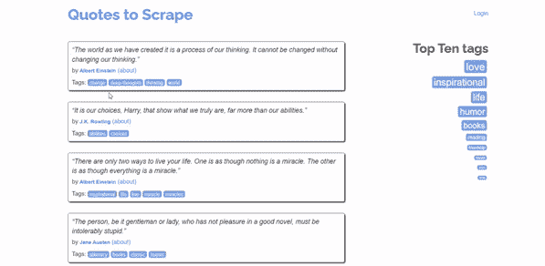

要获取 XPath，右键单击要获取 Xpath 的元素，然后单击 inspect。一旦源代码出现，点击复制>复制 Xpath。

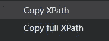

您将看到两个 Xpath 选项，它们代表了两种类型的 Xpath。

## Xpath 的类型

**1。绝对 XPath (Full Xpath):** 它使用从根到我们的元素的完整路径。例如，它以一个`/` 开始—

```
/html/body/div/div[2]/div[1]/div[1]/span[2]/small
```

**2。** **相对 Xpath:** 是对你要提取的元素的直接引用。例如，它以`//` 开始—

```
//*[@class='author']
```

相对 Xpath 总是选择在绝对 Xpath 之上，因为它们不是根元素的完整路径。此外，如果在不久的将来添加或删除一个新元素，那么绝对 Xpath 将变得无效并停止工作。所以相对 Xpath 更好。

Xpath 遵循创建每个表达式所使用的语法。

# Xpath 语法

在查看语法之前，您应该理解 HTML 的节点结构和 Xpath 使用的术语

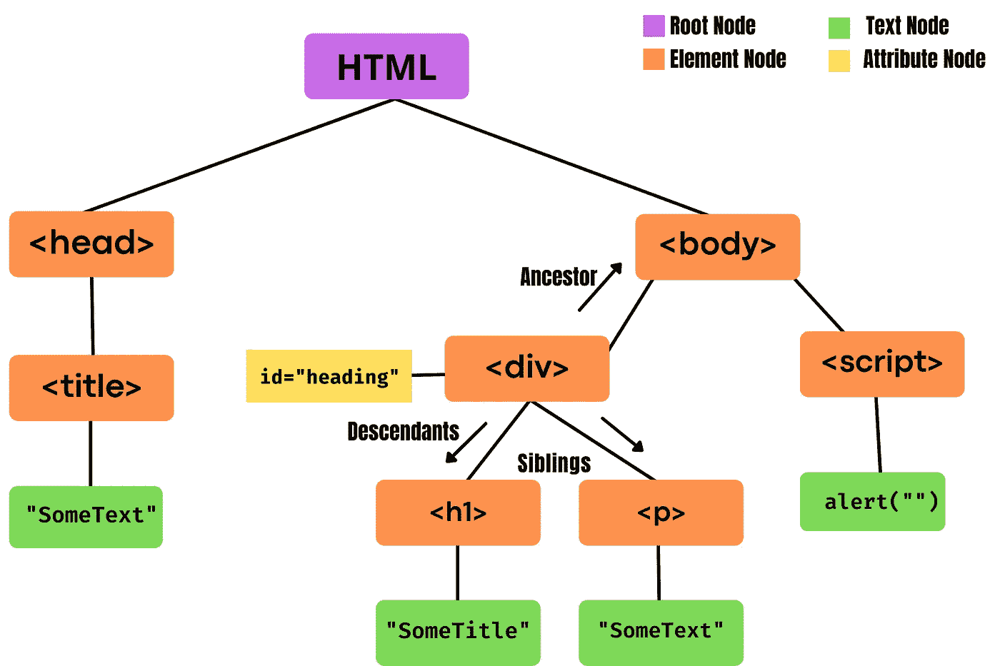

*   HTML 主要分为四个不同的节点——根节点、元素节点、属性节点和包含值的文本节点。
*   **根节点**是节点树中的顶层节点。除了根节点，每个节点都有一个父节点。一个根节点可以有 n 个子节点。
*   文档中除了根之外的每个元素都被认为是一个**元素节点**。每个元素节点都有一个父节点。
*   **属性节点**包含元素节点使用的所有属性的信息。
*   **文本节点**包含元素节点的文本值。这些值对用户是可见的。
*   **祖先节点**是当前节点的父节点或父节点的父节点。
*   **子孙节点**是当前节点的子节点或子节点的 chile 节点。
*   **兄弟节点**是共享同一个父节点的节点。

Xpath 表达式的基本语法是—

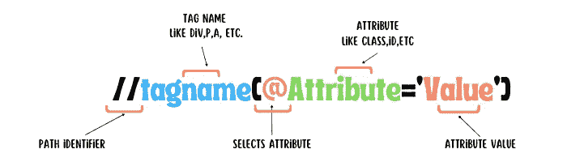

有不同类型的函数和操作符组合在一起，帮助编写在 web 上选择元素的表达式。让我们一个一个来看看其中的一些。

`//`:选择任何匹配的后代节点

`/`:从根开始选择，用于写绝对路径。

`nodename`:选择一个特定的节点 ex: < div >选择所有的 div。

`.`:从当前节点选择元素

`..`:从当前父节点中选择元素。

`@`:从元素中选择属性。

`*`:匹配任意节点的表达式。

`@*`:匹配任何属性节点

**高级表达式**

*   `contains(A,B)`:在元素`B`内搜索字符串`A`。假设你想选择一个带有固定属性的标签，比如类型、名称等等，那么就可以使用它。

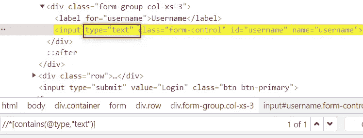

*   `not`:否定查询的某个部分。它可用于您想要从一组否定属性或标签的标签中选择一个标签的情况。

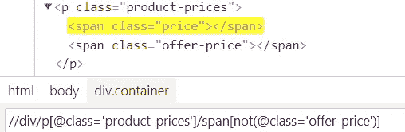

*   `starts-with`:搜索以字符串`A`开头的元素

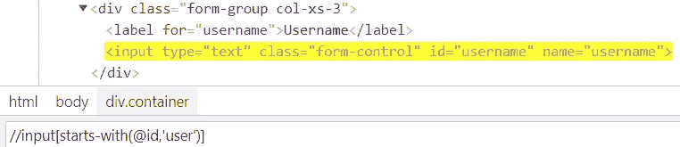

*   `ends-with`:搜索以字符串`B`结尾的元素
*   `OR`:选择满足条件 1 或条件 2 的元素。

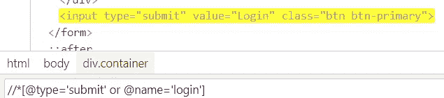

*   `and`:选择同时满足两个条件的元素。

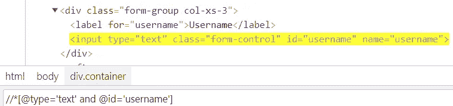

*   `text()`:基于 web 元素的文本定位元素。它是 selenium web 驱动程序的内置函数。

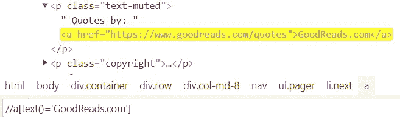

*   `following`:选择当前节点中某个标签后的所有元素。

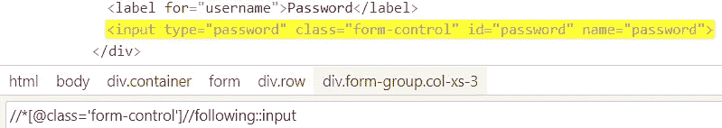

上面的 Xpath 匹配当前节点(用户名)的以下两个输入标签(密码、提交)。

*   `Child`:选择当前节点的所有子元素。

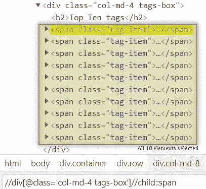

*   `preceding`:选择当前节点之前的所有节点。

```
//*[@name='submit']//preceding::input
```

上面的 Xpath 将选择输入标记之前的所有输入标记，该输入标记的属性名称的值为 submit。

*   `following-siblings`:选择当前选中节点的所有同级节点。你可以用它来选择卡片、按钮等。

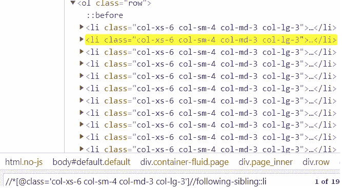

*   `parent`:选择当前节点的所有父节点。您可以通过在方括号中指定索引来选择特定的父代。

```
//*[@id='data']//parent::div
```

上面的 Xpath 将选择一个元素的所有具有数据 id 的父 div。

*   `descendant`:它类似于一个子选择器，但是不同之处在于它选择所有的 HTML 元素，或者是子元素、孙元素、曾孙元素等等。而子选择器只选择当前所选节点的直接子元素。

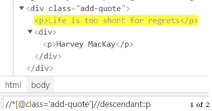

*   `Ancestor`:选择当前节点的所有祖先父节点、祖父节点、曾祖父节点等。

```
//*[@id='info']//ancestor::div
```

所有这些函数只是 Xpath 函数的一部分。有很多可以从 Xpath 中的 MDN Web Docs [函数中找到。](https://developer.mozilla.org/en-US/docs/Web/XPath/Functions)

# 测试 Xpath

有时候 Xpath 会变得非常复杂，很难编写，所以最好在浏览器中测试所有的 Xpath，然后在抓取脚本中使用它们。

我们今天使用的大多数浏览器都提供了测试 Xpath 表达式的方法。为此，请打开一个网页，右键单击并选择 inspect。

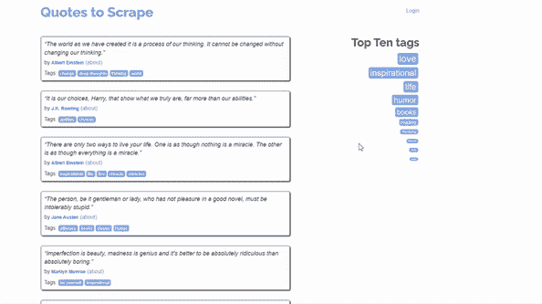

源代码打开后，按`ctrl+f`打开表达式测试字段。写下你想要的任何表达式，然后简单地按下回车键。

# 使用 Python 的 Xpath

让我们用我们学习的 python 结合 scrapy 从这个免费的刮书网站[https://books.toscrape.com/](https://books.toscrape.com/)刮下所有的书籍记录

如果你对 scrapy 一无所知，我建议你去看看我在[之前的博客](/web-scraping-2-0-6600abca37de)中关于使用 scrapy 进行网络抓取的内容。创建一个项目结构和一个蜘蛛抓取网页。

让我们来看看 web 抓取代码的主要部分，即使用 Xpath 选择元素。

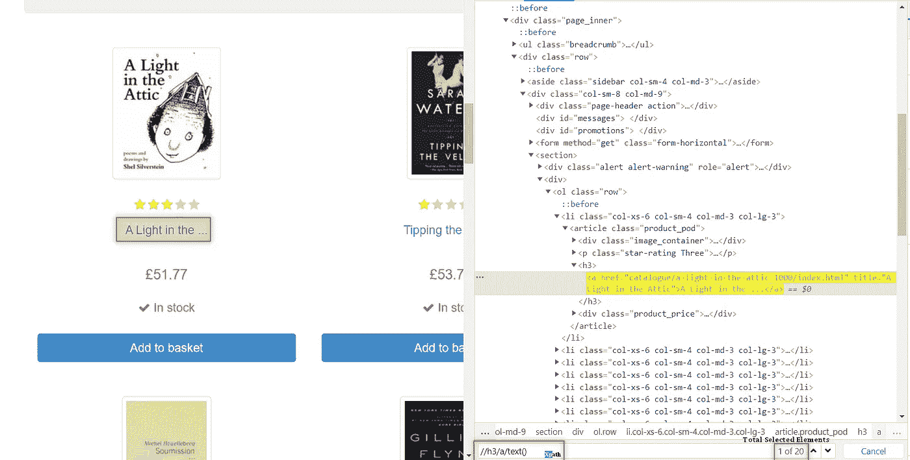

书籍的标题在一个 anchor 标签中，该标签是 heading 3 标签的子标签。这个的 Xpath 将是

```
//h3/a/**text()**
```

接下来是价格，

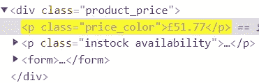

价格在具有价格颜色类的段落标记中。要访问该元素，我们有多个选项。比如我们可以直接用类名`//*[@class='price_color']`或者用标签和类名`//p[@class='price_color']`或者用父 div `//div[@class='product_price']//child::p[1]`等来访问它。你可以使用任何你想要的方法。为了简单起见，我将使用类名来访问它。

最后一个链接，

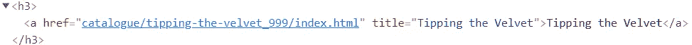

为了提取链接，我们将在表达式的末尾使用`@href()`。

```
Xpath : //h3/a/@href
```

现在，我们有了所有的数据，让我们把它们结合起来，用 Xpath 抓取这个网站的每一页。

“阅读我以前的博客以更好地理解代码，本书详细介绍了作者编写的代码”

## 参考

【1】[https://www.guru99.com/xpath-selenium.html](https://www.guru99.com/xpath-selenium.html)
【2】[https://developer.mozilla.org/en-US/docs/Web/XPath](https://developer.mozilla.org/en-US/docs/Web/XPath)

# 结论

在这篇博客中，我们学习了
-什么是 Xpath，
-Xpath 的特性，
-如何在浏览器上找到 Xpath，
-Xpath 的类型，
-不同的 Xpath 函数，
-在 Web 上测试 Xpath。

我尽力包含了使用 Xpath 进行 web 抓取所需的大部分概念和功能。接下来，试着熟悉使用 Xpath 进行 web 抓取的库，比如 [selenium](https://medium.com/pythoneers/web-scraping-using-selenium-python-6c511258ab50) 和 [scrapy](/web-scraping-2-0-6600abca37de) 。

就像奥斯卡·德·拉·霍亚说的“总有改进的空间”,如果你想在文章中增加什么，我随时欢迎你的建议和回应。

**文中使用的所有图片均为作者所有或以其他方式引用。*

# 推荐读物

[](https://medium.com/pythoneers/master-web-scraping-completly-from-zero-to-hero-38051423256b) [## 网络抓取大师从零到英雄🕸

### 用美汤和请求库同一个项目

medium.com](https://medium.com/pythoneers/master-web-scraping-completly-from-zero-to-hero-38051423256b) [](/web-scraping-2-0-6600abca37de) [## 网页抓取 2.0

### 使用 Scrapy 进行顶层网络刮擦

levelup.gitconnected.com](/web-scraping-2-0-6600abca37de) [](https://medium.com/pythoneers/web-scraping-using-selenium-python-6c511258ab50) [## 使用 Selenium Python 进行 Web 抓取

### 一个项目的详细教程

medium.com](https://medium.com/pythoneers/web-scraping-using-selenium-python-6c511258ab50) 

感谢你读到这里，如果你喜欢我的内容并想支持我，最好的方式是—

1.  跟我上 [*中*](http://abhayparashar31.medium.com/) 。
2.  在 [*LinkedIn*](https://www.linkedin.com/in/abhay-parashar-328488185/) 上和我联系。
3.  使用 [*我的推荐链接*](https://abhayparashar31.medium.com/membership) 成为中等会员。你会费的一小部分会归我。
4.  订阅 [*我的邮件列表*](https://abhayparashar31.medium.com/subscribe) 永远不会错过我的一篇文章。