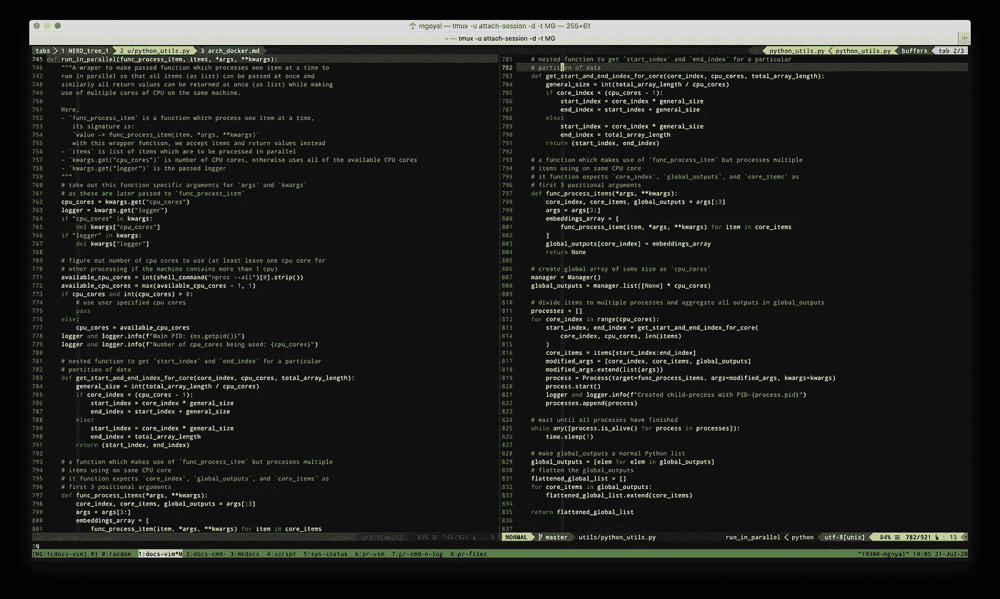
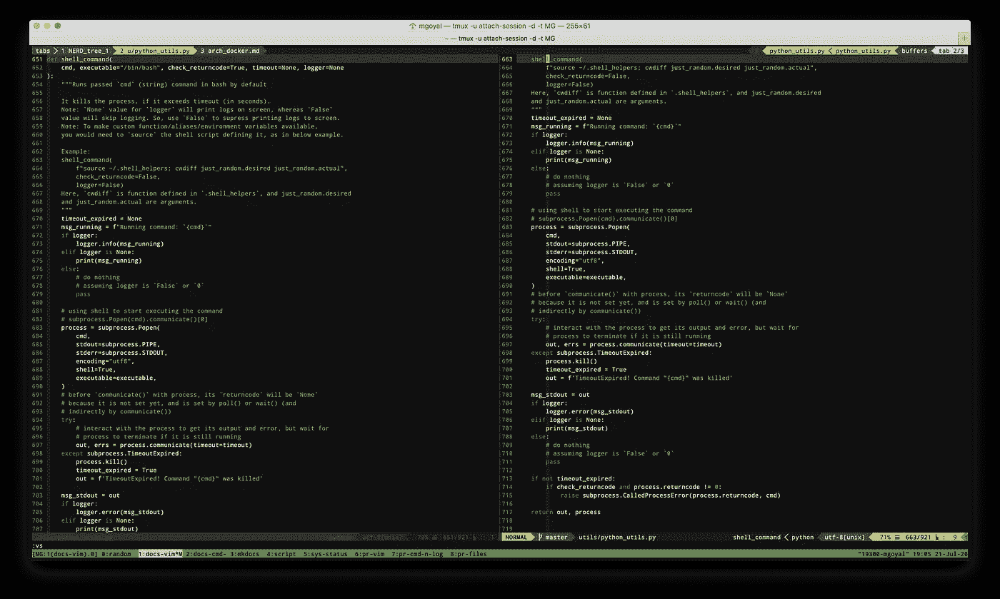

# 掌握 Python 中的并发性

> 原文：<https://levelup.gitconnected.com/master-the-concurrency-in-python-cedd070a913c>

如何在我的 Python 代码中引入并发性？子进程、线程、多进程…

TL；DR:使用`subprocess`运行并发外部程序，但是使用`multiprocessing`将我们编写到 Python 中的任务划分到多个进程中。请关注细节和真实世界的例子。

# Python 中的线程

**CPython 实现细节**:在 CPython 中，由于[全局解释器锁](https://docs.python.org/3.7/glossary.html#term-global-interpreter-lock)，一次只能有一个线程执行 Python 代码(尽管某些面向性能的库可能会克服这个限制)(可以有多个线程，但它们都共享同一个 CPU 内核)。

如果你想让你的应用更好的利用多核机器的计算资源，建议你使用[多处理](https://docs.python.org/3.7/library/multiprocessing.html#module-multiprocessing)或者[concurrent . futures . processpoolexecutor](https://docs.python.org/3.7/library/concurrent.futures.html#concurrent.futures.ProcessPoolExecutor)。但是，如果您想要同时运行多个 I/O 绑定的任务，线程仍然是一个合适的模型，为此可以使用`[**threading**](https://docs.python.org/3.7/library/threading.html)` [**模块**](https://docs.python.org/3.7/library/threading.html) 。

# `subprocess`模块 vs `multiprocessing`包

当我们想要运行和控制其他程序时，我们也可以用命令行运行这些程序，这时`[**subprocess**](http://0.0.0.0:8000/language_python.html#the-subprocess-module)`模块就派上了用场。它让我们将**外部程序**集成到 Python 代码中。

然而，`multiprocessing`包是我们用来将我们编写到 Python 中的**任务分成多个进程的东西。这使我们能够更好地利用所有可用的处理器，并提高性能。这个模块有一个类似于`[threading](http://0.0.0.0:8000/language_python.html#threading-in-python)`模块的 API。**

# `multiprocessing`套餐

`[**multiprocessing**](https://docs.python.org/3.7/library/multiprocessing.html#module-multiprocessing)`是一个支持使用类似于`[threading](http://0.0.0.0:8000/language_python.html#threading-in-python)`模块的 API 生成进程的包。它提供了本地和远程并发，通过使用子进程而不是线程，有效地避开了[全局解释器锁](https://docs.python.org/3.7/glossary.html#term-global-interpreter-lock)。由于这个原因，`multiprocessing`模块允许程序员充分利用给定机器上的多个处理器。

**`**Process**`**类****

**通过创建一个`[**Process**](https://docs.python.org/3.7/library/multiprocessing.html#multiprocessing.Process)`对象，然后调用它的`start()`方法(使流程活动)来产生流程。`Process`遵循`[threading.Thread](https://docs.python.org/3.7/library/threading.html#threading.Thread)`的 API。**

**可以使用进程的`pid`属性来检查进程的 PID，并且可以使用其`is_alive()`方法来检查它是否仍在运行(在使用`start()`方法启动之后)。**

****`**Manager**`**类******

****`[**Manager**](https://docs.python.org/3.7/library/multiprocessing.html#managers)`**提供了一种创建可以在不同进程之间共享的数据的方法，包括在不同机器上运行的进程之间通过网络共享。管理器对象控制管理**共享对象**的服务器进程。******

****例如，检查以下`run_in_parallel`功能:****

********

# ****`subprocess`模块****

****注意:您可能想比较一下`subprocess`模块和`[multiprocessing](http://0.0.0.0:8000/language_python.html#the-multiprocessing-package)`包。****

****注意:最好使用子进程而不是线程，因为 CPython 中的 GIL 允许所有线程使用同一个且只有一个 CPU 内核。此外，每个进程都有自己的内存，而线程共享相同的内存。****

****`[subprocess](https://docs.python.org/3.7/library/subprocess.html#module-subprocess)`模块允许您生成新的(多个)进程，连接到它们的输入/输出/错误管道，并获得它们的返回代码。该模块旨在取代几个较旧的模块和功能，如`[os.system](http://0.0.0.0:8000/language_python.html#the-os-module)`和`os.spawn*`。****

****注意:可以从`subprocess`模块访问`[os](http://0.0.0.0:8000/language_python.html#the-os-module)`作为`**subprocess.os**`。同样，`[sys](http://0.0.0.0:8000/language_python.html#the-sys-and-platform-modules)`模块可以作为`**subprocess.sys**`访问。****

****例如，检查下面的`shell_command`功能:****

********

# ****与`asyncio`的并发****

****`[**asnyncio**](https://docs.python.org/3.7/library/asyncio.html)`是一个使用 async/await 语法编写并发代码的库。****

****它被用作提供高性能网络和 web 服务器、数据库连接库、分布式任务队列等的多个 Python 异步框架的基础。****

****`asyncio`通常非常适合 IO 绑定和高级结构化网络代码。****

******协程:**参考[协程和任务](https://docs.python.org/3.7/library/asyncio-task.html)。****

# ****并发性和未来****

****`[**concurrent.futures**](https://docs.python.org/3.7/library/concurrent.futures.html)`模块为异步执行可调用程序提供了一个高级接口。****

****异步执行可以使用`ThreadPoolExecutor`通过线程来执行，也可以使用`ProcessPoolExecutor`通过单独的进程来执行。两者都实现了相同的接口，该接口由抽象的`Executor`类定义。****

******这里有一些相关的有趣故事，你可能会觉得有帮助:******

*   ****[流畅的数字](https://medium.com/@goyalmunish/fluent-numpy-187cc14f2832)****
*   ****[流利的熊猫](https://medium.com/@goyalmunish/fluent-pandas-22473fa3c30d)****
*   ****[MapReduce 的原因和方式](https://medium.com/@goyalmunish/the-why-and-how-of-mapreduce-524f71561daf)****
*   ****[使用 Python 自动完成浏览器任务](https://medium.com/@goyalmunish/automate-your-browser-with-python-7f5907612820)****