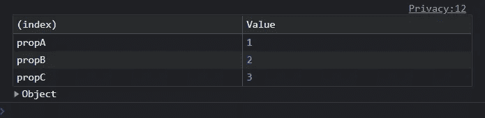
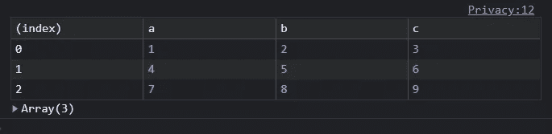
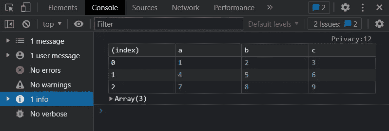
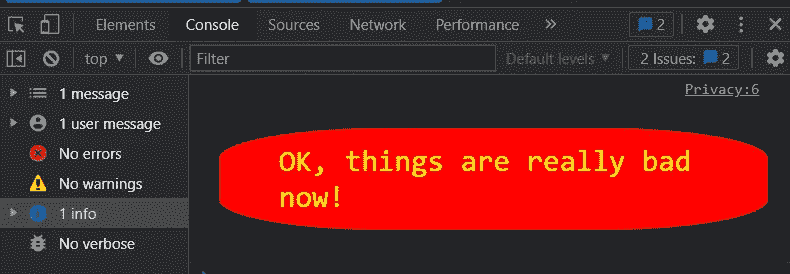
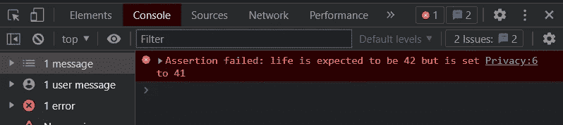
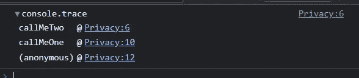
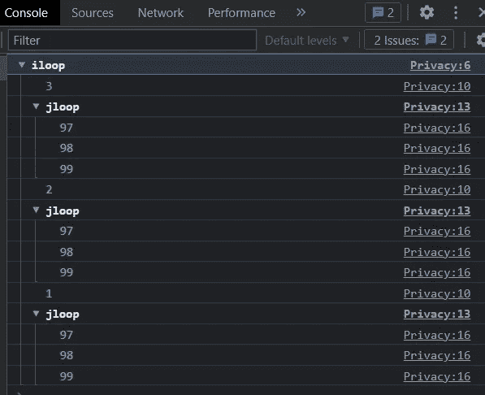

# 掌握这些控制台方法，帮助你提高调试效率！

> 原文：<https://levelup.gitconnected.com/master-these-console-methods-to-help-you-improve-your-debugging-efficiency-e557a034f075>

## 除了最常用的 console.log，你还知道哪些控制台方法？


我们在调试代码的时候基本都是使用 console.log()调试方法，当然遇到复杂的时候也会用到其他工具，但是 console.log()对于日常开发来说基本足够了。

今天我们来看看 console.log()还有哪些别出心裁的写法。

## 使用适当的日志类型

1.  `console.log()`一般是这样用的。

```
console.log('this is a log message');
```

2.`console.info()`的处理方式与`console.log()`相同

```
console.info('this is an information message');
```

3.`console.warn()`警告信息

```
console.warn('I warned you this could happen!');
```

4.`console.error()`错误信息

```
console.error('I\'m sorry Mark, I\'m afraid I can\'t do that');
```

5.`console.debug()`调试信息

```
console.debug('nothing to see here - please move along');
```

6.`console.table()`:以更友好的格式输出对象的值。

```
const obj = {
    propA: 1,
    propB: 2,
    propC: 3
  };
console.table( obj );
```



或者一组对象:

```
const arr = [
    { a: 1, b: 2, c: 3 },
    { a: 4, b: 5, c: 6 },
    { a: 7, b: 8, c: 9 }
  ];

console.table(arr);
```



其他选项包括:

*   `console.dir(obj)`显示 JS 对象的交互属性列表
*   `console.dirxml(element)`显示指定 HTML 或 XML 节点的后代元素的交互树。
*   `console.clear()`清除控制台前的所有信息。

## 过滤日志消息

浏览器以适当的颜色显示日志消息，但也可以过滤以显示特定的类型。Chrome 的侧边栏可以通过点击控制台窗格左上角的图标打开。



请注意，仅当查看详细选项时，才会显示 console.debug()消息。

## 关于使用 printf-type 的信息

所有的日志类型都可以使用 c 语言风格的 printf 消息格式，它定义了一个包含被替换变量的`%`指示器的模板。例如:

```
console.log(
  'The answer to %s is %d.',
  'life, the universe and everything',
  42
);
// The answer to life, the universe and everything is 42.
```

有风格:

```
 console.log(
        '%cOK, things are really bad now!',
        `
  font-size: 2em;
  padding: 0.5em 2em;
  margin: 1em 0;
  color: yellow;
  background-color: red;
  border-radius: 30%;
  `
    );
```

控制台中的结果:



## 使用类似测试的断言

类似于测试的 console.assert()命令可用于在条件失败时输出消息。可以用一个条件和一个或多个对象来定义断言，当该条件失败时，将输出这些对象，例如:

```
console.assert(
  life === 42,
  'life is expected to be',
  42,
  'but is set to',
  life
);
```

或者，可以使用消息和替换值。

```
console.assert(
  life === 42,
  'life is expected to be %s but is set to %s',
  42,
  life
);
```



## 运行堆栈跟踪

您可以使用`console.trace()`输出构成当前执行点的所有函数调用的日志。

```
 function callMeTwo() {
        console.trace();
        return true;
    }
    function callMeOne() {
        return callMeTwo();
    }
    const r = callMeOne();
```

该跟踪显示了每次调用的行，并且可以在控制台窗格中折叠或展开。



## 群组日志消息

在打印日志时，您可以在开头使用 console.group( label)并在结尾使用 console.groupEnd()将日志消息分成命名的组。消息组可以嵌套、折叠或展开(`console.groupCollapsed(label)`最初显示组处于折叠状态)。

```
// start log group
console.group('iloop');

for (let i = 3; i > 0; i--) {

  console.log(i);

  // start collapsed log group
  console.groupCollapsed('jloop');

  for (let j = 97; j < 100; j++) {
    console.log(j);
  }

  // end log group (jloop)
  console.groupEnd();

}

// end log group (iloop)
console.groupEnd();
```



## 使用计时器

方法`console.time`和`console.timeEnd`可用于允许 WEB 开发人员测量 javascript 脚本程序执行所消耗的时间。随着 WEB 应用变得越来越重要，JavaScript 的执行性能也变得越来越重要，了解一些性能测试机器对于 WEB 开发人员来说是必须的。

`console.time`方法是开始计时，`console.timeEnd`是停止计时，输出脚本执行的时间。

```
 // start timer
    console.time('testForEach');

    // (some code for testing)

    // end timer，output use time
    console.timeEnd('testForEach');

// 3522.303ms
```

一个参数可以作为计时器的名称传递给这两个方法，当代码并行运行时，该参数用于分隔计时器。对 console.timeEnd 的调用将立即输出执行所消耗的总时间，单位为毫秒。

如果你对我的文章感兴趣，可以关注我的[媒体](https://hyhwell.medium.com/)或[推特](https://twitter.com/Maxwell_hyh)。

[](/10-advanced-typescript-tips-for-development-2666298d50f) [## 用于开发的 10 个高级打字技巧

### 高级打字技巧

用于开发高级打字稿 Tipslevelup.gitconnected.com](/10-advanced-typescript-tips-for-development-2666298d50f) [](/how-to-add-a-watermark-to-your-website-with-html-canvas-f2c39474308a) [## 如何用 HTML 画布给你的网站添加水印

### Web 水印生成解决方案

levelup.gitconnected.com](/how-to-add-a-watermark-to-your-website-with-html-canvas-f2c39474308a) [](/8-commonly-used-javascript-libraries-become-a-real-master-6d8a4e98eb89) [## 8 个常用 JavaScript 库，成为真正的高手

### 掌握这些 JavaScript 工具库，让你的项目看起来很棒。

levelup.gitconnected.com](/8-commonly-used-javascript-libraries-become-a-real-master-6d8a4e98eb89) [](/javascript-design-patterns-strategy-pattern-c013d3dbc059) [## JavaScript 设计模式:策略模式

### 学习设计模式的目的是代码的可重用性，使代码更容易被其他人理解，并且…

levelup.gitconnected.com](/javascript-design-patterns-strategy-pattern-c013d3dbc059) [](/8-tools-and-methods-often-used-in-javascript-6fcebaf339ce) [## JavaScript 中常用的 8 种工具和方法

### 8 工作中经常用到的 Javascript 方法，记住这些方法，避免多此一举。

levelup.gitconnected.com](/8-tools-and-methods-often-used-in-javascript-6fcebaf339ce)