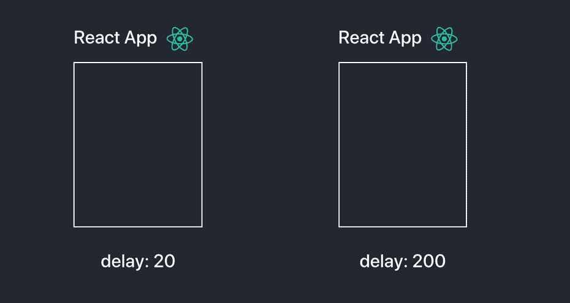

# 2020 年 React 掌握 UX:升级 React 应用用户体验的四种方式

> 原文：<https://levelup.gitconnected.com/master-ux-with-react-in-2020-four-ways-to-upgrade-your-react-app-user-experience-a053b3ffbf59>

> 如果你的应用程序给用户良好的感觉，他们更有可能继续使用它。

2020 年就在眼前，这意味着更多的 React 应用将进入市场。这是学习新 UX 策略的黄金时间，以保持领先地位，并让您的应用程序与最好的竞争！
今天我们将学习一些业内顶级玩家正在使用的策略。占位符内容、微交互、加载屏幕策略、平滑淡入淡出&过渡。我们的每个应用程序都有很大的改进空间。让我们看看如何在 React 中实施这些策略，并让我们的用户参与进来。

# 策略 1:改善你的加载屏幕

加载屏幕是我们开始改善应用程序感觉之旅的好地方。在上面的例子中，我们在显示欢迎屏幕之前从三个独立的 API 获取数据。在“之前”加载屏幕中，我们让用户一无所知。用户完全看不到后台正在运行的任何进程。在“after”加载屏幕中，我们向用户展示幕后发生的事情，然后在每个过程完成时给出肯定的确认。用户感觉他们是这个过程的一部分，这种感觉很好。

不要使用经典的 [react-loading](https://www.npmjs.com/package/react-loading) 或 [react-spinners](https://www.npmjs.com/package/react-spinners) 库，试着用强大的 [react-lottie](https://github.com/chenqingspring/react-lottie) 包来增加加载动画的趣味。你可以前往[lottiefiles.com](https://lottiefiles.com/)，从数千个用户提交的动画中挑选一个来代替无聊的旋转图标。

一旦你找到一个你喜欢的动画，你可以在 lottiefiles 的成熟编辑器中打开它。在这里你可以编辑每一层，播放速度，尺寸，背景颜色，等等，都在浏览器里面！

一个真正强大的工具

关于如何通过代码示例实现这些加载策略的分步指南，您可以参考这篇深入的文章。

 [## 反应加载屏幕策略—改善用户体验

### 如果你的应用程序给用户良好的感觉，他们更有可能继续使用它。反应负载改善…

medium.com](https://medium.com/front-end-weekly/react-loading-screen-tactics-improving-user-experience-9452f183c00b) 

# 策略 2:实现占位符内容

让我们看看上面例子中的 before 和 after。

在“之前”的例子中，我们有一个简单的加载器动画，让我们等待一些神秘的内容。然后，当它完成加载时，意外地扔给我们一些卡。

在“after”示例中，请注意占位符卡片上的平滑渐变，这向用户表明我们正在为他们加载一些内容，然后将结果优雅地淡入指定的位置。

页面应该总是看起来和感觉起来结构合理。

这种策略的一个重要特点是加载前后的页面结构。占位符内容可确保页面在加载内容之前和之后始终保持一致的尺寸。如果我们选择使用一个简单的加载器，页面在加载后可能需要调整大小来适应内容。

## 最大的玩家使用这种战术:

脸谱网

照片墙

Reddit

幸运的是 [Danilo Woznica](https://github.com/danilowoz) 已经构建了两个非常有用的工具来设计和实现 React 中的这些占位符:
[React-Content-Loader](https://github.com/danilowoz/react-content-loader) 和 [Create-Content-Loader](http://danilowoz.com/create-content-loader/)

Create-Content-Loader 是一个帮助我们生成占位符组件的工具，它附带了一些有用的预设，如 Instagram 布局、脸书布局、代码占位符等。

创建内容加载器

几乎你现在遇到的每个平台都实施了这个策略，你也应该这样做！关于如何在你的应用程序中实现这一点的一步一步的指导，请查看这篇文章。

 [## 反应用户体验策略:占位符加载内容

### 改进反应装料筛

medium.com](https://medium.com/front-end-weekly/react-user-experience-tactics-placeholder-loading-content-fb734da0f9ae) 

# 策略 3:掌握淡入

我们的应用程序总是从一个屏幕移动到另一个屏幕，不断地向用户抛出数据。我们如何在最优雅美丽的庄园里处理这些过渡？

让我们看看上面的“之前”和“之后”的例子。在“之前”的例子中，欢迎屏幕立即弹出，没有动画，没有过渡，只是坐在那里。丑。然后，我们点击我们的收件箱，得到一个僵化的转变，直接到一些邮件。我真的不喜欢使用这个人的应用程序，它只是感觉很基本。

另一方面，在查看“after”示例时，请注意 GIF 的第一个毫秒。礼物以一个激动人心的简短动画打开，然后欢迎文本和按钮从屏幕底部淡入。平稳。一旦我点击收件箱，邮件优雅地淡入视野，一个接一个地滑入它们的位置。很好。

## 这非常容易实现

感谢一个有用的库， [react-fade-in](https://www.npmjs.com/package/react-fade-in) ，你不用处理任何 CSS。您只需用一个`<FadeIn>`标签包装任何组件，它就会自动一个接一个地为每个子组件制作动画。你也可以用`<FadeIn>`来包装父对象，它会将所有东西作为一个块来制作动画。

这个`<FadeIn>`组件可以带两个道具:

`delay`默认:50。每个子动画之间的延迟，以毫秒为单位。

`transitionDuration`默认值:400。每个子动画的持续时间，以毫秒为单位。

## 当处理长列表时，应该减少延迟

## 过渡持续时间可以增加一个很好的缓慢衰落

这个小而简单的添加将有助于升级您的应用程序的用户体验。

这种策略可以用于淡入文本、图像、列表和任何其他你能想到的 React 组件。你甚至可以用一个`<FadeIn>`来包装你的整个应用！

关于如何在你的应用中实现这种策略的一步一步的指导，请参考这篇文章。

 [## 反应 UX:掌握淡入

### 改善 React 用户体验

medium.com](https://medium.com/front-end-weekly/react-ux-mastering-the-fade-in-51280750419d) 

# 策略 4:插入可爱的微互动

Medium 是改善用户体验的完美范例。

## 鼓掌按钮。

按下它会立即释放多巴胺。五彩纸屑，明亮发光的动画，在手机上按下时的剧烈振动，这个鼓掌按钮与互动很有趣。这些**微交互**是让用户爱上你的应用的一种即时方式。

让我们看看上面的前后例子。before 示例简单地表明它被按下时颜色发生了变化。平淡无奇，但能完成任务。当你悬停在按钮上时，after 示例会立即给你一个吸引人的绿色外发光，诱使你按下它。一旦按下，你会得到一阵五彩纸屑和一个平滑渐强的亮绿色指示器，这是一个最终吸引人的交互，迫使你再点击几下。前面的例子并不一定*不好……*而且它完成了任务*……*但是我有**的乐趣**点击另一个鼓掌按钮。所以问问自己，**你的 app 用起来好玩吗**？

如果你想在 React 中实现这个组件，你可以使用 [KikoBeats](https://kikobeats.com/) 的 [react-clap-button](https://www.npmjs.com/package/react-clap-button) 库。这个库是可定制的，这意味着你可以切换图标，改变配色方案，并操纵计数机制。

## 我如何开始在我的 React 应用程序中实现微交互？

启动并运行微交互的最快方法是使用这个小而不可思议的库。无论您是需要一堆五彩纸屑、一系列表情符号，还是一个很棒的形状动画，实现这个高度可定制的库就像用`<Reward>`标签包装任何组件一样简单。

关于如何在 React 应用程序中实现微交互的一步一步的指南和代码示例可以在这里找到。

 [## 改善反应 UX:微观互动

### “中”是一个完美的改进用户的例子

medium.com](/improving-react-ux-micro-interactions-1bd19ab3f5e3) 

# 目标是什么？

你遇到的某些应用程序会给你很好的感觉，你会从与它们的互动中获得乐趣，因此会回来做更多的动作。在你的应用中寻找这样做的方法，它既有趣又比看起来更有用。它可以像交互式鼓掌按钮一样简单，可以像完美的淡入淡出和过渡一样微妙，也可以像五彩纸屑和表情符号一样具有爆炸性。找到适合你的环境的方法。感谢您的阅读，祝您新年快乐！

