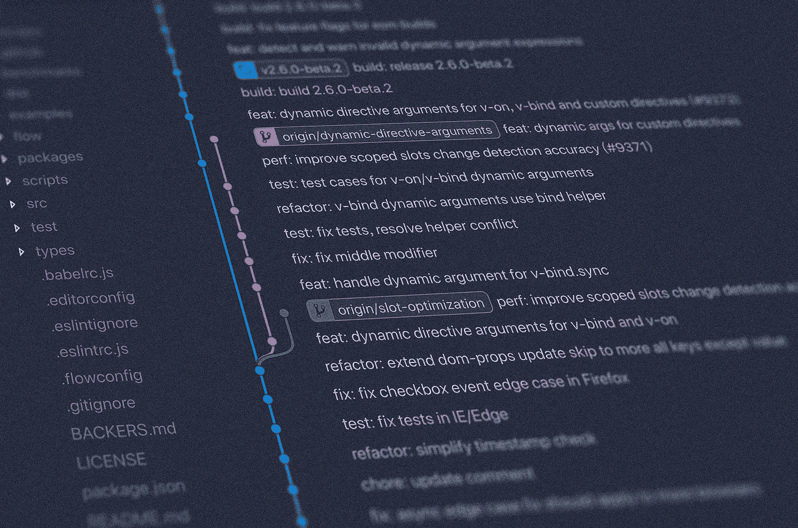

# 掌握基本的 Git 命令

> 原文：<https://levelup.gitconnected.com/mastering-basic-git-commands-185bba4bfc7d>

## 学习日常生活所需的基本 git 命令。



图片来自 Unsplash([**Yancy Min**](https://unsplash.com/@yancymin?utm_source=unsplash&utm_medium=referral&utm_content=creditCopyText))

1.  创建新的本地存储库。

```
**git init**
```

2.将远程分支克隆到您的机器中。

```
**git clone “repository url”**
```

3.列出所有本地分支机构。

```
**git branch**
```

4.列出远程和本地分支。

```
**git branch -a**
```

5.切换到现有分支。

```
**git checkout Branch_Name**
```

6.创建一个本地分支并切换到它。

```
**git checkout -b Branch_name**
```

7.将分支推至远程。

```
**git push origin Branch_Name**
```

8.重命名您的本地分支机构**。**

```
**git branch -m New_Name**
```

重命名当前不使用的分支。

```
**git branch -m Old_Name New_Name**
```

9.删除旧名称远程分支并推送新名称本地分支。

```
**git push origin :Old_Name New_Name**
```

10.重置 New_name 本地分支的上游分支。这意味着您上传的所有更改都需要指向具有新名称的分支。

```
**git push origin -u New_Name**
```

11.删除本地分支。

```
**git branch -d Branch_Name**
```

12.删除远程分支。

```
**git push origin :Branch_Name**
```

13.删除所有未跟踪的文件。

```
**git clean -f**
```

14.删除所有未被跟踪的文件和目录。

```
**git clean -df**
```

15.撤消对所有文件的本地修改。

```
**git checkout -- .**
```

16.撤消对特定文件的本地修改。

```
**git checkout File_Name**
```

17.显示工作分支中的所有本地文件更改。

```
**git diff**
```

18.显示对工作分支中的文件所做的更改。

```
**git diff File_Name**
```

19.显示谁更改了文件以及他们何时更改了文件。

```
**git blame File_Name**
```

20.在一行中显示提交历史记录

```
**git log --oneline**
```

21.列出所有标签

```
**git tag**
```

22.创建新标签

```
**git tag -a Tag_Name -m 'Message'**
```

23.将所有标签推至远程

```
**git push --tags**
```

24.重置本地分支中的所有更改

```
**git reset --hard**
```

25.从远程特定分支提取更改，并将它们合并到本地签出分支。

```
**git pull origin Branch_Name**
```

26.从本地存储的分支中提取更改，并将其合并到本地签出分支中。

```
**git pull origin/Branch_Name**
```

谢谢😊 🙏为了阅读📖。

关注我 [JavaScript Jeep🚙💨](https://medium.com/u/f9ffc26e7e69?source=post_page-----98efbae5e8aa----------------------)。

请在这里捐款[。你捐款的 80%捐给了需要食物的人🥘。提前感谢。](https://www.paypal.com/paypalme2/jagathishSaravanan)