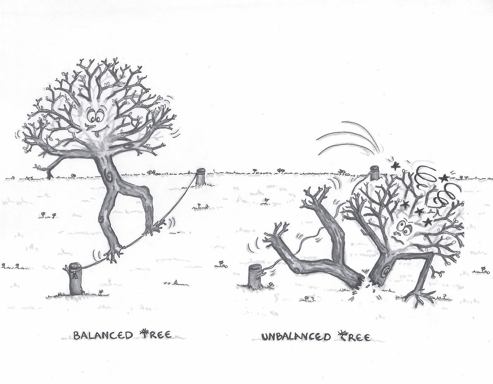

# 掌握二叉查找树— BST

> 原文：<https://levelup.gitconnected.com/mastering-binary-search-tree-bst-e860c1e3ac39>

# 介绍

**二叉查找树(BST)，有序树或排序二进制**是我们正在研究的第一个树数据结构。与线性数据结构的[数组](https://hurna.io/academy/data_structures/array.html)、[链表](https://hurna.io/academy/data_structures/linked_list.html)、[栈](https://hurna.io/academy/data_structures/stack.html)和[队列](https://hurna.io/academy/data_structures/queue.html)不同，树**是内在递归的层次(和非线性)数据结构**。不过，BST 很容易理解和操作。这是它的样子:


使用树的一个原因可能是因为我们想存储自然形成层次结构的信息。另一个是它们非常重要的特性**允许 fast — O(log n) —插入、搜索和删除操作**。

# 树、二叉树和二分搜索法树(BST)

> 在处理 BST 之前，精确术语是很重要的，这些术语经常被混淆。

## 树

**一棵树对每个节点可以拥有的子节点数量没有限制**。**树中最顶端的节点**称为**，根节点**和没有子节点的**称为叶节点**。它们也被称为 N 元树:


> 树的高度是从根部到最深的叶子的边数(这里高度= 3)。

## 二叉树

二叉树是一种特殊的基于树的数据结构的一般概念。各种特定类型的二叉树(例如下面的 BST)可以基于这个概念用不同的属性来构造。**二叉树的每个节点最多可以有两个子节点**。二叉树中的每个节点包含:
-一个**数据元素**(例如 6)
-一个指向“左子”节点(可能是“空”)
-一个指向“右子”节点(可能是“空”)的**指针**

> 这听起来可能令人惊讶，但莫尔斯电码的组织是一个二叉树。


# 二叉树的一些其他应用

*   用于在计算器中构建数学表达式(语法树)。例如，这就是我们的[人工智能 Globo 用来逐步解决你的二次方程](https://demo.hurna.io/#path=equation_solver/quadratic)的东西。
*   由编译器构造，用于将表达式解析为计算器(语法树)
*   几乎在每个 3D 视频游戏中使用，以确定需要渲染什么对象(二进制空间分区)。
*   用于压缩算法，如 mp3，jpg(霍夫曼编码树)…

## 二叉查找树—英国夏令时

最后是我们的 **BST** ，它是一个二叉树数据结构，有以下两个约束:
- **一个节点的左子树**的所有节点的值**小于或等于该节点的**值。
- **一个节点的右子树**的所有节点的值**大于其父节点的值**。


> 右边的二叉树不是二叉查找树，因为节点“3”的右边子树包含一个比它小的值。

优点/缺点

*   **+对插入、删除和查找操作使用二分搜索法原理，复杂度为 O(log n)。**
*   +通过一个有序遍历得到所有的键。
*   +进行订单统计、最接近的较低/较大元素、范围查询等。操作简单。
*   +树是非常灵活的数据，允许以最小的努力移动子树。
*   -二叉查找树的形状取决于插入和删除的顺序，并且**可能会变得非常不平衡**(如果不加以控制——进一步详述)。如果树是完全退化的，我们最终得到类似于线性数据结构的东西:链表。

# 让我们用一些平和的二叉树分形来休息一下


# 目标

> 操作 BST。构建我们自己的 BST 结构。
> 将指针和递归付诸实践。
> 了解平衡采油树的优点/缺点。

# 下一步是什么？

如果你还没有跳到[迷宫生成算法](https://hurna.io/academy/maze_generator/index.html)，玩玩它们并使用我们的[浏览器](https://demo.hurna.io/#path=maze/binary_generator)会让你对迷宫和树形结构之间的二元性有直观的认识。我们将很快研究更高级的树结构，如红黑树、四叉树和八叉树，它们是划分 2D 和三维空间的两种非常有用的结构。

# 建立我们自己的

我们将首先简单地用二叉树定义我们的结构，它包含一个数据，一个指向左子树(节点)的指针，一个指向右子树(节点)的指针。为了便于阅读，代码被简化，请使用[github 链接](https://github.com/Hurna/Hurna-Core/blob/master/Modules/DataStructures/binary_search_tree.hxx)获取完整版本。

```
class BST
  {
    BST(const Value data) : data(data) {}
    ...

  private:
    T data;
    unique_ptr< BST > leftChild;
    unique_ptr< BST > rightChild;
  }
```

> 代码的语义表明递归在树形数据结构中起着主要作用。实际上，BST 的左右节点是也被定义为 BST 的子树。

二分搜索法树支持你能从一个排序数组中得到的一切:有效的搜索，从任何给定元素的有序向前/向后遍历，前一个/后一个元素搜索，和最大/最小查询…

> 为什么不使用一个简单的排序数组，然后使用二分搜索法呢？

拥有一个有序的数组对于很多任务都是有用的，因为它使得[二分搜索法](https://hurna.io/academy/algorithms/search/binary.html)能够被用来有效地定位元素:O(log n)。与二分搜索法树相比，排序数组的问题是元素不能被有效地插入和移除。

> 太好了。既然我们有充分的理由继续，那么让我们定义一个 API。

```
// Manipulation
  void Insert(Value data)     // Insert an element
  BST* Remove(Value data)     // Remove an element // Traversal
  Value GetMin()              // Return the minima
  Value GetMax()              // Return the maxima
  List< Value > InOrder()     // Proceed in order traversal 
  BST* Search(Value data)     // Find an element
```

这是一个相当大的 API，我们将一次一个部分地掌握树操作。我们将从遍历方法到操作方法来解决它们。

# 遍历

# 获取最小值/获取最大值

它们是最简单的方法，它们允许我们记住 BST 的属性:
- **一个节点的左子树**的所有节点的值**小于或等于该节点的值**。
- **一个节点的右子树**的所有节点的值**大于其父节点的值**。

```
// GetMin is getting the left most child
  const BST* GetMin()
  {
    auto curNode = this;
    while (curNode->leftChild)
      curNode = curNode->leftChild; return curNode;
  } // GetMax is getting the right most child
  const BST* GetMax()
  {
    auto curNode = this;
    while (curNode->rightChild)
      curNode = curNode->rightChild; return curNode;
  }
```

参见下面的递归版本的说明(更多的内存消耗)。

```
const BST* GetMin() 
{ return this->leftChild ? this->leftChild->GetMin() : this; }const BST* GetMax() 
{ return this->rightChild ? this->rightChild->GetMax() : this; }
```

# 搜索

在有序数组中搜索一个值使用与[二分搜索法相同的原理。如果**的值小于当前节点的值**，我们可以确定该值在**左子树**、**中，否则**在**右子树**中。](https://hurna.io/academy/algorithms/search/binary.html)

# 有序遍历

在一个有序遍历中，我们**首先访问左边的子节点**(包括它的整个子树)，然后**访问当前节点**，最后**访问右边的子节点**(包括它的整个子树)。注意，二叉查找树使用了 inorder 遍历方法来获取按值的升序排列的所有节点。

```
static void Inorder(const BST* node, List< Value >& result)
  {
    if (!node) return; // end of a branch (no data) Inorder(node->leftChild)  // Recurse in left subtree
    result.push(node->data);  // Get data
    Inorder(node->rightChild) // Recurse in right subtree
  }
```

# 操作

# 插入

**在正确的位置插入一个值类似于搜索**因为我们要维持左子树小于根，右子树大于根的规则。我们根据值继续向右或向左移动，直到变成一片叶子。然后，我们将新节点(或 BST)放在那里。


我们可能已经注意到插入的顺序可能会改变 BST 的形状。这就是前面提到的缺点:我们的树可能会非常不平衡(或者退化)。

> 左:我们按顺序[4，2，5，1，3，6] → O(log n)
> 插入右:我们按顺序[1，2，3，4，5，6] → O(n)插入


我们可以看到，算法在二分搜索法树上的运行时间取决于树的形状，而树的形状又取决于键的插入顺序。



> 有一些被称为树平衡的技术可以保持树的平衡。我们将看到它们具有更高级的树数据结构，如红黑树。
> 
> 但是，如果我们假设数据是以随机顺序插入的，那么对于许多应用程序来说，使用 BST 是合理的。在这种情况下，我们对 n 个节点的操作需要大约 2 ln n。
> 
> 作为第一个练习，我们可以编写从一个排序数组中产生一个平衡 BST 的过程。

# 去除

我们将要深入讨论的 BST 中的最后一个操作是根据给定值删除一个节点。删除比插入更棘手，因为如果节点存在于树中，有三种情况需要考虑:


> 瞧啊。我们现在掌握了 BST 及其操作，这为我们日常的软件开发打下了坚实的基础。

# 一些练习

```
bool IsBalanced()   // Check if the tree is balanced
int MinHeight()     // Return the smallest branch height
int MaxHeight()     // Return the highest branch height
int Size()          // Return number of nodes composing the tree
```

与更多高级课程保持联系。

[h . urna——面向所有人的科学。](https://hurna.io)