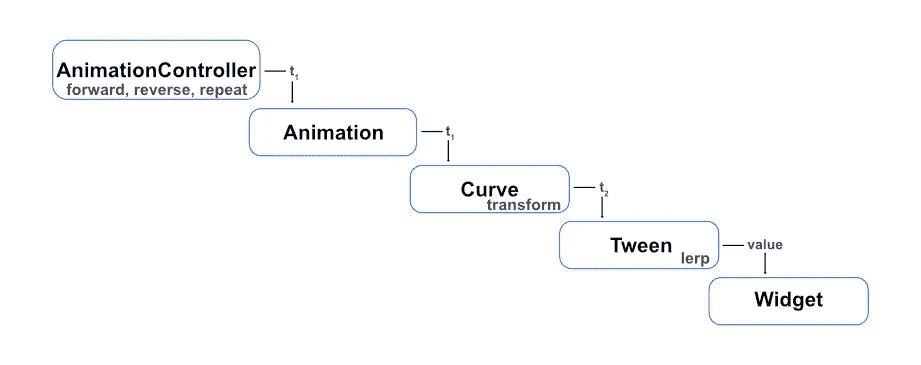
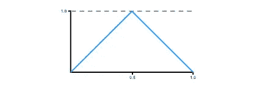

# 掌握颤动动画:补间动画和曲线

> 原文：<https://levelup.gitconnected.com/mastering-flutter-animations-63c0c29f8e1a>

如果你刚刚开始你的颤振动画之旅，我鼓励你先看看这个由颤振团队制作的短片[系列](https://www.youtube.com/watch?v=GXIJJkq_H8g&list=PLjxrf2q8roU2v6UqYlt_KPaXlnjbYySua)。这是 6 个 30 分钟多一点的视频。

现在，如果你以前在 Flutter 中看过、研究过或工作过动画，你应该熟悉两种主要类型:**隐式**和**显式**。这两者之间的区别非常简单。隐式动画使用 **AnimatedWidgets** 在值改变和重建发生时自动制作动画(即通过 *setState* )。另一方面，显式动画需要一个`**AnimationController**`。当事件发生时，例如按下按钮，您有责任控制动画。使用显式动画，您可以控制动画的方向，重复播放动画，以及在任何时间点停止播放动画。还有一些由 Flutter 提供的**动画**类，让我们在执行常见的显式动画时，生活变得更加轻松。

当然，所有这些都包含在之前的播放列表和网络上无数的地方。然而，即使我理解了这些关键概念，我对自己正确实现颤动动画的能力并不完全满意。我觉得自己有能力，但我觉得还有更多东西需要理解。*什么是 Tween？我的意思是，我知道它定义了两个值之间的转换，但是怎么定义呢？为什么有不同种类的补间动画？*这些曲线是关于什么的？我知道它们在某种程度上影响了动画的时间，但是到底发生了什么呢？它是如何工作的？*这****vsync****和****ticker provider****到底是怎么回事废话？***

当然，我可以接受这些是 Flutter 的动画框架使用的类，并坚持使用提供的标准动画来将我的对象从 A 点移动到 b 点。但这不是我的风格。我相信要正确使用一个工具，你必须对它的工作原理和原因有所了解。所以我更深入地钻研这些神秘的课程，并自信地以我想要的方式制作任何我想要的动画。今天，我们也将这样做。我们将讨论上面提出的每个问题。然后，我们将创建我们自己的补间动画和曲线，最终只用几行代码就完成了一个真正的自定义动画。准备好了吗？让我们开始吧。

# ticker 供应商

我们从 TickerProvider 开始，因为一旦我们理解了它，我们就可以使用它了。我们的自定义动画不需要实现任何东西。首先，`**vsync**`在这里被用作参数名称，因为 vsync 或垂直同步是指以屏幕刷新率同步帧更新的术语。vsync 参数接受一个`**TickerProvider**`，负责创建和提供一个`**Ticker**`。Ticker 的工作是在发生帧更新时向任何侦听器提供通知。这允许监听器在绘制框架之前更新任何小部件。Flutter 提供了`**SingleTickerProviderStateMixin**`&**`**TickerProviderStateMixin**`**来简化在类中提供一个或多个 Ticker，允许我们 mixin 然后将`*this*` 传递给 vsync 参数。****

****这就是我所知道的全部。我以前写过一篇[文章](https://medium.com/geekculture/flutter-case-study-timer-precision-a1154b431e8)，讲述使用 TickerProvider 在每一帧上执行一个动作，比使用 Dart 的`Timer`类回调更精确。它将让您对 Ticker 类的用途以及如何直接使用它有更多的了解。****

# ****图汶****

****简单地说，`Tween`定义了两个值之间的转换。要执行此任务，补间需要一个开始值、一个结束值和一个告诉它如何在这两个值之间转换的方法。这种方法叫做`**lerp**`，是*线性插补*的简称。线性插值实际上是一种在两个给定点之间定义多个点的方法。分解起来很简单。Tween 类也有一个`**transform**`方法。它是在使用补间时实际调用的方法，但它的工作只是在动画时间线为 0 时返回开始值，在动画时间线为 1 时返回结束值。否则，它将时间传递给 lerp 并返回结果。所以，我们没有必要去碰它。****

****补间使用**运算符+** 、 **-** 、 ***** 进行线性插值。因此，补间动画可以使用任何实现这些运算符的类。还有专门为特定类设计的特殊补间，如 ColorTween。我们将很快扩展 ColorTween 来定义我们自己的行为。****

# ****曲线****

****一个动画只是一段时间内从 A 到 b 的视觉变化。`Curve`类定义了它变化的速率。从 A 到 B 是平滑的线性过渡，还是开始缓慢变化并加速，或者相反？这些典型的行为就是颤振提供的[曲线类型，但是一条曲线可以定义从 A 到 B 随时间 *t* (从 0.0 到 1.0)的任何速率。我们很快就会把这个事实推到极限。](https://api.flutter.dev/flutter/animation/Curves-class.html)****

```
****NOTE:** A Linear Curve would simply pass along the value t that it receives without transforming it. All others are performing some transformation.**
```

****关于 Curve 的实现，有几个关键点需要理解。它扩展了`**ParametricCurve**`，后者提供了一个`**transformInternal**`方法，在实现定制曲线时应该被覆盖。它还提供了一个不应该被覆盖的`**transform**`方法。如果 *t* 为 0.0 或 1.0，该方法返回 *t* 。否则，它叫`transformInternal`。这一点很重要，因为它允许在起始值和结束值之间设置动画，同时确保动画实际上在各自的值处开始和结束。****

# ****把所有的放在一起****

****因此，如果我们看看所有这些是如何一起工作的，`AnimationController`给出一个时间*t₁*【0.0–1.0】*`Curve`(通过一个`Animation`)，它根据`transform`将其映射到一个新值*t₂*【0.0–1.0】，并将其传递给`Tween`。然后，基于在`lerp`中定义的线性插值，Tween 计算`begin`和`end`之间的值。当屏幕被绘制时，这个值被一个`Widget`使用，这就是我们如何从动画的任何给定点得到应该在屏幕上绘制的值。*****

**********

# *****创建眨眼动画*****

*****我知道你在想什么…我们不需要自定义的补间动画或曲线来闪烁灯光。这是正确的。我们可以向前驱动一个动画，然后向后驱动打开和关闭灯光，并重复一遍又一遍地闪烁。但是，如果我们想用一个动画控制器来驱动一系列的灯，依次闪烁呢？也许你也已经想出了一个更好的方法来处理这个问题，但我们在这里是想亲自动手，更好地理解 Flutter 的动画框架。这就是为什么我们要用自定义补间来解决这个问题。但是，嘿，我们想让我们的手真的脏，以确保我们有一个伟大的把握，对不对？对！因此，首先，我们将尝试使用自定义曲线创建相同的效果，并了解为什么这不是正确的方法。别担心，之后我们会创造出一个很棒的工作曲线！*****

*****但首先，我们要创造什么。像这样的怎么样？*****

**********

## *****代码*****

*****这个项目的代码可以在`tweens_and_curves`目录下的[这里](https://github.com/theLee3/mastering_flutter_animations.git)找到。我鼓励你克隆它，并使用`starter`文件夹跟随它。`complete`文件夹包含了完成的项目。*****

```
*****NOTE:** The classes we create in this project are small, so you can add them to the file alongside the Widgets that use them. That is how the project is setup in the complete directory as well.***
```

*****如果你看一下起始代码，你会看到我们有一个包含 2 个按钮的登录页面。每个按钮将我们带到一个页面，在那里我们将实现我们不同的动画。这些页面的设置都很相似，手势检测器填充了`Scaffold`的主体。当前，当轻击屏幕时，灯泡`Icon`切换开和关，线性动画，并在`blink.dart`的情况下重复。我们将只更新这些动画。不会对布局进行任何更改。*****

```
*****PRO TIP:** Take a look at the on/off colors used. Our off color is the same RGB value as on, but with full transparency. When animating transparency, you should always do so in this fashion. Colors.transparent is specifically a transparent black, and therefore is not purely a transition between transparent & opaque but also between black & whatever color you are using.***
```

*****看着`blink.dart`，你会看到我们有一个动画列表被填入`initState`。*****

```
***@override
void initState() {
  super.initState();
  final interval = 1 / numberOfLights;
  for (var i = 0; i < numberOfLights; i++) {
    final begin = interval * i;
    final end = interval * (i + 1);
    animations.add(
      ColorTween(begin: offColor, end: onColor).animate(
        CurvedAnimation(
          parent: controller,
          curve: Interval(begin, end),
        ),
      ),
    );
  }
}***
```

*****这里需要注意的是，我们使用了一个`ColorTween`(现在)，和一个叫做`Interval`的`Curve`。如果你对`Interval`不熟悉，它是一条曲线，允许我们只在`AnimationController`的整个持续时间的某个间隔内制作特定的动画。这允许我们创建交错的动画。这是如何工作的？如果你回想一下我们对曲线的讨论，你会记得曲线只是将时间 *t₁* 映射到新的值 *t₂* ，然后由`Tween`使用该值来计算由`Widget`使用的值。一条`Interval`曲线将 *t₁* ≤ `begin`的任意值映射到 *0* ，将 *t₁* ≥ `end`的任意值映射到 *1* 。`begin`和`end`之间的任何值都被*归一化*并根据默认情况下传递给`Interval`、*线性*的曲线映射。现在让我们在一个单一的正向动画中使灯光闪烁。*****

## *****曲线闪烁*****

*****首先，让我们来思考一个眨眼动画随着时间的推移应该如何定义。它应该从关闭位置(t=0.0 时为 0.0)开始，在中点处达到开启峰值(t=0.5 时为 1.0)，并在结束时返回关闭状态(t=1.0 时为 0.0)。为了简单起见，我们把它做成线性的。在图表中看起来如何？*****

**********

*****如果我们考虑这样一个图形的公式…当 t ≤ 0.5 时，值就是 2t。当 t > 0.5 时，该值为 2(1-t)。因此，我们的`Blink`类应该覆盖`transformInternal`，如下所示:*****

```
***class Blink extends Curve {
  const Blink(); @override
  double transformInternal(double t) {
    if (t > 0.5) return 2 * (1 - t);
    return 2 * t;
  }
}***
```

*****现在只需通过更新`Interval`来使用我们的`Blink`曲线。*****

```
***curve: Interval(begin, end, curve: const Blink()),***
```

*****跑去看看会发生什么。这里慢了下来。*****

**********

*****这是怎么回事？嗯，您可能还记得，`Curve`也有一个我们没有覆盖的`transform`方法。正如我们所讨论的，它总是将 0.0 映射到 0.0，将 1.0 映射到 1.0，然后将任何其他值传递给我们覆盖的`transformInternal`方法。这意味着曲线必须始终以值 1.0 结束。不是我们正在寻找的，因为我们需要在我们开始的地方结束(0.0)。如前所述，我们永远不应该覆盖这个方法。动画框架要求 0.0 和 1.0 映射到自身。那么我们能做什么呢？我们如何确保每盏灯在动画结束时保持关闭？嗯，考虑到我们目标的独特需求，定制`Curve`实际上并不是一个合适的解决方案。相反，我们应该创造一种习俗`Tween`。*****

## *****用补间动画眨眼*****

*****正如我们所讨论的，一个`Tween`可以在提供必要的`operators`的任何属性之间进行插值。有些类，比如`Color`，可能需要独特的实现。因为我们在这里使用了`Color`，我们不会重新发明轮子，而是扩展`ColorTween`并实现我们想要的行为。创建下面的`LightTween`类。*****

```
***class LightTween extends ColorTween {
  LightTween({required this.off, required this.on})
      : super(begin: off, end: off); final Color off, on; @override
  Color? lerp(double t) {
    if (t > 0.5) return Color.lerp(on, off, 2 * t - 1);
    return Color.lerp(off, on, 2 * t);
  }
}***
```

*****在这里，我们的构造函数接受一个`on` & `off`颜色进行插值。它将关闭颜色传递给`super`构造函数的`begin` & `end`参数，因为我们希望以关闭灯光开始和结束。然后，我们覆盖`lerp`方法来实现我们的计算。我们使用`Color`的静态`lerp`方法返回`t`处`on` & `off`之间的线性插值颜色。我们计算`t`的方式与之前计算`Blink`曲线的方式相同。我们只是将这一计算移到了`Tween`中。这有一个额外的好处，允许我们在补间中使用其他曲线。*****

*****最后，我们需要将`initState`中的`ColorTween`替换为我们的`LightTween`。*****

```
***animations.add(
  LightTween(off: offColor, on: onColor).animate(
    CurvedAnimation(
      parent: controller,
      curve: Interval(begin, end),
    ),
  ),
);***
```

*****我们来看看最后的结果。*****

**********

*****我们做到了！创建自定义补间的工作做得很好！但是使用自定义曲线来完成动画目标不是很好吗？我同意。我们开始吧！*****

# *****创建闪烁动画*****

*****我碰巧发现这条曲线很棒，并看到了很大的使用潜力，以及为进一步的应用而进行的调整。你有没有打开旧灯的开关，看到它闪烁着点亮？如果没有，你一定在恐怖电影里见过别人这样做，对吗？这就是我们想要的效果。我们将通过用几条线定义一条曲线来实现这个目标。最终结果看起来会像这样。*****

**********

*****看一看`flicker.dart`。目前，当轻击屏幕时，灯泡会线性地闪烁。动画每个方向 1 秒。让我们首先定义我们的`Flicker`曲线如下。*****

```
***class Flicker extends Curve {
  Flicker(); final rand = Random(); @override
  double transformInternal(double t) {
    if (t > 0.3) return t;
    return (t - rand.nextDouble()).abs();
  }
}***
```

*****像以前一样，我们覆盖了`transformInternal`方法。这一次我们使用`Random`来创造随机振荡，以创造闪烁的效果。在动画的前 30%中，我们通过从当前的`t`中减去一个 0.0 到 1.0 之间的随机值来创建闪烁效果。然后我们返回绝对值，因为`transformInternal`也必须返回 0.0 到 1.0 之间的值。在剩下的 70%的动画中，我们简单地返回`t`。这将在闪烁后产生线性辉光到最大亮度的效果。*****

*****现在，我们只是更新我们的动画来使用我们的`Flicker`曲线。旧的灯光不会闪烁，它们只是逐渐消失，所以我们也将为反向动画使用不同的曲线，并调整每个的持续时间，以获得更真实的效果。进行以下更改。*****

```
***late final controller = AnimationController(
  vsync: this,
  duration: const Duration(milliseconds: 2000),
  reverseDuration: const Duration(milliseconds: 1000),
);late final animation = ColorTween(begin: offColor, end: onColor).animate(
  CurvedAnimation(
    parent: controller,
    curve: Flicker(),
    reverseCurve: Curves.easeOut,
  ),
);***
```

*****现在你知道了！一个古老的，怪异的灯泡图标动画。*****

**********

*****因为这是用曲线完成的，所以你可以把它应用到你想要的任何其他动画上。虽然，对大多数人来说这可能很不和谐。您还可以为重复的动画实现恒定的闪烁效果。你还能想出哪些很酷的效果或创意？请在评论中分享！*****

# *****结论*****

*****为了更好地理解 Flutter 的动画框架，我们讨论了一些非常深入的话题。希望现在使用隐式和显式动画不再那么令人畏惧。让我们复习一下今天学过的概念。*****

*   *****提供给`vsync`的`TickerProvider`负责通知`AnimationController`屏幕即将被重绘，因此应该计算新的动画值。*****
*   *****基于 0.0 和 1.0 之间的时间 *t* ，简单地计算开始&结束值之间的值。*****
*   *****简单地通过一个`transformation`公式将时间 *t₁* 映射到新的值 *t₂* 。这个新值就是`Tween`使用的 *t* 。*****

*****总之，这些类最终组成了屏幕上绘制的每一个动画。理解了这个概念，我们就可以制作任何我们能想到的动画，有时只需要几行代码！*****

*****我希望你离开这篇文章时对使用 Flutter 动画更有信心。如果你觉得它有帮助，请留下一些掌声，让我知道。如果你有任何意见或问题，他们总是很感激。我会回复你，它们可能会启发我的下一篇文章。一如既往的感谢您的阅读！更多文章将很快推出，请继续关注。*****