# 掌握智能智能提高您的工作效率

> 原文：<https://levelup.gitconnected.com/mastering-intellij-ide-to-boost-your-productivity-32e94c2d291a>

## 每日超级大国

## 了解它的强大功能、快捷方式和插件，每天节省大量时间，让您的编码更上一层楼。

照片由[亚历山德鲁·阿契亚娜](https://unsplash.com/@alexacea) (1) & [奥顿码](https://unsplash.com/@altumcode) (2，3)在 [Unsplash](https://unsplash.com/s/photos/programming?utm_source=unsplash&utm_medium=referral&utm_content=creditCopyText) 上拍摄

作为一名开发人员，您的 IDE 是您构建产品的主要工具，并且您在它上面花费了大量的时间。这就是为什么你应该尽可能高效地使用它——了解它最强大的功能、快捷方式和插件。

我将在本文中介绍的内容:

*   *特性* —了解最有价值的特性，这些特性并不明显。
*   *快捷键* —高效快速地编写代码和导航。
*   *插件* —通过使用社区插件从 IntelliJ 中获得更多。
*   *关键要点*

***免责声明*** *:由于我是 Mac 用户，所以我只为 macOS 添加快捷方式，但你可以在 IntelliJ 的键图中找到其他 OS 的相应快捷方式。*

# 特征

有很多，比如自动完成、语法高亮等等。我将深入探讨那些不太明显或不为大家所知，但对您的日常工作大有裨益的问题。

## 拆分标签

通过右键单击选项卡，您可以创建水平、垂直或两者兼有的拆分视图。例如，这对于编写测试非常有帮助，因为在编写测试代码时，您可以将实现放在测试代码旁边。

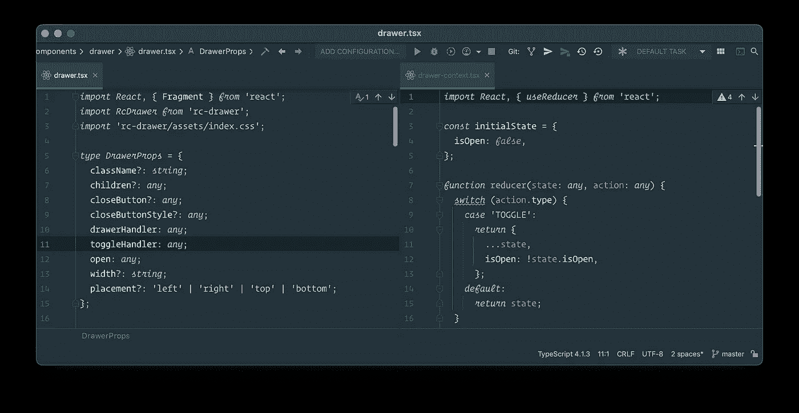

## 当地历史

你有没有经历过如此严重的混乱，以至于你甚至不能用 git 恢复一些东西？即使您用一个`git reset --hard HEAD`放弃了一天的工作，IntelliJ 也会用它自己的版本控制来拯救您。

跟踪不仅包括您在 IDE 中所做的更改，还包括外部更改，而不管实际的发起者是谁。因此，例如，通过 IntelliJ 外部的一些终端命令意外删除的更改可以很容易地恢复。

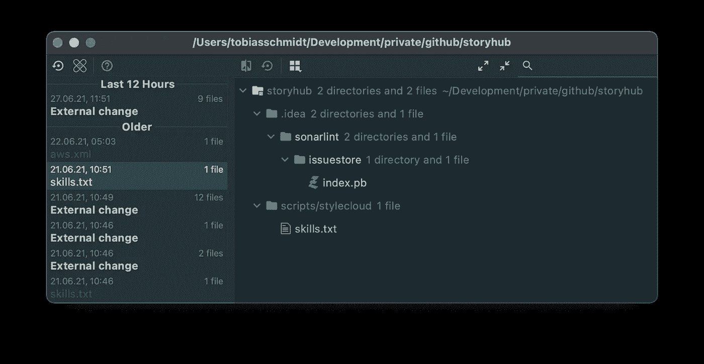

本地历史，包含在 IntelliJ 和其他地方完成的更改(外部更改)。

## 运行调试器时调用任何代码

当运行调试器并设置某些断点时，通常您只需要做一些小的调整就可以修复代码。IntelliJ 让您可以通过`⌥` `F8`使用评估面板直接执行代码，这非常有帮助。您可以修改特定的赋值，访问当前作用域中的所有变量，导入额外的类或运行任意代码。这允许您验证部分修复，而不需要重新启动调试运行。

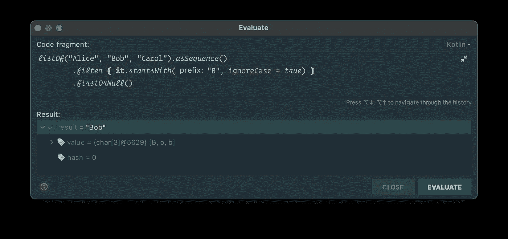

# 快捷指令

利用快捷键尽可能多地使用你的键盘会节省你很多时间。与使用鼠标在(子)菜单中寻找动作相比，这要方便快捷得多。

## 动作菜单

这可能是最有价值的一个，因为您可以从内部直接使用几乎任何功能。按下`⌘` `⇧` `A`打开动作菜单，通过全文搜索浏览所有命令。这也包括插件的功能，如字符串操作。

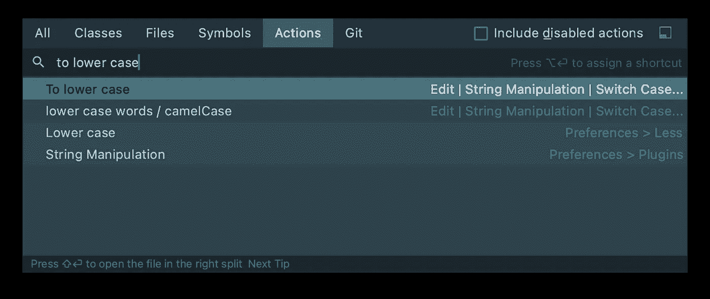

真正喜欢的:使用`⌘ ⇧ a + ‘open recent’`在项目间切换，显示项目概览。它非常适合您经常使用的命令，但不像您需要专用快捷键那样频繁。

## 到处搜索&跳转到最近的文件

按下`⇧`两次，你就打开了文件浏览器，可以打开当前项目中的任何文件。

如果你按下`⌘` `e` IntelliJ 会显示你最近互动过的文件。即使这没有显示输入，你仍然可以通过开始输入来进行搜索。这通常可能发生在所有不同的地方，例如在浏览您的 git 变更或在您的项目概览中导航时。

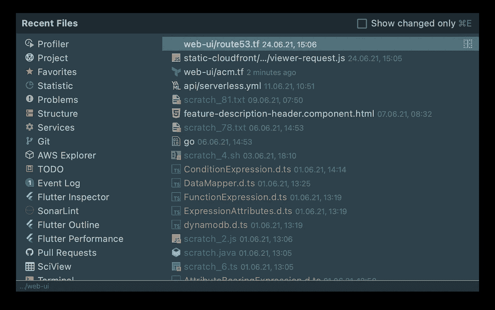

## 多光标选择

通常，您需要对一组项目进行相同的修改。你可以进行多光标选择，一次编辑所有内容，而不是一个一个地浏览。

*   `⌃` `g` ( *为下一次出现添加选择* )—将选择您当前选择的字符串的下一次出现。这可以一直进行到文档中不再有匹配为止。
*   `⌘` `⌃` `g` ( *选择所有匹配项* )—将选择当前文件中所选字符串的所有匹配项。
*   `⌥` `⇧` + `mouse click` ( *添加或移除插入符号* )—添加另一个插入符号或移除当前位于鼠标指针处的插入符号。
*   `⌥` `⌥` &保持——下一次按下`↑`或`↓`(箭头键)将在上或下一行添加另一个插入符号。

## 完成报表

有了 IntelliJ，就没有必要自己一遍又一遍地编写像`if`、`do`、`while`、`try/catch`这样的结构。只需输入关键字并按下`⇧` `⌘` `⏎`，就会自动生成骨架代码块。

## 重构

重构代码是一项常规任务，这两个特性对此很有帮助。

*   `⇧` `F6` ( *重命名* ) —用于重命名变量、类或方法。这将编辑所有引用。
*   `⌥` `⌘` `v`(变量重构)——将当前选择提取到一个新变量中。如果您在几个地方使用了完全相同的模式，IntelliJ 会询问您是否要在其他地方替换它。

## 创建新的暂存文件

很多时候，需要快速创建一些文件用于涂鸦，重新格式化一些东西或者只是以临时的方式尝试一些东西。使用`⌘` `⇧` `n` 你将打开暂存菜单，用你选择的扩展名创建一个新文件。继续键入以找到所需的文件类型。

## 显示用法并跳转到实现

很多时候你想知道你当前的函数或类在哪里被使用。按下`⌘` `click`(或者`⌥` `⌘` `F7`，如果你的光标在目标上的话)，你会看到一个使用你的目标的列表，或者如果只有一个目标的话，你会被直接带到那里。

通过在一个界面上按下`⌘` `⌥`，IntelliJ 将向您展示这个方法或类的实现。

## 删除和移动行

您可以通过按`⌘` `⌫`删除插入符号所在的当前行，或者使用`⌥` `⇧` + `↑`或`↓`上下移动。

## 显示文档

按下`F1`你会看到当前插入符号位置的方法或类的文档。

## 移动元素(如参数)

如果您的插入符号当前位于方法签名参数处，您可以通过按`⌥` `⇧` `⌘` + `←`或`→`将其向左或向右移动。如果您的方法已经在使用中，您也可以在完成签名修改后，通过按下`⌥` `⏎`并选择`Apply signature change`将它传播到所有调用它的地方。

## 注释/取消注释

轻松地将一个选择或一行移动到一个评论中(如果多个 carets 处于活动状态，则可以是多个)。

*   `⌘` `/` —单行注释(`//…`)
*   `⌥` `⌘` `/` :—用于块注释(`/*…*/`)

## …还有更多！

这只是我在日常工作中发现的最有用的一小部分快捷方式。

不要犹豫，访问`Help > Productivity Guide`——它会显示你的功能和相应的快捷键，并有详细的解释。此外，它还显示了您使用它们的频率以及一些更有趣的统计数据。

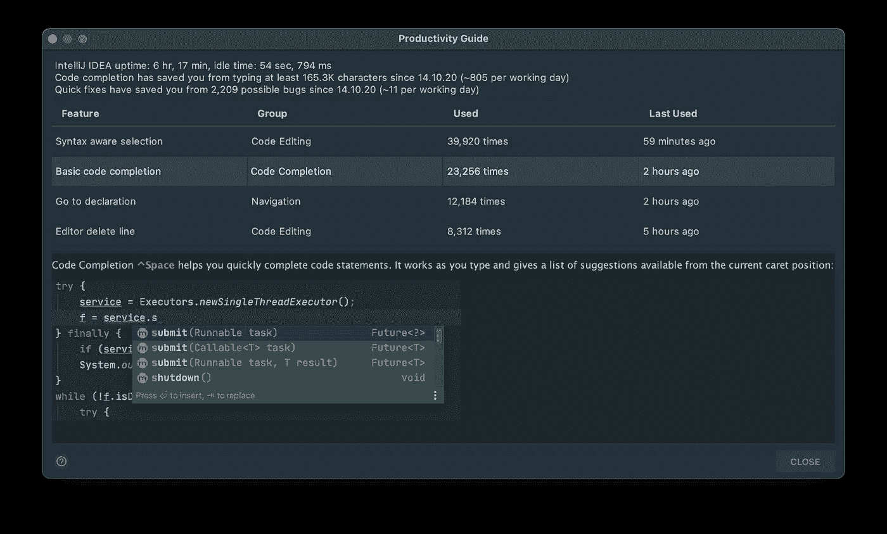

IntelliJ 中的生产率报告

# 插件

有很多插件是为了更容易地使用特定语言而构建的，但我将只关注那些提高一般生产力的插件。

## 材料主题用户界面

与生产率的提高没有直接关系，但是我们一天要花几个小时查看我们的 IDE，拥有一个合适的编辑器主题可以让这变得更容易忍受。有了[材质主题 UI](https://plugins.jetbrains.com/plugin/8006-material-theme-ui) 你会得到很多不同的主题和其他小的改进，比如图标集。

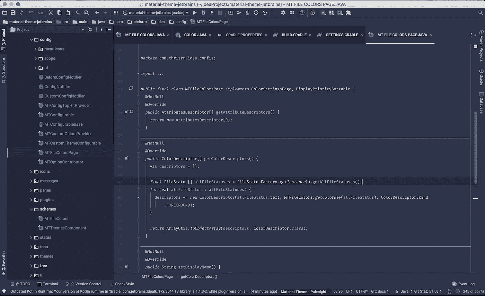

图片来自 IntelliJ 的材质主题 UI 插件市场

## 字处理

编写代码意味着编写文本和使用字符串。很多都是。[字符串操作](https://plugins.jetbrains.com/plugin/2162-string-manipulation) ( `⌥` `⇧` `m`)为你的 IDE 添加了一个完整的工具箱，这样你就可以轻松地切换、排序、过滤、递增、对齐列、grep、转义、编码等等。

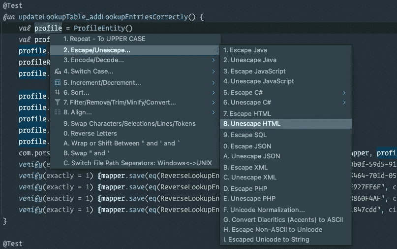

## 彩虹括号

括号——不管是哪一个——是程序员最好的朋友，有时也是最坏的敌人。复杂的代码会变得令人不知所措，仅仅是因为不容易理解哪个左括号与哪个右括号相关。[彩虹括号](https://plugins.jetbrains.com/plugin/10080-rainbow-brackets)通过给你的括号上色来帮助你。

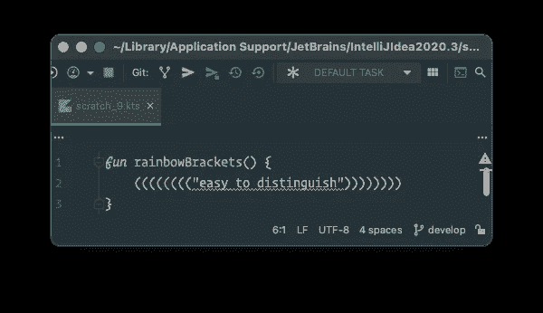

## 开源代码库

实话实说:在 Github 网站上查看 pull 请求一点也不好玩。尤其是对于较大的，即使并排查看也无济于事。通过 [Github 的 IntelliJ 插件](https://plugins.jetbrains.com/plugin/13115-github)，你可以在你的 ide 中查看你的 pull 请求，这使得它变得更加容易，因为你可以跳过代码段和引用，查看实现或抽象，从而更好地理解正在发生的事情。

## 索纳林特

添加代码或更改代码总是有机会引入新的错误。这就是为什么推荐使用像 [SonarLint](https://plugins.jetbrains.com/plugin/7973-sonarlint) 这样的静态代码分析工具。它有助于在打开您的拉取请求之前发现错误、漏洞和代码气味。

## PlantUML

如果你是一名软件架构师或后端开发人员，你会花很多时间定义和构建系统，并找到最佳的编排。

[PlantUML](https://plantuml.com/en/) 使您能够用简单直观的语法快速编写(*而不是绘制*)各种图表——从序列图到组件图。PlantUML 集成插件将为您自动生成实际的图，因此您不需要花费时间来调整大小和拖动框。对代码的每次更新都会创建一个更新的版本。

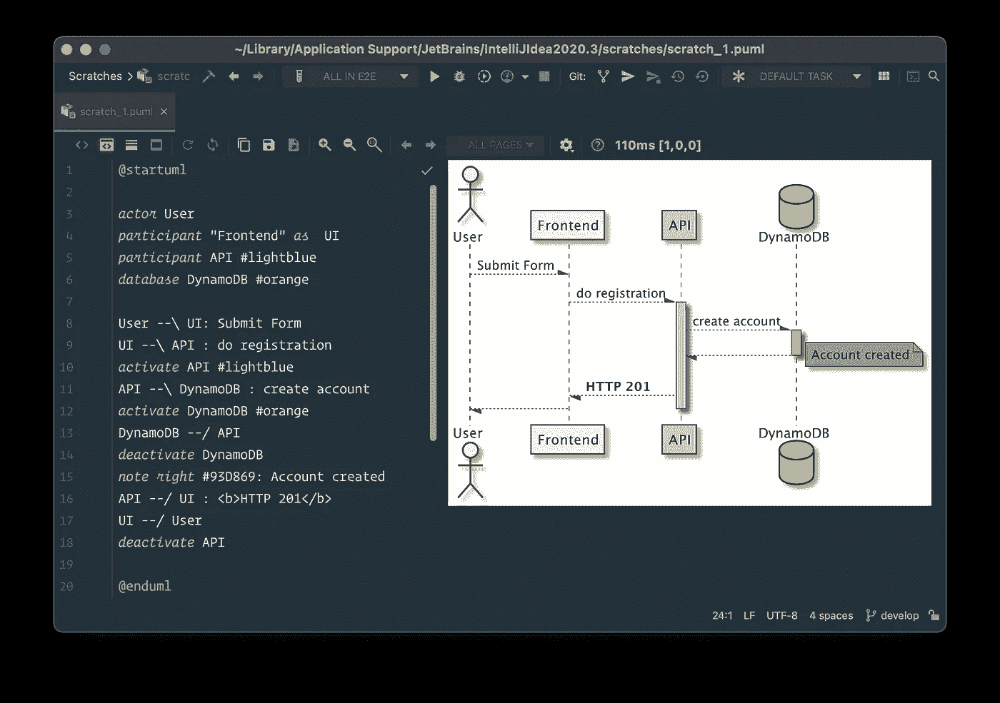

IntelliJ 中 PlantUML 的简单序列图

这样，您可以轻松地将复杂的系统文档作为代码保存在您的存储库中。这无疑是我最喜欢的插件和工具之一。

## BashSupport Pro

*提前:这个插件只能通过* [***订阅***](https://www.bashsupport.com/pro/pricing/) *获得，但是如果你经常使用 Bash，你会得到更多。*

BashSupport Pro 为您提供了使用 bash 或 shell 编写脚本的完整工具箱。它带来了一个调试器和代码补全，向您显示来自 ShellCheck 的提示，等等。

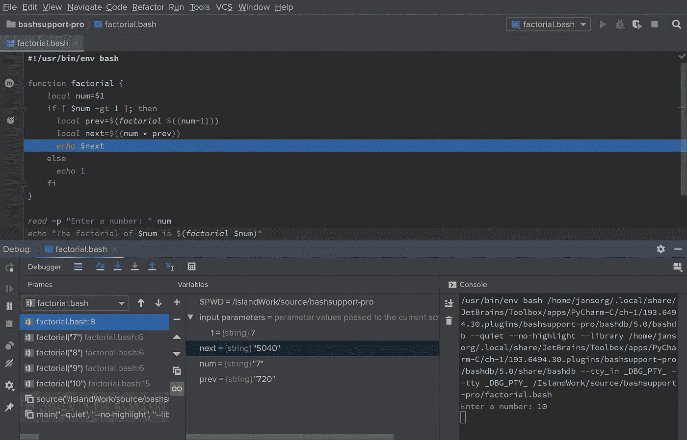

图片来自 [IntelliJ 的 Bash Support Pro 插件市场](https://plugins.jetbrains.com/plugin/13841-bashsupport-pro)

## AWS 工具包

如今，您的日常业务很可能会围绕 AWS 展开。如果是这样的话， [AWS 工具包](https://plugins.jetbrains.com/plugin/11349-aws-toolkit)是必须拥有的。

它允许您直接从 IDE 连接到某些 AWS 服务。例如，您可以浏览 CloudWatch 日志和 S3 桶，或者只需单击一下就可以部署或调用 Lambda 函数。

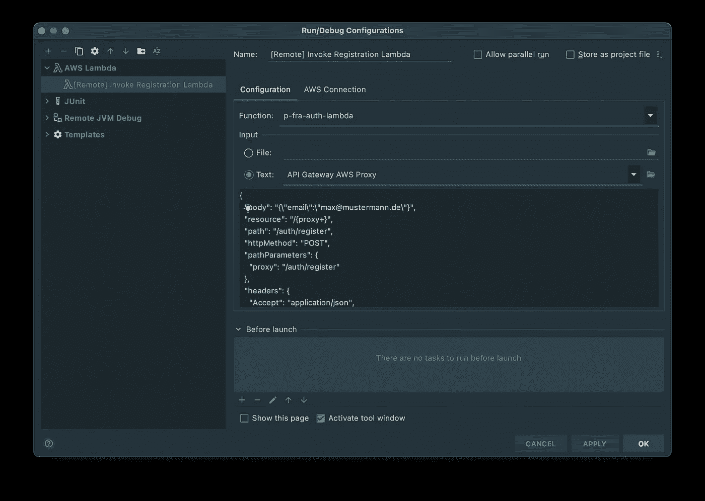

# 关键要点

了解 IDE 的细节将为您节省大量时间，并让您以更高效的方式工作。对于 IntelliJ 这样强大的 IDE 来说尤其如此。在这篇文章中，我们已经浏览了一组有用的特性、快捷方式和插件，以充分利用它们。

今天就投资去学习它们，习惯它，或许还会发现更多能提高你工作效率的特性。

> 偶尔节省几秒钟或几分钟听起来不多，但是在几周或几个月内这样做将会节省你一整天的工作。

感谢您的阅读。