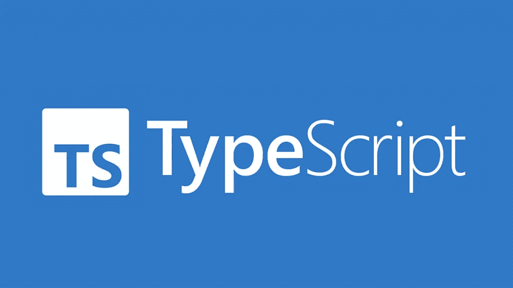

# 掌握 TypeScript 中的交集和并集类型:最终指南和基本技术

> 原文：<https://levelup.gitconnected.com/mastering-intersection-and-union-types-in-typescript-the-ultimate-guide-essential-techniques-49aa9f6a188a>

在本文中，我们将探索 TypeScript 中交集和并集类型的用例及其优点，并演示如何使用它们来提高代码的可靠性和灵活性，为初学者或有经验的 TypeScript 开发人员提供有价值的见解。让我们开始吧…



# 目录

*   交叉点类型
    *关键点
*   工会类型
*   类型简化

# 交叉点类型

什么是交集类型？简单地说，交集类型是一种使用`&`符号将多个类型组合成一个类型，然后使用`type`声明新创建的类型的方法。这里有一个例子:

```
type A = { a: number };
type B = { b: string };
type C = A & B;
let c: C = { a: 1, b: '2' };
```

在这个例子中，我们定义了两种类型，`A`和`B`，它们各有一个属性。然后我们使用`&`操作符将这两种类型组合成一种新的类型，称为`C`。然后我们可以使用`C`类型声明一个变量`c`，它必须同时具有`a`和`b`属性。

当您想要定义一个具有多种类型的所有属性的类型时，交集类型非常有用。当在 TypeScript 中使用接口时，它们特别有用。

# 要点

*   任何类型都可以用`&`组合成新类型吗？

不，用`&`操作符组合基本类型是没有意义的，因为结果类型会是`never`。例如，`string & number`是无效的，因为一个值不可能既是字符串又是数字。

*   属性名相同的接口类型使用`&`组合时是如何处理的？

这里有两种情况需要考虑:

1.  如果属性类型相同，则结果类型将具有相同的属性类型。
2.  如果属性类型不同，结果类型将具有属性类型`never`。

```
interface X{
 q:number,
 w:string
}
interface Y{
 q:boolean,
 r:string,
}
type XY = X&Y
```

在这个例子中，`XY`类型被定义为`X`和`Y`接口的交集。这意味着`XY`类型将有三个属性:`q`、`w`和`r`。`q`属性的类型将是`never`，因为`q`属性在`X`和`Y`接口中有不同的类型。`w`和`r`属性将分别具有与`X`和`Y`接口相同的类型。

因此，产生的`XY`类型将具有以下结构:

```
{
  q: never,
  w: string,
  r: string
}
```

您可以使用`XY`类型来声明必须在`X`和`Y`接口中定义属性的变量。例如:

```
let xy: XY = { q: true, w: 'foo', r: 'bar' };
```

该变量`xy`必须有一个`boolean`类型的`q`属性、`string`类型的`w`属性和`string`类型的`r`属性。

另一个更高级的例子是:

```
interface A {
    inner: D;
}
interface B {
    inner: E;
}
interface C {
    inner: F;
}

interface D {
    d: boolean;
}
interface E {
    e: string;
}
interface F {
    f: number;
}
type ABC = A & B & C;
let abc: ABC = {
    inner: {
        d: false,
        e: 'className',
        f: 5
    }
};
```

在本例中，`ABC`类型被定义为`A`、`B`和`C`接口的交集。这意味着`ABC`类型将只有一个属性`inner`，它本身是一个具有三个属性的对象:`d`、`e`和`f`。

`ABC`类型的`inner`属性是`A`、`B`和`C`接口的`inner`属性的联合。这意味着它必须具有所有三个属性:`d`、`e`和`f`，并且它们的类型必须分别与`D`、`E`和`F`接口中定义的类型相匹配。

因此，产生的`ABC`类型将具有以下结构:

```
{
  inner: {
    d: boolean,
    e: string,
    f: number
  }
}
```

您可以使用`ABC`类型来声明变量，这些变量必须具有在所有三个`A`、`B`和`C`接口中定义的属性。例如:

```
let abc: ABC = {
  inner: {
    d: false,
    e: 'className',
    f: 5
  }
};
```

这个变量`abc`必须有一个`inner`属性，该属性是一个具有类型`boolean`的`d`属性、类型`string`的`e`属性和类型`number`的`f`属性的对象。

# 工会类型

联合类型允许您指定可以是几种不同类型之一的值。要创建一个联合类型，可以使用`|`操作符将多个类型组合成一个类型。例如:

```
type A = { a: number };
type B = { b: string };
type C = A | B;
let c: C = { a: 1 };
```

在这个例子中，我们定义了两个类型，`A`和`B`，它们各有一个属性。然后我们使用`|`操作符创建一个名为`C`的新类型，它表示一个可以是`A`或`B`的值。然后我们可以使用`C`类型来声明一个变量`c`，它必须具有`number`类型的`a`属性或者`string`类型的`b`属性。

当您希望一个值可以是几种不同类型中的一种时，联合类型非常有用。当使用 TypeScript 中的函数时，它们特别有用。

## 函数接口类型的联合类型

联合类型也可以与函数接口类型一起使用。例如:

```
interface A {
  (a: number): string;
}
interface B {
  (b: string): number;
}
type C = A | B;
let c: C;
c = (val: string | number) => {
  if (typeof val === 'string') {
    return val.length;
  } else {
    return val.toString();
  }
};
```

在本例中，`C`类型被定义为`A`和`B`接口的联合。这意味着`C`类型表示一个函数，它可以接受一个`number`并返回一个`string`，或者接受一个`string`并返回一个`number`。

`c`变量用`C`类型声明，并被赋予一个函数，该函数接受`string | number`类型的值，并根据值的类型返回`string`或`number`。

当您希望函数接受多种不同类型的参数，或者返回多种不同类型的值时，这可能会很有用。

## 类型简化

TypeScript 有一个称为类型缩减的功能，它允许您根据使用值的上下文来推断值的类型。例如:

```
let a: A | B;
if (someCondition) {
  a = { a: 1 };
} else {
  a = { b: '2' };
}
```

在这个例子中，我们声明了一个联合类型为`A | B`的变量`a`。根据`someCondition`的值，`a`被分配一个`A`或`B`值。然而，一旦进行了赋值，`a`的类型会根据所赋的值减少为`A`或`B`。

这在使用联合类型时特别有用，因为它允许您利用 TypeScript 的类型安全，同时还允许灵活地为变量赋值。

## 延伸阅读:

*   [TypeScript 必备基础知识—类型别名和接口](/typescript-must-know-fundamentals-for-your-next-tech-interview-or-project-255ae70df0a3)
*   [像专家一样使用打字键](/use-typescript-keyof-like-a-pro-56f3a3d06b73)
*   [打字稿类——从零到英雄](/typescript-classes-from-zero-to-hero-a429a3c96189)
*   [使用类和装饰器的下一级 Typescript 运行时类型验证](/next-level-your-typescript-runtime-type-validation-using-class-and-decorators-ddd2ce3c86f3)
*   [掌握类型脚本泛型:终极指南](/mastering-typescript-generics-the-ultimate-guide-3a62afeff44)
*   打字技巧和提示:立刻成为专业人士
*   [TypeScript 中的泛型——愚蠢简化的基础知识](/generics-in-typescript-must-know-fundamentals-stupidly-simplified-e7b4d7ffc0e3)
*   [Typescript 遗漏了这一点，但你不应该—运行时类型验证](/typescript-missed-this-but-you-shouldnt-runtime-type-validation-aa8a81ce4289)
*   [Typescript 枚举陷阱和解决方案必须知道](/typescript-enum-pitfalls-and-solutions-must-know-bb971cb0f7d2)
*   [掌握打字稿泛型—终极指南—基本接口技术](https://bootcamp.uxdesign.cc/mastering-typescript-generics-the-ultimate-guide-essential-interface-techniques-86e793cf1fc)
*   Javascript 开发人员经常忽略的 Typescript 特性

如果你觉得这个指南有帮助，请鼓掌并跟我来。通过[链接](https://medium.com/@caopengau/membership)加入 medium，在 medium 上访问我和所有其他优秀作家的所有优质文章。

# 分级编码

感谢您成为我们社区的一员！在你离开之前:

*   👏为故事鼓掌，跟着作者走👉
*   📰查看[升级编码出版物](https://levelup.gitconnected.com/?utm_source=pub&utm_medium=post)中的更多内容
*   🔔关注我们:[Twitter](https://twitter.com/gitconnected)|[LinkedIn](https://www.linkedin.com/company/gitconnected)|[时事通讯](https://newsletter.levelup.dev)

🚀👉 [**加入人才集体，找到一份令人惊喜的工作**](https://jobs.levelup.dev/talent/welcome?referral=true)