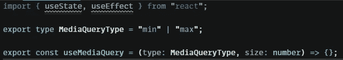
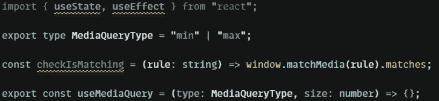
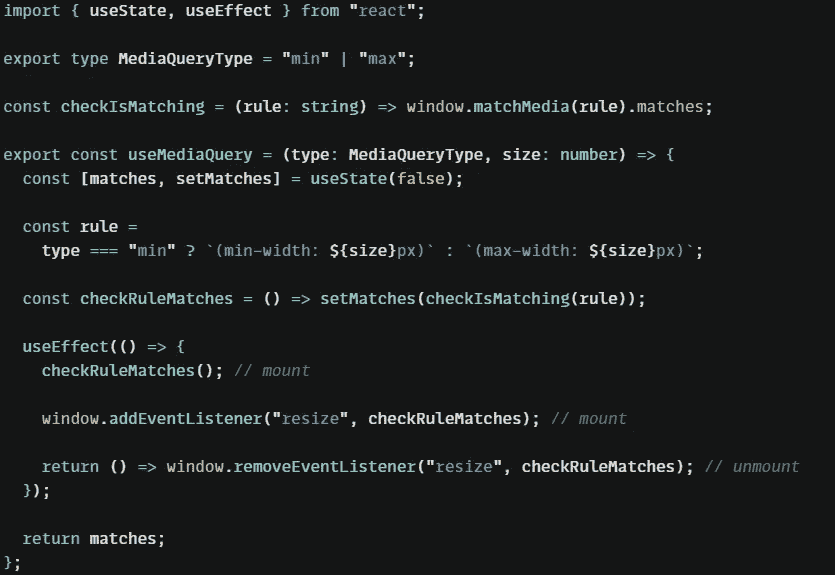
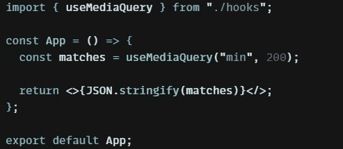

# 掌握 React —构建您自己的 React 挂钩

> 原文：<https://levelup.gitconnected.com/mastering-react-build-your-own-react-hook-12011113a949>

JoshuaWoroniecki 皮查拜

# 🤔动机

您能想象在 React 中编写代码时组件内部没有杂乱的逻辑片段吗？你愿意以最优雅的方式不止一次地使用逻辑的某些部分吗？你来对地方了。

# ✨简介

在我们开始之前，你需要知道基本的钩子([阅读我以前的文章](https://david-nienajadlo.medium.com/mastering-react-basic-hooks-explained-9e579fcf4794))。开始时需要这些知识。

# 🚀让我们建立我们的自定义挂钩

今天我们将构建一个 **useMediaQuery** 钩子作为一个很棒的可重用钩子。

为了创建这个钩子，我们需要使用一个 resize 监听器——在组件被挂载时创建一个监听器，在卸载时删除它。所以我们需要使用组件生命周期。

让我们准备我们的功能。我准备了 MediaQueryType 类型，因为我们之前需要知道媒体查询规则类型。

使用 MediaQuery 空样板

所以现在我们需要创建一个函数来检查媒体查询是否匹配。我们可以使用 **window.matchMedia()** 函数来获取它。

媒体查询规则匹配检查功能

现在我们需要编写精确的钩子逻辑。我们真正需要做的是什么？
-安装组件时创建监听器
-安装组件时检查媒体是否匹配(因为我们想知道安装时媒体是否匹配)，
-卸载组件时移除监听器

这里我们应该使用 **useEffect** 钩子来使用组件的生命周期，当然我们需要在某个地方存储逻辑状态，所以我们应该使用 **useState。**

所以我们的钩子看起来像这样

使用 MediaQuery 挂钩

但是现在——如何使用它？真的很简单

useMediaQuery 挂钩示例用法

# 🍟摘要

正如你所看到的，建立自己的钩子真的很容易。现在，您可以编写可重用的特性，使您的代码更加整洁，并提高您的编程技能。

# 👍谢谢大家！

希望你真的喜欢这篇文章。