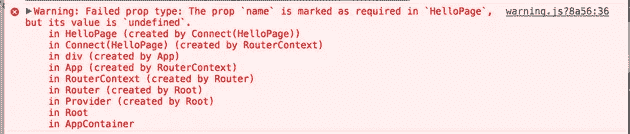

# 掌握 React 属性类型

> 原文：<https://levelup.gitconnected.com/mastering-react-proptypes-93f8de9026df>

## 理解动态类型检查的艺术

萨姆·穆卡达姆在 [Unsplash](https://unsplash.com?utm_source=medium&utm_medium=referral) 上拍摄的照片

React 的 [PropTypes](https://reactjs.org/docs/typechecking-with-proptypes.html) 是开发人员在构建项目时可以使用的强大工具。它可用于验证组件作为输入接收的数据。并确保这是所期望的。

PropTypes 模块包含一组函数，用于验证作为 props 传入的数据类型。并在验证失败时返回错误。最常见的用例是测试所需的道具是否由子组件提供。

# PropTypes 如何工作

PropTypes 是 React 的内部机制，用于检查组件是否正在接收正确的类型。React 组件使用一个名为`propTypes`的属性来设置类型检查。对于功能组件和基于类的组件都可以这样做。

# 要检查的可用类型

当谈到支持的类型时。PropTypes 包提供了预定义的验证函数。它们涵盖了大多数常见的类型。对于更困难的验证，我们也有能力定义定制的验证器。

## 基本类型

这些是基本数据类型的验证器:

*   `PropTypes.any` -道具可以是任何东西
*   `PropTypes.bool` -道具需要是`true`或者`false`
*   `PropTypes.number` -道具需要是任意的`number`
*   `PropTypes.string` -道具需要是任意的`string`
*   `PropTypes.func` -道具需要是一个函数
*   `PropTypes.array` -道具需要`Array`
*   `PropTypes.object` -道具需要`Object`
*   `PropTypes.symbol` -道具需要`Symbol`

## 可呈现类型

可渲染类型检查属性是否可以被 React 渲染。我们可以指定`prop`是否是 React 元素(即。`<MyComponent />`)或其他任何东西(即。字符串、数字等...)

*   `PropTypes.element` -反应元素
*   `PropTypes.node` -任何可以渲染的东西。数字、字符串、元素或数组

## 实例类型

实例验证器可以用来检查`prop`是否是给定类的实例。这对于检查`prop`是否是组件的实例很有用，但是它只适用于基于类的组件。

## 集合类型

当我们需要验证数组的内容时，集合验证器就派上了用场。这让我们可以检查和验证数组或对象的内容。

*   `PropTypes.arrayOf` -已定义元素的数组
*   `PropTypes.shape` -包含已定义属性的对象(可能包含附加属性)
*   `PropTypes.exact` -只包含已定义属性的对象(不能包含任何附加属性)

## 必需的类型

默认情况下所有`props`都是可选的。以确保某个属性总是被传递。我们可以根据需要使用`isRequired`验证器来标记它。

## 自定义验证程序

在某些情况下，我们需要编写定制的验证器。一个很好的例子是检查传递的`prop`是否是有效的电子邮件地址。

我们可以将一个定制的验证器定义为一个接受 3 个参数并在验证失败时返回`Error`的函数。

## 提供默认值

为组件`props`定义默认值很简单。我们可以通过将它们分配给`defaultProps`属性来做到这一点。如果我们忘记设置道具，下面的例子将把`englishSpeaker`设置为`true`。

# 如何检查错误

React 的 PropTypes 在运行时检查类型是否正确。这意味着我们需要运行我们的应用程序来检查类型是否正确。此外，它只检查呈现的组件类型。如果某个组件收到了不正确的类型。我们将在控制台中看到一个警告。

因为这是一项耗时的任务。它仅在开发模式下受支持。所以开发的时候要仔细看控制台。因为你在生产中不会看到警告！

# 结论

[PropTypes](https://reactjs.org/docs/typechecking-with-proptypes.html) 给了我们很多函数来检查组件是否接收到正确的属性。这是将类型检查快速引入 React 项目的好方法。并使应用程序更加稳定。然而，对于大型项目来说，这并不是一个理想的选择。

随着项目越来越大，很容易忽略控制台中的警告。并将不必要的错误引入系统。在这些场景中，我们应该考虑使用像 [Flow](https://flow.org/en/docs/react/) 或 [Typescript](https://www.typescriptlang.org/) 这样的工具进行静态类型检查。

【https://www.upbeatcode.com】最初发表于**。**