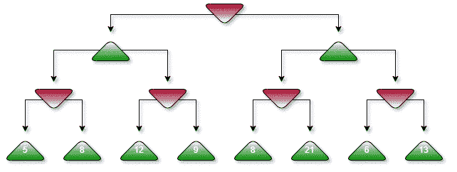
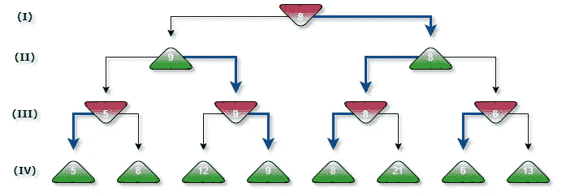
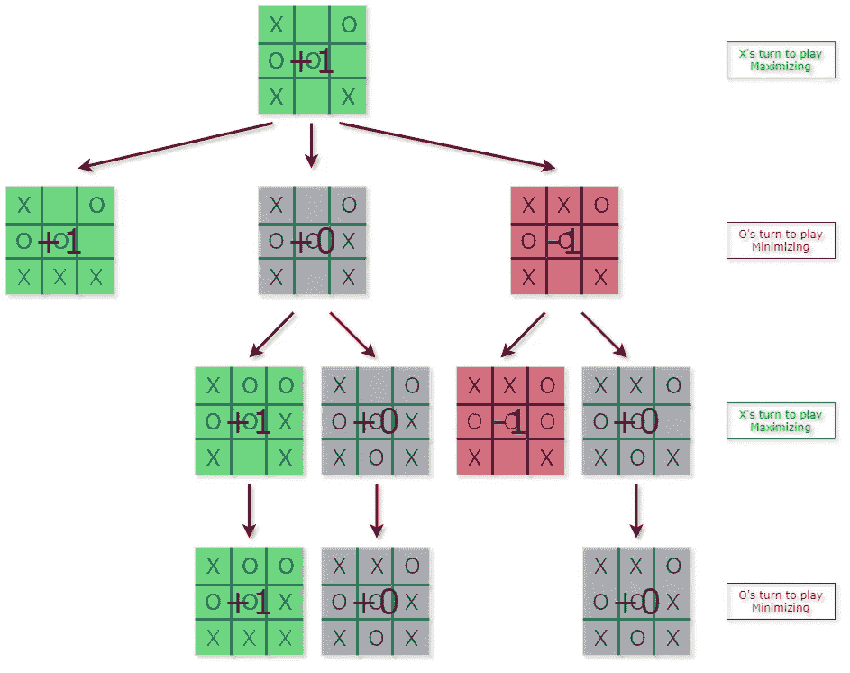
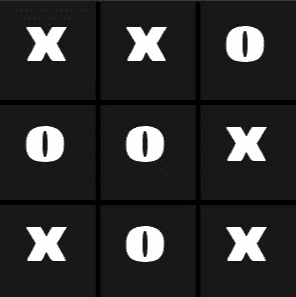
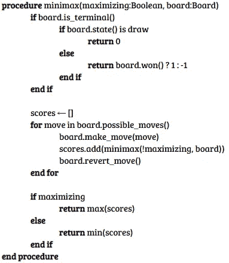
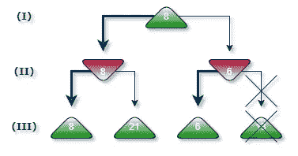

# 用 Python 中的极大极小算法掌握井字游戏

> 原文：<https://levelup.gitconnected.com/mastering-tic-tac-toe-with-minimax-algorithm-3394d65fa88f>

最近一直在涉猎博弈论，不得不重新访问极大极小算法。这个算法我已经很熟悉了，但是我从来没有花时间去实现它。这似乎是一个很好的机会来实现一个简单的游戏，如井字游戏，并解释其基础知识。完整的源代码可在[这里](https://github.com/yigitpirildak/TicTacToe-Minimax)获得。事不宜迟，我们开始吧！

# 极大极小算法

Minimax 是一种用于生成和探索博弈树的**对抗搜索**算法。它主要用于解决**零和游戏**中一方的收益等于另一方的损失，因此所有的收益相加，减去所有的损失最终为零。

对抗性搜索不同于传统的搜索算法，它将**对手**加入到混合搜索中。极大极小算法不断优化玩家和对手的回合，以找出最佳可能的移动。

图 1:运行中的极大极小算法。

让我们考虑一个简单的博弈，其中每个状态只有 2 个可能的移动，比如**图-1** 。树的节点代表**游戏状态**，边代表**招式**。顶部节点是**最小化器**，这意味着轮到你的对手了。自然，它会挑对你最不利的位置**。** 为了让最小化者在给定当前游戏状态的情况下计算出最不利的移动，必须生成所有可能到达的状态。幸运的是，我们只展望未来 3 步，所以我们的树是相当容易管理的。

让我们来看看树的每一层:

*   这些是游戏的终端状态。每一个都经过评估，并根据它们的有利程度进行评分。
*   **(三)**游戏结束前的最后一招，轮到极小者了。选择对最大化器最不利的状态。
*   **(II)** 现在 maximizer 知道 minimizer 下一轮怎么玩，在所有可能达到的状态中，选择最优的一个。
*   既然我们回到了顶端，现在是做决定的时候了。通过预测三步棋，最小化者知道该走哪条路。自然地，选择得分为 **8** 的路径。

正如你所看到的，由于叶节点是终端状态，一旦极大极小算法完成了通向它们的每一个回合，一切都决定了。假设你是和那个人工智能对战的人，即使你打得很完美，你也不可能在这一点上得到高于 8 的分数。

# 井字游戏的极小极大

井字游戏是一种相当简单的游戏，只有 **255，168** 种可能的游戏可以玩。这个数字对于今天的计算机来说微不足道，这就是为什么井字游戏被认为是一个**解决的游戏**，这意味着给定**任何状态**，结果都是可以预测的。这个游戏非常简单，我们可以毫不费力地生成整个游戏树，而在国际象棋中，已经有 **69，352，859，712，417** 种可能的游戏可以在 10 步后完成。

用极大极小法解决的井字游戏树的一部分

我已经使用 python 的 **p5** 库创建了一个简单的井字游戏板。电路板状态以二维 3×3 矩阵表示。每次移动后，评估板状态以检查是否达到终止状态。

实现井字游戏的 minimax 很简单。我们将通过探索每个棋盘状态的所有可能移动来递归生成游戏树，并且在到达终点状态时，我们将为赢分配值 **1，为输分配值-1，为和棋分配值**0。然后基于这些终端状态，对于每个探索的回合，最大化者或最小化者将选择最合适的移动。这样做会将这些结果一直传播到树根。该算法看起来有点像这样:

python 中的实现可以在下面找到。首先，我们检查当前状态是否结束，如果是，则返回一个分数。如果不是终止状态，对于所有可能的移动，我们移动，交换玩家，用新的棋盘状态调用 minimax，将其返回值添加到分数列表中，并撤消移动。

在尝试了所有可能的移动后，我们将返回分数列表的最大值或最小值，这取决于我们是最大化还是最小化。

由于这是一个已解决的游戏，我们已经知道，如果双方都玩得很完美，在井字游戏中就没有获胜的机会。所以让人工智能对抗人工智能只会导致一连串的平局。

x:人类，O : AI

# 改进极大极小算法

对于简单的游戏来说，生成整个树非常有效。如果你想一个像国际象棋一样复杂的游戏，不幸的是那几乎是不可行的。有几种方法可以将该算法应用到更复杂的游戏中。

## 深度受限的极大极小值

可以给算法分配一个最大深度限制，以便只向前探索几个移动。你将需要一个算法来评估非终端游戏状态，以便做出合理的预测。

## 阿尔法-贝塔剪枝

这是一种消除部分树的算法，这样它们就不会被探索。根据你已经获得的分数，有可能决定它不能通过探索树的某一部分来改进。考虑树的以下部分:

阿尔法-贝塔剪枝

假设算法从左到右探索，一旦我们到达水平(II)的右侧，并意识到左侧孩子的分数为 6，探索右侧就没有意义了。原因是 Maximizer 决定选择第二级中的哪个州，并且已经有 8 分可供选择。看到级别(II)的右侧**保证具有 6 或更低的分数**，值 8 在这里成为明显的赢家。

在复杂的游戏中，每回合都有很多可能的走法，丢弃树的大部分可以显著改善算法，甚至可以让你走得更深。

1997 年击败加里·卡斯帕罗夫的 IBM 深蓝国际象棋计算机使用了 alpha-beta 搜索，这基本上是带有 alpha-beta 修剪的 minimax。据说该算法会根据情况提前 6 到 20 步。

# 总结

极大极小是一个老算法，但它仍然有许多用途。由于其简单的性质，这是一个很好的介绍游戏树。在探索每一个可能状态都不可行的游戏中，找到一个评估非终结状态的好算法是关键。我希望这篇文章可以帮助您实现自己的版本，并帮助您获得对它的基本理解！