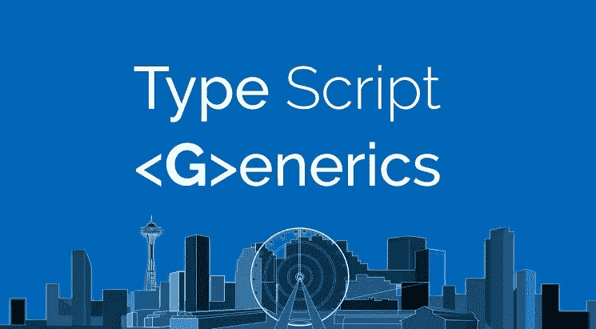

# 掌握类型脚本泛型:最终指南

> 原文：<https://levelup.gitconnected.com/mastering-typescript-generics-the-ultimate-guide-3a62afeff44>



# 目录

*   无商标消费品
*   使用通用函数
*   通用约束
*   使用多个泛型
*   通用接口
*   通用类
*   通用实用程序类型

# 无商标消费品

泛型允许函数和其他类型处理多种类型，同时仍然确保类型安全，支持重用。它们通常用于函数、接口和类中。在我们的日常工作中，我们经常会创建一些函数，这些函数接受某种类型的数据并返回相同类型的数据，这意味着参数和返回类型是相同的，如下所示:

```
function identity<T>(arg: T): T {
  return arg;
}
```

在此示例中，函数“identity”接受一个 T 类型的参数，并返回一个 T 类型的值。T 类型是一个占位符，在调用该函数时将被替换为特定的类型。例如，如果我们使用参数“hello”调用函数，类型 T 将被替换为字符串类型，函数将返回字符串类型的值。

以前，为了允许函数接受任何类型，我们可以将参数类型更改为“any”。但是，这将失去 TypeScript 提供的类型安全性，使函数变得不安全。泛型允许我们保持类型安全，同时仍然使函数能够处理多种不同的类型，提供了灵活性和重用性。

## 使用通用函数

为了创建一个通用函数，我们在函数名后面添加了<>(尖括号)，并在括号内包含了一个类型变量。例如:

```
function identity<T>(arg: T): T {
  return arg;
}
```

注意，泛型函数的类型变量可以是任何有效的变量名，而不仅仅是上面例子中的“T”。

要调用通用函数，我们在尖括号中指定类型参数，如下所示:

```
let output = identity<string>("hello");  // type of output is 'string'
```

或者，我们可以使用类型推断来自动确定类型参数:

```
let output = identity("hello");  // type of output is also 'string'
```

在这种情况下，TypeScript 将根据传递给该函数的参数类型推断该函数的类型参数是“string”。

为了调用通用函数，我们在调用函数时在尖括号中指定类型参数:

```
let output = identity<string>("hello");  // type of output is 'string'
```

或者，我们可以使用类型推断来自动确定类型参数:

```
let output = identity("hello");  // type of output is also 'string'
```

在这种情况下，TypeScript 将根据传递给该函数的参数类型推断该函数的类型参数是“string”。

例如:

```
function identity<T>(arg: T): T {
  return arg;
}
let output = identity<string>("hello");  // type of output is 'string'
```

当调用泛型函数时，也可以省略类型参数<type>，因为 TypeScript 包含一个称为“类型参数推断”的机制，它可以根据传递给函数的参数类型自动推断类型变量的类型。这可以使代码更短，更容易阅读。</type>

例如:

```
function identity<T>(arg: T): T {
  return arg;
}
let output = identity("hello");  // type of output is inferred as 'string'
```

请注意，在某些情况下，有必要显式指定类型参数，例如当编译器无法推断类型或推断的类型不准确时。

# 通用约束

默认情况下，泛型函数的类型变量可以表示多种类型，这意味着不可能访问任何属性。例如，试图使用泛型来获取字符串的长度会导致错误，因为泛型表示任何类型，并且不能保证特定属性的存在。在这种情况下，我们可以向泛型添加一个约束，以缩小可能类型的范围。

添加通用约束有两种主要方法:

*   指定更具体的类型:您可以将通用函数的类型修改为更具体的类型，以便访问其属性，如下所示:

```
function identity<T extends string | number>(arg: T): T {
  console.log(arg.length);  // okay to access 'length' property
  return arg;
}
let output = identity("hello");  // type of output is 'string'
```

在本例中，类型变量 T 被约束为联合类型“string | number”，这意味着它只能是字符串或数字。这允许我们访问参数的“长度”属性，因为字符串和数字都有这个属性。

*   使用类型参数作为约束:也可以使用类型参数作为约束，方法是用“extends”关键字扩展它，如下所示:

```
function getProperty<T, K extends keyof T>(obj: T, key: K) {
  return obj[key];
}
let x = { a: 1, b: 2, c: 3, d: 4 };
getProperty(x, "a");  // okay
getProperty(x, "m");  // error: Argument of type 'm' isn't assignable to 'a' | 'b' | 'c' | 'd'.
```

在这个示例中，类型参数 K 被约束为 t 类型的键。这允许我们使用作为第二个参数传递的键来访问作为第一个参数传递的对象的属性。

添加约束:您可以创建一个描述约束并提供所需属性的接口，然后使用“extends”关键字将约束添加到类型变量:

```
interface Lengthwise {
  length: number;
}
function identity<T extends Lengthwise>(arg: T): T {
  console.log(arg.length);  // okay to access 'length' property
  return arg;
}
let output = identity({ length: 10, value: 3 });  // type of output is { length: number, value: number }
```

在本例中，类型变量 T 被约束为具有 number 类型的“length”属性的类型。这允许我们访问参数的“length”属性，该属性的类型为{ length: number，value: number }。

# 使用多个泛型

在泛型中可以有多个类型变量，并且可以基于一个类型变量约束另一个类型变量(例如，可以基于第一个类型变量约束第二个类型变量)。例如:

```
function getProperty<T, K extends keyof T>(obj: T, key: K) {
  return obj[key];
}
let x = { a: 1, b: 2, c: 3, d: 4 };
getProperty(x, "a");  // returns 1
```

在这个示例中，函数“getProperty”有两个类型变量:T 和 K。类型变量 T 表示作为第一个参数传递的对象的类型，类型变量 K 表示作为第二个参数传递的键的类型。类型变量 K 被约束为 T 类型的键，这意味着它只能是作为第一个参数传递的对象的有效键的字符串。这允许我们使用键来访问对象的属性。

您还可以使用多个类型变量来创建更复杂的类型。例如:

```
function createPair<T, U>(first: T, second: U): [T, U] {
  return [first, second];
}
let pair = createPair(1, "second");  // type of pair is [number, string]
```

在本例中，函数“createPair”有两个类型变量:T 和 U。该函数分别接受 T 和 U 类型的两个参数，并返回具有相同类型的元组。元组的类型是[T，U]，这意味着它是一对，第一个元素的类型是 T，第二个元素的类型是 U。

# 通用接口

为了创建一个通用接口，我们在接口名后面添加了一个类型变量。接口也可以和泛型一起使用，以增加灵活性和重用性。

例如:

```
interface Pair<T, U> {
  first: T;
  second: U;
}
let pair: Pair<number, string> = { first: 1, second: "second" };
```

在这个例子中，接口“pair”有两个类型变量:T 和 u。对象“Pair”的类型是“Pair <number string="">”，这意味着它是一个具有类型 number 的“第一”属性和类型 string 的“第二”属性的对象。</number>

还可以使用泛型接口为函数创建类型别名:

```
type Callback<T> = (arg: T) => void;
let callback: Callback<string> = (arg) => console.log(arg);
```

在此示例中，类型别名“callback”有一个类型变量 t。变量“Callback”的类型是“Callback <string>”，这意味着它是一个采用类型 string 的单个参数且不返回值的函数。</string>

您还可以使用通用接口来约束对象的属性类型:

```
interface Dictionary<T> {
  [key: string]: T;
}
let dictionary: Dictionary<number> = { a: 1, b: 2, c: 3 };
```

在这个例子中，接口“dictionary”只有一个类型变量 t。对象“Dictionary”的类型是“Dictionary <number>”，这意味着它是一个具有 number 类型属性的对象。接口的索引签名指定对象的键必须是字符串。这允许我们使用字符串键来访问对象的属性。</number>

# 通用类

像泛型接口一样，类也可以和泛型一起使用。

为了创建一个泛型类，我们在类名后添加一个类型变量，如下所示:

```
class Pair<T, U> {
  constructor(public first: T, public second: U) {}
}
let pair = new Pair<number, string>(1, "second");
```

在这个例子中，类“pair”有两个类型变量:T 和 u。对象“Pair”的类型是“Pair <number string="">，这意味着它是一个具有类型 number 的“第一”属性和类型 string 的“第二”属性的对象。</number>

您还可以使用泛型类来约束对象的属性类型:

```
class Dictionary<T> {
  [key: string]: T;
}
let dictionary = new Dictionary<number>();
dictionary.a = 1;
dictionary.b = 2;
dictionary.c = 3;
```

在这个例子中，类“dictionary”只有一个类型变量 t。对象“Dictionary”的类型是“Dictionary <number>”，这意味着它是一个具有 number 类型属性的对象。类的索引签名指定对象的键必须是字符串。这允许我们使用字符串键来访问对象的属性。</number>

还可以使用泛型类为函数创建类型别名:

```
type Callback<T> = new (arg: T) => void;
class MyClass<T> {
  public value: T;
  constructor(value: T) {
    this.value = value;
  }
}
let callback: Callback<string> = MyClass;
let instance = new callback("value");
```

在这个例子中，类型别名“callback”有一个类型变量 t。变量“Callback”的类型是“Callback <string>”，这意味着它是一个采用类型 string 的单个参数并且不返回值的类。“MyClass”类有一个类型变量 T 和一个采用 T 类型参数的构造函数。“instance”变量是“MyClass <string>”的实例，这意味着它是一个具有 string 类型的“value”属性的对象。</string></string>

# 通用实用程序类型

“Partial <t>”实用程序类型用于构造 T 的所有属性都设置为可选的类型。当您希望创建一个基于现有类型的新类型，但某些属性是可选的时，这很有用。</t>

例如:

```
interface Person {
  name: string;
  age: number;
  occupation: string;
}
type PartialPerson = Partial<Person>;
// type PartialPerson = { name?: string; age?: number; occupation?: string; }
let person: PartialPerson = {};
```

在这个例子中，接口“Person”有三个必需的属性:“name”、“age”和“occupation”。“PartialPerson”类型是使用“Partial <t>”实用程序类型创建的，它具有与“Person”接口相同的属性，但它们都是可选的。“person”变量属于“PartialPerson”类型，这意味着它是一个具有可选“姓名”、“年龄”和“职业”属性的对象。</t>

您还可以使用“Partial <t>”实用程序类型来创建一个类的部分版本:</t>

```
class Person {
  constructor(public name: string, public age: number, public occupation: string) {}
}
type PartialPerson = Partial<Person>;
// type PartialPerson = { name?: string; age?: number; occupation?: string; }
let person = new PartialPerson();
```

在这个例子中，“Person”类有三个必需的属性:“姓名”、“年龄”和“职业”。“PartialPerson”类型是使用“Partial <t>”实用程序类型创建的，它具有与“Person”类相同的属性，但是它们都是可选的。“person”变量是“PartialPerson”的实例，这意味着它是一个具有可选“姓名”、“年龄”和“职业”属性的对象。</t>

其他实用程序类型包括:

*   Readonly <t>:创建一个 T 的所有属性都设置为只读的类型。</t>
*   挑选<t k="">:通过从 t 中挑选一组属性 K 来创建一个类型</t>
*   记录<k t="">:创建一个具有 t 类型的一组属性 K 的类型。</k>
*   Exclude <t u="">:通过从 T 中排除那些可赋给 u 的类型来创建一个类型。</t>
*   Extract <t u="">:通过从 T 中提取那些可赋给 u 的类型来创建一个类型。</t>
*   省略<t k="">:通过从 t 中省略一组属性 K 来创建一个类型。</t>

## 只读

“Readonly <t>”实用程序类型用于构造 T 的所有属性都设置为只读的类型。当您希望创建基于现有类型的新类型，但所有属性都为只读时，这很有用。</t>

例如:

```
interface Person {
  name: string;
  age: number;
  occupation: string;
}
type ReadonlyPerson = Readonly<Person>;
// type ReadonlyPerson = { readonly name: string; readonly age: number; readonly occupation: string; }
let person: ReadonlyPerson = { name: "John", age: 30, occupation: "Developer" };
person.name = "Jane"; // error: cannot assign to 'name' because it is a read-only property
```

在这个例子中，界面“Person”有三个属性:“姓名”、“年龄”和“职业”。“ReadonlyPerson”类型是使用“Readonly <t>”实用程序类型创建的，它具有与“Person”接口相同的属性，但它们都是只读的。“person”变量属于“ReadonlyPerson”类型，这意味着它是一个具有只读“姓名”、“年龄”和“职业”属性的对象。</t>

您还可以使用“Readonly <t>”实用程序类型来创建类的只读版本:</t>

```
class Person {
  constructor(public name: string, public age: number, public occupation: string) {}
}
type ReadonlyPerson = Readonly<Person>;
// type ReadonlyPerson = { readonly name: string; readonly age: number; readonly occupation: string; }
let person = new ReadonlyPerson("John", 30, "Developer");
person.name = "Jane"; // error: cannot assign to 'name' because it is a read-only property
```

在这个例子中，“Person”类有三个属性:“姓名”、“年龄”和“职业”。“ReadonlyPerson”类型是使用“Readonly <t>”实用程序类型创建的，它具有与“Person”类相同的属性，但它们都是只读的。“person”变量是“ReadonlyPerson”的实例，这意味着它是一个具有只读“姓名”、“年龄”和“职业”属性的对象。</t>

## 选择

“Pick <t k="">”实用程序类型用于通过从 t 中选取一组属性 K 来创建一个新类型。当您想要创建一个基于现有类型的新类型，但只有一个属性子集时，这很有用。</t>

例如:

```
interface Person {
  name: string;
  age: number;
  occupation: string;
}
type NameAge = Pick<Person, "name" | "age">;
// type NameAge = { name: string; age: number; }
let person: NameAge = { name: "John", age: 30 };
```

在这个例子中，界面“Person”有三个属性:“姓名”、“年龄”和“职业”。“NameAge”类型是使用“Pick <t k="">”实用程序类型创建的，它只有来自“Person”接口的“name”和“Age”属性。“person”变量属于“NameAge”类型，这意味着它是一个具有“name”和“Age”属性的对象。</t>

您也可以使用“Pick <t k="">”实用程序类型从一个类中创建一个新的类型:</t>

```
class Person {
  constructor(public name: string, public age: number, public occupation: string) {}
}
type NameAge = Pick<Person, "name" | "age">;
// type NameAge = { name: string; age: number; }
let person = new Person("John", 30, "Developer");
let nameAge: NameAge = { name: person.name, age: person.age };
```

在这个例子中，“Person”类有三个属性:“姓名”、“年龄”和“职业”。“NameAge”类型是使用“Pick <t k="">”实用程序类型创建的，它只有来自“Person”类的“name”和“Age”属性。“person”变量是“Person”的实例，“namAge”变量是“namage”类型，这意味着“namage”变量是“namage”类型，这意味着它是一个具有“name”和“age”属性的对象。“nameAge”变量是通过从“person”对象中提取“name”和“Age”属性创建的，该对象是“Person”类的一个实例。</t>

## 记录

“Record <k t="">”实用程序类型用于创建一个表示键 K 和值 t 的记录(字典)的类型。当您想要创建一个表示具有特定类型的一组固定键和值的对象的类型时，这很有用。</k>

例如:

```
type UserId = Record<"id", number>;
// type UserId = { id: number; }
let userId: UserId = { id: 123 };
```

在本例中，“UserId”类型是使用“Record <k t="">”实用程序类型创建的，它表示一个具有“number”类型的单个“Id”属性的对象。“UserId”变量属于“userId”类型，这意味着它是一个具有“number”类型的“Id”属性的对象。</k>

您还可以使用“Record <k t="">”实用程序类型来创建一个表示具有多个键和值的对象的类型:</k>

```
type User = Record<"id" | "name" | "age", number | string>;
// type User = { id: number; name: string; age: number; }
let user: User = { id: 123, name: "John", age: 30 };
```

在这个例子中,“User”类型是使用“Record <k t="">”实用程序类型创建的，它表示一个具有三个属性的对象:“number”类型的“id”、“string”类型的“name”和“number”类型的“age”。“user”变量属于“User”类型，这意味着它是一个具有相应类型的“id”、“name”和“age”属性的对象。</k>

## 延伸阅读:

*   [TypeScript 必备基础知识—类型别名和接口](/typescript-must-know-fundamentals-for-your-next-tech-interview-or-project-255ae70df0a3)
*   [像专业人士一样使用 Typescript keyof】](/use-typescript-keyof-like-a-pro-56f3a3d06b73)
*   [打字稿类——从零到英雄](/typescript-classes-from-zero-to-hero-a429a3c96189)
*   [使用类和装饰器的下一级 Typescript 运行时类型验证](/next-level-your-typescript-runtime-type-validation-using-class-and-decorators-ddd2ce3c86f3)
*   [打字技巧和提示:立即成为专业人士](https://bootcamp.uxdesign.cc/typescript-tricks-and-tips-become-a-pro-in-no-time-5390aba151be)
*   [打字稿中的泛型——基础知识被愚蠢地简化](/generics-in-typescript-must-know-fundamentals-stupidly-simplified-e7b4d7ffc0e3)
*   [Typescript 遗漏了这一点，但你不应该—运行时类型验证](/typescript-missed-this-but-you-shouldnt-runtime-type-validation-aa8a81ce4289)
*   [Typescript 枚举陷阱和解决方案必须知道](/typescript-enum-pitfalls-and-solutions-must-know-bb971cb0f7d2)
*   [掌握 TypeScript 泛型—终极指南—基本接口技术](https://bootcamp.uxdesign.cc/mastering-typescript-generics-the-ultimate-guide-essential-interface-techniques-86e793cf1fc)
*   【Javascript 开发者经常忽略的 Typescript 特性
*   [掌握 TypeScript 中的交集和并集类型:终极指南和基本技巧](/mastering-intersection-and-union-types-in-typescript-the-ultimate-guide-essential-techniques-49aa9f6a188a)

如果你觉得这个指南有帮助，请鼓掌并跟我来。通过[链接](https://medium.com/@caopengau/membership)加入 medium，在 medium 上访问我和所有其他优秀作家的所有优质文章。

# 分级编码

感谢您成为我们社区的一员！在你离开之前:

*   👏为故事鼓掌，跟着作者走👉
*   📰查看[升级编码出版物](https://levelup.gitconnected.com/?utm_source=pub&utm_medium=post)中的更多内容
*   🔔关注我们:[Twitter](https://twitter.com/gitconnected)|[LinkedIn](https://www.linkedin.com/company/gitconnected)|[时事通讯](https://newsletter.levelup.dev)

🚀👉 [**加入升级人才集体，找到一份惊艳的工作**](https://jobs.levelup.dev/talent/welcome?referral=true)