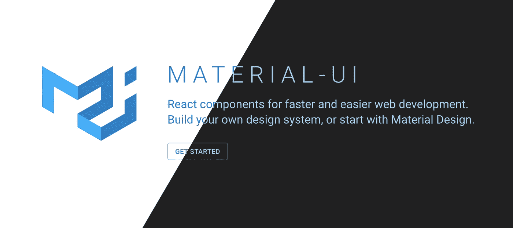
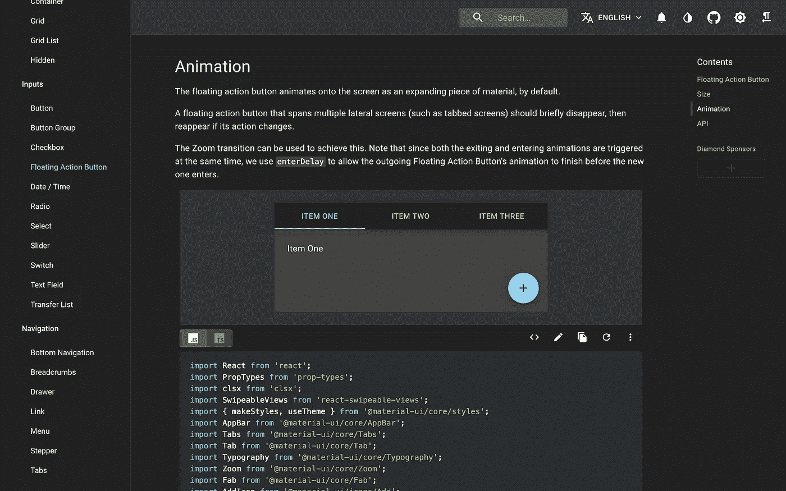
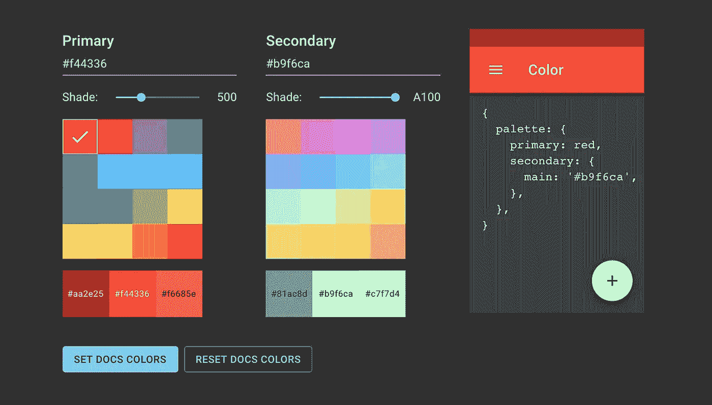
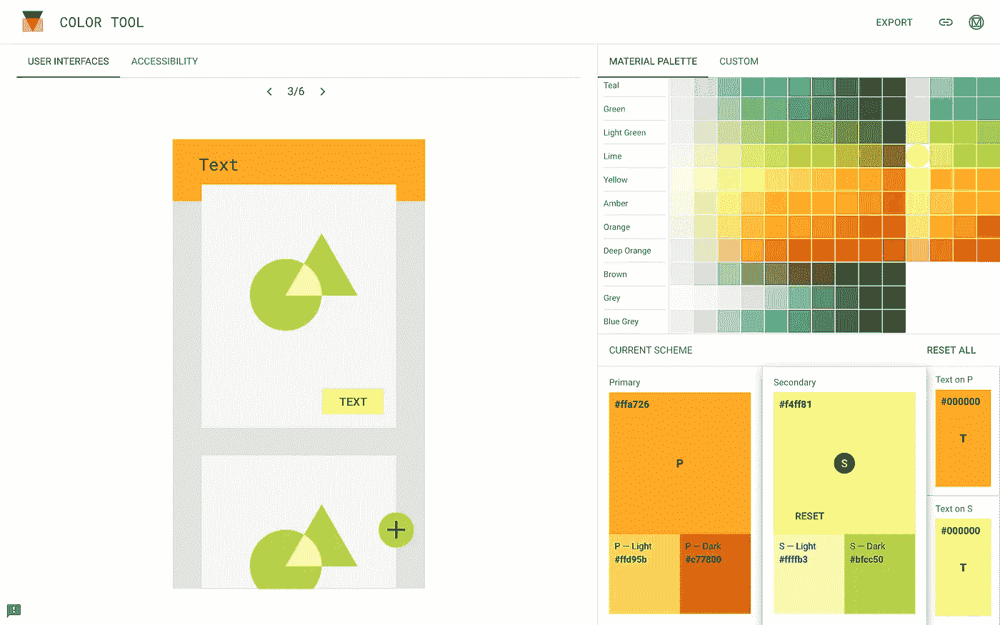

# Material-UI:如何实现黑暗模式和编辑主题颜色

> 原文：<https://levelup.gitconnected.com/material-ui-how-to-implement-dark-mode-and-edit-theme-colors-effcfa0893b9>

## 对于第一次使用的用户来说，自定义材质界面可能会有点混乱。下面我们来探讨一下如何编辑主题。



[Material-UI](https://material-ui.com/) 是一个 React 组件库，遵循 Google 的 [Material Design](https://material.io/design/introduction) 指南。因此，它提供了一个干净的用户界面体验，既可访问又跨浏览器兼容。默认情况下，它以亮模式出现，所以本文将讨论如何切换到暗模式。作为奖励，我们还将探索如何编辑主题颜色。

# 基础:用纱线或 npm 安装

Material-UI 网站本身很好地解释了安装，但是概括一下，在您的终端中，在您的项目目录中运行以下代码。

```
yarn add @material-ui/core
// or
npm install @material-ui/core
```

接下来，将 Roboto 字体添加到 HTML 文件的头中。

```
<link rel="stylesheet" href="https://fonts.googleapis.com/css?family=Roboto:300,400,500,700&display=swap" /> 
```

这是最起码的要求！然而，如果你最终使用了 Material-UI 的图标，你将需要安装额外的软件包。 [如果您希望使用图标，请参考其安装页面](https://material-ui.com/getting-started/installation/)获取更多说明。

# 切换到黑暗模式



Material-UI 的网站处于黑暗模式，这也是一个在你自己的应用中实现的例子。

黑暗模式对眼睛来说更容易，幸运的是 Material-UI 允许快速定制主题。这是一个包含四个步骤的过程，应该会产生下面的 index.js 文件。

请注意第 6–7 行(导入)、第 9–13 行(定义我们的自定义主题)和第 16–19 行(将其应用到我们的应用程序)。

让我们看看如何一步一步地实现这一点。

## 第 1 步:导入 createMuiTheme 和 ThemeProvider

在 index.js 文件中，像这样导入`ThemeProvider`和`createMuiTheme`。您可以在上面代码的第 6 行看到这一点。

```
import { ThemeProvider, createMuiTheme } from '@material-ui/core/styles';
```

## 第二步:定义你的主题

我们可以传递一个对象给`createMuiTheme`,它定义了我们想要定制的部分。具体来说，如果我们想将主题切换到黑暗模式，并且不做任何其他花哨的事情，这就是它看起来的样子。

```
const theme = createMuiTheme({
  palette: {
    type: "dark",
  }
});
```

我建议观看`console.log`中的`theme`，以充分了解这里正在发生的事情。如果你想知道你还能编辑什么，[你可以在这里查看默认的主题对象](https://material-ui.com/customization/default-theme/)。

## 步骤 3:用 ThemeProvider 包装应用程序

因为我们现在已经定义了我们想要在我们的`theme`变量中的内容，现在让我们使用它，以及我们之前导入的`ThemeProvider`。`ThemeProvider`包装你的应用，并为其提供你定义的主题。它看起来会像这样。

```
ReactDOM.render(
  <ThemeProvider theme={theme}>
    <App />
  </ThemeProvider>,
  document.getElementById('root')
);
```

请注意，`ThemeProvider`被赋予了一个主题道具，我们正在传递我们的`theme`。

## 最后一步:导入 CSS 基线

最后，如果你现在启动你的应用程序，你会注意到背景仍然是白色的。这是因为我们必须添加一个 CSS 重置/规范化的应用程序，以保持与我们的主题同步的风格。为此，我们需要组件`CssBaseline`。用下面的代码将其导入 index.js。

```
import CssBaseline from ‘@material-ui/core/CssBaseline’;
```

现在把它插在`ThemeProvider`里面，在你的`App`组件之前，像这样。

```
ReactDOM.render(
  <ThemeProvider theme={theme}>
    <CssBaseline />
    <App />
  </ThemeProvider>,
  document.getElementById('root')
);
```

你完了！你应该会看到你的应用程序的背景现在变成了深灰色，你拥有的任何材质 UI 组件现在都将是它们的暗模式版本。

如果你想了解更多关于`CssBaseline`的信息，Material-UI 实际上引用了 [normalize.css](http://nicolasgallagher.com/about-normalize-css/) 作为类似于`CssBaseline`的功能。我还发现通过[解析 CssBaseline.js](https://github.com/mui-org/material-ui/blob/master/packages/material-ui/src/CssBaseline/CssBaseline.js) 的代码有助于明确它到底做了什么。

# 编辑颜色



Material-UI 的颜色选择器可以帮助你可视化你理想的配色方案。[https://material-ui.com/customization/color/#playground](https://material-ui.com/customization/color/#playground)

现在我们有了黑暗模式，也许我们想使用不同于默认提供的颜色。这可以很容易地通过对我们现在的代码做一些小的编辑来实现。您可以在提供给`createMuiTheme`的对象中更改颜色和其他样式选择。

## 选择颜色

有三种不同的工具可以用来选择配色方案。

你可以访问 Material-UI 网站上的[页面](https://material-ui.com/customization/color/#playground)来选择你想要的配色方案。正如页面所提到的，您可以复制右边的对象，并向您的主题提供从`createMuiTheme`中得到的值。

你也可以从材料网站使用[这个颜色选择器，它有一个优秀的可访问性标签，用于检查易读性和多个预览图像。它唯一的缺点是提供的例子只是在亮模式下，但是它可以给你一个很好的选择颜色的主意(特别是如果你要包括亮/暗模式切换)。](https://material.io/resources/color/)

如果你想看什么颜色搭配你选择的某种颜色，你也可以从材料设计查看[这一页](https://material.io/design/color/the-color-system.html#tools-for-picking-colors)。它包括一个颜色选择器，可以让您看到颜色的补色、相似色和三原色。



材质的颜色工具。[https://material.io/resources/color/#!/?view.left=0&view . right = 0&primary . color = FFA 726&secondary . color = f4ff 81](https://material.io/resources/color/#!/?view.left=0&view.right=0&primary.color=FFA726&secondary.color=F4FF81)

## 向主题添加颜色

一旦你决定了你喜欢的颜色，实现它们就像编辑传入`createMuiTheme`的对象一样简单。

请参见第 8 行(导入)和第 13–16 行(编辑传递到 createMuiTheme 中的对象)。

注意我们从 Material-UI 导入`red`的第 8 行。材料-UI 具有基于 2014 材料设计调色板的预定义调色板，您可以导入这些调色板。你只需要将它们原样提供给`primary`或`secondary`，比如上面第 13 行，因为所选颜色(色调)的所有阴影都包括在内。

您也可以选择提供十六进制颜色代码，如第 15 行所示。但是，请注意，提供了一个带有`main`键的对象，而不是从 Material-UI 导入的颜色。

作为最后一个替代选项，如果您不想提供十六进制颜色代码，但仍想使用材料设计调色板中的特定颜色，也可以使用之前导入的颜色。比如上面的十六进制色码`‘#b9f6ca’`也可以写成`green[‘A100’]`，只要导入`green`。先前的颜色选择器提供了色调名称和阴影编号。

注意，只有`main`颜色需要提供给`createMuiTheme`，因为其他属性如`light`、`dark`和`contrastText`都是由`createMuiTheme`使用`main`颜色作为参考来计算的。也就是说，如果你想更多地控制配色方案，你也可以自己定义！

就是这样！为了进一步阅读，看一看材料设计的黑暗主题基础文档，以更深入地了解其设计原则。[https://material.io/design/color/dark-theme.html](https://material.io/design/color/dark-theme.html)

编码快乐！

## 资源

*   [物料界面安装文档](https://material-ui.com/getting-started/installation/)
*   [物料-界面主题化单据](https://material-ui.com/customization/theming/)
*   [材质界面默认主题](https://material-ui.com/customization/default-theme/)
*   [关于 normalize.css](http://nicolasgallagher.com/about-normalize-css/)
*   [材质-UI 颜色文档，包括颜色工具](https://material-ui.com/customization/color/)
*   [材质设计颜色选择器](https://material.io/resources/color/#!/?view.left=0&view.right=0)
*   [材质设计调色板生成器](https://material.io/design/color/the-color-system.html#tools-for-picking-colors)
*   [材质设计黑暗主题原则](https://material.io/design/color/dark-theme.html)