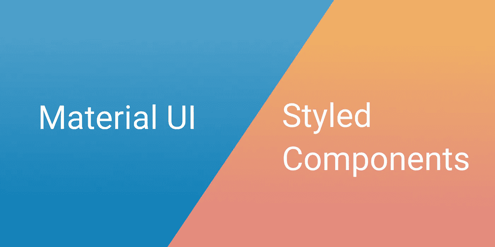

# 材质用户界面和样式组件-将样式组件与外部库一起使用

> 原文：<https://levelup.gitconnected.com/material-ui-styled-components-fff4d345fb07>

我们可以将两个发电站库合并到一个项目中吗？当然可以。

在我的上一份工作中，有一场关于材质 UI 的战争。这是一个非常固执己见的沉重的库(可以理解)，而样式化组件是一个新发现的自由。我们可以像其他 React 组件一样编写常规 CSS 并注入自定义属性？？给我们报名。

在花时间和我的团队一起从头创建一个组件库后，我发现对材料 UI 有了全新的认识。使用他们的架构良好的组件比构建一个定制的组件要快得多。

因此，在我们深入研究如何让材质 UI 和样式组件相互配合之前，我们应该问问自己…

# 我们为什么要这么做？

问得好。就我个人而言，我喜欢样式化组件，因为它能够编写常规 CSS、传递函数和道具，以及它整体的组件驱动特性。

唯一的问题是没有多少成熟的风格化组件库可以和 Material UI 抗衡。

我不喜欢材料 UI，但我认为组件库的庞大规模和成熟度绝对胜过目前任何基于样式化组件构建的 UI 库。此外，材料设计现在几乎随处可见。

我对 Material UI 的主要问题是，它的 CSS-in-JS 解决方案感觉不如样式化组件强大。

如果我们可以将材质 UI 组件库与样式化组件样式化解决方案相结合，这将解决两个库的缺点！

# 我们怎么做呢？

好热该死…看起来材料用户界面非常支持开箱即用:

举个简单的例子，没什么特别的。我们只需要使用`&&`来使我们的选择器足够具体。我们也可以使用样式组件的`ThemeProvider`，包括电池。

# 抓住你了

尽管到处使用`&&`并不理想。到目前为止，这是必要的，因为样式组件和材质 UI 都在 head 标签的底部注入样式。如果我们希望能够在不使用`&&`的情况下设计我们的材质 UI 组件，那么我们必须做以下事情:

很简单。这是直接从医生那里得来的。它所做的就是确保首先注入材质 UI 的样式，这样样式化的组件类就有了优先权。

# 覆盖特定的材质 UI 类

我们仍然希望能够在我们的材料 UI 组件中覆盖特定的类。例如，我们可能希望按钮标签的样式不同于默认的样式。下面是您应该如何做:

这张看起来有点怪，但还不算太差。我们所做的就是返回一个按钮组件，它的标签类被重命名为‘label ’,而不是时髦的材质 UI 类名`.MuiButton-label`。

我们分散其余的属性，以便我们可以像往常一样传递我们的 MUI 道具。如果我们想要将道具传递给样式化的组件(并且我们不希望我们的 MUI 组件接收它们)，我们可以这样做:

# 利用材料用户界面主题

材质 UI 有一个非常透彻的基于材质设计原则的主题。如果你正在使用组件库，你可能也不想从头开始构建一个主题。我们可以很容易地利用材质 UI 主题。我们只是将主题传递给我们的样式组件`ThemeProvider`:

# 例子

这里有一个 CodeSandbox，其中有一个工作示例，您可以尝试一下:

# 结论

材料 UI 文档有更详细的信息，但希望这能更快地概述如何使用这些技术来利用这两个库，以及为什么。

# 我们连线吧！

请在 Medium、 [LinkedIn](https://linkedin.com/in/kristopher-guzman-2615b19b/) 上联系我，或者在 [Instagram](https://www.instagram.com/kris_guzman/) 上关注我！我尝试每周发布文章，我也在寻找客户的工作。