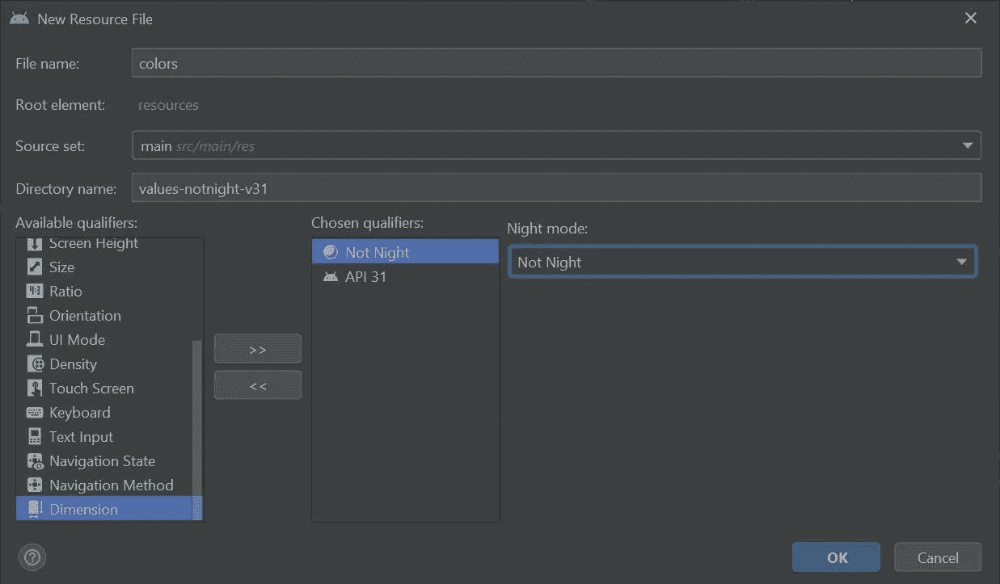
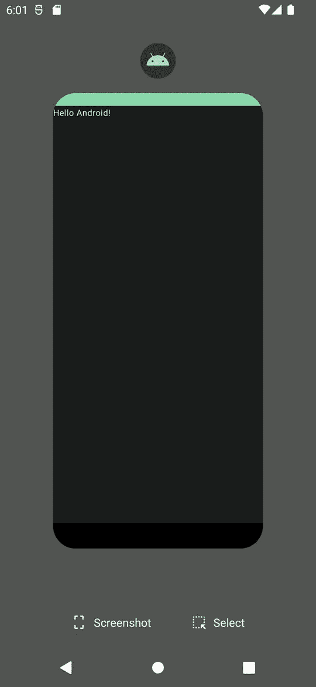

# 材料你应用图标:中途有

> 原文：<https://levelup.gitconnected.com/material-you-app-icons-part-way-there-bb8cb02ce452>

## 争取非官方支持的尝试

随着 [Material Design 3](https://go.oliverspryn.com/material-design-3) 的推出，更普遍的说法是 Material You，谷歌为 Android 上的主要材料设计提供了新的定制深度。兼容的应用程序不再依赖于应用程序设计者的想象力来完全实现。现在，用户的偏好可以左右调色板和其他设计美学。

这种级别的定制可以扩展到应用程序本身的图标。目前，谷歌还没有任何关于在应用程序中实现这一功能的官方文档。因此，这项工作留给了社区来拼凑和测试。

我一直在为我专业开发的应用程序 [MyUPMC Android](https://go.oliverspryn.com/myupmc-android) 研究一些下一代工具。我想知道在我的发现过程中，我可以让用户在多大程度上定制应用程序，包括应用程序图标本身。虽然结果并不是我所希望的那样，但它确实产生了一些丰硕的成果，无论何时谷歌正式向更广泛的受众开放这一定制，都将使这一过程变得更加容易。

# 愿望清单

假设你可以使用他们最新版本的 Pixel launcher 访问 Android 12。在这种情况下，您会注意到几个内置的应用程序遵循您的材料自定义设置的规则。也就是说，这些是您可以更改的选项:

*   **深色主题:**图标应该遵循用户的深色主题/浅色主题偏好。
*   **主题图标:**当开关关闭时应使用图标的默认样式，否则应遵循系统主题。

现在，理想的期望已经很清楚了，让我们对我们的应用程序图标进行必要的更改。

# 材料

像任何项目或 DIY 组装程序一样，我们需要一些材料:

*   Android 12，默认 Pixel 启动器，如前所述。
*   带有路径的自适应图标，您可以快速识别和修改`fillColor`或`color`属性。这种技术在传统的 mipmap 启动器图标集上不起作用。
*   各种`color.xml`文件供操作系统定义你的图标使用哪种颜色。

我将在我的示例应用程序中使用默认的 Android 应用程序图标，但为了简单起见，没有任何花哨的人工制品。这意味着我不会有这个图标特有的背景网格或阴影。

与我将要使用的图标相比，默认的 Android 应用程序图标

# 创建颜色资源文件

首先，我建议从图标的矢量资产中提取你的品牌的所有颜色，并将它们移动到默认的`colors.xml`文件中。一旦你这样做了，你的 vector 资产就不应该自己定义任何颜色，而应该通过它的`@color`资源标识符来引用每种颜色。

我的例子很简单。我需要创建两种颜色，一种用于背景，另一种用于前景。

使用我品牌配色方案的调色板

一个自适应的安卓应用图标

自适应 Android 应用程序图标的前景

自适应 Android 应用程序图标的背景

注意所有的颜色定义是如何驻留在默认的`colors.xml`文件中的。接下来，我们需要一个`colors.xml`用于`night-v31`变体。

Android Studio 针对 colors.xml 的 API 31 黑暗模式变体的新资源创建窗口

对于黑暗模式变体，Android 更喜欢使用`@android:color/system_accent1_100`作为图标的原色，使用`@android:color/system_neutral1_800`作为背景的原色。

调色板的暗模式变体

当然，如果你有一个更复杂的图标需要表达，你可以自由地偏离这个方案，但是当你填充图片的其余部分时，不要偏离这个基线太远是有益的。谷歌的 Material 3 颜色主题页面提供了更多关于你可以选择的标准托盘的信息。坚持使用材料 3 中的预定义调色板是很重要的，这样你就可以从系统定义的主题中受益。

最后，我们需要一个`colors.xml`的`notnight-v31`变体。

Android Studio 的新资源创建窗口，用于 colors.xml 的 API 31 光模式变体

同样，我们需要从标准的颜色选择中进行选择，以匹配谷歌在他们的其他应用程序中所做的事情。这里我们需要做的是交换背景和前景原色的角色。

调色板的灯光模式变体

# 测试

为您的设备选择主题并首次安装应用程序后，应用程序启动器上的图标会按预期做出响应:

我们的应用程序在 Pixel launcher 上显示了一个匹配的配色方案

然而，我们在应用程序列表上遇到了第一个麻烦，这里没有像其他应用程序那样使用品牌颜色:

我们的应用图标是唯一一个没有在应用列表中显示品牌颜色的图标

我们的图标在改变后不会跟随系统颜色:

图标不会像其他颜色一样从橙色变为绿色

有趣的是，你可以看到任务列表中应用程序上方的图标已经响应了变更请求:

与启动器图标不同，任务列表中应用程序上方的图标是绿色的

将图标从应用程序列表拖到启动器时，在图标被拿起并放到最终位置之前，图标会显示正确的颜色:

拖动图标显示正确的绿色，直到它被拖放到启动器上

卸载并重新安装该应用程序似乎可以解决问题，不过:

卸载应用程序并在启动器上替换它可以纠正颜色不匹配的问题

明暗模式的切换似乎马上就生效了。在少数情况下，我发现这种情况下也需要重新安装:

亮暗模式之间的切换有时是即时的

最后，在我禁用了主题图标设置之后，除了这个图标之外的所有图标都反映了这一变化:

当指示这样做时，应用程序图标也不会跟随品牌的颜色

# 结论

虽然这可能是一个令人失望的诚实努力的总结，但它确实提供了一些关于谷歌如何在自己的应用程序中实现这一点的见解。我们成功地为浅色和深色主题设计了配色方案，但是不能使用我们的品牌颜色，也不能按照指示改变图标的颜色。

在 Google 发布一些关于这个定制特性的官方指导之前，我建议推迟，直到这些关键问题得到解决。就我而言，我期待着有一天在我的应用程序中使用它的机会。所以，你可以确信我会密切关注官方声明。

# 参考

这一发现工作的大部分是由社区来完成的。我要感谢这些资源为我指明了正确的方向:

*   [材料组件 GitHub 发布](https://go.oliverspryn.com/material-you-icons-issue)
*   【StackOverflow 的素材你图标

# 喜欢你读的东西吗？

媒体上还有成千上万篇类似的文章。我是这个网站的付费会员，我完全认为这项投资是值得的。[点击这里加入](https://go.oliverspryn.com/medium-membership)，你将用你的一部分会员身份支持我的工作。

本文最初发表于[https://oliverspryn.com/](https://oliverspryn.com/)。加入我的邮件列表。