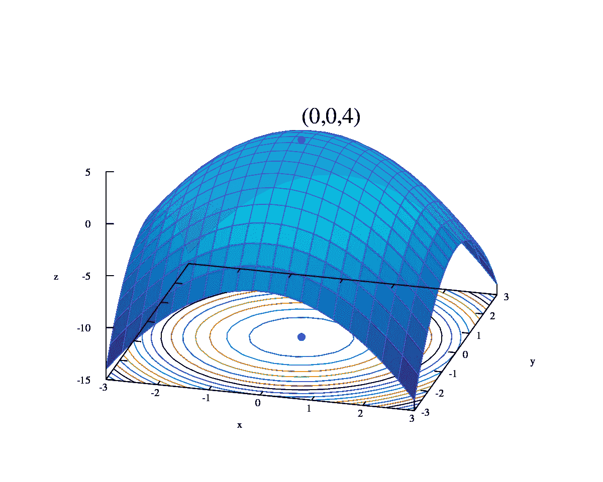
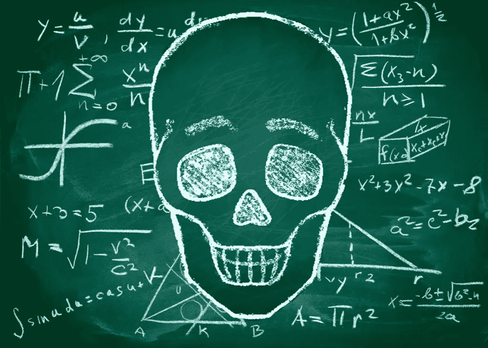

# 从困惑到清晰:我在 Matlab 中数学物理迷人世界的旅程

> 原文：<https://levelup.gitconnected.com/mathematical-physics-from-confusion-to-clarity-aaa70a02b670>

*   数学和物理:它们可能是你使用的技术背后的隐藏力量吗？
*   精通数学和物理能让你在科技世界中获得竞争优势吗？

从你的手机到星星:看看数学和物理如何让这一切成为可能！ **潜心体验数学物理。**

# 我对数学物理的个人经验

暑假期间，我一遍又一遍地检查新学年的教学大纲。只有“ ***数学物理与数值方法*** ”让我脑子一亮。我立刻去了安德鲁·多森的 youtube 频道。他有一门张量微积分课程，这是我教学大纲的一部分。你可以在这里看到完整的教学大纲。兴奋和我紧紧地拥抱在一起。我将有机会在 [MATLAB](https://www.mathworks.com/?s_tid=mlh_gn_logo) 中编写那些令人兴奋的数学方法。

不幸的是，我的老师的话从未传到我的耳朵里。这是因为我们的立陶宛语-英语语言障碍。他英语说得很好。但是他天生的言语行为让人很难理解他。他不熟悉的语调模式和用词使人很难听懂他的话。最幸运的是，每当他觉得自己头脑不清楚时，他有时会用立陶宛语解释。与此同时，那些数学符号承受着比这个可怕的冬天更冷的寒意。

过了一段时间，我就不上课了。我去参加考试，解决了我的编程作业。不去上课意味着我必须找到另一种方式来理解材料。为了继续我的研究，我依赖于 YouTube 上杰弗里·查斯诺夫的课程。他提供了清晰的解释，让我理解了材料。

# 我在数学物理的西部遇到的数值方法

微积分是一种数学，它涉及到寻找不同方程的变化率。有时候，解决微积分问题会非常困难。在这些情况下，我们可以用数值方法来近似求解。我们不用精确的微积分规则，而是用这些方法来寻找答案。

数值方法用于优化函数和寻找方程的根。

[**数值微分**](https://en.wikipedia.org/wiki/Numerical_differentiation)

*   有限差分(向前、向后和中心)

****(分为显式和隐式方法)****

*   **中点法则，**
*   **梯形法则，**
*   **辛普森法则。**

****数值微分方程****

*   **欧拉和修正欧拉。**
*   **龙格库塔方法族。**

****数值非线性方程、求根和优化****

*   **牛顿法**
*   **二分法**
*   **割线法**

**我所有的类代码都在我的 GitHub 上。有些很难看，因为一开始是黑客工作。我重构了它。**

# **你如何从我的经验中学习数学物理编程？**

****

**不要担心。我会告诉你该怎么做。**

****学编程**:你需要的只是编程的基础知识。你可以通过这门 python 课程或这门 MATLAB 课程来熟悉以下内容:**

*   **变量**
*   **条件语句**
*   **环**
*   **接收输入并打印到控制台**
*   **功能**
*   **课程等。**

****拿微积分 I 和 II** 来说:你可以通过学习数学方法来编程。它们是算法。但是没有理论的实践只能带你走这么远。随着你的进步，如果你做到了，你会想在更高的水平上做得更多。除非你有坚实的理论基础，否则这是不可能的。**

****拿经典物理**来说:这个同上。我分开它是有原因的。你到底想怎么理解物理场景？如果您从未了解过您创建的方法，那么这些方法在哪些场景中适用？如果你正在写一个物理引擎，你必须知道真实世界的物理是如何工作的。**

**参加一个数值方法课程:你必须学习你将要编码的方法。在没有任何计算背景的情况下学习这门课程是非常危险的。我带着 Calc I 和 II 拿了它，但我仍然在挣扎。youtube 上有一个杰弗瑞·查斯诺夫的精彩课程。**

# **数值方法和数学物理的一些实际应用**

**数值方法是我们可以用数学来弄清楚事物如何工作的方法。在物理学中，我们使用这些方法来研究星系如何运动以及微小粒子的行为。我们也可以用它们来了解材料的特性。例如，它们的导热性能或强度。**

**在天体物理学中，数值方法帮助我们了解恒星和行星。我们也用它们来了解它们之间的互动。在生物学中，我们可以用它们来研究细胞和神经元是如何工作的。**

**数值方法有助于理解许多不同领域的复杂系统。这是因为我们用微积分复制了那些系统。处理数学方程更简单。每当我们需要预测结果时，我们不必测量系统中的每一个变量。**

# **詹姆斯·汉森:用数学对抗气候**

****

**詹姆斯·汉森是一位科学家，他想了解地球是如何变化的。他用数字方法制作了一个地球气候的计算机模型。当他运行他的模型时，他发现由于空气中的气体，地球正在变暖。这是第一次有人证明全球变暖正在发生。詹姆斯的工作非常重要，因为它帮助我们更好地了解地球。他是怎么做到的？**

*   **他使用一种叫做大气环流模型(GCM)的计算机模型来研究地球的气候。**
*   **他写出了描述空气和水运动的方程。其他方程涵盖了热量和水分的传递。**
*   **他用数值方法求解这些方程。他能够模拟地球大气和海洋的行为。**
*   **他在功能强大的计算机上进行模拟，以预测地球气候的变化。**
*   **他的预测表明地球的温度正在上升。由于温室气体的排放，温室气体在增加。这是第一次有人警告我们全球变暖正在发生。**

# **结论**

**我们已经在课堂上开始了张量微积分，雅可比等，但我个人还没有研究过，所以我会在以后写。数学物理编程还有更多的内容。我们可以进入多维积分，蒙特卡罗模拟等。今天就讲到这里吧。如果你想让我深入一些代码[演练](https://stephenadesina.com/category/advent-of-cyber-2022/)或者你需要辅导，请在评论中告诉我。**

****Secundum Allos Parakletos。****

***原载于 2022 年 12 月 9 日***。****

# ***分级编码***

***感谢您成为我们社区的一员！在你离开之前:***

*   ***👏为故事鼓掌，跟着作者走👉***
*   ***📰查看[升级编码出版物](https://levelup.gitconnected.com/?utm_source=pub&utm_medium=post)中的更多内容***
*   ***🔔关注我们:[Twitter](https://twitter.com/gitconnected)|[LinkedIn](https://www.linkedin.com/company/gitconnected)|[时事通讯](https://newsletter.levelup.dev)***

***🚀👉 [**加入升级人才集体，找到一份神奇的工作**](https://jobs.levelup.dev/talent/welcome?referral=true)***