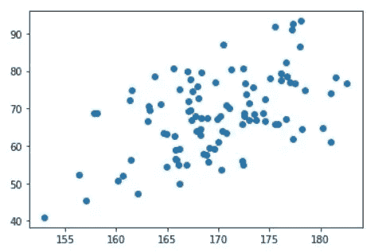

# Matplotlib: Python

> 原文：<https://levelup.gitconnected.com/matplotlib-python-ecc7ba303848>

## Matplotlib 是一个用于在 Python 中创建静态、动画和交互式可视化的综合库。


卢克·切瑟在 [Unsplash](https://unsplash.com/s/photos/graph?utm_source=unsplash&utm_medium=referral&utm_content=creditCopyText) 上的照片

在我的上一篇文章中，我们已经看到了如何在 NumPy 库的帮助下处理数据。使用 NumPy，我们可以将数据转换成数组，然后执行操作。

在这里，我们将看到如何使用 Python 中的另一个库 **Matplotlib** 来可视化上述数组。数据可视化是通过在 matplolib 的帮助下绘制图形来完成的。

Matplotlib 中有不同类型的图形，我们将了解:

1.  **条形图**
2.  **散点图**
3.  **线图**
4.  **直方图**
5.  **箱线图**

## 1.可视化:条形图

当我们必须可视化跨多个类别的数字数据时，**条形图**非常有用。它用矩形条表示分类数据。条形图可以垂直或水平绘制。

要使用条形图，我们必须安装 matplotlib，还必须导入 pyplot，它用于在 Python 中绘制各种各样的图形。

```
import matplotlib.pyplot as plt
```

让我们看一个例子

假设我们要绘制一个条形图，其中 x 轴代表不同类型的巧克力，y 轴代表巧克力的数量。

x = ['士力架'，' M&M '，' Twix '，' KitKat '，'吉百利']

y = [10，5，8，4，2]

让我们绘制图表。为了显示条形图，我们应该在程序中以 **plt.bar()** 的形式传递命令。

输出中的条形图如下所示。


如果我们想要命名图形及其标签，我们使用以下代码:

*   plt.xlabel()，plt.ylabel()
*   plt.title()

现在，让我们用标题和标签更新上面的代码。

上述代码的输出如下所示。


带有标题和标签名称的条形图

我们也可以通过在 **plt.bar()中直接输入**颜色**来改变图形中**条**的颜色。标题和标签也一样。**

应用上述更改后，更新后的代码如下所示。

不同颜色的条形图看起来像这样


多种颜色的条形图

这就是我们如何在 Python 中使用条形图。如果我们在一个轴上绘制定量数据，在另一个轴上绘制分类数据，那么条形图会更有用。

## **2。可视化:散点图**

散点图是数据可视化的另一种形式，在散点图中，数据中存在的每个值的数据由图表中的点表示。与条形图一样，散点图也需要两个大小相同的数组，一个用于 x 轴，另一个用于 y 轴。

散点图有助于检查两个定量变量之间的任何关系模式，并检测其中的异常值。

让我们通过使用 NumPy 模块生成随机数据来创建一个散点图。如果您不熟悉 NumPy，您可以查看我以前的文章，其中我解释了 NumPy 库及其功能。

我们使用正态和均匀数据分布创建两个随机数数组。x 轴为身高，平均值设置为 170，标准差为 6，y 轴为体重，平均值设置为 0.75，标准差为 1.25。确保两个数组的长度相同。

为了显示散点图，我们在程序中使用命令 **plt.scatter()** 。

上述程序的散点图如下所示。



与条形图类似，您可以为图表添加标题和标签，也可以更改颜色。让我们更新上面的代码，并将标题和标签添加到图表中。

现在，添加标题和标签后，散点图如下所示。


**注意:**这个散点图看起来与上一个略有不同，因为我们是随机生成身高和体重值的。所以，每次我们运行程序时，数据集都会改变。

如前所述，我们知道散点图有助于两个定量数据集之间的可视化。Matplotlib 还提供了多种功能，通过使用不同数量的尺寸变量，使这些图尽可能具有描述性。

## 3.可视化:折线图

线图可能是数据可视化中最简单的图形。折线图准确描述了特定数据在一段时间内的趋势。

为了显示线图，我们在程序中使用命令 **plt.plot()** 。我们在使用 plt.plot()命令时应该小心。因为使用 **plt.plot()** 我们也可以生成散点图。

**示例:**取 1 到 100 之间的随机整数列表，使用 plt.plot()生成散点图。

```
integers = np.random.randint(1,100, 50)
plt.plot(integers, 'ro')# Here 'ro' indicates color, r=red and marker 'o'
```

上述程序的图表如下


使用 plt.plot()命令的散点图

现在，通过使用相同的数据和命令，我们也可以生成线图。

```
integers = np.random.randint(1,100, 50)
plt.plot(integers, 'red', marker = 'o')
```

如果我们生成上面的程序，图形看起来像这样。


使用 plt.plot()命令的折线图

因此，在使用 **plt.plot()** 命令时，我们应该小心谨慎，并确保我们正在生成所需的图形。

让我们来看看如何使用线形图绘制“一个国家的失业率”数据。

一个世纪以来的失业率

上述代码的折线图显示如下。


线图

如上图所示，线形图描述了一个国家过去十年的失业趋势。但是，x 轴并不显示所有的年份，如果我们想显示 x 轴上的所有值，我们可以对代码稍作修改。

现在，线形图看起来像


每个值都在 x 轴上的折线图

> 对于相同的数据，如果我们绘制散点图，它看起来像这样


上述数据的散点图

如果我们查看这两个图表，那么与**散点图**相比，**线图**对于给定的数据更有意义。当您想要了解特定变量在特定时期的趋势时，折线图非常有用。现实世界中使用折线图的行业有金融市场、天气预报等。

## 4.可视化:直方图

直方图用于计算数据集中某个元素出现的频率。当我们想了解给定系列的分布时，这是很有用的。

为了显示直方图，我们在程序中使用命令 **plt.hist()** 。

我们拿一个数据库里 100 个人的年龄数据。

现在，上述程序的直方图显示如下


为了更好地理解图形，我们将更改条形的颜色，并为各个条形添加边缘。

```
plt.hist(age, edgecolor = 'black', color = 'cyan')
plt.show()
```

修改后，直方图如下所示


柱状图

默认情况下，直方图创建 10 个柱或 10 个分区。我们可以通过对代码做一点小小的修改来减少图表中出现的条块数量。

```
plt.hist(age, bins = 5, edgecolor = 'black', color = 'cyan')
plt.show()
```

现在，直方图看起来如下，只有 5 个柱。


具有特定箱数的直方图

如果需要，我们可以进一步[样式化我们的直方图](https://matplotlib.org/users/style_sheets.html)。

## 4.可视化:箱形图

**盒状图**或**盒须图**是一种方便的方式，通过四分位数直观地显示其数据分布。


基本箱形图

它显示一组数据值的汇总，如最小值、第一个四分位数、中值、第三个四分位数和最大值。Q1 基本上代表第 25 个百分点，Q3 是第 75 个百分点。Q1 到 Q3 被称为 IQR(四分位数间距)。

为了显示箱线图，我们在程序中使用命令 **plt.hist()** 。

让我们看一个例子。我们将三个随机数组作为数据集，并绘制相应的箱线图。

上面代码的方框图如下所示。


箱形图

箱形图在其图形中总是有三个重要的数据范围:

*   **中值**:这是将数据范围分成两等份的值，即第 50 百分位。
*   **四分位范围(IQR)** :这些是介于第 25 和第 75 百分位值之间的数据点。
*   **异常值**:这些数据点明显不同于其他观察结果，位于胡须之外。

## 5.可视化:支线剧情

为了获得更好的整体视图，有时如果我们可以在单个网格中绘制不同的图形会有所帮助。在单个对象中比较不同的剧情称为**支线剧情。**

为了创建支线剧情，我们在程序中使用命令 **fig，ax = subplot()** 。

假设我们有三个不同国家为期 5 年的数据集。我们会看到支线剧情的代码。

上面代码的子情节如下所示。


支线剧情

但是，如果我们观察上面的图表，我们不知道哪条线代表哪个国家。所以，我们使用一个名为 **plt.legend()的命令。**它将显示图中每个线形图所代表的内容。

```
plt.legend()
plt.show()
```

如果我们在前面代码的末尾添加上面的命令，折线图的子图如下所示。


使用线形图的支线剧情

让我们看看如何使用条形图绘制支线剧情。我们将采用我们在上面的**可视化:条形图**中使用的同一个例子。

在数据中，我们在 y 轴上取 2 个数据集，并将其与巧克力的类型进行比较。如果我们写代码，它看起来会像这样

条形图的子图代码

这个程序的条形图的子情节看起来像这样。


使用条形图的支线剧情

我们可以调整条形的宽度，观察图形的变化。

# 结论

通过本文，我们看到了数据可视化如何通过绘制不同类型的图表来帮助更好地理解数据。在现实世界中，这些类型的数据可视化技术将有助于处理大量数据。还有其他不同类型的图表，可用于绘制数据，但这些是世界上最常用的图表。

**感谢您阅读**和**快乐编码！！！**

# 在这里查看我以前关于 Python 的文章

*   [**NumPy: Python**](https://medium.com/coderbyte/numpy-python-f8c8f2bbd13e)
*   [**Python 中的时间复杂度及其重要性**](https://medium.com/swlh/time-complexity-and-its-importance-in-python-2b2ba03c786b)
*   [**Python 中的递归或递归函数**](https://medium.com/python-in-plain-english/python-recursion-or-recursive-function-in-python-5802c74c1844)
*   [**Python 程序检查阿姆斯特朗数(n 位数)和栅栏矩阵**](https://medium.com/python-in-plain-english/python-programs-to-check-for-armstrong-number-n-digit-and-fenced-matrix-bc84a1bf32aa)
*   [**Python:基础参考问题—对换、阶乘、反数位、模式打印**](https://medium.com/python-in-plain-english/python-problems-for-basics-reference-swapping-factorial-reverse-digits-pattern-print-241dde763c74)

# 参考

*   https://matplotlib.org/index.html**Matplotlib——用 Python 可视化**:[](https://matplotlib.org/index.html)
*   **Python 用 Matplotlib 绘图(指南):**[https://realpython.com/python-matplotlib-guide/](https://realpython.com/python-matplotlib-guide/)
*   **Python | Matplotlib 简介**:[https://www . geeks forgeeks . org/Python-Introduction-Matplotlib/](https://www.geeksforgeeks.org/python-introduction-matplotlib/)
*   **Matplotlib 教程:**[https://www.tutorialspoint.com/matplotlib/index.htm](https://www.tutorialspoint.com/matplotlib/index.htm)
*   **Matplotlib 教程—Python:【https://www.edureka.co/blog/python-matplotlib-tutorial/】T22**