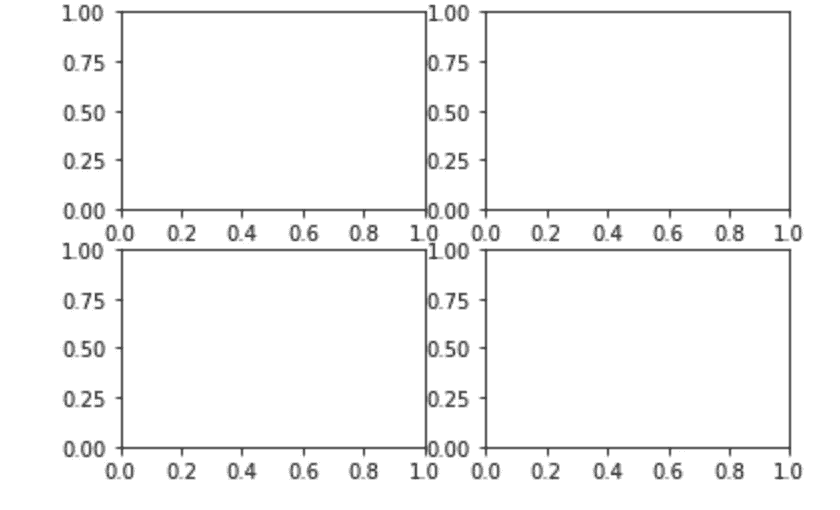
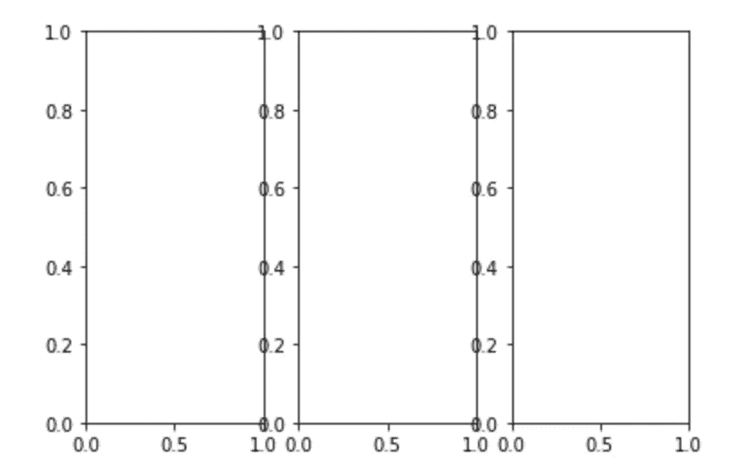

# Matplotlib 终极备忘单(2021)

> 原文：<https://levelup.gitconnected.com/matplotlib-ultimate-cheat-sheet-2021-2bcd1646f41e>

## Python 中 Matplotlib 的完整指南，满足您的绘图需求

Matplotlib 是一个用于在 Python 中创建静态、动画和交互式可视化的综合库。起初，使用该库似乎令人望而生畏。然而，通过不断的练习，你会找到窍门的。为此，我创建了一个全面的 Matplotlib 备忘单，当您熟悉这个库时，可以一直参考它。


卢克·切瑟在 [Unsplash](https://unsplash.com?utm_source=medium&utm_medium=referral) 上的照片

# 目录:

1.  概观
2.  数据准备
3.  创建绘图
4.  测绘
5.  自定义绘图
6.  保存绘图
7.  显示绘图
8.  奖金

# 概观

```
>>> import matplotlib.pyplot as plt # DATA PREPARATION
>>> x = [1,2,3,4] 
>>> y = [10,20,25,30]# CREATE PLOT
>>> fig = plt.figure() 
>>> ax = fig.add_subplot(111) # PLOTTING
>>> ax.plot(x, y, color='lightblue', linewidth=3) 
>>> ax.scatter([2,4,6],  [5,15,25],  color='darkgreen',  marker='^')# CUSTOMIZE PLOT
>>> ax.set_xlim(1, 6.5)# SAVE PLOT 
>>> plt.savefig('foo.png')# SHOW PLOT 
>>> plt.show()
```

# 数据准备

**1D 数据(例如沿一个轴)**

```
>>> import numpy as np >>> x = np.linspace(0, 10, 100) 
>>> y = np.cos(x) 
>>> z = np.sin(x)
```

**2D(如图片)**

```
>>> from matplotlib.cbook import get_sample_data 
>>> img = np.load(get_sample_data('axes_grid/bivariate_normal.npy'))
```

# 创建绘图

**导入库**

```
>>> import matplotlib.pyplot as plt
```

**创建图**

```
>>> fig = plt.figure()
```

**调整体形大小(如两倍高度)**

```
>>> fig2 = plt.figure(figsize=plt.figaspect(2.0))
```

**轴**

所有绘图都是相对于*轴*完成的。子图包含在图形中，子图是网格系统中的轴。

**添加轴**

```
>>> fig.add_axes() 
>>> ax1 = fig.add_subplot(221) # 2rows by 2rows, first subplot
>>> ax3 = fig.add_subplot(212) # 2 rows by 1 row, second subplot
```

**添加轴 v2**

```
>>> fig3, axes = plt.subplots(nrows=2,ncols=2) # 2 by 2 subplots
```



```
>>> fig4, axes2 = plt.subplots(ncols=3) # 1 row by 3 columns
```



# 绘图(1D)

**用线画点**

```
>>> ax.plot(x,y)
```

**绘制散点**

```
>>> ax.scatter(x,y)
```

**绘制垂直条形图**

```
>>> ax.bar([1,2,3],[3,4,5])
```

**绘制水平条形图**

```
>>> ax.barh([0.5,1,2.5],[0,1,2])
```

**画水平线**

```
>>> ax.axhline(0.45)
```

**画垂直线**

```
>>> ax.axvline(0.45)
```

**绘制填充多边形**

```
>>> ax.fill(x,y,color='blue')
```

**绘制直方图**

```
>>> ax.hist(y)
```

**绘制箱线图**

```
>>> ax.boxplot(y)
```

**画小提琴的情节**

```
>>> ax.violinplot(z)
```

# 绘图(2D)

```
>>> ax.imshow(img, cmap='gist_earth', interpolation='nearest',  vmin=-2, vmax=2)
```

# 自定义绘图

**颜色**

```
>>> ax.plot(x, y, c='yellow')
```

**透明度**

```
>>> ax.plot(x, y, alpha=0.4)
```

**Colormap (** [**全列表**](https://matplotlib.org/stable/tutorials/colors/colormaps.html) **)**

```
>>> ax.imshow(img, cmap='seismic')
```

**标记器**

```
>>> ax.scatter(x, y, marker=".")
>>> ax.scatter(x, y, marker="o")
```

**线宽**

```
>>> ax.plot(x, y,linewidth=4.0)
```

**线条样式**

```
>>> ax.plot(x, y, ls='solid')
>>> ax.plot(x, y, ls='--')
```

**添加文字**

```
>>> x_pos, y_pos = 1, 10
>>> ax.text(x_pos, y_pos, 'Example Graph', style='italic')
```

**数学文本(LaTex)**

```
>>> plt.title(r'$sigma_i=15$', fontsize=20)
```

**情节填充**

```
>>> ax.margins(x=0.0,y=0.1)
```

**纵横比为 1**

```
>>> ax.axis('equal')
```

**极限轴**

```
>>> ax.set(xlim=[0,10.5],ylim=[-1.5,1.5])
```

**限制 x 轴(或 Y 轴)**

```
>>> ax.set_xlim(0,10.5)
>>> ax.set_ylim(-1.5,1.5)
```

**设置标题、x 轴和 y 轴标签**

```
>>> ax.set(title='An Example Axes', ylabel='Y', xlabel='X')
```

**设置刻度**

```
>>> ax.xaxis.set(ticks=range(1,5), ticklabels=[3, 100, "foo"])
>>> ax.yaxis.set(ticks=range(1,5), ticklabels=[1, 200, "bar"])
```

# 保存绘图

**保存数字**

```
>>> plt.savefig('foo.png')
```

**保存透明数字**

```
>>> plt.savefig('foo.png', transparent=True)
```

# 显示绘图

```
>>> plt.show()
```

# **奖金**

**清除一个轴**

```
>>> plt.cla()
```

**清晰的身影**

```
>>> plt.clf()
```

**关闭窗口**

```
>>> plt.close()
```

# **结论**

我希望你能从这份小抄中学到一些东西。一如既往，任何意见或反馈都非常感谢！

***做订阅我的邮件简讯:***[*https://tinyurl.com/2npw2fnz*](https://tinyurl.com/2npw2fnz)****在这里我定期用通俗易懂的英语和漂亮的可视化总结 AI 研究论文。****