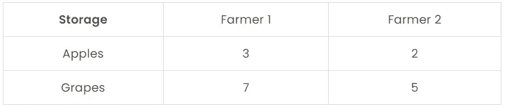
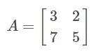
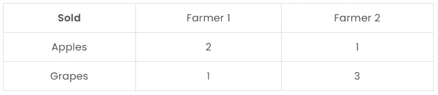
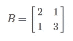
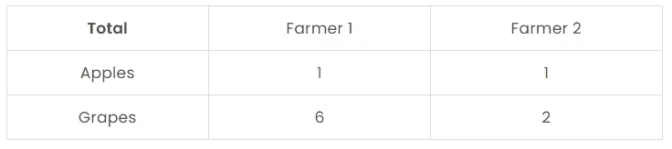
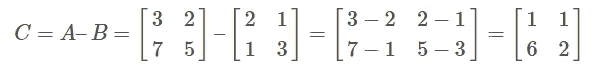
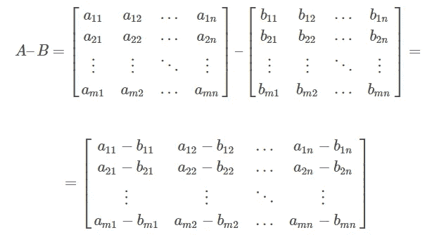

# 矩阵减法讲解(Python 示例)-线性代数

> 原文：<https://levelup.gitconnected.com/matrix-subtraction-explained-with-python-examples-linear-algebra-941cfe2e27e4>

## 在本文中，我们将通过例子讨论矩阵加法的步骤和直觉，并在 Python 中执行矩阵减法。


作者图片

**目录**

*   介绍
*   矩阵减法解释
*   Python 中的矩阵减法
*   结论

# 介绍

在这篇文章中，我们解释了矩阵减法的直觉和步骤。

使用的例子相当简单，甚至不需要计算器。逻辑与[矩阵加法](https://pyshark.com/matrix-addition-explained-using-python/)的过程非常相似。然而，本文中学习的方法可以应用于更复杂的矩阵减法。

我们还探索了使用 Python 执行矩阵加法是多么的快速和简单。

为了继续学习本教程，我们需要以下 Python 库:numpy。

如果您没有安装它们，请打开“命令提示符”(在 Windows 上)并使用以下代码安装它们:

```
pip install numpy
```

# 矩阵减法解释

一个矩阵可以从另一个矩阵中减去，当且仅当它们具有相同的维数(都是 2×2、3×3 等等)。

举个直观的例子，让我们考虑两个农民，他们都有一些苹果和一些葡萄。我们可以用表格来表示:



作者图片

这也可以简单地用矩阵表示:



作者图片

这两个农民然后去市场卖了一些水果。他们出售水果的数量也可以用一张表来表示:



作者图片

这也可以简单地用矩阵表示:



作者图片

一旦市场关闭，他们会计算在卖出一部分后，仓库里新的水果总数是多少。他们通过减去卖出的水果数量得到:



农民 1 从苹果中减去苹果(2–1 = 1)，从葡萄中减去葡萄(7–1 = 6)。农民 2 做了同样的事情，分别得到 1(2–1)和 2(5–3)。

现在让我们以矩阵形式做同样的事情:



作者图片

我们看到矩阵 **C** 与上面有总计的表有相同的值。

我们可以将这种方法进一步推广到一个 **m** × **n** 维矩阵:



作者图片

# Python 中的矩阵减法

为了在 Python 中执行矩阵向量乘法，我们将使用 numpy 库。第一步是导入它:

Numpy 有很多有用的函数，对于这个操作，我们将使用 [subtract()](https://numpy.org/doc/stable/reference/generated/numpy.subtract.html) 函数，该函数按元素减去数组。

回想一下，在 Python 中，矩阵被构造为数组，矩阵需要具有相同的维数才能被减去。下一步是定义输入矩阵。

我们将使用与[前一节](https://pyshark.com/matrix-subtraction-explained-using-python/#matrix-subtraction-explained)中相同的 2×2 矩阵:

现在我们已经有了所需的矩阵，我们可以很容易地计算矩阵减法产生的矩阵:

您应该得到:

```
[[1 1]
 [6 2]]
```

这与我们手动计算的[示例](https://pyshark.com/matrix-subtraction-explained-using-python/#matrix-subtraction-explained)中的输出完全相同。

# 结论

在本文中，我们讨论了矩阵减法的直觉和步骤，并展示了使用 Python 的完整示例。

如果你有任何问题或对一些编辑有建议，请随时在下面留下评论，并查看更多我的[线性代数](https://pyshark.com/category/linear-algebra/)文章。

*原载于 2022 年 1 月 17 日 https://pyshark.com**[*。*](https://pyshark.com/matrix-subtraction-explained-using-python/)*