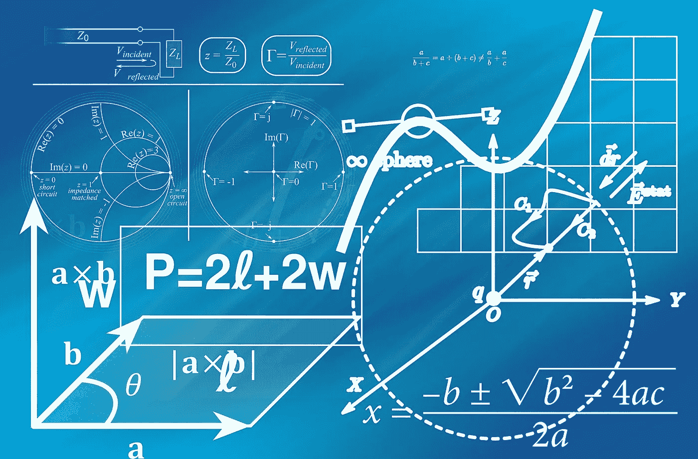

# 矩阵变换变得简单！

> 原文：<https://levelup.gitconnected.com/matrix-transformations-made-easy-fb8257a92df>

## 使用 Python 和 NumPy 执行数学矩阵计算



Python 及其令人惊叹的数据科学库没有什么不值得欣赏的。我已经用多种语言写了 25 年的代码，但是出于某种原因，我从来没有真正关注过 Python。去年，我开始了一门应用机器学习的课程，这是我对 Python 的入门。从那以后，我成了一个超级粉丝，并且认为可能性是无穷无尽的。不仅仅是 Python 是跨平台的，非常快速、高效、文档完善、易于使用，而且它的库也非常棒！

我想为自己和其他人写这个快速参考，只是为了向你展示它的强大之处。

如果你不熟悉数学中的矩阵变换，我真的推荐[这个由可汗学院](https://www.khanacademy.org/math/linear-algebra/matrix-transformations)提供的免费培训。

## 先决条件

*   [Python 环境](http://installpython3.com/)
*   [NumPy 库安装完毕](https://numpy.org/install)

## 让我们开始吧…

导入别名为“np”的 NumPy

```
import numpy as np
```

用特殊的 NumPy 数组创建一个矩阵。

```
A = np.array([[1, 2, 3], 
    [4, 5, 6],
    [7, 8, 9]])print (A.shape)
**(3, 3)**print (type(A))
**<class 'numpy.ndarray'>**print (A)
**[[1 2 3]
 [4 5 6]
 [7 8 9]]**
```

我们还将为自己创建几个矩阵作为计算示例。

```
B = np.array([[9, 8, 7], 
    [6, 5, 4],
    [3, 2, 1]])C = np.array([1, 2, 3])D = np.array([4, 5, 6])E = np.array([[1, 3, 5], 
    [2, 4, 7],
    [1, 5, 9]])
```

## 矩阵加法

等着吧…

```
print (A + B)
**[[10 10 10]** # (1+9) (2+8) (3+7) **[10 10 10]** # (4+6) (5+5) (6+4) **[10 10 10]]** # (7+3) (8+2) (9+1)
```

## 矩阵减法

一样简单…

```
print (A - B)
**[[-8 -6 -4]** # (1-9) (2-8) (3-7) **[-2  0  2]** # (4-6) (5-5) (6-4) **[ 4  6  8]]** # (7-3) (8-2) (9-1)
```

## 矩阵点积(标量)

这有助于你找到一个向量的长度或两个向量之间的角度。

```
print(np.dot(D,C))
**32   # 1*4 + 2*5 + 3*6**
```

## 矩阵叉积(向量)

这有助于你找到垂直于两个向量所跨平面的向量。

```
print (np.cross(C, D))
**[-3  6 -3]**
```

## 矩阵乘法

```
print (np.matmul(A, B))
**[[ 30  24  18]
 [ 84  69  54]
 [138 114  90]]**
```

## 逆矩阵

```
print (np.linalg.inv(E))
**[[-0.5  1\.  -0.5]
 [ 5.5 -2\.  -1.5]
 [-3\.   1\.   1\. ]]**
```

## 矩阵除法

```
print(np.dot(A, np.linalg.inv(E)))
**[[ 1.50000000e+00 -6.66133815e-16 -5.00000000e-01]
 [ 7.50000000e+00 -3.99680289e-15 -3.50000000e+00]
 [ 1.35000000e+01 -7.77156117e-15 -6.50000000e+00]]**
```

## 转置矩阵

行对列，列对行

```
print (A)
**[[1 2 3]
 [4 5 6]
 [7 8 9]]**print (np.transpose(A))
**[[1 4 7]
 [2 5 8]
 [3 6 9]]**print (A.T)  # shorthand for above
**[[1 4 7]
 [2 5 8]
 [3 6 9]]**
```

## 生成矩阵

```
print (np.arange(25).reshape((5,5)))
**[[ 0  1  2  3  4]
 [ 5  6  7  8  9]
 [10 11 12 13 14]
 [15 16 17 18 19]
 [20 21 22 23 24]]**print (np.random.randint(1,50,size=(5,5)))
**[[21 41 25 27 30]
 [45 25 13 47 43]
 [40 23 10 30 47]
 [25  8 36 25  5]
 [ 4 12 27 46 34]]**
```

## 矩阵转置证明

T = ATBT

```
print (B.T.dot(A.T))
**[[ 30  84 138]
 [ 24  69 114]
 [ 18  54  90]]**print ((A.dot(B)).T)
**[[ 30  84 138]
 [ 24  69 114]
 [ 18  54  90]]**print (B.T.dot(A.T) == (A.dot(B)).T)
**[[ True  True  True]
 [ True  True  True]
 [ True  True  True]]**
```

**您可能喜欢的更多文章:**

[](/python-numpy-pandas-for-data-science-4b548de8517a) [## 用于数据科学的 Python NumPy/Pandas

### 介绍熊猫和熊猫

levelup.gitconnected.com](/python-numpy-pandas-for-data-science-4b548de8517a) [](/python-pandas-quick-reference-574a874f21bd) [## Python 熊猫快速参考

### 我最近一直在使用 Python Pandas 库，这是一个如此巨大和令人印象深刻的库。我…

levelup.gitconnected.com](/python-pandas-quick-reference-574a874f21bd) 

我希望你觉得这篇文章有趣并且有用。如果您想随时了解情况，请不要忘记关注我，注册我的[电子邮件通知](https://whittle.medium.com/subscribe)。

# 迈克尔·惠特尔

*   *如果你喜欢这个，请* [*跟我上媒*](https://whittle.medium.com/)
*   *更多有趣的文章，请* [*关注我的刊物*](https://medium.com/trading-data-analysis)
*   *有兴趣合作？* [*我们在 LinkedIn 上连线*](https://www.linkedin.com/in/miwhittle/)
*   *支持我和其他媒体作者* [*在这里报名*](https://whittle.medium.com/membership)
*   *请别忘了为文章鼓掌:)←谢谢！*