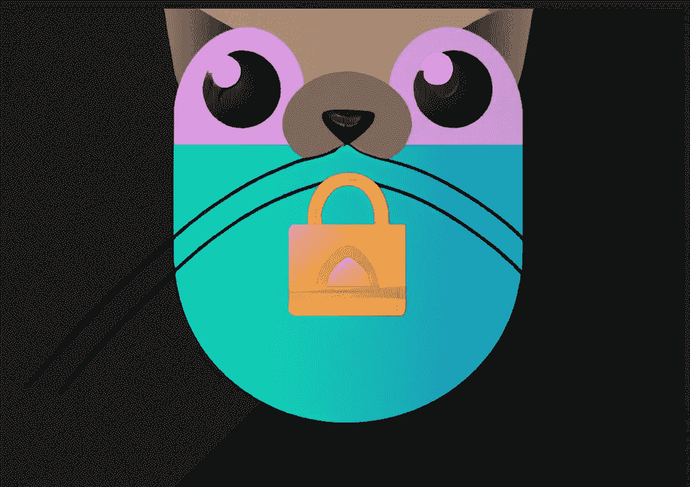
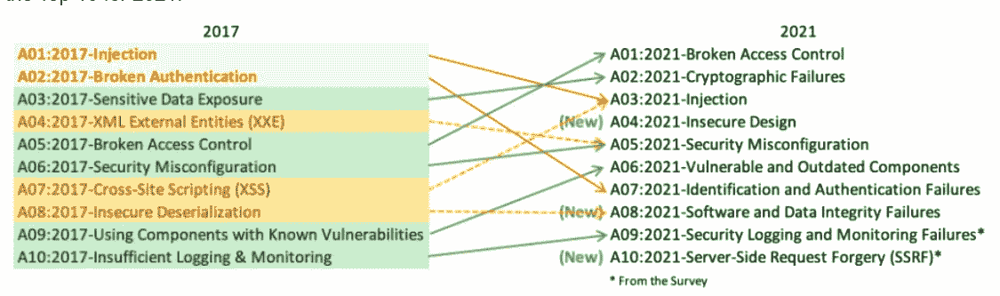

# 最大化 NestJS 应用程序中的代码安全性(第 1 部分)

> 原文：<https://levelup.gitconnected.com/maximize-code-security-in-your-nestjs-applications-part-1-b7abb99fa048>

NestJS 开发人员的顶级安全代码最佳实践



由 DALL-E 生成

作为开发人员，我们都知道代码安全性有多重要。最近发生在 Optus 和 T2 的数据泄露事件再次凸显了代码安全的重要性。因此，问题是:我们如何编写安全的代码来防止 web 应用程序中的各种类型的攻击？遵循最佳实践来编写安全代码至关重要，这样我们的应用程序才能免受漏洞和威胁的侵害。

在我们深入探讨如何防范安全风险之前？让我们首先来看看最常见的安全风险类型。这将让我们更好地理解保持应用安全所面临的挑战。

OWASP Top 10 是一个被广泛接受的 web 应用程序最关键的安全风险列表，由行业专家共同决定。以下是 2017 年和 2021 年十大风险列表。



来源:https://owasp.org/www-project-top-ten/

前 10 名中有许多对 web 应用的安全性至关重要。

作为本文的第 1 部分，我将介绍一些风险和防止风险的最佳实践。

它们包括:

*   [破坏访问控制](#4d65)
*   [服务器端请求伪造(SSRF)](#3fb4)
*   [批量分配](#2dac)
*   [敏感信息曝光](#ffd8)

## 中断的访问控制

函数访问中断是最常见的风险之一。当攻击者能够访问未经授权的功能或资源时，就会发生这种情况。一个真实的例子是 2014 年 1 月发生的 Snapchat 事件。

为了防止这种风险，遵循**最小特权**的原则非常重要。这意味着默认情况下应该总是拒绝访问，并且应该只在需要的基础上授予特权。

我们可以使用基于角色的访问控制(RBAC)或访问控制列表(ACL)等访问控制机制，根据用户的角色或权限来限制对功能或资源的访问。

这里有一个 RBAC 在 NestJS 应用程序中使用[保护](https://docs.nestjs.com/guards)的例子:

```
import { Injectable, CanActivate, ExecutionContext } from '@nestjs/common';

@Injectable()
export class AdminRoleGuard implements CanActivate {
  canActivate(context: ExecutionContext): boolean {
    const request = context.switchToHttp().getRequest();
    const user = request.user;
    return user.role === 'admin';
  }
}

@Controller('cats')
export class CatsController {
  @UseGuards(AdminRoleGuard)
  @Get()
  async findAll(): Promise<Cat[]> {
    return this.catsService.findAll();
  }
}
```

在上面的代码片段中，我们创建了一个`AdminRoleGuard`，它实现了由 NestJS 提供的`CanActivate`接口。它检查当前用户的角色，当用户是管理员时返回`true`。然后，我们使用`@UseGuards`装饰器将`AdminRoleGuard`应用于`findAll`方法，这将限制仅具有`admin`角色的用户对端点的访问。

应使用成熟框架中的集中功能来应用访问控制机制，以确保其安全且易于维护。

还建议进行单元测试，测试控制器上应用的必要保护。因此，如果防护被意外移除，单元测试将捕获它。

## 服务器端请求伪造(SSRF)

SSRF 是一种网络攻击，攻击者诱使服务器代表他们发出非故意的请求。这些请求可用于从内部网络访问受限资源。

为了防止 SSRF，正确验证用户输入是至关重要的。以下是易受 SSRF 风险攻击的终端示例。

```
import { Controller, Get, Res, HttpStatus, Query } from '@nestjs/common';

@Controller()
export class CatsController {
  @Get()
  async getData(@Query('url') url: string, @Res() res) {
    const response = await fetch(url);
    return await response.json();
  }
}
```

在上面的例子中，应用程序向来源于`url`查询参数的 URL 发出请求，并将响应数据返回给客户端。显然，它很容易受到 SSRF 攻击，因为攻击者可以通过恶意 URL 向服务器发送请求，从内部网络访问受限资源。

我们应该验证 URL 参数以防止如下风险。

```
import { Controller, Get, Res, HttpStatus, Query } from '@nestjs/common';
import { isURL } from 'validator';

@Controller()
export class CatsController {
  @Get()
  async getData(@Query('url') url: string, @Res() res) {
    if (!isURL(url)) {
      return res.status(HttpStatus.BAD_REQUEST).send('Invalid URL');
    }

    const response = await fetch(url);
    return await response.json();
  }
}
```

为了进一步提高安全性，我们不应该允许用户直接在查询参数中传递 URL。相反，我们应该使用现有的服务从可信的 API 中检索数据。

```
@Controller()
export class CatsController {
  @Get()
  async getData(@Query('name') dataName: string, @Res() res) {
    const response = await dataService.GetDataByName(dataName);
    return await response.json();
  }
}
```

还有其他方法可以防止 SSRF 袭击:

*   仅向可信来源(即已知的 API 或服务)发出请求
*   实施安全标头(如“ [X-Frame-Options](https://developer.mozilla.org/en-US/docs/Web/HTTP/Headers/X-Frame-Options) ”)以防止点击劫持攻击和其他类型的恶意请求。
*   使用内容安全策略(CSP)来指定允许哪些源代表您的应用程序发出请求。

在 NestJS 中，您可以使用[头盔](https://docs.nestjs.com/security/helmet)轻松设置安全头和内容安全策略。

## 批量分配

批量分配是一个漏洞，攻击者能够通过向您的应用程序发送恶意请求来修改多个对象属性。

在下面的示例中，基于来自请求主体的数据创建了一个新用户。它容易受到批量分配攻击，因为攻击者可以发送一个带有恶意数据的请求，覆盖`Client` 对象中的敏感字段(即角色或密码)。

```
import { Controller, Post, Body } from '@nestjs/common';

@Controller("client")
export class ClientController {
  @Post()
  create(@Body() body) {
    const client = new Client(body);
    return await client.save();
  }
}
```

为了防止大量分配，我们可以为每个对象定义一个允许属性的白名单。在下面的例子中，我们实现了一个属性白名单来防止敏感字段被覆盖。

```
import { Entity, Column, PrimaryGeneratedColumn } from 'typeorm';

@Entity()
export class Client{
  @PrimaryGeneratedColumn()
  id: number;

  @Column()
  name: string;

  @Column()
  role: string;

  @Column()
  password: string;

  @Column(})
  email: string;
}

@Controller('client')
export class ClientController {
  constructor(private clientService: ClientService) {}

  @Post()
  async create(@Body() client: Pick<User, 'name' | 'email'>) {
    return await this.clientService.create(client);
  }
}
```

这里，我们使用 TypeScript `Pick`类型为`User`实体定义一个属性白名单。然后使用`@Body`装饰器将请求体绑定到`user`参数，该参数将只包含允许的属性。这可以防止攻击者通过批量赋值来修改`User`实体的其他属性。

防止批量分配的其他方法包括:

*   使用简化的 DTO，而不是一般的 DTO。例如，创建一个`InsertClientEntity` 和`UpdateClientEntity.`这些 dto 只包含插入和更新操作中允许的属性。
*   避免直接绑定到来自客户端的对象。

## 敏感信息暴露

敏感信息包括密码、API 密钥和其他机密数据。任何包含个人信息或支付相关信息的数据都是敏感的。

通常，在设计 web API 时，会向客户端返回过多的数据。

```
import { Controller, Get, Param } from '@nestjs/common';
import { Client} from './client/client.entity';

@Controller()
export class ClientController {
  @Get('clients/:id')
  async getClient(@Param('id') id: string): Promise<Client> {
    // Return all fields for the client
    return await Client.findById(id);
  }
}
```

在这个例子中，`getClient`方法返回客户端的所有字段，包括敏感数据，如`role` 或`password`。尽管这些数据不会被客户端使用或显示，但它们仍然可能被攻击者截获和暴露。

为了防止敏感的个人数据暴露，我们应该只返回客户端的必要数据，在本例中是`name`和`email`字段。简而言之，我们应该只公开最少量的数据。

```
import { Controller, Get, Param, UseGuards } from '@nestjs/common';
import { Client} from './client/client.entity';

@Controller()
export class ClientController {
  @Get('clients/:id')
  async getClient(@Param('id') id: string): Promise<Client> {
    // Only return the name and email
    return await Client.findById(id).map(c => {c.name, c.email});
  }
}
```

为防止敏感数据泄露，以下是其他应遵循的准则:

*   不要将敏感信息存储到版本控制中。这些信息包括环境变量或配置文件
*   识别您系统中的敏感信息( [GDPR](https://gdpr-info.eu/) 、 [PCI、](https://www.pcisecuritystandards.org/)和 [PII 数据](https://www.cyber.gov.au/acsc/view-all-content/glossary/personally-identifiable-information-pii))，并通过加密保护。
*   确保您的应用程序在客户端和服务器之间使用 HTTPS。这将防止敏感数据在传输过程中被截获。

## 摘要

在本文中，我们将介绍 4 种常见风险以及在 NestJS 环境中防范这些风险的最佳实践。

通过遵循这些最佳实践，您可以编写安全的代码来确保您的 NestJS 应用程序尽可能地安全。

在本文的第 2 部分中，我们继续讨论其他主要的 OWASP 风险。

[](/maximize-code-security-in-your-nestjs-applications-part-2-be707466b7ea) [## 最大化 NestJS 应用程序中的代码安全性(第 2 部分)

### 通过真实世界的例子来保护代码的最佳实践

levelup.gitconnected.com](/maximize-code-security-in-your-nestjs-applications-part-2-be707466b7ea) 

如果您还不是 Medium， [**的付费会员，您可以通过访问此链接**](https://sunnysun-5694.medium.com/membership) 进行注册。你可以无限制地阅读媒体上的所有报道。我会收你一部分会员费作为介绍费。

编程快乐！