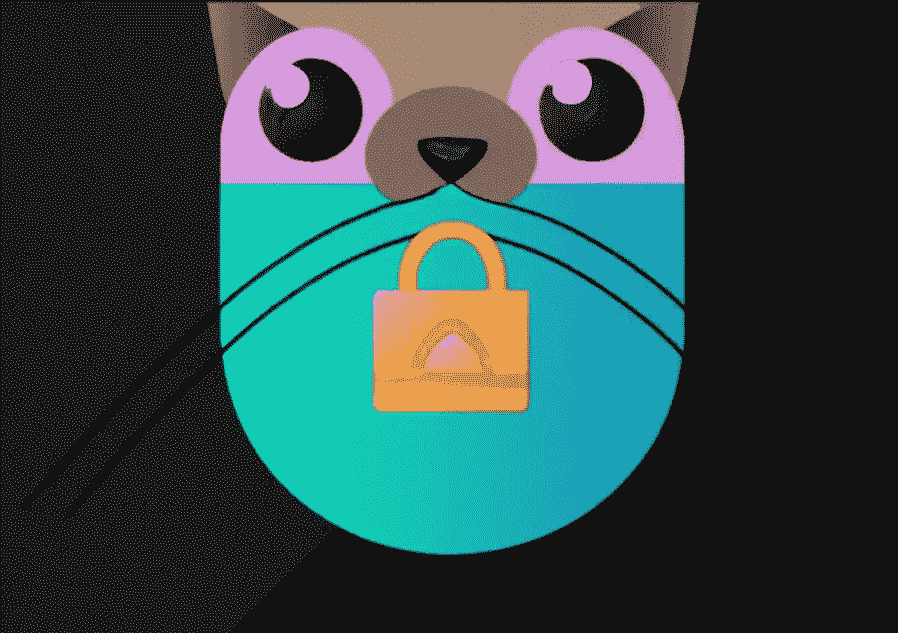

# 最大化 NestJS 应用程序中的代码安全性(第 2 部分)

> 原文：<https://levelup.gitconnected.com/maximize-code-security-in-your-nestjs-applications-part-2-be707466b7ea>

## 通过真实世界的例子来保护代码的最佳实践



由 DALL-E 生成

在本文第 1 部分中，我们介绍了 NestJS 环境中的 4 种常见安全风险及其防范措施。值得注意的是，尽管这里使用了 NestJS(作为我最喜欢的 API 框架之一)，但是那些最佳实践是框架不可知的。

让我们继续深入研究其他常见的安全漏洞。

*   [注射](#5dcf)
*   [缺乏资源和速率限制](#dc35)
*   [识别和认证失败](#035f)
*   [缺少对象级访问控制](#1fa9)

## 注射

作为最广为人知的漏洞之一，当攻击者通过将任意代码或命令注入到应用程序中来执行它们时，就会发生注入。注入攻击可以采取多种形式，如 SQL 注入、命令注入和表达式注入。

虽然注射是一个众所周知的风险，但它仍然频繁发生。最近的一些事件包括 [2017 年 Equifax 数据泄露](https://en.wikipedia.org/wiki/2017_Equifax_data_breach)影响 1.47 亿用户，2018 年英国航空公司数据泄露泄露 38 万信用卡信息，以及 [2019 年 Capital One](https://www.capitalone.com/digital/facts2019/#:~:text=When%20did%20this%20occur%3F,4.) 泄露 1 亿用户个人信息，这都是 SQL 注入造成的。

下面是 SQL 注入的一个例子

```
import { Injectable } from '@nestjs/common';
import { Connection } from 'typeorm';

@Injectable()
export class ClientService {
  constructor(private connection: Connection) {}

  async getClients(name: string) {
    const query = `SELECT * FROM client WHERE name = '${name}'`;
    return await this.connection.query(query);
  }
}
// Client Controller
@Controller('users')
export class ClientController {
  constructor(private clientService: ClientService) {}

  @Get('search')
  async searchClient(name: string) {
    return this.clientService.getClients(name);
  }
}
```

在这个例子中，`ClientService` 类使用`name`参数构建一个针对数据库执行的 SQL 查询。如果没有对`name` 参数进行适当的清理，攻击者可以通过包含特殊字符将恶意代码注入到查询中。例如，攻击者可以发送一个带有`name`参数的请求，比如`'; DROP TABLE client; --`，这将删除`client` 表。

可以通过净化用户输入并尽可能使用预处理语句或参数化查询来防止 SQL 注入。这是上一个例子的改进版本。

```
import { Injectable } from '@nestjs/common';
import { Connection } from 'typeorm';

@Injectable()
export class ClientService {
  constructor(private connection: Connection) {}

  async getClients(name: string) {
    const query = 'SELECT * FROM client WHERE name = $1';
    const params = [name];
    return await this.connection.query(query, params);
  }
}
```

修订后的`ClientService` 使用参数化查询，这有助于确保用户输入被视为数据，而不是可执行代码。

另一种常见的注入攻击是操作系统命令注入。当攻击者注入并执行任意操作系统命令时，就会发生这种情况，注入可以通过请求头或参数等完成。这里有一个例子。

```
@Injectable()
export class ClientService {
  public executeCommand(command: string): void {
    const commandArray = command.split(' ');
    spawn(commandArray[0], commandArray.slice(1));
  }
}
```

如果没有对`command` 输入进行适当的消毒或验证，上面的代码就会为类似于`rm rf /var/www`的恶意命令打开大门。

为了防止操作系统命令注入，最好的方法是用特定于框架的 API 替换应用程序中的操作系统命令。或者，我们应该转义并验证用户输入，以确保只有预期的输入会通过验证。

## 缺乏资源和速率限制

许多客户端可以同时调用一个 API。如果并发请求的数量超过限制，API 将变得没有响应，甚至崩溃。

高峰时段合法请求的突然激增或恶意 DDoS 攻击都会触发此漏洞。最近的 DDoS 攻击之一是 [2020 AWS web 服务攻击](https://www.a10networks.com/blog/aws-hit-by-largest-reported-ddos-attack-of-2-3-tbps/)。

当攻击者在短时间内发送大量请求时，任何没有速率限制的 API 端点都容易受到攻击。为了防止它，我们可以在 NestJS 中使用一个限速中间件。你有几个选择，如`[nestjs/throttler](https://github.com/nestjs/throttler)` 或`e[xpress-rate-limit](https://github.com/express-rate-limit/express-rate-limit).`

在下面的例子中，我们使用`nestjs/throttler`来限制在 1 分钟内最多可以从同一个 IP 向一个端点发出 10 个请求。它适用于应用程序的所有传入请求。

```
@Module({
  imports: [
    ThrottlerModule.forRoot({
      ttl: 60,
      limit: 10,
    }),
  ],
})
export class AppModule {}
```

还有其他选项可用于自定义限制。例如，您可以使用`@SkipThrottle` decorator 来禁用端点的速率限制，或者使用`@Throttle()` decorator 来覆盖全局模块中设置的`limit`和`ttl`。

除了请求数量之外，还应考虑以下限制

*   执行超时:如果一个请求需要很长时间才能完成，那么它应该被终止。
*   有效负载大小/响应的最大数据量，如果请求返回潜在的大量数据
*   最大可分配内存:过多的内存使用会导致应用程序崩溃。

## 识别和认证失败

识别和身份验证失败是与应用程序的身份验证过程和识别过程相关的漏洞。

当系统或应用程序没有可靠的方法来验证用户身份时，或者当身份验证过程很容易被绕过或操纵时，就会发生这种情况。

这种漏洞有多种不同的形式。最常见的一种被称为会话劫持。下面是一个在 NestJS 应用程序中发生这种情况的例子:

*   攻击者拦截普通用户的会话 cookies。这些 cookies 可能包含用户 ID 或角色等信息以及其他识别信息。

```
// Cookies content
eyJ1c2VySWQiOjEyMzQ1LCJ1c2VyUm9sZSI6Im5vcm1hbCJ9
// JSON
{"userId":12345,"userRole":"normal"}
```

*   攻击者修改会话 cookies 来更改用户角色和其他标识信息，以匹配管理帐户。
*   攻击者伪装成管理员，将修改后的 cookies 发送回服务器。服务器接收修改后的 cookies，并授予攻击者以管理权限访问应用程序。

上面的例子很明显是服务器端认证不充分造成的。为了在 NestJS 中防止这种类型的攻击，一种方法是使用 JWT (JSON Web token)实现身份验证。NestJS 提供了一个 [](https://github.com/nestjs/jwt) `[@nestjs/jwt](https://github.com/nestjs/jwt)` 包供 JWT 操纵。你可以在你的 NestJS 应用[这里](https://docs.nestjs.com/security/authentication#jwt-functionality)找到更多关于 JWT 实现的细节。

为了进一步加强身份验证，您可以考虑实现 MFA(多因素身份验证)。最流行的 MFA 形式是 OTP(一次性密码)。

您可以创建自己的 OTP 服务来存储一次性密码并管理通过电话或电子邮件的发送。如果你不想重新发明轮子，我们可以使用现有的库，比如 [otplib](https://github.com/yeojz/otplib) 。

下面是在 NestJS 中使用 otplib 的基本步骤

```
// install Otplib
npm install otplib
// import it
import * as OTPLib from 'otplib';

// generate a secrete
const secret = OTPLib.authenticator.generateSecret();
// then, we can gerenate a QRCode url to show a QRCode in your app
// we should save the generated secret in database for later use
const otpUrl = OTPLib.authenticator.keyuri('user', 'The App name', secret);

// Now user scan the QRCode and sent it to the NestJS endpoint
// we can use the built in authenticator.verify to validate the otp token
import { authenticator } from 'otplib';

authenticator.verify({
      token: token // Sent from Client,
      secret: secrete // previously saved secrete
    })
```

如果无法实现 MFA，可以考虑的其他额外安全性选项包括:

*   安全问题
*   验证码
*   需要强密码

## 缺少对象级访问控制

对象级访问控制是一种安全机制，它可以根据请求访问的用户的权限或角色来控制对特定对象或资源的访问。

下面是一个在 NestJS 应用程序中风险可能发生的例子:

```
import { Injectable } from '@nestjs/common';
import { ClientService } from './client.service';

@Injectable()
export class AttachmentController {
  constructor(private clientService: ClientService) {}

  @Get('/document/:id')
  public async getFile(id: string): Promise<any> {
    return await this.clientService.getAttachmentById(id);
  }
}
```

在这个例子中，`AttachmentController`中的`getFile`方法没有适当的对象级访问控制，以确保只有附件的所有者或有权限的用户才能访问它。攻击者可能通过猜测附件 id 来访问系统中的任何文件。

为了防止这种风险，我们可以验证用户是所有者或者拥有访问对象或资源的权限。

```
@Injectable()
export class AttachmentController {
  constructor(private clientService: ClientService) {}

  @Get('/document/:id')
  public async getFile(id: string): Promise<any> {
    const currentUser = getCurrentUser();
    const document = await this.clientService.getAttachmentById(id);
    if (currentUser.id !== document.ownerId) {
      throw new ForbiddenException();
    }
    return document;
  }
}
```

请注意，上面是一个虚构的例子，假设只有附件文件的所有者才能访问它。

为了进一步降低风险，我们还可以使用难以预测的随机值作为记录 id。这有助于防止攻击者猜测或枚举记录 id。下面是一个使用`uuid` 模块为文档 id 生成随机唯一值的例子。

```
import { v4 as uuid } from 'uuid';
const document = {
  id: uuid(),
  ownerId: currentUser.id, 
```

最佳实践是确保在您的 NestJS 应用程序中使用基于角色的授权[保护](https://docs.nestjs.com/guards)来保护服务器端功能。

## 最后的想法

人们普遍认为安全性是软件开发周期中的最后一步，无论是以渗透测试的形式还是通过使用静态扫描工具。然而，这种方法是不够的。

相反，安全性应该集成到开发过程的每一步，从设计到编码和测试。安全考虑应该是软件应用程序规划和开发的关键部分，而不是事后的想法。

在本文中，我们讨论了几种可能影响 NestJS 应用程序的常见安全风险，还有许多其他的需要考虑。我希望这篇文章对你构建一个安全且有弹性的应用有所帮助。