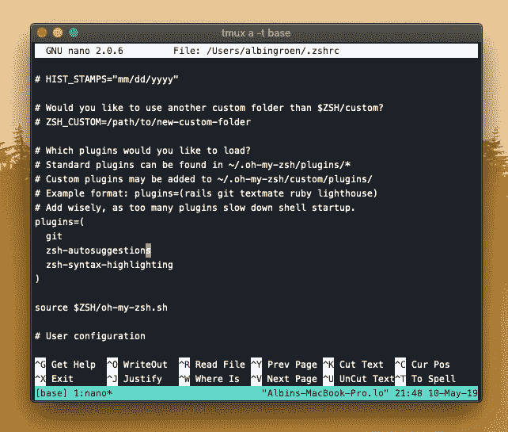

# 最大限度地利用终端

> 原文：<https://levelup.gitconnected.com/maximizing-use-of-the-terminal-9b7b12ab5dd2>


如果您是开发人员或工程师，您可能以前接触过终端或某种命令行。这么多人认为命令行比使用图形用户界面更强大是有原因的。如果你对它感到满意，你可以更快地浏览你的操作系统和电脑，在更少的时间里做更多的事情。特别是如果你从事软件开发，使用终端可以大大提高你的生产力和工作流程。熟悉终端需要相当长的时间。但这肯定是值得的。毕竟，罗马不是一夜建成的,——不管怎样，它是存在的。

作为一名软件开发人员，在你的工具上投入时间将会逐渐改善你的工作流程，并享受你以前可能没有优先考虑的工作。建立一个完美的开发环境是一个漫长的过程。这里有一些技巧和窍门，让你枯燥的老终端变得有趣，每天工作起来更愉快。其中一些提示你可能已经知道了，但希望你会发现其中一些有用。

# 1.终端和外壳

外壳是你终端的引擎。大多数机器上的默认 shell 称为 Bash(重生 Shell)。尽管 Bash 工作得非常好，但是许多人正在转向其他 UNIX shellss，如 Zsh、Fish 和 Rc，因为这些 shell 更加可定制。本文将针对运行 Zsh 的终端，但是大多数技巧也适用于其他 shells。你的计算机上的默认终端很可能是不可定制的，因此我和许多其他开发人员建议你在 Mac 上使用 iTerm 这样的终端。iTerm 提供了许多令人惊叹的特性，并且可配置性极强。

## 安装 iTerm2 和 ZSH

如果你想阅读安装 ZSH 的完整文档，我强烈推荐你访问官方的 Github 库:

**iTerm2**

【https://www.iterm2.com 

**ZSH**

```
$ brew install zsh zsh-completions
```

通过在终端窗口中输入以下命令，将 ZSH 设置为默认终端外壳:

```
$ chsh -s /bin/zsh
```

现在，安装并打开 iTerm2 后，您应该会看到类似这样的消息。


# 2.会话、窗口和窗格管理

在设置了新的终端和终端外壳引擎后，我们想安装一个名为 **Tmux 的工具。Tmux 是一个很棒的终端多路复用器工具，可以同时管理多个会话和活动，使用多个窗口，并根据需要将窗口分成多个窗格。Tmux event 允许您关闭终端，并且在您处理其他事情时，仍然让进程和活动在后台运行。**

## 安装 Tmux

假设您的机器上安装了 Homebrew，安装 Tmux 就像运行以下命令一样简单

```
$ brew install tmux
```

现在，要启动新的 Tmux 会话，只需键入以下命令:

```
$ tmux
```

现在，随着 Tmux 的启动和运行，我们可以根据需要轻松地拆分窗格，创建多个会话，在选项卡之间切换，添加窗口等等。

**在这里阅读更多关于 Tmux 的信息:**

 [## Tmux 备忘单和快速参考

### 最新的快捷方式，快速参考，运行在 Linux，OS X，OpenBSD，FreeBSD 上的 tmux 终端复用器的例子…

www.tmuxcheatsheet.com](https://www.tmuxcheatsheet.com) 

# 3.主题和字体

设置计算机终端和终端外壳的最有趣的部分包括按照你想要的方式来设计它。幸运的是，iTerm2 和 Zsh 非常容易定制，并且可以根据您的需要轻松地进行主题化和配置。对于本文，我们将为 iTerm2 安装一个名为 Lovlace 的主题，并启用一个名为 Agnoster 的流行的 Zsh 主题。

**iTerm2 lovelace 主题**

[](https://www.dropbox.com/s/c4ezrzx3lcen7uw/lovelace.itermcolors?dl=0) [## lovelace.itermcolors

### Dropbox 是一项免费服务，可以让你将照片、文档和视频带到任何地方，并轻松分享。从不发电子邮件…

www.dropbox.com](https://www.dropbox.com/s/c4ezrzx3lcen7uw/lovelace.itermcolors?dl=0) 

**Zsh 不可知论者**

[](https://github.com/agnoster/agnoster-zsh-theme) [## agno ster/agno ster-zsh-主题

### 一个 ZSH 主题，旨在根据上下文披露信息，带有电力线美学-不可知论者/不可知论者-zsh 主题

github.com](https://github.com/agnoster/agnoster-zsh-theme) 

为 Zsh 安装主题的最大好处是这是一个非常简单的过程。你所要做的就是选择一个主题，打开配置文件，输入你想要使用的主题。像下面这样:

```
$ nano ~/.zshrc
```

并改成了下面的 **ZSH_THEME="agnoster"**


点击 **ctrl+x** 关闭 nano，点击**y**保存。之后，您需要在终端窗口中输入以下命令来刷新您的 Zsh 配置。

```
$ source ~/.zshrc
```

您现在已经成功地为 Zsh 启用了 Agnoster 主题！

# 4.插件

如前所述，Zsh 是非常可定制的，允许许多附加组件和插件。我最喜欢的一些插件允许在输入命令时自动给出建议，语法高亮显示以便在终端输入时更容易发现错误，还有 Zsh 的 git 插件。安装 Zsh 插件真的很容易。你所要做的就是下载你想要安装的插件，把它放在 Zsh 的插件文件夹中，然后把它添加到配置文件中。或者，如果您正在使用 Oh-My-Zsh 运行 Zsh(我们正在这样做),您所要做的就是用插件克隆一个 git repo，并将其添加到我们的配置文件中。

**Zsh-自动暗示**

```
git clone [https://github.com/zsh-users/zsh-autosuggestions](https://github.com/zsh-users/zsh-autosuggestions) ${ZSH_CUSTOM:-~/.oh-my-zsh/custom}/plugins/zsh-autosuggestions
```

然后继续添加到插件部分的 Zsh 配置文件中。在这里，您可以添加所有想要安装的插件。许多插件已经位于插件地图中，你可以通过将它们添加到插件部分来启用它们。



**Zsh-语法-高亮显示**

```
git clone [https://github.com/zsh-users/zsh-syntax-highlighting.git](https://github.com/zsh-users/zsh-syntax-highlighting.git) ${ZSH_CUSTOM:-~/.oh-my-zsh/custom}/plugins/zsh-syntax-highlighting
```

现在只需按照前面的过程，将插件添加到配置文件的 plugins 部分。虽然你已经在配置文件里面了，但是我强烈推荐你添加 git 插件，它允许你输入 git 命令，可以提高速度和效率。


在这一点上，你将有一个非常直观的终端每天工作，而不是点击用户界面。至少对我来说，这极大地提高了生产率和工作流程，因为在使用了几个月之后，我对命令行感觉非常舒服。能够一次有多个会话，分割窗格，一边运行服务器，另一边运行文本编辑器，如 Nano 或 Vim，这是非常自由的。记住，*最适合你的，永远是最好的工具*。

# 分级编码

感谢您成为我们社区的一员！ [**订阅我们的 YouTube 频道**](https://www.youtube.com/channel/UC3v9kBR_ab4UHXXdknz8Fbg?sub_confirmation=1) 或者加入 [**Skilled.dev 编码面试课程**](https://skilled.dev/) 。

[](https://skilled.dev) [## 编写面试问题

### 掌握编码面试的过程

技术开发](https://skilled.dev)