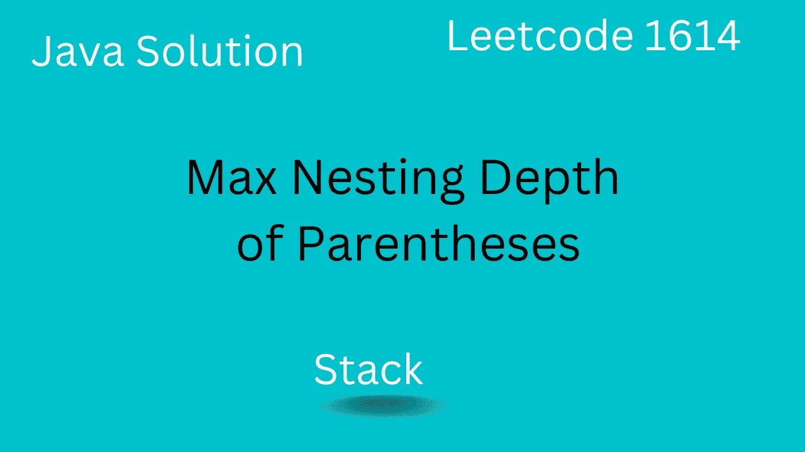
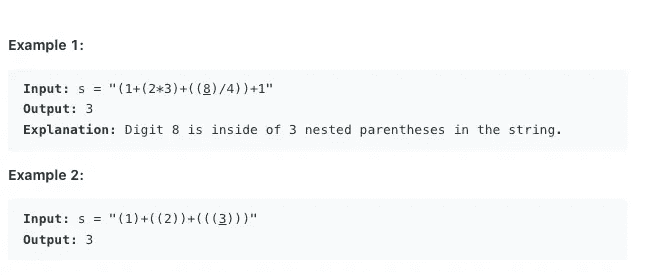
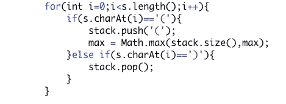

# 括号的最大嵌套深度— Leetcode 1614

> 原文：<https://levelup.gitconnected.com/maximum-nesting-depth-of-the-parentheses-leetcode-1614-4dbabe23b39>

## Leetcode 1614 的 Java 解决方案

## 介绍

*   在本文中，我们将解决 Leetcode 1614，它将主要帮助我们理解如何使用堆栈数据结构。
*   我们还将看到如何在没有堆栈数据结构的情况下解决这个问题。

## 问题陈述

*   我们已经得到了一个**有效的括号字符串(VPS)** ，需要返回嵌套深度。
*   VPS 定义为
    >>“->空字符串
    > >写为 AB，其中 A 和 B 都是有效的 VPS
    > > (A) - >其中 A 是 VPS

## 例子

*   在下面的示例中，括号的深度是 3，因为数字 8 嵌套在 3 个括号内。
*   同样，在第二个示例中，嵌套深度是 3，其中 3 是嵌套括号。

## 解决方法

直觉是我们遍历字符串中的每个字符，如果这个字符恰好是左括号，我们就把它添加到堆栈中。
-当我们向堆栈添加左括号时，我们还会检查当前堆栈大小是否大于最大值。堆栈大小基本上描述了深度。
-如果字符恰好是右括号，那么我们可以弹出我们添加的最后一个左括号，因为它完成了我们的括号。

## 密码

*   这是整个逻辑。

*   我们可以避免使用 stack，因为我们要处理的唯一字符是左括号和右括号。
*   相反，我们可以保持开括号，遇到开括号时递增，遇到闭括号时递减。

## 结果

*   我们的解决方案被 leetcode 接受

## 复杂性

**带栈** - >时间复杂度:O(N)
- >空间复杂度:O(N)

**无栈** - >时间复杂度:O(N)
- >空间复杂度:O(1)

## 结论

*   在本文中，我们使用堆栈来解决括号问题。这个问题很适合从堆栈数据结构开始。
*   我们还看到，如果存储在堆栈中的数据没有变化，我们如何使堆栈冗余。

## 奖金

*   如果你想升级你的编码面试游戏，你绝对可以看看这个畅销课程[***(这是 Java 的)***](https://click.linksynergy.com/link?id=FAaRt1BJn8w&offerid=1060092.1419186&type=2&murl=https%3A%2F%2Fwww.udemy.com%2Fcourse%2Fdata-structures-and-algorithms-deep-dive-using-java%2F)