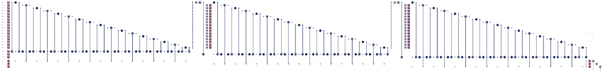
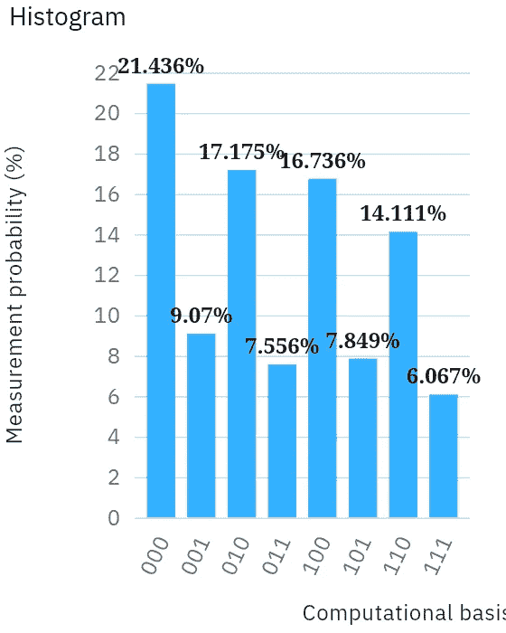

# 最大量子分类

> 原文：<https://levelup.gitconnected.com/maximum-quantum-classification-b629372ea64d>

本文是我上一篇“[量子分类](https://link.medium.com/bLdYZTh2A8)”文章的延续，为基于质心的聚类算法奠定了基础。出于本文的目的，这些组是已知的，我们想要确定一个新示例应该属于哪个组。

**基于质心的聚类**

对于那些不熟悉基于质心的聚类(一种流行的实现是 k-means 算法)的人来说，我们将从未标记的示例开始，确定 k(我们需要多少组)个中心点(又名质心)，然后根据这些质心的邻近程度对示例进行分组。这个电路中的交换测试有效地确定了质心，但是我们已经知道哪些例子在哪些组中，这是欺骗。

阅读有关交换测试的更多信息:

*   [比较量子态](https://link.medium.com/HNZPhKmzz8)
*   [特定基础互换测试](https://link.medium.com/9eW5qJqzz8)
*   [简化量子机器学习(QML)分类](https://link.medium.com/3QEYCdtzz8)
*   [比较纠缠态](https://link.medium.com/bEVuolvzz8)
*   [量子分类](https://link.medium.com/bLdYZTh2A8)

**绘制示例图**

如果你把一个布洛赫球沿其轴分成八个部分，这些例子可以用 U3 操作任意映射到这八个部分中的三个。因此，这些截面中的每一个都有效地具有一个质心。

**最大电路深度**

我最初试图使用 IBM Q Experience simulator 的所有 32 个量子位，但这导致了一个错误。当我把电路缩小到只有 9 个量子位时，它工作了。因此，我慢慢地向上缩放，直到达到你在这里看到的最大电路深度(和宽度)。正如你在下面看到的，每增加一个量子位，运行时间就加倍，直到任务无法完成。

运行时间:

*   20 个量子比特和 42 个弗雷德金:13 分 47.8 秒
*   21 个量子比特和 45 个弗雷德金:29 分 33.8 秒
*   22 个量子位和 48 个弗雷德金:1 小时 6 分 31.5 秒
*   23 个量子比特和 51 个弗雷德金:2 小时 18 分钟 5.9 秒
*   24 个量子位和 54 个弗雷德金:错误

我还打算运行多个任意状态来展示算法为不同的例子选择不同的组，但是老实说，我不知道这些长时间的运行是否会对其他 IBM Q Experience 用户产生负面影响。因此，我给出了一个在最大可能的运行时工作的例子。

**第一组**

在这张图片的左侧，你可以看到 17 个 U3 操作，它们映射了代表属于第一组的例子的任意量子态。在它们下面是三个相同的 U3 操作，代表我们将确定最近质心的例子。在它们下面是三个安西拉量子位，每个都有一个哈达玛门。每个交换测试使用最上面的辅助量子位作为其控制量子位，最上面的测试量子位作为一个目标，数据量子位之一作为另一个目标。

**第二组**

为了最大化可用量子位的数量，我们重置了 17 个数据量子位，并映射代表第二组示例的任意量子状态。这一次，每个交换测试使用中间的辅助量子位作为其控制量子位，中间的测试量子位作为一个目标，并且再次使用其中一个数据量子位作为另一个目标。

**57 个虚拟量子位**

通过使用重置，禁止使用超导处理器(这是我最熟悉的)，我们能够绘制出 51 个例子。将三个测试量子位和三个辅助量子位相加，就好像我们在模拟 57 个量子位。

重置门在超导处理器上不起作用，因为所有的实验都是从初始化开始，到测量结束，不管你实际上把测量结果放在电路的什么地方。

**第三组**

组 3 几乎与组 2 相同，除了每个交换测试使用底部辅助量子位作为它的控制量子位和底部测试量子位作为目标之一。我们再次使用每个数据量子位作为其他目标，每个数据量子位都应用了重置门和新的 U3 操作。

**X 测量值**

交换测试以对辅助量子位的 x 测量结束。x 测量与更常见的 z 测量的区别在于测量之前放置了哈达玛门。

**运输**

这是整个电路，再一次，但是是在模拟器上的传输之后。从两幅图像的高度差异可以看出，电路深度明显增加。然而，这只显示了每个弗雷德金门被转换成两个 CNOT 门和一个托弗利门。Transpiled 电路几乎总是在真实硬件上看得更深，Fredkin gates 肯定就是这种情况。

**分类**

解释互换测试结果相当简单。相同状态以 1 的概率测量|0 >,最大相反状态以 0.5 的概率测量|0>。例如，以 0.9 的概率测量|0 >表明状态比以 0.6 的概率测量|0 >的状态更接近。

所得直方图显示，顶部辅助量子位测量|0 >的概率最高，并且顶部辅助量子位将测试状态与组 1 进行比较。因此，出于分类目的，测试状态最接近组 1。幸运的是，这是基于组 1 和测试状态中数据量子位的 U3 旋转的预期结果。

**《古典劣势》**

这张电路图展示了我第一次尝试使用 IBM Q 体验模拟器的全部 32 个量子位；该电路使用 78 个弗雷德金门。在这个版本失败但九量子位版本成功后，我发推特说:

> 我不知道如何证明“量子优势”，但我可能证明了“经典劣势”。

如果运行时间确实随着每个额外的量子位而加倍，并且如果硬件能够处理它，我们可以期望这个 32 量子位电路在经典模拟器上的运行时间超过 6 周！

**运输**

这个电路再次显示了每个 Fredkin 门被转换为 2 个 CNOT 门和 1 个托夫里门，但是我读到过在 IBM Q Experience 处理器上规范的交换测试被转换为 14 个门。该电路在每次交换测试中使用了一个以上的 Fredkin 门，因此很明显，如果可以在真实的量子处理器上运行，该电路图并不能完全说明 transpiled 电路的实际深度。

**未来工作**

这项工作的一个逻辑扩展是基于质心的聚类算法的完成。对于这篇文章，我想使用尽可能多的例子。然而，为了确定这些组，示例的数量可能必须非常少。