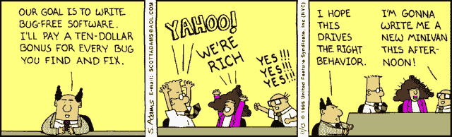

# 衡量开发人员的生产力|如何获得正确的结果？

> 原文：<https://levelup.gitconnected.com/measuring-developer-productivity-how-to-get-it-right-7a3f01f2f754>

彼得·德鲁克曾经说过:“有度量的，就有管理的”。在当今竞争激烈的商业环境中，项目经理、利益相关者和高管希望尽可能量化产出。

在软件开发中，就像任何其他领域一样，许多人根据输入和输出来考虑生产率。在美国，全职开发人员的平均年薪为 107510 美元，每周工作 40 小时。工资和工作时间是简单可见的可量化输入。然后，开发人员重复地将错误修复放在一起，生成部署、文档和软件特性。这些是输出。

还有另外一个学派有不同的看法！他们认为不应该有任何形式的量化标准来衡量开发人员的表现。

“对于软件开发人员来说，使用任何形式的量化方法来衡量生产力都可能导致整体生产力下降。它还阻碍了动力，最终会把优秀的人赶出去。”— vartec

毫无疑问，以上观点有一定的价值，但是必须有一些方法来衡量个人开发者的质量。度量开发人员的生产力是一门不精确的科学，但是如果你不度量，你怎么知道在哪里关注和改进呢？CEO 或 CTO 需要识别和实现清晰的度量方法，并且需要将它们传达给开发团队。

下面是一些考虑如何不测量以及如何准确测量开发人员生产力的方法。

# **如何不衡量开发人员的生产力**

**1。代码行**

我们有必要讨论这个吗？

复杂问题的解决方案有时可能是删除代码行。类似地，一个更高效的开发人员可以用几行代码就能设计出一个解决方案，而不是成百上千行。

一些团队领导和项目经理可能认为开发人员在给定的时间内写的代码越多，他或她就越有效率——这最终变成了一个可怕的想法。

**2。工作时间**

这个应该也很明显。用工作时间来衡量生产率是一种两败俱伤的情况。最高效的开发人员可以在更短的时间内完成更多的工作，解决更困难的问题。

斯坦福大学的一项研究表明，每周工作 60 小时的员工比每周只工作 40 小时的员工完成的工作要少。调查结果显示，过度工作的人甚至可能开始记录负生产力。这可能会导致错误或疏忽的增加，开发人员随后需要纠正这些错误或疏忽。

**3。修正的 Bugs】**

这不是衡量开发人员生产力的最聪明的方法。我认为呆伯特可以总结这个问题，以防乍一看不清楚:

不用说，用已修复的 bug 或已发布的特性来衡量生产率同样毫无意义。

**4。完成的任务**

我们知道，就所需工作量或复杂性而言，并非每项任务都是相同的。简单地用完成的任务来衡量生产率并不是理解生产率的明智方式。我们需要一个更好的系统。

# **衡量开发人员生产力的更智能、更好的方法**

不幸的事实是，并不是所有的度量都有明确的北方，同样的情况也适用于测量开发人员的生产力。但是，总有办法为您的特定团队或特定团队成员制定正确的策略。通读这些方法，找到最适合你情况的方法。

**1。创建的文档**

经常被忽视但却是开发中最重要的部分之一是文档。所以记住文档，建立一个开发人员生产力目标可能是有用的。它可以有很多种类型，从给我读文本到评论和更复杂的手册。但是，不管是哪种类型，它都会产生持久的影响，甚至可能在开发人员离开项目之后。

**2。关闭门票**

票证允许许多软件项目监控为单个开发人员完成的工作。通过统计关闭的票证数量并查看某段时间内的工作类型，您可以看到哪个开发人员参与了更重要的任务。如果任务是按照业务优先级分配的，并且写得正确，那么度量已完成的票据可能是度量开发人员生产力的更好的度量。也有许多不同的方法来衡量封闭门票，许多工具，如吉拉或 GitHub，是可用的。

**3。已完成的代码评审**

代码评审是任何高功能软件开发团队的重要组成部分，也可以帮助你衡量开发人员的生产力。测量已完成的代码评审显示了您的团队对代码评审的认同程度。与此同时，如果您的开发人员正在提交代码评审，那么，可以推测，罚单正在被关闭，您的项目正在向前推进。因此，它成为前面提到的一些度量标准的补充度量，也用来度量开发人员的生产力。

**4。部署**

部署是一种有用的生产力度量，您可以度量与您的用户共享的项目中的变更。

如今有许多工具可以用来以一种简单、自动化的方式衡量部署，这种方式还允许您查看部署中进行了哪些工作。这确保了代码质量处于尽可能高的水平，并鼓励您的团队快速和经常地发布代码。

因此，当开发人员致力于维护高水平的代码时，测量部署可能是一种创造性的和有洞察力的方法来测量他们的生产力。

## **结论**

谈到开发人员的生产力，有许多可用的度量标准。传统的度量方法，如编写的代码行数和工作时间，通常不能给出实际开发人员生产力的最佳视图。其他的度量，比如关闭的标签、完成的代码审查，甚至与其他员工的对话，可以让你更好地洞察开发人员的生产力。由您来决定哪些指标最适合您的团队。做到这一点的一个方法是，当需要完成工作时，决定什么是优先工作。

**关于银河网络链接**

我们专注于交付端到端的软件设计和开发服务，并在大、中、初创企业开发需求方面拥有实践经验。我们的工程师还帮助提高安全性、可靠性和功能，以确保您的业务应用程序能够扩展并保持安全。