# 推荐系统中的相似性度量

> 原文：<https://levelup.gitconnected.com/measuring-similarity-in-recommendation-systems-8f2aa8ad1f44>

图片来源:山本雅也——自己的作品，CC BY-SA 4.0，[https://commons.wikimedia.org/w/index.php?curid=59714108](https://commons.wikimedia.org/w/index.php?curid=59714108)

你有没有想过网飞是如何推荐你想看的电影的？或者亚马逊怎么给你看你觉得需要买的产品？

很明显，那些网站已经搞清楚了你喜欢看什么或者买什么。他们在后台运行一段代码，收集用户在线行为的数据，并预测个人用户对特定内容或产品的好恶。这种系统被称为“推荐系统”。

概括地说，有两种开发推荐系统的方法。在一种方法中，系统考虑个人消费的*内容*的属性。比如你在网飞上一天看完了《黑客帝国》三部曲，那么网飞明白你喜欢科幻电影，更有可能推荐其他科幻电影。换句话说，推荐是基于电影类型的——在这个例子中是科幻。

在另一种方法中，推荐系统考虑与你口味相似的其他人的偏好，并推荐他们看过的电影。与第一种方法相比，推荐是基于多个用户的行为，而不是基于正在消费的内容的属性。这种方法被称为*协同过滤。*

在这个例子中，我们认为这两种方法都更有可能向你推荐科幻电影，但它们会采取不同的途径来得出结论。

# 效用矩阵

协同过滤的一个重要部分是识别具有相似偏好的观众。尽管网飞采用了多种方式来收集用户偏好信息，但为了简单起见，让我们假设它要求观众对电影进行 1-5 分的评分。让我们也假设只有七部电影被评论(哈利波特三部曲、暮光之城和星球大战三部曲)，并且只有四个观众被要求评价它们。

图 1 显示了我们精心挑选的四位观众给出的评分。这种表格——产品沿列，用户沿行——被称为*效用矩阵。*空格表示部分用户还没有对部分电影进行评分。

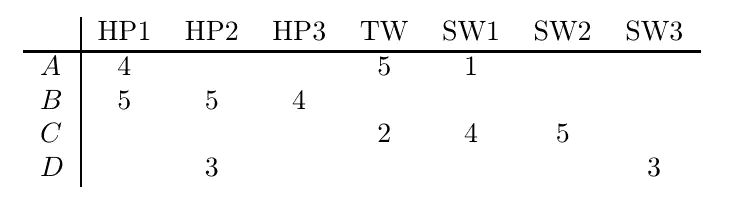

图 1:一个效用矩阵捕获了四个用户对七部电影的评价。电影是沿着列的

事实上，网飞每天有数以千计的节目被数以百万计的观众消费。相应地，它的实际效用矩阵将有数百万行，跨越数千列。此外，随着系统不断收集关于用户行为的信息，该矩阵会动态更新。

通过查看图 1 中的效用矩阵，我们可以得出一些明显的结论。

*   观众 A 喜欢《哈利·波特 1》和《暮光之城》，但不喜欢《星球大战 1》
*   观众 B 喜欢哈利波特三部曲的所有电影，但她不喜欢的是一个严守的秘密
*   观众 C 喜欢星球大战 1 和 2，但不喜欢暮光之城
*   观众 D 不介意在无聊的一天看《哈利波特 2》和《星球大战 2》，但这两部都不是她的自动选择

总之，观众 A 和 B 有相似的品味，因为他们都喜欢哈利波特 1。相比之下，观众 A 和 C 口味不同，因为观众 A 喜欢《暮光之城》，而观众 C 一点也不喜欢。同样，A 不喜欢星球大战，C 却喜欢。推荐系统需要一种方法来比较不同观众的评论，并告诉我们他们的品味有多接近。

# 量化相似性

有不同的指标来比较两个观众提供的评分，并判断他们是否有相似的品味。在本文中，我们将学习其中的两种:雅克卡距离和余弦距离。口味相近的观众比较接近。

## **Jaccard 距离**

Jaccard 距离是另一个称为 **Jaccard 相似性的量的函数。**根据定义，集合 *S* 和 *T* 的 Jaccard 相似度是 *S* 和 *T* 的交集的大小与它们的并集的大小之比。数学上，它可以写成:

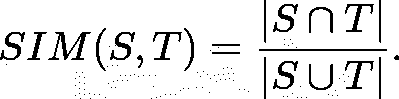

集合 A 和 B 之间的 Jaccard 距离 *d(x，y)* 由下式给出:

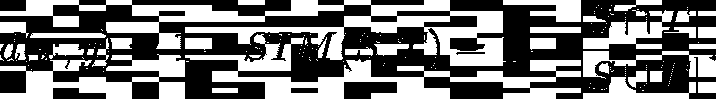

## 余弦距离

两个向量 ***A*** 和 ***B*** 之间的余弦距离为角度*d(****A****，****B****)*，由下式给出，

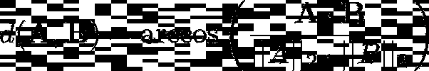

在哪里，

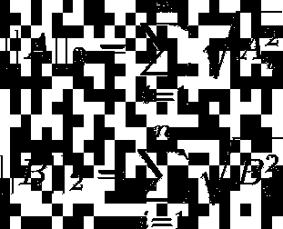

分别是矢量 ***A*** 和 ***B*** 的 L₂-norm， *n* 是产品(本例为电影)的数量。余弦距离在 0 到 180 度之间变化。

## 计算效用矩阵的距离度量

为了更好地理解这些距离度量，让我们使用效用矩阵中的数据来计算距离(图 1)。

**计算 Jaccard 距离:**计算 Jaccard 距离的第一步是以集合的形式写出用户给出的评分。对应于观众 A 和 B 的集合是:

A = {HP1，TW，SW1}

B = {HP1，HP2，HP3}

集合 A 和 B 的交集是两个集合共有的元素的集合。A 和 B 的并集是 A 和 B 中所有元素的集合。因此，

⋂ B = {HP1}和

A ⋃ B = {HP1，HP2，HP3，TW，SW1}。

A 和 B 之间的距离是:

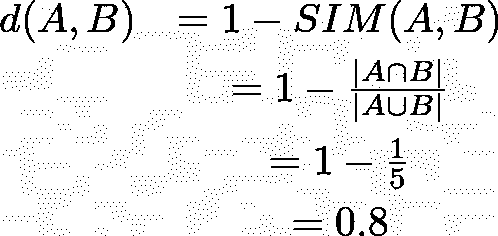

同理，A 和 C 之间的 Jaccard 距离， *d(A，C) =* 0.5。根据这个度量，与观众 A 和 b 相比，观众 A 和 C 之间具有更多的相似性。这与效用表的直观分析所揭示的正好相反。因此，Jaccard 距离对于我们正在考虑的数据类型来说不是一个合适的度量。

**计算余弦距离:**现在让我们计算观众 A 和观众 B 之间以及观众 A 和观众 c 之间的余弦距离。为此，我们首先必须创建一个表示他们收视率的向量。为简单起见，我们假设空格相当于评级为零。这是一个有争议的选择，因为零评级也可以代表观众给出的差评级。对应于观众 A、B 和 C 的向量是:

**答** = [4，0，0，5，1，0，0]

**B** = [5，5，4，0，0，0，0]

**C** = [0，0，0，2，4，5，0]。

**A** 与 **B** 之间的余弦距离为:

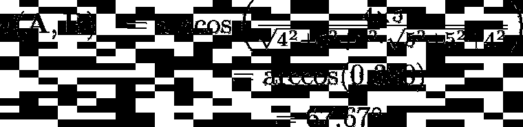

类似地， **A** 和 **C** 之间的余弦距离为:

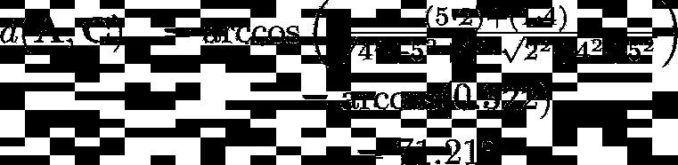

这是合理的，因为它表明 **A** 比 **C** 稍微更靠近 **B** 。

# 转变评级

我们还可以通过对矩阵中的每个元素应用明确定义的规则来转换效用矩阵中捕获的数据。在本文中，我们将学习两种转换:舍入和规格化。

## 四舍五入数据

观众通常对相似的电影给出相似的评级。例如，观众 B 对所有哈利波特电影都给予了很高的评价，观众 C 对《星球大战 1》和《星球大战 2》给予了很高的评价。这种评级的相似性可以通过用规则对评级进行舍入来消除。例如，我们可以设置一个规则，将评分 3、4 和 5 四舍五入为 1，并将评分 1 和 2 视为空格。应用这条规则后，我们的效用矩阵变成:

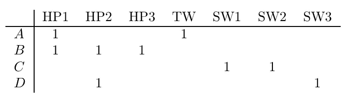

在评级被舍入的情况下，对应于观众 A 和 C 的集合的交集是空集。这将 Jaccard 相似性降低到其最小值零，并将 Jaccard 距离拍摄到其最大值 1。此外，对应于观众 A 和 B 的集合之间的 Jaccard 距离小于 1，这使得 B 比 c 更接近。注意，当使用原始用户评级计算距离时，Jaccard 距离度量没有提供对用户行为的这种洞察。用舍入值查找余弦距离会得出相同的结论。

## 标准化评级

转换原始收视率的另一种方法是将其正常化。通过标准化，我们的意思是从每个评分中减去单个观众的平均评分。作为一个例子，让我们找到平均评分为 10/3 的观众 A 的标准化评分。因此她的标准化评分是，

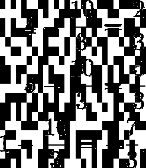

所有值都标准化的效用矩阵如下所示。请注意，这会将较高的评分转化为正值，而将较低的评分转化为负值。

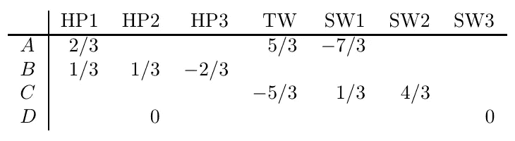

图 3:带有标准化值的效用矩阵

由于效用矩阵中的单个值发生了变化，我们可以预期余弦距离会发生变化。然而，Jaccard 距离保持不变，因为它只取决于两个用户评价的电影数量，而不取决于给出的评价。

利用归一化值，对应于观众 A、B 和 C 的向量是:

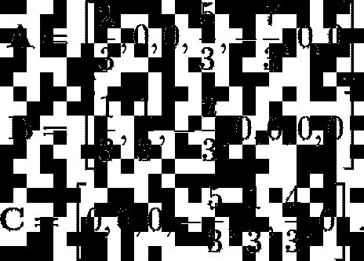

**A** 和 **B** 以及 **A** 和 **C** 之间的余弦距离为:

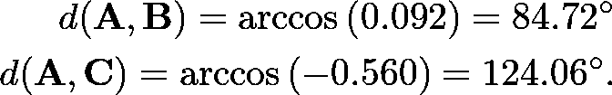

虽然标准化评级的余弦距离计算不会改变最初的结论(即 **A** 比 **C** 更接近 **B** ，但它确实放大了向量之间的距离。向量 **A** 和 **C** 在标准化评级下看起来特别遥远，尽管两者都不是很接近。

# 结论

推荐系统是互联网经济的核心。它们是让我们沉迷于社交媒体、在线购物和娱乐平台的计算机程序。推荐系统的工作是预测特定用户可能购买或消费什么。预测这一点的两个主要方法之一是查看其他人——尤其是那些与所讨论的用户有相似偏好的人——购买或消费了什么。这种方法的一个关键部分是量化用户之间的相似性。

计算 Jaccard 和余弦距离是用来量化用户之间相似性的各种方法中的两种。Jaccard distance 考虑了被比较的用户所评价的产品数量，而不是评价本身的实际价值。另一方面，余弦距离考虑了评价的实际值，但没有考虑两个用户评价的产品数量。由于计算距离的差异，Jaccard 和余弦距离度量有时会导致预测冲突。在某些情况下，我们可以通过根据明确定义的规则对评级进行四舍五入来避免这种冲突。

也可以通过从用户给出的每个评级中减去用户给出的平均评级来转换评级。这个过程称为归一化，它不影响 Jaccard 距离，但有放大余弦距离的趋势。

# 参考

1.  *海量数据集的挖掘*。下载的书[在这里](http://mmds.org/)。