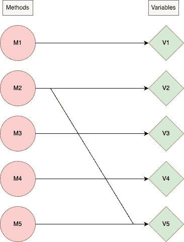
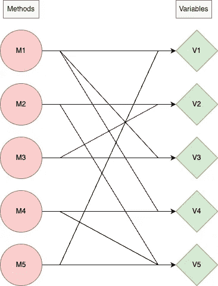

# 测量软件模块化—第 1 部分:内聚性

> 原文：<https://levelup.gitconnected.com/measuring-software-modularity-part-1-cohesion-127de06a4c0d>


由[佐佐木小次郎](https://unsplash.com/ja/@chelsea777?utm_source=medium&utm_medium=referral)在 [Unsplash](https://unsplash.com?utm_source=medium&utm_medium=referral) 上拍摄的照片

模块化是优秀软件设计的必备条件。它有助于扩展性、可读性、可维护性等等。让你的代码模块化当然不容易，但是到底什么是模块化，我们如何度量它？

# 定义

模块化描述了相关代码的逻辑分组，可以是一组类或函数。[1]

模块化衡量你的代码被分成不同的模块或功能块的程度。你的代码越模块化，就越容易改变。让你的代码模块化不是目的，而是达到目的的一种手段:你想让其他人(包括你自己)更容易理解你的代码做什么以及它是如何工作的。

## 边注

以前，我写过关于[如何成为一名优秀的软件工程师的文章，](https://softwarengineer.substack.com/p/how-to-stand-out-as-a-software-engineer)，我认为在编写代码时考虑模块化会让你从一大群工程师中脱颖而出。

# 我们如何衡量模块化？

有很多有用的度量标准来衡量模块化。在这个系列中，我将尽力帮助您理解*内聚、耦合和共生。*

这部分将重点介绍 ***衔接*** ，我们开始吧。

# 内聚力

在《软件架构基础》一书中，Mark Richards 和 Neal Ford 定义了什么是内聚模块。

> *内聚模块是指所有部分都应该打包在一起的模块，因为将它们分解成更小的部分需要通过模块之间的调用将这些部分耦合在一起以获得有用的结果。[1]*

让我们从一个简单的类示例开始

```
class C:
  def __init__(self):
    self.a = 1
    self.b = 2 def do_a(self):
    func(self.a) def do_b(self):
    func(self.b)
```

以上类是 ***不衔接*** 。*为什么？* 因为它的功能可以分成两个独立的类而不影响结果。

为了让这个类具有内聚性，我们可以把它拆分成两个不包含对某些方法过度的变量的类(变量 a 对方法 do_b 过度，变量 b 对方法 do_a 过度)。

```
class A:
  def __init__(self):
    self.a = 1 def do_a(self):
    func(self.a) class B:
  def __init(self):
    self.b = 2 def do_b(self):
    func(self.b)
```

在这个例子的基础上，我们可以用图表来说明这一点。
考虑一个类，它的所有方法和变量都将是顶点。如果 M1 使用 V1，在方法顶点 M1 和变量顶点 V1 之间有一条边。

例如，考虑这个场景，我们在一个类中有 5 个方法和 5 个变量。

*   方法 1 仅使用变量 1
*   方法 2 同时使用变量 2 和变量 5
*   方法 3 仅使用变量 3
*   方法 4 仅使用变量 4
*   方法 5 只使用变量 5

从上面的场景中，我们可以生成下图



我们可以认为这个类*是非内聚的，因为大多数方法可以分成不同的类，就像我们在第一个代码示例中所做的那样。(例如，方法 1 不使用变量 2-5，因此将它们放在同一个类中没有好处)*

*相比之下， ***一个内聚类*** 就会有一个图以远**为例***

******

***更多的边意味着每种方法使用更多的变量，分割更困难/效率更低/不可能。***

# ***我们如何衡量凝聚力？***

***现在我们对内聚的含义有了一个粗略的概念，让我们来形式化我们如何度量它。***

> ***给定 n 个*方法* M1，M2，…，Mn *包含在一个类* C1 *中，该类还包含一组实例变量* { Ai } *。那么对于任何方法* Mi *我们可以定义*的划分集***
> 
> ***P = {(Ai，Aj) | Ai ∩ Aj = φ}
> Q = {(Ai，Aj) | Ai ∩ Aj ≠ φ}***
> 
> ****那么 LCOM = |*P*|—|*Q*|，if |*P*|>|*Q*|****
> 
> ****=0 否则****
> 
> ****LCOM 是相似度为零的方法对的计数。[2]****

***让我们用两个图表例子来分解这个定义。***

******

***A1 = { V1 }
A2 = { V2，V5 }
A3 = { V3 }
A4 = { V4 }
A5 = { V5 }***

***A5 *∩* A2 = { V2}
和所有其他交集产生空集，意思是:
|P| = 9，|Q| = 1
LCOM = 8***

****

**A1 = { V1，V3，V4 }
A2 = { V2，V5 }
A3 = { V2，V3 }
A4 = { V4，V5 }
A5 = { V1，V5 }**

**|P| = 3，|Q| = 7
LCOM = 0**

> **LCOM = 0 表示一个内聚类。**
> 
> **LCOM > 0 表示该类需要或可以分成两个或更多个类，因为它的变量属于不相交的集合。[2]**

**从上面的例子我们可以理解，一个类/模块的内聚性是一个梯度，不一定是一个是/否的问题。**

**大多数情况下，为了有效地使用这个度量，你要为内聚性设置一个阈值——例如，如果 LCOM > 20，我们认为这个类是非内聚性的，否则这个类是内聚性的。**

# **结束语**

**最后，我想说，我希望你有一个啊哈的时刻，并且更好地理解了凝聚力意味着什么以及它是如何衡量的。**

**在接下来的几周里，我将发布本系列的下一部分，其中将涵盖更多的软件模块化度量，如耦合和共生。**

**我最近开始在 [substack](https://softwarengineer.substack.com/) 上写博客，如果你订阅了软件上的[，给工程师](https://softwarengineer.substack.com/)(完全免费)，我会很感激你的支持。**

**[](https://eliran9692.medium.com/membership) [## 通过我的推荐链接加入 Medium-Eliran turge man

### 阅读 Eliran Turgeman(以及媒体上成千上万的其他作家)的每一个故事。您的会员费直接支持…

eliran9692.medium.com](https://eliran9692.medium.com/membership)** 

# **参考**

**[1] [软件架构基础](https://www.oreilly.com/library/view/fundamentals-of-software/9781492043447/)，作者 Mark Richards，Neal Ford**

**[2]齐丹博，s，r，凯梅勒，c，k，面向对象设计的度量套件， *IEEE Trans .论软件工程。【1994 年 6 月第 20 卷第 6 期。***