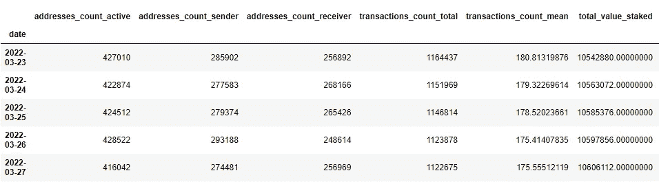

# 衡量链上指标对以太坊价格的影响

> 原文：<https://levelup.gitconnected.com/measuring-the-influence-of-on-chain-metrics-on-ethereum-price-81b7633be832>

估计第二大加密硬币价格因素的机器学习方法。


以太坊价格预测

经济学有一个“经济人”的抽象概念——这个数字表示金融世界中完全理性的参与者。这些有效的和不存在的生物完全依靠客观因素做出决定。虽然我们，作为智人，并不完全有能力长期保持这种奉献精神，但没有人能拒绝我们尝试的机会。

我们必须处理的障碍是，通常很难估计我们想要购买或提供的产品或服务的价格。分析开发成本通常是不够的，即使它包括收入预期或税收等复杂的指标，因为总是存在人性的足迹—投机。加密货币的价格估值到处都有这个足迹。

尽管如此，像比特币或以太坊这样的流行硬币有很多关于它们的客观数据暴露在外部世界。网络活动、交易数量、确认经济运作的难度——这些都是可用的，并可用于形成对指定工具价值的公正意见。至少理论上是这样。

在实践中，我会尝试将简单的回归模型应用于可用的链上指标，然后我们会讨论这种做法的相对成功以及可以做些什么来改善它。

# 资料检索

对于这一部分，我大量使用了[cryptoquant.com](https://cryptoquant.com/sign-up?my-friend=vmk8zk9k)API，最近我开始使用专业订阅。我相信，在接下来的几天里，你会看到我的一些帖子，以及这个平台提供的数据。

链上度量通常用于描述网络的技术状态。以下是我在财务分析中使用的一些方法:

*   代币供应
*   活动地址
*   交易编号
*   ETH 2.0 标桩

生成的数据帧如下所示:



为实验检索的数据

我还将使用 yfinance 包来获取指定时期的定价数据:

```
import yfinanceeth = yfinance.download(f'ETH-USD', df.index.min(), df.index.max())df = df.join(eth)
```

# **与 FB 先知一起造型**

脸书预言家收录了时间序列建模所需的基本工具。这对于快速构建原型非常方便，并且可以很好地将熊猫作为数据源。在引擎盖下，该框架试图拟合一个函数来表示季节性、趋势和假日效应以及误差项。您很快就会看到，这些功能组件也可以作为预测的副产品使用。

FB Prophet 在 python 中也很容易使用:

# 结果

…开始时并不看好


预测价格(橙色)远高于实际价格(蓝色)

这个模型很难帮助你获得 ETH，但是在你匆忙下结论之前，让我们再深入一点。首先，让我们来看看我上面提到的组件之一:


趋势

该模型估计趋势为上升，这是合理地基于以前的表现。最后，以太坊实际上每年以 3 位数的百分比增长。然而，在 2022 年初的现实中，技术进步受到了市场环境的影响。2021 年底比特币的下跌、全球货币政策的限制以及视频交易后的问题都对价格产生了影响。

# 市场指标的整合

为了展示经济背景，我将介绍与令牌组学和交换相关数据相关的另一部分指标:

*   **瑞士法郎和美元的外汇储备** —代表加密交易所保留的钱包上瑞士法郎的数量。有科学研究证明，这些数字的上升通常是即将到来的抛售的好信号，下降意味着每个人都在 HODL。
*   **估计杠杆率**——显示衍生品交易中的信用负担水平。这是市场即将出现波动的一个很好的指标。
*   **未平仓合约** —显示衍生品的未平仓合约数量。与价格有很高的相关性，但很难在实际预测中使用它，因为它通常由交易所发布，有一定的时滞。不过，对教育目的来说更有用。

# 更新的结果


使用市场指标，预测更接近预期值

更加接近完美！平均绝对误差现在在 200 美元左右，这使得它成为当前价格结构的一个不错的估计值。那么，什么发生了变化？

令人惊讶的是，开放兴趣并没有在这里扮演“先知”的角色。没有此功能，也可以获得相同的 8%平均绝对百分比误差。在尝试了一些要使用的列的组合后，我发现**“Reserve”在与链上指标一致时具有足够好的预测能力**，但它本身是不够的。

# 假设和总结

虽然似乎有可能只使用客观指标来拟合 ETH 的价格函数，但它仍然不完美。8%的平均绝对百分比误差意味着你会错过数百美元。对于为什么这个模型不能更接近实际价格时间序列，可能有几种解释:

1.  **基础。**模型不够复杂。例如，它不会像深度学习模型那样计算系列内的模式。
2.  **不完整。**还有其他可用的指标。例如，鲸鱼比率经常被用来描述一小部分持有者对硬币价格的影响。动量因子也可以通过使用各种平均价格(均线、均线等)来体现。)
3.  **猜测。**在本文的开头，我提到过市场上的每一种产品或服务都有一些源自人们购买意愿的未知因素。人们可能高估/低估成本，做出不完美的经济决策。

我愿意相信这三个假设都涉及到了。这使得 crypto 中的价格预测非常有趣，因为可以用小于特性的回归来解决的任务不是您应该写的:)