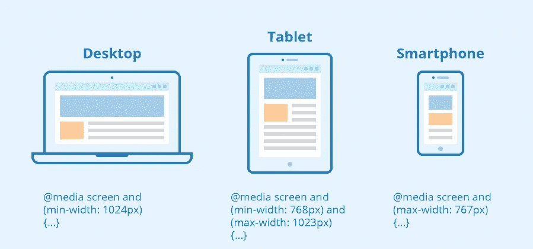

# JS/TS 中的媒体查询完成正确

> 原文：<https://levelup.gitconnected.com/media-queries-in-js-ts-done-right-3bd598dca9df>



最近，我遇到了一个情况，涉及到监听一个应用程序的屏幕宽度。有很多方法可以实现这一点，但我想要一些简单的、可重用的、不会对性能产生太大影响的通用方法。

我认为在`window`上监听`resize`事件并检查`innerWidth`太慢了，尤其是因为所有与布局相关的事情都迫使[回流](https://gist.github.com/paulirish/5d52fb081b3570c81e3a)。

在搜索解决方案时，我很快发现了[window . match media()](https://developer.mozilla.org/en-US/docs/Web/API/Window/matchMedia)API，这似乎是最好的解决方案(所有主流浏览器都支持它)。

剩下唯一要做的就是实现一个简单的可重用的通用解决方案，在底层使用它。这里有一个帮助我起步的 [MDN 链接](https://developer.mozilla.org/en-US/docs/Web/CSS/Media_Queries/Testing_media_queries)。

我想要的是能够`subscribe`响应来自应用程序不同组件的不同媒体查询，而不需要创建新的监听器。

我想到的解决方案是创建一个`static class`(嗯，一个带有`static`方法和变量的`class`，它将保存一个查询列表和这些查询的订阅列表(以及一个侦听器引用列表，这样就可以很容易地清理它)。

```
export interface IQueryList {
    [key: string]: {
        query: MediaQueryList;
        subscribers: Array<(matchesQuery: boolean) => void>;
    };
}

interface IEventListener {
    [key: string]: (event: MediaQueryListEvent) => void;
}

export class MediaQueryListener {
    private static _subscribers: IQueryList = {};
    private static _eventListenersRefs: IEventListener = {};

    static subscribe() {
        //...
    }
    static unsubscribe() {
        //...
    }
}
```

这个类将公开两个公共方法:`subscribe`和`unsubscribe`。

`subscribe`方法接受一个回调函数，该函数接收一个表示查询是否匹配的`boolean`参数，以及一个字符串格式的实际查询(例如:`'(max-width: 768px)'`)。
然后，它检查是否已经从某个其他地方对此查询进行了订阅:

*   如果是，它只将回调添加到该查询的订阅者列表中。
*   如果不是，它将查询添加到列表中，唯一的订阅者是传递的回调，然后它开始监听新创建的查询的更改。

无论采用哪种方式，它都会使用当前的查询匹配立即调用回调。

```
static subscribe = (cb: (matchesQuery: boolean) => void, query: string) => {
    if (!this._subscribers[query]) {
        this._subscribers[query] = {
            query: window.matchMedia(query),
            subscribers: [ cb ],
        };

        // keep the refs so we can remove the listeners in unsubscribe
        this._eventListenersRefs[query] = event => {
            this._subscribers[query]
                .subscribers
                .forEach(subscriber => subscriber(event.matches));
        };

        // create the listener only on first subscription for the query
        this._subscribers[query]
            .query
            .addEventListener('change', this._eventListenersRefs[query]);
    } else {
        this._subscribers[query].subscribers.push(cb);
    }

    // Call the callback with the current value of the media query
    cb(window.matchMedia(query).matches);
};
```

`unsubscribe`方法接收相同的回调函数和字符串格式的查询，并从该查询的订阅者中移除回调。它还检查是否没有剩余的订阅者，并删除媒体查询侦听器，以便没有剩余的挂起侦听器。

```
static unsubscribe = (cb: (matchesQuery: boolean) => void, query: string) => {
    if (!this._subscribers[query]) {
        return;
    }

    this._subscribers[query].subscribers = this._subscribers[query].subscribers.filter(subscriber => subscriber !== cb);

    if (this._subscribers[query].subscribers.length === 0) {
        this._subscribers[query].query.removeEventListener('change', this._eventListenersRefs[query]);

        delete this._subscribers[query];
        delete this._eventListenersRefs[query];
    }
};
```

正如我所说的，它是一个在`matchMedia` API 之上的基本包装器。可能有多个包以这样或那样的方式实现了同样的事情，在创建我的解决方案之前，我没有专门研究这些包，因为我喜欢编写一个解决方案的想法。

感谢您阅读文章！

# 分级编码

感谢您成为我们社区的一员！在你离开之前:

*   👏为故事鼓掌，跟着作者走👉
*   📰更多内容请查看[升级编码刊物](https://levelup.gitconnected.com/?utm_source=pub&utm_medium=post)
*   🔔关注我们:[推特](https://twitter.com/gitconnected) | [LinkedIn](https://www.linkedin.com/company/gitconnected) | [时事通讯](https://newsletter.levelup.dev)

🚀👉 [**加入升级人才集体，找到一份神奇的工作**](https://jobs.levelup.dev/talent/welcome?referral=true)