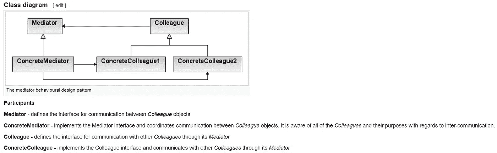

# 中介设计模式。NET C#

> 原文：<https://levelup.gitconnected.com/mediator-design-pattern-in-net-c-e1bfcc96789d>

## 设计模式

## 中了解中介器设计模式。NET C#与代码示例。

照片由 [Jonathan](https://unsplash.com/@isodme?utm_source=unsplash&utm_medium=referral&utm_content=creditCopyText) 在 [Unsplash](https://unsplash.com/?utm_source=unsplash&utm_medium=referral&utm_content=creditCopyText) 上拍摄，由 [Ahmed Tarek](https://medium.com/@eng_ahmed.tarek) 调整

# 中介设计模式定义

**中介设计模式**是行为设计模式之一。

根据[维基百科](https://en.wikipedia.org/wiki/Mediator_pattern)，定义如下:

> 中介模式的本质是“定义一个封装了一组对象如何交互的对象”。它通过防止对象显式地相互引用来促进松散耦合，并允许它们的交互独立变化。客户端类可以使用中介向其他客户端发送消息，并可以通过中介类上的事件从其他客户端接收消息。

因此，简单地说，**中介设计模式**用于管理一组对象(相似或不相似)之间的交互，保持对象相互隔离。

为了理解这一点，我用一个简单的例子来解释一下。

假设你正在实现一个聊天室。因此，你有无限数量的用户可以加入聊天室，一旦任何用户发送消息，该消息应该被聊天室的所有其他用户接收。

因此，实现这个，你将拥有一个带有`SendMessage`方法的`User`类。

但是，您仍然需要访问其他用户，以便您可以将消息发送给他们。此外，每当用户离开聊天室时，您还需要将该用户从所有其他用户中删除，这样他们就不会给他发送消息。

您有不止一种方法来实现这一点:

1.  在每个用户内部定义一个用户列表，并在用户进入或离开聊天室时更新这些列表。
2.  使用另一个类或模块作为中间人来处理用户列表以及不同用户之间发送和接收消息的方式。

第一种选择可行，但是不好，因为:

1.  `User`类会做太多实际上与其主要工作无关的事情。
2.  每个`User`现在都知道其他用户，这是不符合逻辑的。
3.  如果我们想要应用一些商业规则来决定允许哪个用户与哪个用户通信，那将会非常困难。
4.  维护所有用户列表的处理量太大。

现在，如果我们探索第二种选择:

1.  类完成了它的工作，也是唯一的工作。
2.  维护用户列表的所有逻辑都集中在一个类或模块中。
3.  这使我们能够在需要时轻松应用业务规则和聚合。

如你所见，选择第二种会更好。现在，让我告诉你，你将在第二个选项中实现的是**中介设计模式**。

 [## 🔥订阅艾哈迈德的时事通讯🔥

### 订阅艾哈迈德的时事通讯📰直接获得最佳实践、教程、提示、技巧和许多其他很酷的东西…

medium.com](https://medium.com/subscribe/@eng_ahmed.tarek) 

# 中介设计模式类图

关于**中介设计模式**，我注意到它可以被实现成多种风格。

有时你可以使用**事件**、**委托**或**直接方法**。有时，您可以在许多地方使用**中介**并将其作为依赖项注入，或者您可以仅在集中式管理器中使用它。

因此，这使我将**中介设计模式**视为一个概念而不是一个模式。

然而，为了帮助你想象**中介设计模式**可能是怎样的，这里有一个来自[维基百科](https://en.wikipedia.org/wiki/Mediator_pattern)的类图。

[中介行为设计模式](https://en.wikipedia.org/wiki/Mediator_pattern)，由 [Ahmed Tarek](https://medium.com/@eng_ahmed.tarek) 调整

由 [Arnold Francisca](https://unsplash.com/@clark_fransa?utm_source=unsplash&utm_medium=referral&utm_content=creditCopyText) 在 [Unsplash](https://unsplash.com/?utm_source=unsplash&utm_medium=referral&utm_content=creditCopyText) 上拍摄，由 [Ahmed Tarek](https://medium.com/@eng_ahmed.tarek) 调整

# 代码示例

现在是时候深入一些代码来理解**中介设计模式**了。我们现在要做的是实现**聊天室**的例子。

先说`User`类。

我们在这里可以注意到:

1.  我们定义了`MessageBroadcastedEventHandler`委托作为每个用户发送消息时触发的事件。
2.  那么很明显，我们在`User`类中定义了`event MessageBroadcastedEventHandler MessageBroadcasted`。
3.  我们还将`protected void OnMessageBroadcasted(string message)`定义为处理触发事件的最佳实践。
4.  每个`User`都有一个`Name`属性。
5.  另外，当某个`User`发送消息时，每个`User`都有主模块调用的`SendMessage`方法。在这里，我们只是通过`OnMessageBroadcasted`触发事件。
6.  `ReceiveMessage`方法用于在广播消息时通知`User`。在这里，我们只是记录一些测试信息。

现在，让我们转到`ChatRoom`类，它是我们的**中介**类。

我们在这里可以注意到:

1.  我们定义了一个**用户**的私有列表。
2.  我们定义了一个在向`ChatRoom`添加新的`User`时要调用的`AddUser`方法。我们在这里做的是将用户添加到私有列表中，并订阅它的`MessageBroadcasted`事件。
3.  我们定义了从`ChatRoom`中移除`User`时要调用的`RemoveUser`方法。我们在这里做的是将用户从私有列表中移除，并取消订阅其`MessageBroadcasted`事件。
4.  我们定义了`OnMessageBroadcasted`方法来处理每个`User`的`MessageBroadcasted`事件。我们在这里所做的是循环所有的**用户**，除了那个广播消息的用户，并触发他们的`ReceiveMessage`方法。

移动到主模块。

我们在这里可以注意到:

1.  我们定义了 3 个用户。
2.  我们创建了**聊天室**并逐一添加了 3 个用户。
3.  然后，**艾哈迈德**开始说“大家好。”。我们在控制台上看到这个:
    “Tarek”收到一条来自“Ahmed”的消息:“大家好。”“哈桑”收到了“艾哈迈德”发来的信息:“大家好。”
4.  然后塔瑞克回复说:“嗨，艾哈迈德。”。我们在控制台上看到这个:
    “艾哈迈德”收到了来自“塔里克”的消息:“你好，艾哈迈德。”“哈桑”收到了“塔雷克”发来的信息:“你好，艾哈迈德。”
5.  然后 **Tarek** 从聊天 rom 中删除。
6.  然后 Tarek 发了一条信息说“有人能听到我吗？”。然而，我们在控制台中没有得到任何东西，因为 Tarek 已经从聊天室中删除了。
7.  然后**哈桑**发来一条信息说“我认为塔里克断线了。”。我们在控制台上看到了这个:
    “艾哈迈德”收到了“哈桑”发来的信息:“我想塔里克断线了。”

所以，现在一切都正常工作，重要的是我们的对象(在我们的例子中；用户)是松散耦合的。

此外，如果我们想要应用一些业务规则，我们可以很容易地做到，因为我们将关系和交互集中到一个地方。这也使得应用聚合变得非常容易。

照片由[萨米·威廉姆斯](https://unsplash.com/@sammywilliams?utm_source=unsplash&utm_medium=referral&utm_content=creditCopyText)在 [Unsplash](https://unsplash.com/?utm_source=unsplash&utm_medium=referral&utm_content=creditCopyText) 上拍摄，由[艾哈迈德·塔里克](https://medium.com/@eng_ahmed.tarek)调整

# 误解

有一种误解认为**中介设计模式**管理相似对象或相同类型对象之间的关系和交互，然而，这不是真的。

**中介设计模式**可以对不同种类的对象做同样的工作。一个著名的例子是**请求处理器**模式实现。

简而言之，如果您有一些输入或请求将通过一系列不同的处理程序(可能是预定义的或在运行时加载的)传递，那么使用**中介设计模式**会非常好。

使用**中介设计模式**的主要好处是，你可以实现一个松散耦合的设计，这样请求和处理程序就不会互相察觉。

让我们看一个例子。

# 请求处理程序示例

假设我们有一个员工管理系统，每当雇佣新员工时，我们都有不同的操作要执行。

在这种情况下，您不希望像业务层中的`CreateEmployee`方法一样在一个地方运行或触发这些操作。这是可行的，但是，您最终会得到一个臃肿的业务层。同样，每次你想添加一个新的动作，你都要修改`CreateEmployee`方法。这样不好，因为你可能会无意中打碎东西。

因此，在这里使用**请求处理程序**模式会很好。

N **ote** :为了简单起见，这里将省略一些最佳实践，以便将注意力集中在**请求处理程序**模式的主要思想上。

我们在这里可以注意到:

1.  我们定义了一个简单的`Employee`类。
2.  我们定义了一个简单的`IAddEmployeeRequest`接口。它只有一个要添加的`Employee`属性。
3.  我们定义了一个简单的`AddEmployeeRequest`类来实现`IAddEmployeeRequest`接口。
4.  我们定义了`IAddEmployeeRequestHandler`接口来表示`IAddEmployeeRequest`请求的任何处理程序。
5.  我们有两个简单的`IAddEmployeeRequestHandler`接口实现；`AddEmployeeRequestHandler1`和`AddEmployeeRequestHandler2`。

我们在这里可以注意到:

1.  我们定义了`AddEmployeeMediator`类。
2.  它维护一个`IAddEmployeeRequestHandler`处理程序列表。
3.  当一个请求通过`Handle`方法进入时，它在所有注册的处理程序上循环并触发它们的`Handle`方法。
4.  `RegisterHandler`和`UnregisterHandler`是注册和注销处理程序的两种方法。

运行这个程序，我们会得到以下结果:

> AddEmployeeRequestHandler1 处理 Ahmed
> addemployeerequesthandler 2 处理 Ahmed
> addemployeerequesthandler 1 处理 Tarek
> addemployeerequesthandler 2 处理 Tarek

这太棒了。现在，我们让不同的处理程序处理我们的请求，而没有紧密耦合的请求和处理程序。

当然，示例代码并不是处于最佳状态，它可以通过提供更多的抽象和进行一些重构来增强，但这是很容易做到的，对吗？

在我们离开这一步之前，让我告诉你实现这一概念的著名图书馆之一是[**mediator**](https://github.com/jbogard/MediatR)。

由 [Ben White](https://unsplash.com/@benwhitephotography?utm_source=unsplash&utm_medium=referral&utm_content=creditCopyText) 在 [Unsplash](https://unsplash.com/?utm_source=unsplash&utm_medium=referral&utm_content=creditCopyText) 上拍摄，由 [Ahmed Tarek](https://medium.com/@eng_ahmed.tarek) 调整

# 什么是联发科？

[**联发科**](https://github.com/jbogard/MediatR) ，按照团队的定义，我引用一下，就是:

> 简单，没有野心的中介实现。网
> 
> 无依赖性的进程内消息传递。
> 
> 支持请求/响应、命令、查询、通知和事件，同步和异步，通过 C#通用变量进行智能调度。

如果你愿意，你可以在[这个维基](https://github.com/jbogard/MediatR/wiki)页面上查看一些使用[mediator](https://github.com/jbogard/MediatR)的例子。

如今它已经和**一起被大量使用。NetCore** ，已知在实现**命令和查询责任分离(CQRS)** 时使用。

我真的建议你试一试。

由 [Pixabay](https://pixabay.com) 上的 [ColiN00B](https://pixabay.com/users/colin00b-346653/) 拍摄，由 [Ahmed Tarek](https://medium.com/@eng_ahmed.tarek) 调整

# 最后的想法

**中介设计模式**是有史以来最伟大的模式之一。在某个时候，我发现我甚至在知道它之前就已经在使用它了。

有时使用这种模式太明显了，而其他时候就有点棘手了。

为了了解更多关于**中介设计模式**的信息，我建议不要仅仅满足于从本文中学到的东西，继续做一些研究和尝试。这会帮助你更好地理解它。

# 希望这些内容对你有用。如果您想支持:

如果你还不是**中介**会员，你可以使用 [**我的推荐链接**](https://medium.com/@eng_ahmed.tarek/membership) ，这样我可以从**中介**那里得到你的一部分费用，你不需要支付任何额外费用。订阅 [**我的简讯**](https://medium.com/subscribe/@eng_ahmed.tarek) 将最佳实践、教程、提示、技巧和许多其他很酷的东西直接发送到您的收件箱。

# 其他资源

这些是你可能会发现有用的其他资源。

 [## 中的策略设计模式。NET C#

### 了解中的策略设计模式。NET C#

levelup.gitconnected.com](/strategy-design-pattern-in-net-c-b9dbd863c31e)  [## 当实现影响抽象时

### 关于实现的知识会影响抽象设计吗？

levelup.gitconnected.com](/when-implementations-affect-abstractions-1bb2adc808d1)  [## 如何在单独的请求/命令中取消正在运行的进程。NET C#

### 了解如何在单独的请求中取消已经运行的进程。NET C#

levelup.gitconnected.com](/how-to-cancel-a-running-process-in-a-separate-request-command-in-net-c-2ca8fb733618) 