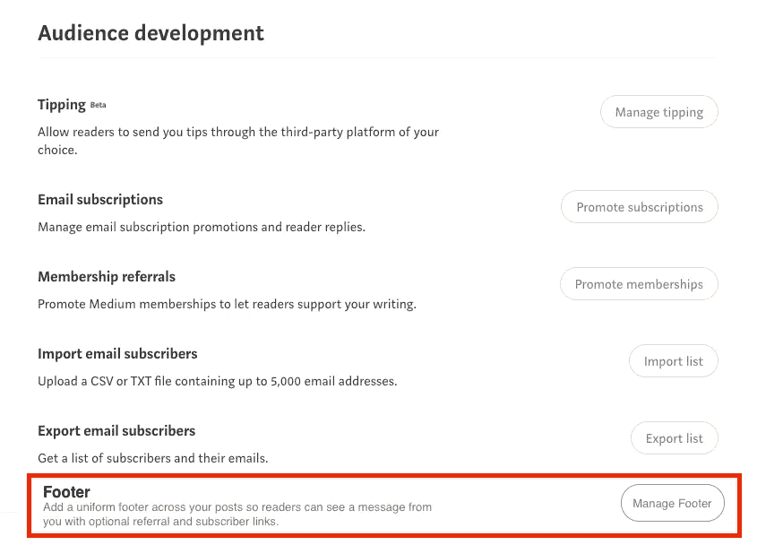
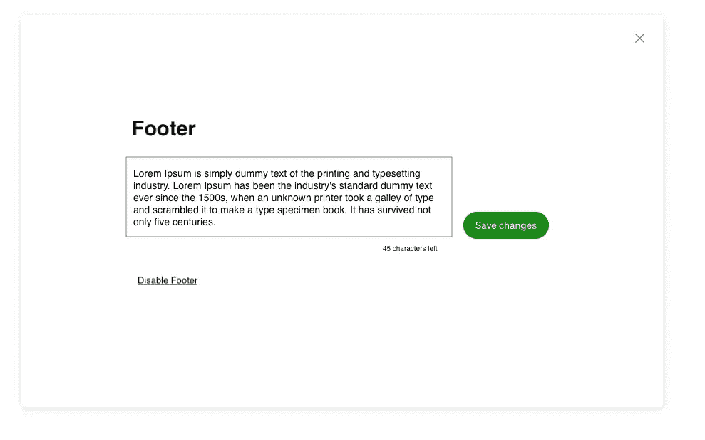
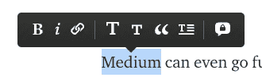
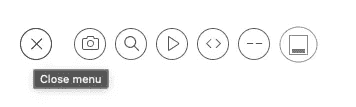

# 媒体应该有一个页脚功能，使作家的生活更容易

> 原文：<https://levelup.gitconnected.com/medium-should-have-a-footer-feature-to-make-writers-lives-easier-1fe67c4d9d6d>

## 以下是它的外观和实现方式


丹尼尔·托马斯在 [Unsplash](https://unsplash.com/s/photos/blogging?utm_source=unsplash&utm_medium=referral&utm_content=creditCopyText) 上拍摄的照片

我已经在 Medium 上写了五年了，这是一段愉快而有建设性的经历。作为一个年轻时多产的作家，我注意到当我大学毕业，从电视转向编码时，我写得更少了。

Medium 为我提供了一个途径，既可以进一步提高我的编码专业知识和在线表现，也可以为我的第一个爱好——写作——腾出空间。我喜欢这个平台提供的很多东西——尤其是无广告模式，这是点击诱饵和定向广告的 *cookies-* cutter 世界中的一股新鲜空气。

虽然我注意到最近我的收件箱里有更多来自 Medium 的内容。我将把它留到另一篇文章中。

[随着首席执行官](https://ev.medium.com/new-decade-new-ideas-faee8e712589)的更换，有很多人在谈论新首席执行官[托尼·斯塔布尔宾](https://medium.com/u/adeddd83f452?source=post_page-----1fe67c4d9d6d--------------------------------)，谈论可以添加的新功能，或者可以恢复的旧功能。这些功能旨在鼓励更多的优质内容，并进一步惠及作家。

*这里有* [*13 个特征*](https://medium.com/feedium/13-ideas-for-the-new-ceo-of-medium-b58ae69a5d0e) *为例，分别由作家* [*贾里德·布洛克*](https://medium.com/u/ceef4c8e43d4?source=post_page-----1fe67c4d9d6d--------------------------------) *提出。*

# 我的建议是

我非常喜欢 Brock 提到的 13 个特性，以及我在 Medium 上看到的其他特性，但是我还没有看到有人写过的一个特性是为每篇文章实现一个可选的*页脚*。请允许我详细说明。


在我所有帖子的底部，我有下面的文字…

> [***升级您的免费 Medium 会员资格***](https://matt-croak.medium.com/membership) *并接收各种出版物上数千名作家的无限量、无广告的故事。这是一个附属链接，你的会员资格的一部分帮助我为我创造的内容获得奖励。*
> 
> *您还可以通过电子邮件* [***进行订阅***](https://matt-croak.medium.com/subscribe) *每当我发布新内容时，您都会收到通知！*

不要太疯狂。

只是给那些想和我进一步联系的人的一个提示，也帮助我从我写的内容中受益。唯一的问题是，在我写这篇文章的时候，我必须将这段文字复制/粘贴到我写的每篇文章中。作为一个在过去五年里写了近 120 篇文章的人，你可能会觉得这有点麻烦。

通常，我只是复制/粘贴一个旧帖子的页脚，并将其添加到我当前正在处理的帖子的末尾。问题是如果我想在过去的帖子中*改变*或者*添加*；就像去年 8 月 11 日——顺便说一下，是我的生日——增加了中型合作伙伴推荐计划[😄。](https://blog.medium.com/evolving-the-partner-program-2613708f9f3c)


作为一个在添加这个功能之前*已经写了大约四年的无数帖子的人，我有 ***很多*** 的帖子，我想把这个推荐链接放在我的电子邮件订阅链接的底部。所以我基本上不得不复制页脚，转到一个帖子，点击编辑，转到底部，添加页脚，然后点击保存，对于 ***几十个*** 的帖子。*

当我想改变页脚信息的一些措辞时，这相当麻烦，我必须通过 ***所有那些帖子*** 来改变它，再次**。现在，假设我想添加一个新的链接或者只是改变我的页脚的一些措辞。我将不得不再次做所有的…**。基本上，我将不得不通过 100 多个职位，每一个点击编辑，粘贴更新页脚，点击保存。****

********

****是啊，不理想。****

****这就是为什么我想出了一个想法，我认为这个想法对于作者来说非常好，对于中型开发人员来说实现起来相对简单。它将由一个页脚选项组成，作者可以自定义(在合理的范围内)并添加到他们所有的帖子中。****

****当他们更改它时，它会在所有帖子中更新。****

# ****它会是什么样子****

****应该可以在*受众发展*下的小费等工具附近找到。它看起来像是用户可以管理的另一个选项。见下文。****

********

****当用户点击*管理页脚*时，它会打开一个模式或页面(类似于*管理提示*)，用户可以在其中添加允许纯文本和链接的正文(有一些字符限制)。见下文。****

********

****然后，在每篇文章的底部，它可以显示为一个横幅，就像订阅和小费选项一样，或者甚至只是一个带或不带链接的文本块，就像我有我的链接一样。****

****没什么特别的。****

****也许将来他们可以添加对图片的支持，或者甚至允许作者加入小费和订阅横幅，页脚作为一个部分(而不是像每个单独的横幅)。目前，我对一个文本块就很满意了——从存储和数据处理的角度来看，这种数据类型应该更易于管理。****

# ****如何实施****

****鉴于他们已经实现了小费功能(测试版)，以及电子邮件订阅选项，从编程的角度来看，这是非常相似的。在新的表单提交中，请求负载可以作为空字符串/null(当禁用 footer 时)或使用 JavaScript 捕获的字符串(可能转换为 HTML)发送。****

****无论他们用什么系统来确定一篇文章的哪一部分是明文还是链接，都可以在这里实现。或者，可以通过正则表达式将链接与明文区分开来，就像在 markdown 和其他网站(如 Reddit 和 Stack Overflow)上一样。****

```
**Here is my body text with [a link](www.theurl.com) in the middle.**
```

********

****链接喜欢页脚链接****

****Medium 甚至可以比 regex 选项更进一步，允许帖子中允许的相同功能——你突出显示一个单词，然后出现一个上下文菜单，允许你添加链接、粗体文本等。上下文菜单方式显然更加用户友好(你不需要知道 markdown/reddit 语法)。****

********

****文本的当前上下文菜单。我想象页脚只允许链接选项——也许还有粗体和斜体选项。它不需要支持上述所有选项。****

****然而，对于测试版，可以实现 regex 选项，以使中型开发人员的工作更容易(只需要包含一个 regex 检查，通过括号隔离链接)。*然后*在*以后的版本*中引入上下文菜单 UI。****

****同样，我现在对 regex 选项非常满意。****

****无论使用什么媒介来允许明文和链接，一旦页脚完成，它就可以存储在用户对象中——或者存储在他们用来管理受众开发的任何对象或类中。他们甚至可以将它添加到他们最近实现的小费功能中。****

****在发布帖子时，他们可以允许以两种方式之一附加帖子。他们可以把它放在掌声、评论等之前。在一个帖子的底部自动为每个帖子(或他们选择的任何地方)。****

****或者他们可以允许用户在任何他们想要的地方添加它(可能只添加一次)。这第二种方式可能是有益的，因为我个人喜欢在我的参考列表之前添加页脚——而不是直接在我的帖子的结尾。****

****第一种方式是自动的。很简单。第二个，可能看起来像这样。****

********

****最右边的页脚操作按钮****

****当他们点击加号按钮时，它会像往常一样打开菜单，但现在有一个添加页脚的选项(在[找到 inspo online](https://icons8.com/icons/set/footer) 后制作了上面的图标)。这样，作者可以在任何他们想插入的地方插入它——比如在引用像这篇文章这样的精彩文章之前😉。****

****如果他们想把它插在顶部或中间或任何地方，那是他们的事。第一种方式似乎更容易实现，但是它提供了较少的灵活性——这本质上并不是坏事。无论哪种方式，能够在一个地方编辑一个页脚并让它反映在许多地方都会提高生产率，并允许更多的注意力(和时间)用于写作。我知道我个人会从这样的功能中受益。****

****你会吗？****

****在 Medium 平台上的新迭代中，你还希望看到哪些特性？请在评论中告诉我！****

****[***升级您的免费 Medium 会员资格***](https://matt-croak.medium.com/membership) *，就能收到各种出版物上数千名作家的无限量、无广告的故事。这是一个附属链接，你的会员资格的一部分帮助我为我创造的内容获得奖励。*****

*****您也可以通过电子邮件* [***订阅，每当我发布新内容时，您都会收到通知！***](https://matt-croak.medium.com/subscribe)****

# ****参考****

 ****[## 新的十年，新的想法

### 下个月将是 Medium 推出十周年。随着我们为下一个十年做好准备，我决定…

ev.medium.com](https://ev.medium.com/new-decade-new-ideas-faee8e712589)**** ****[](https://medium.com/feedium/13-ideas-for-the-new-ceo-of-medium-b58ae69a5d0e) [## 媒体新 CEO 的 13 个想法

### 你可以在接下来的一年里让公司翻 10 倍，让作家们永远赞美你

medium.com](https://medium.com/feedium/13-ideas-for-the-new-ceo-of-medium-b58ae69a5d0e) [](https://blog.medium.com/evolving-the-partner-program-2613708f9f3c) [## 发展合作伙伴计划

### 扩大你的社区，赚更多的钱。

blog.medium.com](https://blog.medium.com/evolving-the-partner-program-2613708f9f3c) [](https://icons8.com/icons/set/footer) [## 页脚图标-免费下载 PNG 和 SVG 格式

### 各种用户界面设计风格的免费页脚图标。下载静态和动画页脚矢量图标…

icons8.com](https://icons8.com/icons/set/footer)****