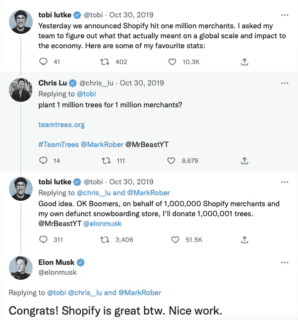

# 一名程序员将 Ruby 代码变成了价值 480 亿美元的产品，受到了埃隆·马斯克的赞赏

> 原文：<https://levelup.gitconnected.com/meet-a-programmer-who-built-a-company-worth-48-000-000-000-admired-by-elon-musk-3d1e35f0ce4>

## 没有人能想象到如此巨大的成功

Tobias Lutke 的照片来自 [theglobeandmail](https://www.theglobeandmail.com)

Tobias Lutke 是 Shopify 的首席执行官和联合创始人之一。Shopify 公司现在的市值为 480 亿美元。

鸢被认为是世界上最优秀的企业家之一。

但是，当鸢开始他的第一个网上业务销售滑雪板时，他从来没有想到它会导致一个数百万美元的软件公司。

鸢当他开始 Shopify 的时候，他只是想建立一个 20 人的公司。

如今，该公司已经上市，拥有超过 10，000 名员工。

在这里，你将了解鸢·卢特克的疯狂故事。

# 埃隆·马斯克在推特上赞赏这位 Shopify 创始人

2019 年 10 月 30 日。

埃隆·马斯克(Elon Musk)发布了一条推文，他在推文中称赞了创建 Shopify 的程序员鸢·卢特克(Michael lut ke)的工作。

事情是这样的:

作者截图

下面我们再深入挖掘，详细了解一下这位程序员的心路历程。

# 鸢童年时面临过哪些挑战？

鸢在德国长大。

当鸢还是个孩子的时候，他的父母发现鸢很聪明，但是他在学习上很努力。

鸢有学习障碍。

鸢很难在学校考试中取得好成绩。

鸢从未接受过对他所有学习障碍的全面诊断。

鸢从小患有诵读困难症，这使得鸢阅读困难。

此外，鸢对他在学校学习新事物的方式感到厌烦。

当时，德国教授课程的方式没能让鸢对不同的事物产生好奇心。

> “德国的课程是这样教的，这里有你以后可能会发现有用的所有解决方案，花很少时间谈论问题……如果我不理解我试图解决的问题，我就很难了解问题的解决方案。”

## 学习电脑编程

十年级后，鸢意识到学校不适合他，所以他离开并加入了德国学徒计划。

这个项目帮助鸢成为了一名软件工程师。

他在德国制造业巨头西门子的子公司的一个小团队里做学徒。

在西门子，鸢是团队的一员，他的同事都是叛逆的人。

鸢对该团队的成员印象深刻。

这是鸢最初加入这个团队的原因。

鸢很高兴，因为他整天写代码就能拿到钱。

他从来没有想过自己会有更好的生活。

# 狂热的滑雪板爱好者

鸢曾经是一个狂热的滑雪板爱好者。

鸢的父母有一个地方，他过去常常每天开车 5 个小时，在那里滑雪。

当他长大一点时，他的朋友们决定去美国度假，练习滑雪。

但是由于美元的低兑换率，他们决定去加拿大。

那是在 2000 年。

这是鸢第一次决定只玩滑雪板而不滑雪。

他在加拿大的时光让他爱上了单板滑雪。

## 鸢在去加拿大的旅途中遇见了他的妻子

鸢第一次去加拿大滑雪时遇到了他的妻子菲奥娜·麦克基恩。

即使在旅行结束后，两人仍保持联系。

菲奥娜在完成学士学位后搬到了德国。

当时，鸢作为一名程序员在一家初创公司工作。

菲奥娜搬到德国后找到了一份工作。

她的工作是做一些编辑、写作和学术工作。

> “我们在一起生活了 10 个月，然后她告诉我，她需要回去读硕士课程。”

## 鸢和菲奥娜一起搬到了加拿大

菲奥娜问鸢是否想和她一起去。

鸢同意移居加拿大，一起探索新的生活。

鸢能够和他的女朋友同居的一个关键原因是他的编程技能。

鸢有很好的编程技巧，所以他在德国做的事情也可以在世界上任何其他地方进行。

当他搬到加拿大时，他仍在为他之前位于德国的公司远程工作。

鸢正在努力完成他的远程工作。

这是由于缺乏良好的沟通渠道。

没有空闲时间，他不得不使用电子邮件进行交流。

作为一名程序员，通过电子邮件交流很困难。

鸢工作的初创公司试图开发一款新的浏览器。

随着时间的推移，在网络泡沫破灭后，人们放弃了那家创业公司。

最后，它关闭了。

# 鸢没有去任何大公司工作的计划

当鸢离开他之前的创业公司时。

他知道自己拥有可以在任何大公司使用的宝贵技能。

但他不想加入任何大公司。

是因为他之前的公司，西门子。

当鸢在德国为西门子工作时，他不仅学会了写专业代码，还对自己有了更多的了解。

西门子公司有一种奇怪的文化。

员工们不愿意互相信任。

西门子有严格的着装规定，这在某种程度上表明该公司不信任员工的着装方式。

对鸢来说，这绝不是一个属于他的地方。

> “有太多不好的地方，感觉就是不对……20 岁的鸢在那里不会有职业生涯。”

## 只专注于单板滑雪

那时，鸢和他的女朋友住在渥太华。

加拿大是一个非常寒冷的地方，尤其是在冬天。

渥太华的冬天很长。

一年差不多有 6 个月。

鸢不想等到夏天再做有意义的事情。

这就是他决定滑雪的原因。

随着时间的推移，鸢对滑雪变得认真起来。

他想知道关于滑雪的一切。

他开始研究市场上最好的滑雪板装备。

他开始为各种可以用来制作滑雪板的技术制作大型电子表格。

在做这些研究的时候，鸢开始对销售滑雪板感兴趣。

他想开始销售滑雪板的互联网业务。

## 创业是他唯一的选择

那时，鸢收到了当地一家不太大的公司的工作邀请。

他对这个角色很感兴趣。

为了接受当地公司的职位，他必须签署一些文件。

当他去签署文件时，他意识到他需要一个工作许可证。

当时，鸢没有工作许可证。

他被允许留在加拿大，因为他正在申请永久居留权。

> “我在这个国家并不违法，但我所在的州没有给我工作许可。我和律师谈过，他告诉我，要获得永久居留权还需要一段时间。”

鸢的律师告诉他，在他获得永久居留权之前，鸢将无法获得工作许可。

但是他的律师告诉他一件更有趣的事情。

鸢的律师告诉他，如果他想的话，他可以自己创业。

这就是为什么鸢即使收到工作邀请也无法为这家当地公司工作。

然后，鸢考虑利用他的专业技能建立一个网上商店。

他想利用这个网上商店销售滑雪板。

> “我在考虑建立一个在线商店软件，因为我认为这将存在，并将其作为销售滑雪板的一种方式……在滑雪时赚钱，并希望有一个美好的生活。”

# 鸢是如何遇到他的联合创始人的，他又是如何帮助鸢的？

鸢和他的女朋友住在她父母的房子里。

鸢在加拿大的渥太华遇到了一个叫斯科特·莱克的人。

司各特是鸢女友的世交，也在鸢即将就职的公司工作。

鸢和史考特过去常一起滑雪。

鸢告诉史考特他想开发软件来销售滑雪板的想法。

斯科特觉得这个想法很有趣，并支持它。

他们都计划一起创业。

> “我负责技术，斯科特负责业务……最终，斯科特与供应商建立了关系，并负责所有的业务设置。”

## 他们在尝试开展在线业务时遇到的问题

他们俩都没有资本签长期租约。

这就是为什么他们首先想到开始网上业务。

他们计划最终开一家实体店。

鸢预计只需要一周时间就可以开一家网上商店。

鸢试图找到开源软件。

但是大多数已有的软件都非常昂贵。

鸢和史考特买不起如此昂贵的软件。

> “2004 年，我坐在电脑前，震惊地意识到我们还没有想出如何为在线商店开发软件。”

当时，他们需要能够实现以下功能的软件:

*   把滑雪板的照片放在网站上。
*   用户可以在网站上搜索可用的滑雪板类型。软件必须有搜索功能。
*   用户在线付款，卖家必须收到付款。
*   通知卖家刚刚到达的订单。

在那个时候，没有软件可以让人们轻松地在网上出售他们的东西。

我们现在认为理所当然的最困难的事情之一是处理信用卡支付，尤其是在线支付。

# 他们是如何保持低成本并在软件方面取得进展的？

当鸢和斯科特开始销售滑雪板时，他们需要一些钱来启动它。

鸢和史考特用他们的积蓄来资助他们的事业。

> “我们都给公司投了钱……我想我们的资本大约是 20，000 加元。”

即使他们把所有的积蓄都投入到生意中。

他们压低了所有的成本。

他们试图尽可能多地储蓄。

他们没有租办公室。

他们用不同的咖啡店作为他们的办公室。

鸢免费住在他女朋友的父母家。

他用不同的咖啡店来安装他的软件。

## 他们是如何处理软件问题的？

当鸢发现没有现成的软件可以让他们在网上出售滑雪板时。

他只剩下两个选择:

1.  折中一下想法，做点别的。
2.  利用他的编程技能，创造一些东西，将有助于这项业务的增长。

鸢从一开始就知道，他是迄今为止唯一一个要从事这样一个项目的程序员。

> “我意识到，我将成为唯一从事这项工作的程序员，所以我不必选择很多人都知道的东西。我可以为这项工作选择最好的工具……有一种叫做 Ruby 的编程语言，我非常喜欢它。”

当时，Ruby 是开源的，只有日文文档。

源代码是用拉丁文写的。

鸢已经使用过几次 Ruby 编程语言。

他认为这次他有权力选择工具。

那么为什么不用 Ruby 作为编程语言，用它来构建一些东西呢？

# 他们第一次经营企业的体验如何？

鸢选择了 Ruby 语言来编写软件代码。

他总共花了两个半月的时间来编写这个软件的第一个版本。

鸢和斯科特都推出了 Snowdevil 来销售滑雪板。

鸢过去每天花大约 16 个小时写代码。

当时他的生活方式并不健康。

他过去常吃比萨饼，喝可乐。

> “我永远不会向任何人推荐这个，但在当时，世界上没有什么比这更让我感兴趣的了。”

## 他们的第一个订单和体验

那时，鸢曾在咖啡店工作。

> “这个时候我正在一家咖啡店工作，我记得那天的所有事情……在我编写软件的某个时候，我必须键入软件将发送给我的关于订单的电子邮件。”

鸢记得那天的一切。

他去了咖啡店，打开他的笔记本电脑，找到了实际的订单。

一个来自宾夕法尼亚的家伙刚刚订购了一个滑雪板。

鸢然后走回家，打电话给史考特。鸢告诉史考特他们的第一份订单。

他们都对订单非常满意。

## 人们是如何发现雪邪的？

2004 年的情况与我们现在的情况大不相同。

鸢和斯科特都测试了他们网站的基本推广。

当时，谷歌 AdWords 是一个新产品。

点击广告的最低出价约为 20 美分。

当时卖滑雪板的网店并不多。

在谷歌广告的帮助下，snowdevil 品牌迅速成长。

作为一家企业，斯诺登邪做得相当不错。

滑雪板的利润率相当不错，他们很快就赚到了最初投资创业的钱。

鸢和斯科特面临的挑战之一是维护和管理库存。

> “滑雪板的利润率真的很高……我们最大的问题是保持库存和拿回库存……我们一直缺货。”

他们不仅获得了最初的投资回报，还通过出售滑雪板节省了一大笔钱。

他们没有雇用任何人来管理和经营企业。

他们什么都自己做。

# 春季销售放缓，但奇迹发生了

春天来了，所有的销售额都下降了。

他们正在考虑将其他类型的主板添加到他们的库存中。

对他们来说，最自然的事情就是增加更多的董事会，扩大业务。

但是在那段时间里发生了一些奇迹。

即使在经营 Snowdevil 品牌时，鸢也从未停止编写代码，并不断改进软件。

他不断修改软件。他试图让软件运行得更快。

他花时间尝试不同的方法，设法使软件更加健壮。

过了一段时间，人们开始给鸢发电子邮件，让他们获得斯诺登的许可。

这些人也想开始类似的事情。

> “我没有停止编程，我只是想现在让我尝试一些事情，让我更快地尝试不同的方法……越来越多的人给我发电子邮件，问我是否愿意将 snowdevil 许可给他们。人们想开始类似的事情。”

## 选择滑板还是软件

在 2005 年的某个时候，斯科特和鸢都必须决定在哪里度过他们的时间。

他们要么选择销售不同类型的电路板，要么继续使用软件。

从需求方面来看，很明显他们应该继续开发软件。

## 鸢邀请丹尼尔·韦南德加入公司

丹尼尔是鸢最好的德国朋友。

鸢和斯科特选择继续使用软件。

鸢和斯科特选择继续从事软件服务。

鸢打电话给丹尼尔，问他是否愿意来加拿大一起工作。

在那之前，史考特和鸢都决定不再追求单板滑雪，并且完全放弃。

# Shopify 这个名字从何而来，又是如何推出的？

三个人决定叫它 Shopify。

这个名字来自两个单词。

第一个是显而易见的:

*   商店

第二个是这个词的最后一部分:

*   简化

购物+简化=购物化

从一开始，Shopify 的整个团队就有一个使命:

*   构建软件，让人们能够轻松简单地开设电子商务商店。

## 第一次筹集资金，推出 Shopify

大约在 2005 年，Shopify 团队第一次决定筹集资金。

首先，他们向朋友和家人借钱。

当时，他们需要大约 20 万美元来顺利运营公司。

在那个年代，20 万美元是一大笔钱。

当人们问他们为什么需要这么多钱时。鸢过去常常告诉他们要相信他，让他去做他们想做的事情。通过说服家人和朋友，该团队能够筹集到种子资金。

在域名 Shopify.com 上已经建立了一个登陆页面。登录页面曾经包含他们正在尝试做什么的演示。

当 Shopify 在 2006 年推出时，该团队有大约 4000 封电子邮件。

Shopify 团队在加拿大渥太华租了一间办公室。

> “我们发送了大量电子邮件……一些人注册只是为了尝试一下，这很令人兴奋。”

# 斯科特离开了公司，事情进展如何

2008 年，Shopify 的联合创始人之一斯科特·莱克(Scott Lake)决定离开公司。

斯科特是该公司的首席执行官。

> “他(斯科特)在某个时候意识到，软件行业的发展方向是，大多数担任首席执行官的人实际上是创始团队中的高技术人员。”

鸢对斯科特离开公司的决定感到担忧。

鸢很担心，因为他必须为公司找到另一位首席执行官。

有人对鸢说:

“如果一家优秀的风险投资公司投资你的公司，他们会有网络找到合适的首席执行官。”

这时候，鸢开始前往硅谷，与风险投资家交谈，他们会帮助他们找到一位首席执行官。

## 第一次来硅谷

鸢来到硅谷的目的是建立一个只有 20 人的公司。

这家公司将帮助人们通过创建软件来打开他们的电子商务商店。

鸢没有建立大公司的计划。他想要一个好的可持续的生活。

> “我住在湾区的一家招待所。我有一个室友也是电脑程序员。我在克雷格列表上买了一辆自行车。我在那里待了一周，但最终待了两周半。”

鸢毫无准备地来到了山谷。

当风险投资家问他与业务相关的不同事情时。

他只能回答几个问题。

当时，鸢无法理解风险投资会议中各种术语的含义。

他习惯把这些术语写下来，然后查找它们的意思。

即使在他不能回答所有这些问题之后，一些人还是感兴趣。

> “我最终得到了人们梦寐以求的投资意向书……所有的报价都是以将我们的公司搬到硅谷为条件的。”

鸢回到了加拿大。

他想和他的团队谈谈，然后再做决定。当时整个 Shopify 团队大约由五个人组成。

这一切都发生在 2008 年。

当鸢回到加拿大时，一场全球性的经济衰退正等着他。经济衰退严重打击了市场。

他所有的条款清单都没有用。

# 全球经济衰退对 Shopify 来说是一个很好的机会

由于大规模的全球经济衰退，许多人失业了。

所有那些被解雇的人都有很多想法。

他们想开网上商店。

人们想要建立自己的企业。他们想结束对朝九晚五的依赖。

由于全球经济衰退，人们愿意冒险，尝试让他们兴奋的事情。

在全球经济衰退期间，Shopify 平台的订户数量呈指数级增长。

> “2009 年，该公司首次实现了中性现金流……我们能够考虑长期投资，比如基础设施项目。”

当时，鸢·卢特克被任命为公司的首席执行官。

## 作为公司的首席执行官，鸢表现如何？

> “我不乖。我的团队对我非常有耐心，但我还有很多东西要学……这是一项非常微妙的工作。”

从 2009 年到 2010 年。

鸢阻止了公司的发展。

他有意放慢公司的发展速度。

鸢被困在一件让他付出巨大代价的事情上:

*   Shopify 是一项生活方式业务还是一项风险投资。

当时，该公司的年收入超过了 100 万美元。

即使在获得不错的收入后，鸢也为公司和自己付出了很多努力。

他的妻子非常支持他，但巨大的责任让他不堪重负。

> “这是一个沉重的责任……人们有家庭和孩子……我简直不敢相信正在发生的事情……我的岳父给我钱支付工资，这是他的救命之恩。”

在整个旅程中，每个人都非常支持鸢。

不知何故，他们相信这个想法。

# 700 万美元的融资

鸢未能决定这项业务是一种生活方式还是一种冒险。

当时，Shopify 在营销方面举步维艰。

后来，鸢决定尝试 5 种不同的营销方法。

他告诉自己，如果任何一种营销方式显著加速了他们的成长，他会称之为一种冒险，否则就是一种生活方式。

整个 Shopify 团队提出了新的营销理念，并对其进行了投票。

他们测试了他们。

> “每一个想法都奏效了……我们做了广告词，出版了一本关于这个概念的书，赞助了一个播客，我们追踪的所有想法都奏效了。”

## 回到硅谷

曾经所有的营销理念都对 Shopify 有效。

鸢回到硅谷，试图争取一些投资者。

最终，他筹集到了 700 万美元，Shopify 的估值约为 2500 万美元。

每个投资该公司的人都在董事会中获得了一个席位。

> “我发现这很有帮助…我一直与投资我公司的每个人都保持着良好的关系…我直截了当地告诉他们，我不会假装我知道一些事情，我希望你们能帮助我。”

在经营 Shopify 的过程中，鸢学到了一些需要学习的技能。

Shopify 的团队大约有 20 人。

# 搬出他妻子父母的房子

2014 年，鸢搬出了妻子父母的房子。

鸢当时有一个孩子。

2013 年底，Shopify 拥有约 8 万名客户和 300 名员工。

## 2015 年上市

2015 年，Shopify 的投资者决定上市。

今天，超过 410 万个电子商务网站都是由 Shopify 构建的。

超过 65%的 Shopify 商店在美国。

目前估值为 480 亿美元。

# 你想看更多这样有趣的故事吗？

加入一群喜欢阅读关于技术、创业和编程的故事的人。

你可以在这里加入。

我们将讨论技术和编程中发生的有趣的事情。

我们将深入了解企业家和各种公司的旅程。