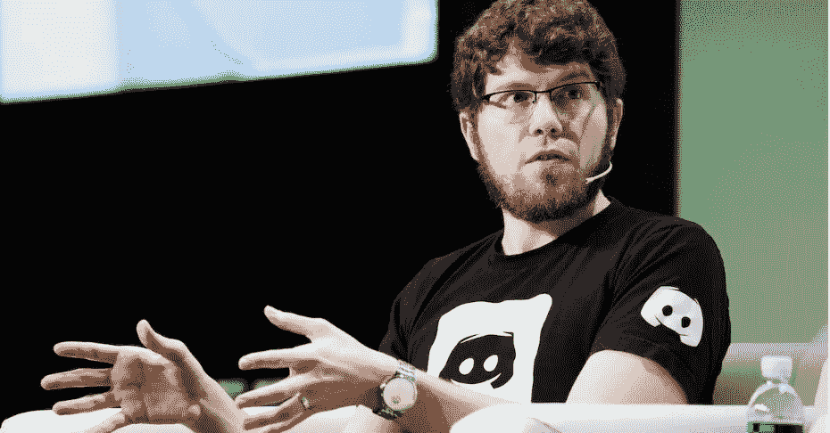

# 遇到一个程序员，他拒绝了微软 100 亿美元的收购要约

> 原文：<https://levelup.gitconnected.com/meet-a-programmer-who-rejected-a-10-000-000-000-acquisition-offer-from-microsoft-6dc984074961>

## 激励年轻开发者的失败之旅

来自 Marketrealist.com 的杰森·西特龙的照片

Jason citron 在他的一生中创造了几个产品。

大多数产品都是失败的。

但其中一款产品带来了微软 100 亿美元的收购要约。

他对自己的产品如此自信，以至于最终拒绝了这个提议。

让我们来看看他是如何打造一款目前估值 150 亿美元的产品的。

# Jason 早年就学会了编程

杰森的父亲在他早年就教他编程和 IT 技能。

他的父亲想把他的儿子放在一个位置上，这样他就可以在任何需要的时候挣钱。

在高中，杰森学会了制作视频游戏和网页。

早年，Jason 意识到他可以利用他的 IT 和编程技能赚很多钱。

他利用自己的 IT 技能，教人们如何使用电脑。

利用这一点，他赚了一些钱。

## 杰森的父母误判了他的编程技能

Jason 过去经常在各种在线编程社区中闲逛。

他试图找到那些寻找可以创建网站的程序员的人。那些人曾经雇佣过他，他会为他们创建网站。

第一次，当他问父母一个问题:

"你怎么能在网上接受一个陌生人的钱？"

他的父母认为杰森在网上向陌生人出售非法药物。但是当他告诉他们他在用他的编程技能赚钱时。

他们信任他，帮他建立了一个贝宝账户。

## 在佛罗里达接受高等教育，学习电子游戏设计

杰森从来不去名牌大学学什么花里胡哨的东西。

他在佛罗里达州的一所营利性学校学习视频游戏设计。

> “高等教育是社会中有趣的一部分……当我与人们一起工作时，他们去的学校从来不会出现……唯一重要的是你能做什么……归根结底，硅谷的魅力在于，如果你有一个伟大的想法，你可以将它付诸实践，你可以说服一个完全陌生的人给你钱，加入你的项目……你必须去一所伟大的学校的想法最终没有成为我的事情。”

# 史蒂夫·乔布斯的主题演讲改变了杰森的世界

杰森毕业后加入了一家创业孵化器。

起初，杰森建立了一个基于视频的交友网站。

事实证明这是一个可怕的想法。

他们在它发布的当天就关闭了它，因为没有一个人想使用它。

接下来，他创造了一个多人游戏。

他通过 Bebo 社交网络发布了这款游戏。它做得很好，大约有 10，000 人在一起玩。

当史蒂夫·乔布斯宣布苹果应用商店时，他立即关闭了这个游戏。

## 推出 app store 就像推出一款新的游戏机

史蒂夫·乔布斯 2008 年的主题演讲改变了杰森的一切。

> “每当推出新的视频游戏主机时，这是新的视频游戏工作室开始的机会，因为没有太多的游戏可用…当新的 PlayStation 出来时，因为它是一个新系统，所以只有少数几个游戏可用…如果你可以成为一个发布游戏，你就可以获得大量的发行。”

## 在看到苹果应用商店后，杰森的一切都变了

苹果的应用商店是推出新的视频游戏业务的新机会。

他关闭了他的旧游戏。

经过 5 个月的不懈努力，他们在 app store 上发布了一款游戏。

这个游戏的名字叫极光佯攻。

贾森认为，如果他们在一周内有 1000 名球员，那将是惊人的。最令人惊讶的是，他们在推出的第一个小时就有一千名玩家。

随着时间的推移，游戏无法获得 Aurora Feint 的团队所期望的牵引力。他们无法赚钱，而赚钱可以让游戏继续下去。

他们只能挣到支付一个月费用的钱。

# 卖技术而不是视频游戏

Jason 看到他们创造了所有这些东西，如游戏内排行榜、聊天室和多人游戏功能，他认为其他开发者可能想在他们的游戏中使用所有这些技术。

他们决定将自己为前作创造的技术卖给其他游戏厂商。

他们称之为 OpenFeint。

## 支持其他游戏开发

唯一的问题是，他们银行里没有钱来建造所有他们需要的东西，以使这项技术易于为他人所用。

杰森和他的搭档丹尼尔创建了一个网页，上面写着:

> “如果你正在制作一个视频游戏，并希望有一个多人支持下降，你可以使用我们的系统”

当他们创建自己的网站时，技术危机掩盖了这一点，他们的邮件列表上有几百人。

在邮件列表的帮助下，他们筹集到了种子资金。

当他们推出 15 款游戏时，一切都从那里开始。

开发者开始在他们的应用程序上使用 Open Feint 标志，几乎所有的 iPhone 游戏创作者都开始使用它。

它到达了一个点，应用程序商店上的每个游戏都开始在边上有开放佯攻标志。

> “这太疯狂了……这真的就像是一个供人们和朋友一起玩的社交平台。”

## 商业模式是什么样的？

OpenFeint 团队最初认为该软件对任何游戏都是免费的。随着游戏变得流行，他们会要求游戏团队付给他们钱。

后来他们意识到这不是正确的商业模式。

最终，他们让它完全免费。

他们不知道如何用公开的假动作赚钱。

为了经营公司，杰森·西特龙过去常常筹集资金。

## 以 1.04 亿美元收购

使用 Open Feint 的用户和他们的员工数量呈指数级增长。

2011 年 4 月，OpenFeint 公司以 1.04 亿美元的价格被出售给日本游戏公司 GREE。

最初，GREE 公司同意 Jason 和他的团队提供资源和一切他们需要的东西来支持他们成为一个伟大的公司。

但收购后的三四个月，Jason 意识到他们对这个产品有不同的愿景。

他离开了公司。

# 杰森对 iPad 的独特见解

2012 年，Jason 曾经思考过很多关于分销的问题，这将有助于创业公司脱颖而出。

当时，iPad 的用户群和市场呈指数级增长。

杰森有一个独特的见解，那就是 iPad 最终可能会取代移动设备。

与在移动设备上玩游戏的人相比，在 iPad 上玩游戏的人有着不同类型的行为。

就 iPad 而言，人们倾向于坐得更久，体验更深。

> “我的想法是，如果我们建立一个更像传统视频游戏的游戏业务，但在平板电脑上玩，而不是我以前一直在做的某种手机游戏，会怎么样。”

## 学习电子游戏业务后的独特体会

在研究了游戏行业之后，Jason 意识到那些已经存在了很长时间的公司往往拥有某种超越单一头衔的持久优势。

十年前，历史悠久的视频游戏公司往往有自己的发行机制。他们可以很容易地使用这种分发机制来缓冲创作成功的标题之间的时间。

比如索尼的 Play Station，微软的 Xbox，Valve 的 Steam Store。

所以他才想到建立某种分配机制。

为此，他有了一个想法，为过去玩游戏的人创建一个群组通信应用程序。

他的整个想法是建立一个基于团队的多人游戏，内置文本和语音聊天。

最终，他的计划是建立一个通信网络，并利用它来发布更多的游戏，并最终建立一个游戏分销业务。

# 重新想象英雄联盟游戏

Jason 和他的团队采用了一种英雄联盟游戏模式，并开始为一块 12 英寸的玻璃重新设计它。

他们设计了同样的游戏在平板电脑上玩。

英雄联盟游戏仅在 PC 模式下可用。

这就是为什么他们试图重建它。

他们重新设计了整个游戏，并在游戏中加入了许多本地移动体验，以提供一些不同的东西。

他们称该公司为锤子和凿子。

为了开发这个游戏，他们一共雇佣了 18 个人。

他们筹集资金来开发这个游戏。他们花了大约两年半的时间来开发这款游戏。

## 这个游戏成功了吗？

游戏于 2014 年 7 月发布。它没有得到团队希望的牵引力。

起初，所有的评论家都喜欢这款游戏，并给出了惊人的评论。

很多人一开始就装了。

尽管如此，游戏还是失败了。

随着时间的推移，团队越来越清楚，iPad 上的游戏不会增长太多，移动设备仍将是赢家。

## 斯坦·维什涅夫斯基向杰森提出了一个新想法

斯坦·维什涅夫斯基是锤凿公司的工程师。

他遇到了 Jason，并告诉了他关于构建一个不需要用游戏来引导它的通信应用的想法。

这个想法为今天的不和谐埋下了种子。

> “他真正的洞察力是将几个点放在一起…我们看到我们的客户围绕我们自己的游戏与所有这些不同的应用程序进行交流，当我们在 PC 上玩游戏时，我们也是如此…我们应该直接解决这个问题，而不是需要建立一个新的游戏…我们应该开始在 PC 上制作它。”

不和谐就是这样开始的。

# 和朋友在网上闲逛是下一个好主意

对于杰森来说，在成长的过程中，电子游戏是他打发时间和与朋友一起玩的方式。

他不是一个出去玩的孩子。

在他的一生中，杰森和他最好的朋友，他的妻子，还有他玩电子游戏的哥哥有很多美好的回忆。

视频游戏本身并不是重点。

一半的时间他们会谈论一些随机的事情，比如一般的生活，从根本上来说，不和谐是关于创造一个你和你的团队聚在一起聊天和闲逛的地方。

这就像拥有自己的私人咖啡馆、卧室或客厅。

不和谐是专为你和你的朋友建立的，首先在你的电脑上，然后在你的手机上。

这并不是说外面的游戏玩家没有这些东西。

如果你在玩游戏，你可以很容易地给你的朋友打电话，进行电话会议。您可以将通话放在扬声器上，并在播放和相互交谈时以这种方式进行交流。

谈论聊天系统。斯莱克已经在外面了。

Discord 团队想要创造一些东西，给世界上的每个玩家一个独特的体验。这是因为必须同时在所有这些应用程序之间进行协调是一个巨大的痛苦。

不和谐给每个玩家一个全合一的体验。

## 整个团队的焦点转移到了不和上

Jason 决定锤子和凿子的整个焦点将是他们正在创建的这个聊天应用程序。

Jason 不想花费任何时间和天赋来构建视频游戏。

杰森要求整个艺术团队离开公司，他们集中精力制造不和。

## 不和谐如何得到正确的关注

在最初的五个月里，整个团队都参与了游戏的制作，同时也向他们的朋友展示产品并获得他们的反馈。

通过这样做，他们确保了能够继续改进产品。这样做的结果是，Discord 队友的一些朋友开始使用 Discord 服务。

当时，团队中的每个人都知道它会成为某种东西，但当时该产品存在很多问题。应用程序有时会崩溃。

杰森让他在游戏社区的一个朋友在 Reddit 上发帖，询问人们对这款应用的看法。

这样，不和谐就会被新人发现。他们不妨试试。

通过这种方式，Reddit 上的一些人发现了 Discord，大约有 50 人开始定期使用它。

这是一种不和的开始。

# 拒绝 100 亿美元的收购交易

近年来，不和变得异常严重。

平台上正在发送数十亿条消息。

Discord 不会追踪它的用户。他们注重隐私。

## 收购要约

随着 covid 的出现，Discord 的用户群呈指数级增长。

该平台每周发送数十亿条信息。

2021 年 3 月，微软出价 100 亿美元收购 Discord。

杰森之前在 2011 年以超过 1.04 亿美元的价格出售了 Open Feint。

但这一次，他太相信他们正在开发的产品，以至于最终拒绝了微软的提议。

> “我和团队中的一些人谈论我们可以走哪条路……好消息是团队中的大多数人都想继续建设。”

## Discord 的最新估值为 150 亿美元

不和还没有利润。

2022 年 3 月 12 日，Discord 筹集了最新一轮资金。

2021 年，该公司估值 150 亿美元，从投资者那里筹集了 5 亿美元。

# 帮我写这篇文章的采访

我是如何和盖伊·拉兹一起建造的。

你可以在苹果播客上听。

# 你想加速你的程序员生涯吗

加入一群热爱编程和技术的人。

[你可以在这里加入。](https://codertoentrepreneurs.substack.com/)

在我们社区的帮助下，我们将解决程序员生活中的主要问题，并讨论前端和后端工程。

我们将帮助你重新规划你对科技中各种事物的理解。