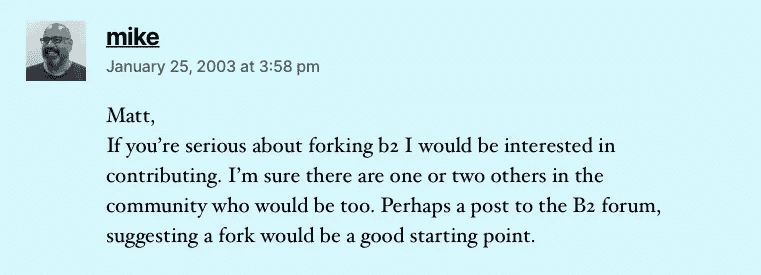

# 一个程序员把一个开源工具变成了一个 75 亿美元的帝国

> 原文：<https://levelup.gitconnected.com/meet-a-programmer-who-turned-an-open-source-platform-into-a-7-500-000-000-company-645e14c53c8>

## 激励年轻程序员的疯狂之旅

[来自 Ted 的照片](https://www.ted.com/talks/matt_mullenweg_why_working_from_home_is_good_for_business):【https://www.ted.com 

WordPress.com 及其母公司 Automatic 的创始人是马特·莫楞威格。

Automattic 目前估值 75 亿美元。

在最近的新闻中，Automattic 从其现任和前任员工手中回购了价值 2.5 亿美元的股票。

这是一个程序员马特·莫楞威格白手起家创建 WordPress 的故事。

互联网上 40%的网站都是用 WordPress 建立的。

WordPress.org 最初是作为一个非营利性博客平台创建的。

Matt 热衷于博客和开源软件。他的伟大想法是建立一个平台，让任何人都可以创建博客。

他收到了许多科技巨头的工作邀请，但他拒绝了几乎所有这些工作邀请。原因很简单，如果他加入了任何一家科技巨头，他就必须放弃自己的知识产权。

WordPress.com 的母公司 Automattic 在全球拥有约 2000 名员工。Automattic 的员工分布在世界各地。

# 马特的童年是什么样的？

马特和他的姐姐一起在休斯顿长大。

他的母亲管理家庭，他的父亲是一名电脑程序员，主要为石油公司工作。

十几岁时，马特一直在寻找一份可能成为音乐家的职业。

他对萨克斯管感兴趣，因为他爸爸喜欢吹。

他就读于一所表演艺术高中。学校有一种奇妙的氛围，他曾经靠吹萨克斯管赚钱。

他在不同的地方演奏萨克斯管，比如不同的意大利餐馆。

## 他为什么不选择音乐作为职业？

> “在学校里，有些孩子是真正的神童，我相当不错，但必须非常努力才能到达那里……我不是最好的……这一点变得很明显。”

马特的爸爸有一台工作用的电脑，但当他有了一台家用电脑后，马特迷上了电脑。

起初，他经常修补几个游戏，但随着时间的推移，他参与了不同的互联网社区。

根据马特的说法:

> 这个社区将围绕着共同的兴趣而形成。它是关于其他人的，你可以了解那里的其他 20 个人…有一个叫做 IRC 的聊天系统…它是一种基于文本的 slack。

## Matt 是怎么学会做网站的？

在 2000 年或 2001 年，建立一个网站要复杂得多。

马特在高中学会了如何建立一个网站。他是在书本的帮助下，经过大量的反复试验才做到的。

有许多网站发布软件，如 GeoCities、Dreamweaver、FrontPage 等。

大多数时候，他点击任何特定软件上的所有按钮，然后看看发生了什么。

这就是他如何设法了解任何软件的。

当时，马特创办了一个名为“男仆”的摄影网站。在那个网站上，他曾经贴过照片。为了推出这个网站，他使用了名为 Gallery 的开源软件。

它主要是一个 PHP 脚本，允许照片被发布到网上。(那是在 Flickr 和脸书出现之前。)

 [## 两位程序员将 7 行代码的解决方案变成了 950 亿美元的帝国

### 这是一次我非常希望所有年轻程序员都能读到的旅程。

javascript.plainenglish.io](https://javascript.plainenglish.io/two-programmers-turned-7-lines-of-code-solution-into-95-000-000-000-empire-961f200b3082) 

# 马特和一个陌生人开始了 wordpress.org

马特学习编码的时候。

他参与了一个名为 b2 cafelog 的开源博客平台。他喜欢这个平台，并为博客平台 b2 cafelog 提出了一些代码更改。

b2 的首席开发人员喜欢 Matt 的代码。

Matt 被要求创建一个票证并提交代码。

Matt 提交的代码很快被接受，后来成为正式发布的一部分。

后来更新软件的人都在运行马特的代码。

> “我的天啊，有成百上千的网站在运行我写的代码，这让我兴奋不已。”

Matt 开始频繁地为 b2 平台贡献代码。

b2 平台在世界各地有许多其他贡献者。

b2 的首席开发人员 Mitchell 掌握着整个 b2 平台的钥匙。

2002 年，首席开发人员 Mitchell 离开了 b2。他是该项目的仁慈的独裁者。因为 Mitchell 离开了 b2，所以不可能对平台进行新的代码更改。

这就是为什么全世界的人都不再给 b2 投稿了。

## 迈克是如何发现马特·莫楞威格的

Matt 一直在博客上记录 b2 当时发生的一切。

他写了一篇名为[博客软件困境](https://ma.tt/2003/01/the-blogging-software-dilemma/)的博文。

Matt 提到他想要一个与众不同的博客平台。

他想要一些非常漂亮的东西，有很好的排版来发布博客文章。他提到平台要简单，像 Blogger 一样，要像 b2 一样可黑客攻击。

代码必须非常漂亮和灵活。

因为 b2 cafelog 是开源的并且是 GPL 许可的，所以首席开发人员 Mitchell 所做的工作并没有丢失。

通过这个帖子，Matt 想告诉社区里的其他人，即使有人从地球上消失了，那个人创造的代码也永远不会丢失。

人们可以轻松地获取这些代码，继续构建他们想要的任何东西。

帖子公开后，一个名叫迈克·利特尔的人评论说，如果马特想从事这样的项目，他很乐意一起工作。

截图来自[这个](https://ma.tt/2003/01/the-blogging-software-dilemma/)网站

这就是迈克和马特最终所做的。

他们采用 b2 cafelog 代码，将其分叉，并以此为基础创造新的东西。

Matt 和 Mike 曾经在 IRC 上聊天，但是至少三年没有见面了。他们过去经常互相发送代码块，也通过对代码的评论进行交流。

## WordPress.org 这个名字从何而来？

迈克和马特有他们的 b2 叉子。

b2 还有五六个分支，人们试图用 b2 代码创造一些有意义的东西。

当时，Matt 是博客社区的活跃分子。参与该社区的人过去常常在咖啡店或酒吧见面，一起谈论博客。

当 Matt 谈到 Mike 和 Matt 正在建立的平台时，其中一个名叫 Christin 的博客作者想到了 WordPress 这个名字。

Matt 喜欢 WordPress 这个名字，并继续使用它。

许多以前参与 b2 的人喜欢马特和迈克正在做的事情。他们中的大多数迁移到这个新项目。

如果你仔细看看 WordPress.org 的历史，你会注意到它从来没有开始作为一个企业，他们都只是想使博客更容易和更有趣，每个人都可以贡献。

这是参与这个项目的每个人的爱好项目之一。

# 一个彻底改变博客的想法

2003 年 5 月，迈克和马特正式向全世界发布了 WordPress.org。

世界上大多数使用过任何博客软件的博客作者都对 WordPress 感到兴奋。

此外，来自各种在线社区的开发者对 WordPress 充满热情。

在 WordPress 推出之前，Matt 联系了 b2 的员工，请他们为一个项目做贡献，而不是为不同的项目工作。

他让他们做一件大事，他们开始为 WordPress 做贡献。

在发布时，WordPress 有五六个指定的开发人员，但是数百名开发人员对其进行了小的改动或调整。

当 WordPress.org 首次发布时，数百人开始在日常生活中使用它来写博客。

## 随着越来越多的人开始接受 WordPress.org，跑步的总成本是多少？

随着越来越多的人开始使用 wordpress.org，需要更大的服务器。

那时还没有亚马逊网络服务(AWS)。

他们租了一台服务器，就像某个地方大楼里的一个盒子。你可以在网上和它互动。

运营和租赁服务器所需的总费用为每月 425 美元。

当时只有服务器是主要成本。

为了支付服务器的成本，Matt 曾经建立网站和计算机。他还在一些地方演奏萨克斯管赚钱。

# 雅虎和 CNet 等公司的工作邀请

马特·莫楞威格收到了一些大型科技巨头的工作邀请。

这些公司想雇用马特，因为他们想让他为他们做一些重要的事情。

其中一些公司包括雅虎和 CNet。

Cnet 是首批互联网媒体公司之一。他们之前已经建立了一个内容管理系统。

Cnet 向 Matt 提供的工资约为 9 万美元。

Matt 当时的收入在 1k 美元/月左右。对于 20 岁的马特来说，9 万美元的报价就像中了彩票一样。

Matt 接受了 Cnet 的工作邀请，原因如下:

> “他们允许我保留我正在创建的代码的知识产权……通常，当你加入谷歌这样的公司时，你就签署了你在那里创建的一切的权利……对我来说，知识产权非常重要。”

## 20 岁的他是怎么知道 IP 的？

> “我刚刚在网上看了很多博客，我也有音乐背景，非常熟悉知识产权……我仍然是版权的忠实信徒。”

Matt 曾在 Cnet 担任项目经理。

在 Cnet，他只负责特殊项目。

马特在 WordPress.org 的经历帮助 Cnet 的工作人员快速建立了联系。

在 Cnet 工作期间，他还向非营利组织 wordpress.org 贡献了代码。

 [## 认识一下这位 26 岁的程序员，他在两年内开发了一个价值 10 亿美元的应用程序

### 没有人能预料到他的成功

javascript.plainenglish.io](https://javascript.plainenglish.io/meet-the-26-year-old-programmer-who-built-a-1-000-000-000-app-in-2-years-31a16a4bcff6) 

# 是什么让马特创办了营利性的 WordPress.com 公司？

马特向当时的 Cnet 首席执行官推销:

> WordPress.org 很酷，但设置起来很复杂…我们可以让您轻松地点击几个按钮，设置您的博客。我认为它会受欢迎的…让我们开始吧…

整个 Cnet 团队决定，他们不想进入博客托管业务。

Matt 对这个想法非常兴奋，在 Cnet 工作时，他创办了自己的公司 Automattic。

Matt 为 Automattic 雇佣了第一批员工。

这个想法是创建商业实体，作为 WordPress 的附件，并提供简单的托管服务。他们想创造一些东西，让任何人都可以使用 WordPress，而不用成为开发者。

如果普通人想拥有一个博客，但不知道如何编码，他或她可以使用它并创建一个博客。

## 马特筹集了 0 美元来经营这家自动化公司

马特·莫楞威格起初白手起家创办了这家公司。

马特在用他的钱资助整个项目。他用自己的信用卡和 Cnet 的工资开始了。

根据马特的说法:

> 我绝对是过度扩张了自己。

当公司内部开始运转的时候，他意识到他的工资和他信用卡上的钱不足以资助盈利版的 WordPress。

Matt 记得有一次有人联系他在 WordPress.org 上做广告。

WordPress.org 的广告费用大约是每月 2000 美元。

这位广告客户希望他的网站在谷歌上的一些有价值的关键词排名更高。他告诉马特，由于人们复制他们网站上的内容，这就是为什么他们不能在谷歌上排名靠前。

他想让 Matt 提供一个他在 WordPress.org 网站的链接。这将有助于他们在谷歌上排名更高。

广告商想要排名的关键词是有价值的，例如各种疾病。

为了帮助这个广告客户，Matt 发明了一种向用户发送垃圾邮件的新方法。

Matt 使用 CSS 代码的方式是，如果你以用户身份在浏览器中访问网站，外部链接将是不可见的。如果你像谷歌一样以机器人的身份访问 WordPress.org 网站，网站上会出现外部链接。

因为谷歌使用机器人来索引网站。Matt 的策略可以帮助广告客户为有价值的关键词获得数百万新用户。

简而言之，通过向有价值的 wordpress.org 用户发送垃圾邮件，马特·莫楞威格接受了垃圾邮件发送者的钱。

> “当一个人的薪水取决于他对某件事的不理解时，他很难理解这件事。”

后来谷歌发现了 CSS 代码。当谷歌的人发现这个简单的 CSS 代码欺骗了他们的搜索引擎时，他们很生气。

因此，谷歌决定将 WordPress 从搜索中移除。就像从网上被删除了一样。

马特·莫楞威格这样做辜负了成千上万人的信任。

在此之后，Matt 修复了代码，并写了一篇博文，公开道歉。最终，谷歌原谅了马特，他们把 WordPress 放回了搜索引擎。

## 离开 Cnet 创建反垃圾邮件软件

Matt 离开 Cnet，专注于 Automattic。

马特创造的第一个商业产品叫做 Akismet。他以他姐姐的名字给这个软件命名。这是一个反垃圾邮件软件。

这是一个机器学习系统，它分析了数百万个博客的垃圾邮件模式，然后 Akismet 返回一个拇指向上或拇指向下的结果。

如果它回复竖起大拇指，评论就有合法的意义，否则就是垃圾邮件。

这将有助于人们自动删除网站上的垃圾邮件。识别垃圾邮件不需要人工干预。Akismet 个人使用是免费的，但商业使用则需要付费。

马特很早就决定 WordPress.com 将保持免费，他的商业模式将是为 WordPress 出售插件。

# 马特为什么要筹钱？

每个自动化员工来自不同的城市。他们遍布世界各地。

当时，Automattic 的月收入约为 2 万美元。

Matt 意识到，如果发生了一些事情，他们在这种情况下停止赚钱，公司将无法支付下个月的工资。

他开始感觉到那些与自动化公司有关联的人和信任马特的人的责任。

运营企业并不需要钱，但 Matt 希望有一些现金储备，这样他就可以耐心地建造东西，或者在最糟糕的情况下，员工可以找到其他工作。

最初，当 Matt 与投资者会面时，他们要求他招聘不同的职位，如首席执行官、首席技术官和公司的其他高级职位。

马特不想雇佣任何这样的角色。

后来，Matt 遇到了 Tony Schneider，他之前将自己的一家公司卖给了雅虎，并对与他的交谈印象深刻。

马特聘请他担任 Automattic 的首席执行官。聘请托尼·施耐德担任首席执行官帮助 Automattic 从私人投资者那里筹集资金。

当时，托尼是公司的首席执行官，马特的头衔是 Automattic 的总裁。

## WordPress.com 是如何吸引人们适应它的平台和服务的？

根据马特的说法:

> 都是口口相传……我们当时做的一件事就是模板里默认运行 WordPress 的网站都写着:“powered by WordPress”。

如果你访问任何运行 WordPress 的网站，你会看到一个链接显示这个网站是由 WordPress 支持的。你可以点击链接并探索 WordPress。

如果在探索阶段后你喜欢 wordpress.com，你可以很容易地尝试一下。

此外，在开始时，马特喜欢阅读各种人的博客。

每当有人抱怨“哦…我的网站越来越慢”之类的事情时，Matt 就会告诉他们 WordPress.com 的服务。

 [## 一名 19 岁的程序员从大学辍学，在两年内创建了一家价值 23 亿美元的公司

### 没有人能预料到他的成功

sanjay-priyadarshi.medium.com](https://sanjay-priyadarshi.medium.com/a-19-year-old-programmer-dropped-out-of-college-to-build-a-2-300-000-000-company-in-2-years-1055963ec1db) 

# 2 亿美元的收购要约和 Automattic 的当前估值

当时，自动化团队大约有 20 人。

2007 年，马特拥有该公司一半以上的股份，并收到了以 2 亿美元出售 wordpress.com 的报价。

对于一家成立仅两年的公司来说，这是一笔非同寻常的交易。

马特在 23 岁时就已经赚了大约 1 亿美元。

他开始认真考虑这件事。

他想，他这么年轻就需要退休吗？当他质疑自己时，他发现退休的想法很无聊。

他问了他姐姐、妈妈和爸爸一个严肃的问题。如果他们银行里有 1 亿美元，他们会用这笔钱做什么？他们想买一辆超酷的车，买一栋房子，然后去度假。

要做到这一切，他只需要 500 万美元。

他会用剩下的钱做什么？

他当时想要的是每天写代码，漫游世界去认识新的人。他想和他喜欢的人一起工作，仅此而已。

有一次他严肃地质疑自己。他得到的唯一回答是，不要在这么年轻的时候卖掉公司。

## 2009 年，WordPress 获得了 1000 万次下载

在 2009 年之前，WordPress 团队增加了一个功能，WordPress 不仅可以运行你的博客，还可以管理整个网站。

这一特征被证明是 WordPress.com 的主要特征之一。

它帮助 WordPress 成为一个内容管理系统。在那之前，WordPress 是一个日志或博客软件。

后来，更大的公司被 WordPress 所吸引，因为他们可以通过它管理他们网站的所有页面。

## Automattic 的当前估价

2021 年，马特·莫楞威格宣布公司现在的价值为 75 亿美元。

在他们的旅程中，Automattic 收购了 WooCommerce、Tumblr、Simplenote 和其他几家公司。

# 帮我写这篇文章的采访

我是如何和盖伊·拉兹一起建造的。

你可以在苹果播客上听。

# 你想加速你的程序员生涯吗

加入一群热爱编程和技术的人。

[你可以在这里加入。](https://codertoentrepreneurs.substack.com/)

在我们社区的帮助下，我们将解决程序员生活中的主要问题，并讨论前端和后端工程。

我们将帮助你重新规划你对科技中各种事物的理解。

# 分级编码

感谢您成为我们社区的一员！在你离开之前:

*   👏为故事鼓掌，跟着作者走👉
*   📰查看更多内容请参见[升级编码刊物](https://levelup.gitconnected.com/?utm_source=pub&utm_medium=post)
*   🔔关注我们:[Twitter](https://twitter.com/gitconnected)|[LinkedIn](https://www.linkedin.com/company/gitconnected)|[时事通讯](https://newsletter.levelup.dev)

🚀👉 [**加入升级人才集体，找到一份神奇的工作**](https://jobs.levelup.dev/talent/welcome?referral=true)