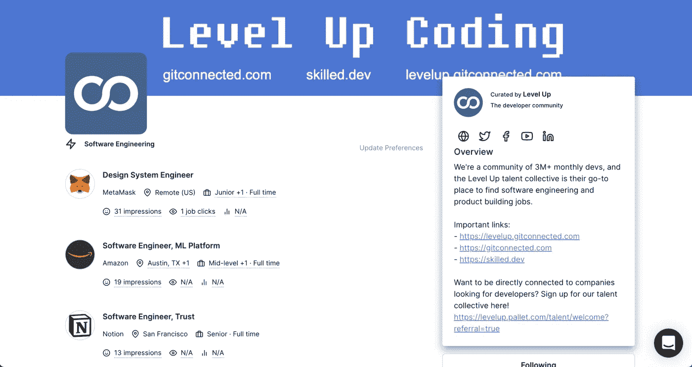
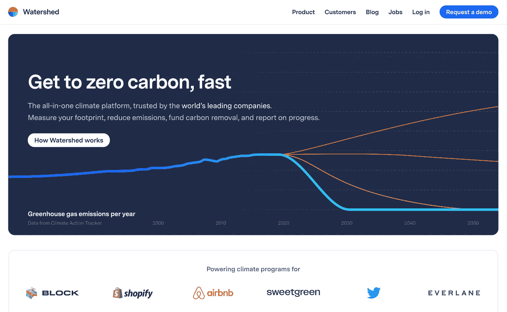
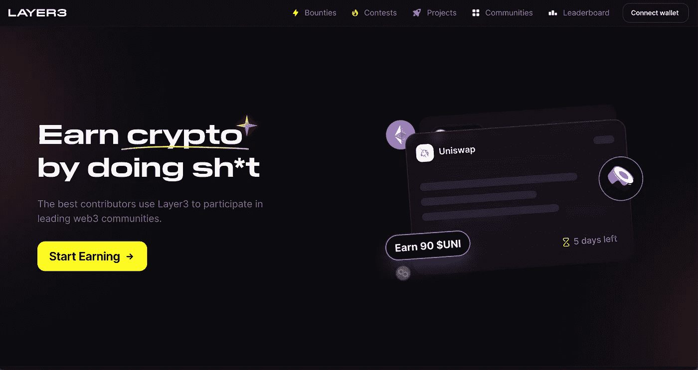
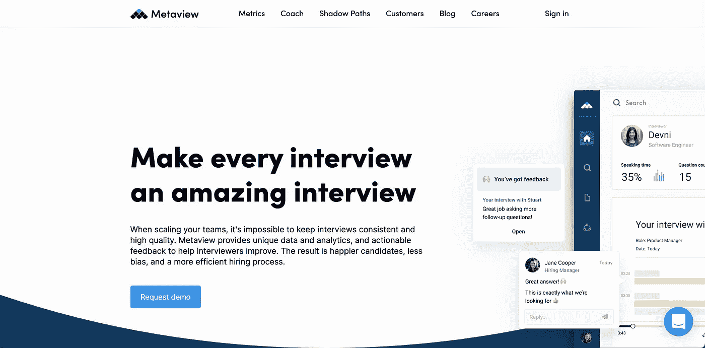
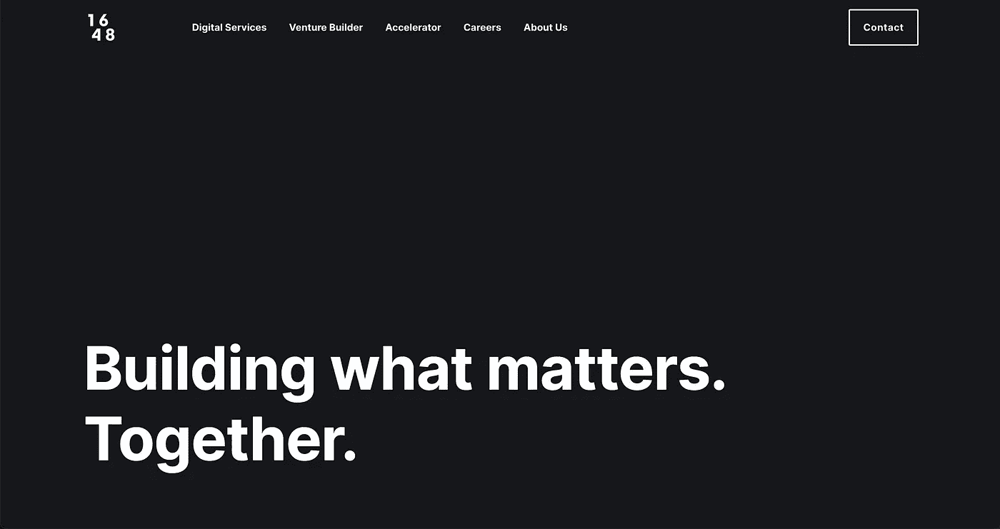
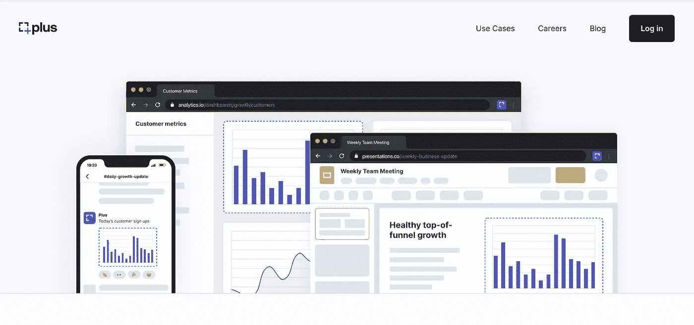
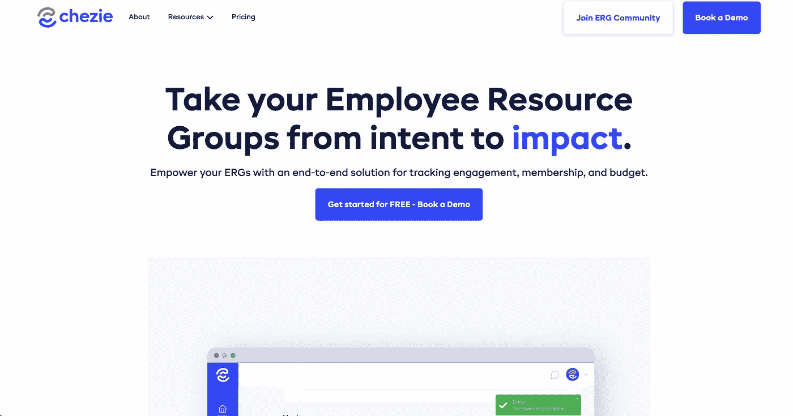
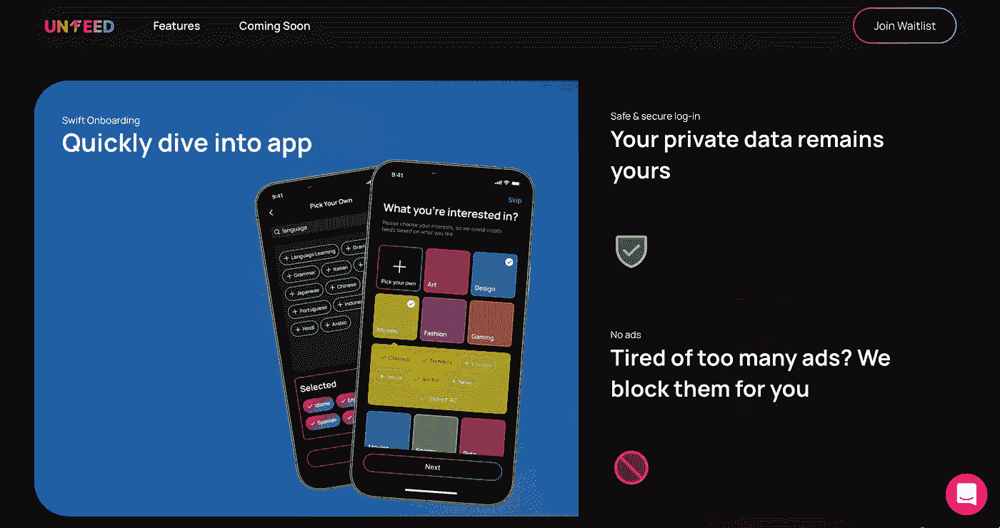
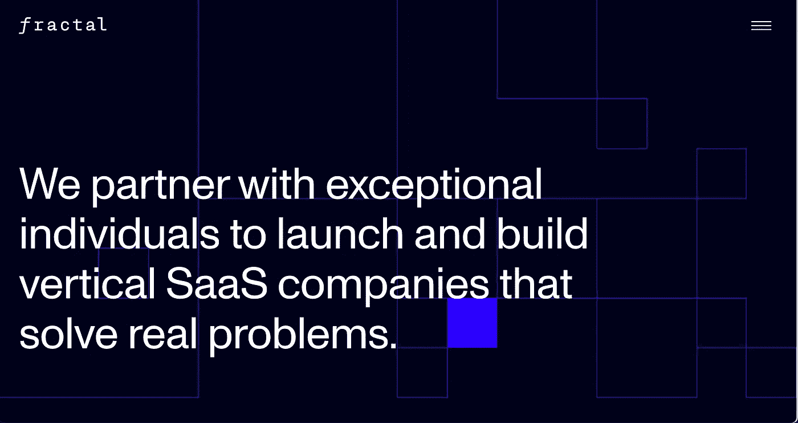
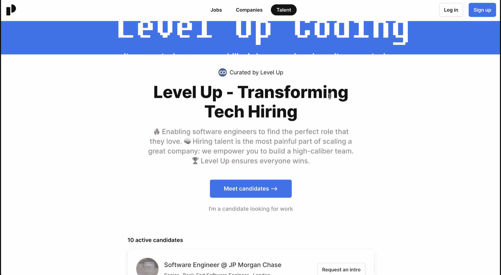

# 🔥🙌在 2022 年 6 月举行的高级人才选拔中，认识那些令人惊叹的公司

> 原文：<https://levelup.gitconnected.com/meet-the-amazing-companies-hiring-in-the-level-up-talent-drop-june-2022-22ed39ce1eff>

Level Up Coding 与顶级科技公司和初创公司合作，为我们的社区提供令人惊叹的就业机会。您可以[加入我们的人才集体](https://jobs.levelup.dev/talent/welcome?referral=true)，让这些公司与您联系，了解我们每月人才投放中的空缺职位。在最有趣的公司找到好工作——没有垃圾邮件或咄咄逼人的招聘人员💪。

[**加入升一级的人才集体** ➡️](https://jobs.levelup.dev/talent/welcome?referral=true)

你是一家招聘公司吗？ [*注册连接 Level Up 社区*](https://jobs.levelup.dev/talent/welcome) ，*由 3M 月度开发者阅读。*

# 本月公司招聘水平上升

## [**分水岭**](https://watershed.com/)

“尽快达到零碳排放。全球领先公司[信赖的一体化气候平台](https://watershed.com/customers)。测量您的足迹，减少排放，资助碳排放，并报告进展。”

## [第三层](https://beta.layer3.xyz/)

“通过做 sh*t 获得 crypto。最好的贡献者使用第 3 层参与领先的 web3 社区。为下一代工作提供动力。”

## [元视图](https://www.metaview.ai/)

“让每一次面试都成为令人惊叹的面试。当扩展你的团队时，保持采访的一致性和高质量是不可能的。Metaview 提供独特的数据和分析，以及可操作的反馈，帮助面试官改进。”

## [1648](https://www.1648factory.com/)

“1648 工厂是一个全球创业工作室，推出明日创业。我们努力打造能够带来真正变化的产品和业务，并对世界产生积极影响。”

## [加上](https://www.plusdocs.com/)

“一起构建大局。您团队的所有数据都在您需要的地方。没有复杂的集成。”

## [内部财务](http://insiderfinance.io/)

“强大的交易软件。简化。借助强大的工具，提高交易任何资产类别的胜率。”

## [Chezie](https://www.chezie.co/)

“将您的员工资源组从意图转变为影响。使用端到端解决方案来跟踪参与度、会员人数和预算，让您的 erg 如虎添翼。”

## [Un1feed](https://www.un1feed.com/)

“在一个应用程序中提供您所有的社交订阅源。控制你的消费。创建符合您兴趣的订阅源。”

## [分形](https://www.fractalsoftware.com/)

“我们与杰出的个人合作，发起并建立解决实际问题的垂直 SaaS 公司。”

# 只需要 3 分钟

[加入➡️人才集体](https://jobs.levelup.dev/talent/welcome?referral=true)

## [**加入升一级的人才集体** ➡️](https://jobs.levelup.dev/talent/welcome?referral=true)