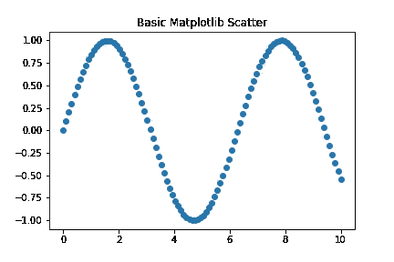
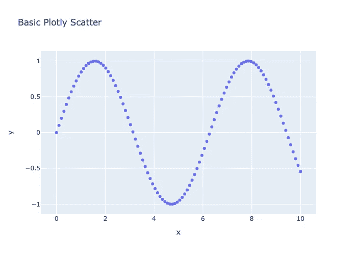
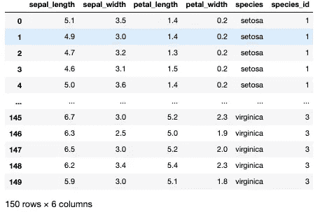
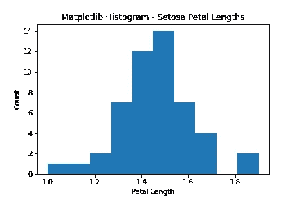
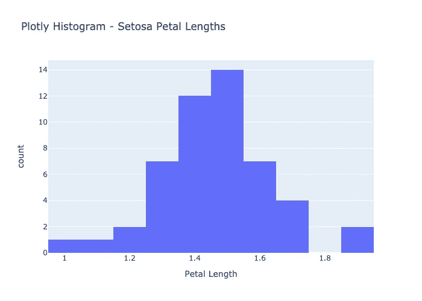
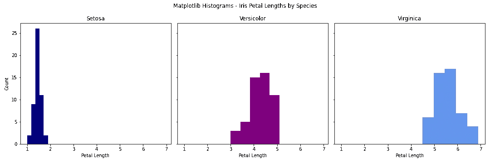
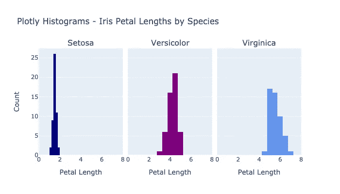

# 认识一下 Python 图形库的碧昂斯

> 原文：<https://levelup.gitconnected.com/meet-the-beyonce-of-python-graphing-libraries-1e068cb6076d>

6 周前，我辞去了管理咨询的工作，创办了一个数据科学训练营。我的世界从漂亮的幻灯片和连续的微软团队会议到行星、动物和死亡语言(阅读:Jupyter 笔记本、Python、熊猫和数学符号中的统计)。

在我的咨询生涯中，有一件事我会一直坚持，那就是讲故事的重要性。如果没有人知道如何使用它们以及它们为什么重要，谁会关心我能建立多少模型呢？正如谚语所说，一幅画胜过千言万语。

> 在数据科学和分析领域，干净、清晰、简单的视觉效果的重要性怎么强调都不为过。

# Matplotlib

如果 matplotlib 是一个人，他们可能看起来像这样

任何对数据科学有所涉猎的人都可能已经了解过 Matplotlib，这是一个标准的免费绘图库，其灵感来自于更复杂/更难访问的 MATLAB。它使用起来简单直观，非常适合初学者。

问题是… **它很丑**，美学定制会占用大量代码。

# 输入:Plotly

Plotly 是图形库的碧昂斯

Plotly 是一个免费的开源图形库，可用于多种编码语言，包括 Python、Javascript 和 r。虽然 plotly 和 matplotlib 在结构和功能上相似，但 plotly 优于 matplotlib 的三个明显优势是:

1.  更容易做出更具美感的视觉效果
2.  默认情况下，Plotly 图形是交互式的
3.  只用一行代码就可以实现动画

# 对比时间！

让我们演示一些简单的例子。

首先，导入我们将在整个示例中使用的标准包。

```
import numpy as np
import matplotlib.pyplot as plt
import plotly.express as px
import plotly.graph_objects as go
from plotly.subplots import make_subplots
```

## 1.美学:

我们将从一个非常简单的散点图开始，展示每个库的基本美学。

为二维曲线创建一些样本数据，并使用 matplotlib 绘图:

```
xaxis = np.linspace(0, 10, 100)
yaxis = np.sin(xaxis)mat_scatter = plt.scatter(x=xaxis, y=yaxis)
plt.title('Basic Matplotlib Scatter')
plt.show();
```



使用 plotly 的 express 模块绘制相同的样本数据:

```
plotly_scatter = px.scatter(x=xaxis, y=yaxis, title='Basic Plotly Scatter')
plotly_scatter.show()
```



马上，plotly 的数字在视觉上更令人愉快，虽然我认为这是主观的简单程度。Plotly 还会根据使用的变量自动添加轴标签，而我必须在 matplotlib 中编写代码。您还可以看到，plotly 使用较少的方法接受更多的参数(例如:设置绘图的标题)。

## 2.交互性:

直方图是展示 plotly 的开箱即用交互性的一种很好的方式。

使用熊猫的一个数据集创建一个数据框架，然后根据分类“物种”列分割出 3 个不同的数据框架。这将为我们演示如何在一个图形上创建多个图。

```
df = px.data.iris()
setosa_df = df[df['species'] == 'setosa']
versicolor_df = df[df['species'] == 'versicolor']
virginica_df = df[df['species'] == 'virginica']
```



使用 matplotlib 绘制 setosa 物种花瓣长度直方图:

```
mat_hist = plt.hist(x=setosa_df['petal_length'])
plt.title('Matplotlib Histogram - Setosa Petal Lengths')
plt.xlabel('Petal Length')
plt.ylabel('Count')plt.savefig('images/mat_hist.png')
plt.show();
```



根据上面的代码编写的 PNG 文件

使用 plotly express 绘制相同的直方图:

```
plotly_hist = px.histogram(setosa_df, x='petal_length', title='Plotly Histogram - Setosa Petal Lengths', labels={'petal_length': 'Petal Length'})plotly_hist.write_html('images/plotlyhistogram.html')
plotly_hist.write_image('images/plotly_hist.png')
plotly_hist.show()
```



PNG 文件由上面的 plotly 代码编写

演示用上面的 plotly 代码编写的交互式 HTML

这是比较变得更好的地方。

默认情况下，Plotly 图形是交互式的，这意味着您可以将鼠标悬停在图形上以查看底层数据的详细信息，放大/缩小等。不需要添加任何代码。在我们的 setosa 花瓣长度直方图示例中，用户可以将鼠标悬停在每个条柱上，以查看在该条柱中捕获的 x 值的范围(在本例中，是花瓣长度的范围)，以及落入该条柱的元素的计数。使用数据框中的列标题自动标记 x 轴。向“labels”参数传递一个 original value: desired label 的字典，对于可能不太熟悉底层数据集的用户来说，我可以轻松地使这些标签更加直观。您可以将图形保存为静态 PNG/JPG 文件或在 web 浏览器中打开的交互式 HTML 文件。图形的交互版本在 Jupyter Notebook 中自动渲染。

## 快速旁白——支线剧情:

matplotlib 和 plotly 都可以在一个图形上绘制多个支线剧情来显示对比。我们将演示在虹膜上使用相同的数据。

使用 matplotlib，创建一个有 3 列的图形，然后在图形上绘制每个物种花瓣长度的直方图。

```
mat_hist_fig, axes = plt.subplots(ncols=3, figsize=(15,5), sharex=True, sharey=True)
mat_hist_fig.set_tight_layout(tight=True)
mat_hist_fig.suptitle('Matplotlib Histograms - Iris Petal Lengths by Species')axes[0].hist(setosa_df['petal_length'], bins=5, color='navy')
axes[0].set_title('Setosa')
axes[0].set(ylabel='Count')
axes[0].set(xlabel='Petal Length')axes[1].hist(versicolor_df['petal_length'], bins=5, color='purple')
axes[1].set_title('Versicolor')
axes[1].set(xlabel='Petal Length')axes[2].hist(virginica_df['petal_length'], bins=5, color='cornflowerblue')
axes[2].set_title('Virginica')
axes[2].set(xlabel='Petal Length')mat_hist_fig.savefig('images/mat_hist_fig.png');
```



上面代码写的 PNG 文件

同样的，使用 plotly 的支线剧情模块，制作一个有 3 个支线剧情的人物，并给他们标题。然后，更新地物标题，关闭图例以节省空间，并设置 x 轴和 y 轴标签。使用 plotly 的图形对象模块将轨迹添加到图形中的每个子图形。

```
plotly_hist_fig = make_subplots(rows=1, cols=3, subplot_titles=('Setosa', 'Versicolor', 'Virginica'), shared_yaxes=True, shared_xaxes=True, horizontal_spacing=.02)plotly_hist_fig.update_layout(title_text='Plotly Histograms - Iris Petal Lengths by Species', showlegend=False, height=400)plotly_hist_fig.update_xaxes(title_text='Petal Length', range=[0,8])
plotly_hist_fig.update_yaxes(title_text='Count', col=1)plotly_hist_fig.add_trace(
    go.Histogram(x=setosa_df['petal_length'], name='Setosa', marker_color='navy', nbinsx=5),
    1, 1)plotly_hist_fig.add_trace(
    go.Histogram(x=versicolor_df['petal_length'], name='Versicolor', marker_color='purple', nbinsx=5),
    1, 2)plotly_hist_fig.add_trace(
    go.Histogram(x=virginica_df['petal_length'], name='Virginica', marker_color='cornflowerblue', nbinsx=5),
    1, 3)plotly_hist_fig.write_image('images/plotly_hist_fig.png')
plotly_hist_fig.show()
```



上面用 plotly 代码写的 PNG 文件

总的来说，这两个库使用了非常相似的概念。我发现在 plotly 中定制更容易，因为有更多参数的方法更少，与 matplotlib 相反，matplotlib 通过直接在图形/子图形上调用更多方法来应用定制。正如这里所看到的，使用 plotly 进行调整更容易实现。

## 3.动画:

我发现使用 plotly 最酷的事情是它的绝对防呆动画定制。

使用与上图相同的数据和场景，通过将“animation_frame”参数设置为分类元素(在本例中为物种)，在 plotly 中创建动画直方图。

```
plotly_hist_anim = px.histogram(df, x='petal_length', nbins=5, title='Plotly Histogram - Iris Petal Lengths', labels={'petal_length': 'Petal Length'}, **animation_frame='species'**, color='species', color_discrete_sequence=['navy', 'purple', 'cornflowerblue'])plotly_hist_anim.update_layout(xaxis_range=(0, df['petal_length'].max()), yaxis_range=(0, 25))plotly_hist_anim.write_html('images/plotly_hist_anim.html')
plotly_hist_anim.show()
```

演示由上面的 plotly 代码生成的动画图形

这张图表的复杂程度令人难以置信，因为它只需要很少的几行代码。几乎任何分类数据元素(最多可能有 10-15 个唯一值)都可以传递到动画参数中，以快速显示比较结果，并包括用户友好的过滤功能。

# 结论

从几个简单的例子中可以看出，plotly 在简单性、优雅性、交互性和动画方面远远超过了 matplotlib 的图形库，因此即使您的 ETL 也可以很漂亮。

接下来要探索的是:plotly 的 [Dash](https://dash.plotly.com/introduction) ，用它可以用纯 Python 代码创建基于 web 的交互式数据可视化应用。

# 其他资源:

Badreesh Shetty 写了一篇精彩的博客详细介绍 Matplotlib 库。

[Plotly 的文档](https://plotly.com/python/)很好，也很容易浏览，尽管我偶然发现了一些过时的东西，所以请做好反复试验的准备。他们展示了很多更高级的例子和图表类型。