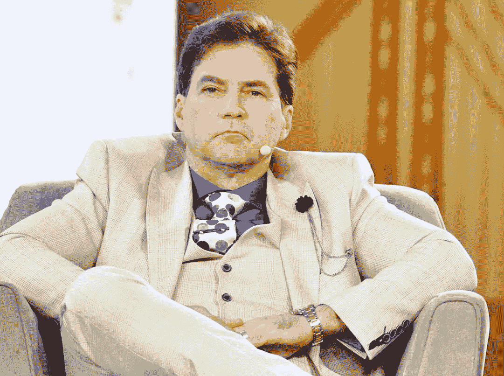
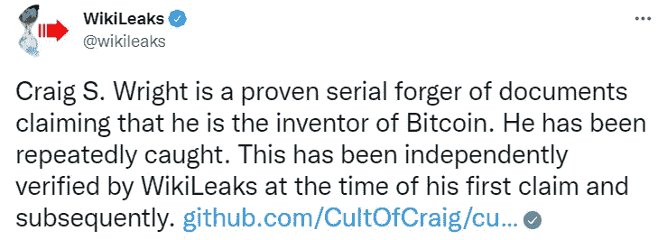
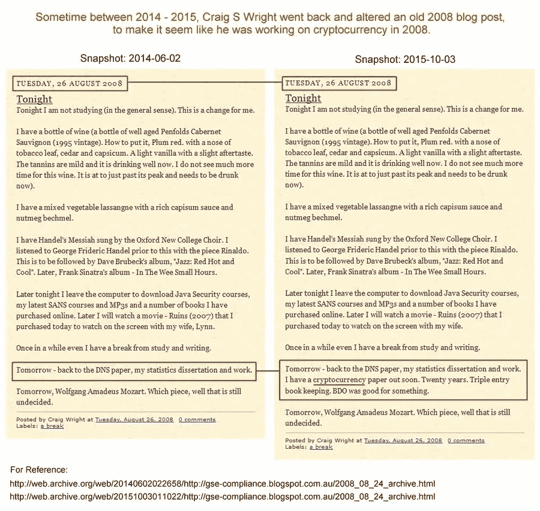

# 见见声称发明了比特币的计算机科学家

> 原文：<https://levelup.gitconnected.com/meet-the-computer-scientist-who-claims-he-invented-bitcoin-ae553e14c96e>

试图起诉维塔利克·布特林。

*照片由——*[*尤金·戈洛古尔斯基*](http://gologurskyphoto.com/) 上[造币专家](https://www.coindesk.com/policy/2022/09/14/craig-wright-wont-give-cryptographic-proof-hes-satoshi-his-lawyers-say-at-hodlonaut-trial/)

你是比特币发明者的说法应该很容易证明。

非常简单。

当然，除非你是一个名叫克雷格·赖特的古怪的澳大利亚计算机科学家。

这个人饱受争议，喜欢出风头，并为他的 15 分钟成名而努力。

比特币不是他第一个古怪的主张；他还声称为世界上第一家网上赌场设计了架构。

34 岁时，他被判藐视法庭罪，被判入狱 28 天，原因是他违反了一项禁令，该禁令禁止他在辞职后去工作的地方接近客户。

该判决被缓期执行，因为他要做 250 小时的社区服务。

他两次试图对不做社区服务的裁决提出上诉，但都令人沮丧地失败了。

媒体渠道 [*Wired*](https://en.wikipedia.org/wiki/Wired_(magazine)) 和[*Gizmod*o](https://en.wikipedia.org/wiki/Gizmodo)*对他进行了平行调查，最初支持他是比特币发明者的说法，当时大多数人认为这只是一场精心策划的骗局。*

*在新闻报道他是比特币发明者的几个小时后，赖特的家遭到澳大利亚联邦警察的突袭。*

*警方会收回之前的说法，称这次突袭与税务局的调查有关。*

*在赖特看来，乐趣才刚刚开始。*

*他决定在自己的网站[www.drcraigwright.net](http://www.drcraigwright.net)上发布一篇博客，这篇博客似乎将他与中本聪联系在了一起，这个人或团体撰写了比特币著名的白皮书，并创造了区块链。*

*Wright 发布了一条附有加密签名的消息，但事实证明，他重复使用了 Satoshi 在 2009 年进行的比特币交易中的一个旧签名。*

*在一个名为[stopcraigwright.com](https://privacypros.io/stop-craig-wright/)的页面发布了一卡车的更多信息后，维基解密得到了这个故事的风声。*

*他们发现，赖特回到过去，篡改了 2008 年以来的文件，使其看起来好像是在研究比特币。*

*他没有。这是他们的推文。*

**

*   *下面左边的图片显示了最初的博客文章。*
*   *下图右边用红圈圈起来的是一个篡改过的版本，Wright 狡猾地补充说他正在研究一种加密货币，论文很快就会发表。*

**

*来源— [维基解密推特](https://twitter.com/wikileaks/status/1095309111263223808?s=20&t=2TT7xvSvsp7X081UZoq_kQ)*

*正如脱口秀传奇人物[莫里·波维奇](https://en.wikipedia.org/wiki/Maury_Povich)所说:*

> *“结果是，这实际上是一个谎言；你是父亲。”*

*赖特没有被任何反弹吓倒，他指示他的公关团队邀请作家安德鲁·奥哈根到他家住几周——赖特仍然坚持“比特币的创造是一个团队的努力，我推动了这个项目。”*

*这是这本书；评论大多是正面的。我可以向你保证，这不是一个附属链接。*

> *(本书— [人生三大真实故事](https://www.amazon.co.uk/Secret-Life-Three-True-Stories/dp/0571335845/ref=asc_df_0571335845/?tag=googshopuk-21&linkCode=df0&hvadid=310819191513&hvpos=&hvnetw=g&hvrand=4461535014913555571&hvpone=&hvptwo=&hvqmt=&hvdev=c&hvdvcmdl=&hvlocint=&hvlocphy=1006573&hvtargid=pla-378550142804&psc=1))*

*如果这本书的交易还不足以让他的古怪主张获得皇家认可，赖特[为比特币白皮书注册了美国版权](https://en.wikipedia.org/wiki/Copyright_registration)。*

*然后，赖特会试着说，这一事件的坚实的公关曝光。*

> *"这是政府机构首次承认克雷格·赖特是比特币的创始人中本聪."*
> 
> *(他在用第三人称谈论自己。就像你一样。)*

*美国版权局发布了一份新闻稿，澄清事实并非如此。*

> *“版权局不会调查原告和署名作者之间是否存在可证明的联系。”*

*如果这还不够，那些不相信他的人被以兰斯·阿姆斯特朗的方式起诉，“我不是药物作弊反应”。*

*莱特开始利用英国诽谤法起诉那些指控他谎称自己是比特币发明者的人。*

*法律通知开始从人们的信箱中落下；另外一个著名的收到法律通知的人是维塔利克·布特林，他曾公开称赖特是个骗子。*

*莱特最终放弃了对布特林的诉讼，让它过期。*

# *你要问的真正问题是*

*很明显，赖特不是比特币的创始人或创造者。*

*但你可能会问，如果比特币真正的创造者出现了，会发生什么？*

*我认为这对比特币来说将是一场灾难。*

*某个地方的某个人会让他们为某种罪行负责。这也可能意味着，如果出售 Satoshi 的 100 万比特币，价格可能会下跌，并改变叙事。*

*据估计，中本聪拥有约 100 万枚比特币(合 190 亿美元)，可以申请合作税。*

*为了我们所有人，让我们希望它仍然是一个谜，我们最接近 Satoshi 的是一个疯狂的计算机科学家。*

> **如果你想在 Web3 上阅读更多我的观点，考虑成为会员吧。你的会员费直接支持你读的作家。如果你用我的链接* [*注册，我会赚一小笔佣金。点击这里*](https://medium.com/@jayden_levitt/membership) *。**

**本文仅供参考；不应将其视为财务、税务或法律建议。在做出任何重大财务决定之前，请咨询财务专家。**