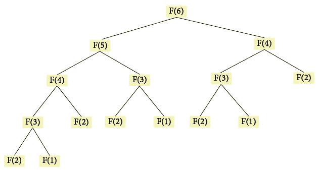

# 记忆和递归

> 原文：<https://levelup.gitconnected.com/memoization-and-recursion-290f0e5a0351>


*照片由* [*@edgarraw*](https://unsplash.com/@edgarraw)

在我的上一篇[博客文章](https://ionabrabender.medium.com/recursion-revealed-38e4a0a5acb)中，我研究了递归，并且看了一些我们如何实现递归的基本例子。当我在学习递归的时候，我不断遇到这个词——**记忆化**。我不确定这是什么意思，也不知道这有什么关系，所以我决定进一步调查。在这篇文章中，我将讨论为什么记忆化是实现递归时的一个重要因素，并举例说明如何使用它。

# 什么是记忆化？

记忆化是一种可能使使用递归的函数运行得更快的方法。正如我将在下面的例子中展示的，一个递归函数可能会多次使用相同的输入执行相同的计算。这意味着它可能会比迭代方法花费更长的时间。记忆功能允许我们将输入与计算结果一起存储。因此，它可以简单地返回存储在缓存中的值，而不必使用相同的输入再次做相同的工作。


*照片由*[*@ yespanioly*](https://unsplash.com/@yespanioly)

# 记忆化和斐波那契

为了真正理解记忆化，我发现在使用递归计算斐波那契数列中的第*n*个数字时，看看如何使用记忆化是很有用的。这是一个非常常见的例子，绝对可以成为你在技术面试中需要实现的东西。

*关于* [*斐波纳契数列*](https://www.livescience.com/37470-fibonacci-sequence.html) *的快速注释:这是一个数列，其中每个数字都是前面两个数字的和。我们总是从 0 和 1 开始。下一个数字将是另一个 1，因为 0 + 1 = 1。然后我们得到 2 (1 + 1 = 2)，然后是 3 (1 + 2 = 3)，依此类推。*

最初的递归解决方案可能如下所示:

```
function recursiveFibonacci(n) { if (n <= 1) { return n; } return recursiveFibonacci(n-1) + recursiveFibonacci(n-2);}recursiveFibonacci(6);// 8recursiveFibonacci(10);// 55recursiveFibonacci(20);// 6765
```

*如果你不清楚递归是如何工作的，你可以看看我之前的* [*博客文章*](https://ionabrabender.medium.com/recursion-revealed-38e4a0a5acb) *，它提供了递归的概述，或者* [*这篇文章*](https://medium.com/launch-school/recursive-fibonnaci-method-explained-d82215c5498e) *，它专门处理递归和斐波那契数列。*

耶，成功了！但是，虽然这个函数只有几行长，但它的效率非常低，并且比迭代方法花费的时间更长。运行时间是指数级的，这意味着每当我们将输入增加 1，计算时间就会大幅增长。这是因为使用相同的参数多次调用了该函数。

我们可以在这张图表中看到这是如何发生的:



*递归斐波那契函数树表示法*

当输入为 6 时，该函数使用 6 之前的每个数字进行几次递归调用。例如，F(2)被调用五次！虽然这可能不会有很大的影响，但是我们可以想象当我们的输入为 1000 时，运行时会受到多大的负面影响。显然，我们需要一个更好的解决方案。


*照片由*[*@ steffipereira*](https://unsplash.com/@steffipereira)

记忆拯救世界！通过记忆功能，我们可以创建一个缓存，在其中存储输入及其计算结果。然后，每当我们有一个已经看到的输入时，我们可以简单地检索结果，而不用重新做任何工作。

下面，我们可以看到如何创建这样一个函数的示例:

```
// We’ve separated out the memoization function from our Fibonacci calculating function to allow it to be reused.function memoize(fn) { // We create the cache which we'll use to store the inputs and calculated results. const memoCache = {}; return function(n) { // We can check if we've already performed a calculation using the given input. // If we have, we can simply return that result. if(memoCache[n]) { return memoCache[n]; } // If we don't find the current input in our cache, we'll need to perform the calculation. // We also need to make sure we store that input and result for future use. const result = fn(n); memoCache[n] = result; return result; }}// Our recursiveFibonacci function can remain the same.function recursiveFibonacci(n) { if (n <= 1) { return n; } return recursiveFibonacci(n - 1) + recursiveFibonacci(n - 2);}// We reassign recursiveFibonacci to our memoize function with recursiveFibonacci passed as the argument.recursiveFibonacci = memoize(recursiveFibonacci);recursiveFibonacci(6);// 8recursiveFibonacci(10);// 55recursiveFibonacci(20);// 6765
```

太好了！我们现在有了一个更有效的递归解决方案，可以避免重复同样的工作。这意味着，当正确实现时，我们的运行时变得线性而不是指数，这是一个巨大的改进。

此外，由于这是一个非常通用的函数，我们甚至可以结合其他递归函数重用它。在这种情况下，您可能还希望增加函数能够接受的参数数量，例如使用…args，以便使它更加抽象。

# 关于记忆化的一个注记

通过创建缓存，我们使用了额外的空间，所以你必须决定是否值得提高速度。如果你有一个非常大的输入范围，你不太可能需要重复相同的计算，记忆可能不是一个有效的解决方案。

# 来源

1.  [“3 分钟理解 JavaScript 记忆化](https://codeburst.io/understanding-memoization-in-3-minutes-2e58daf33a19)”，Codesmith 在 codeburst.io 上，2020 年 11 月 20 日访问
2.  [“在 Javascript 中实现记忆化](https://medium.com/@reallygordon/implementing-memoization-in-javascript-5d140bb04166)”，Arielle Gordon on Medium，2020 年 11 月 20 日访问
3.  [“递归斐波纳契方法解释](https://medium.com/launch-school/recursive-fibonnaci-method-explained-d82215c5498e)”，Bennie van der Merwe，LaunchSchool on Medium，2020 年 11 月 20 日访问
4.  [“什么是斐波那契数列？](https://www.livescience.com/37470-fibonacci-sequence.html)，Tia Ghose 关于生命科学，2020 年 11 月 20 日获取

*原载于 2020 年 11 月 20 日*[*https://dev . to*](https://dev.to/ionabrabender/memoization-and-recursion-228f)*。*