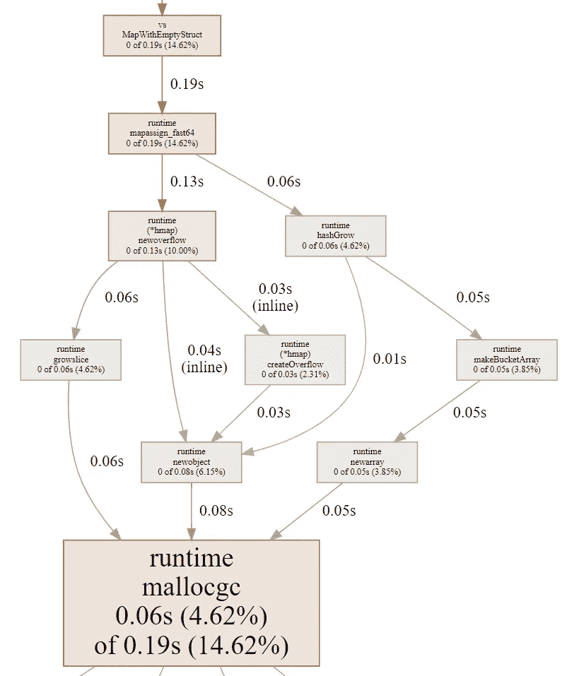
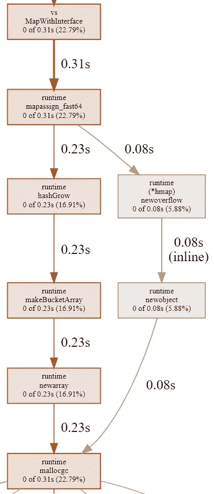
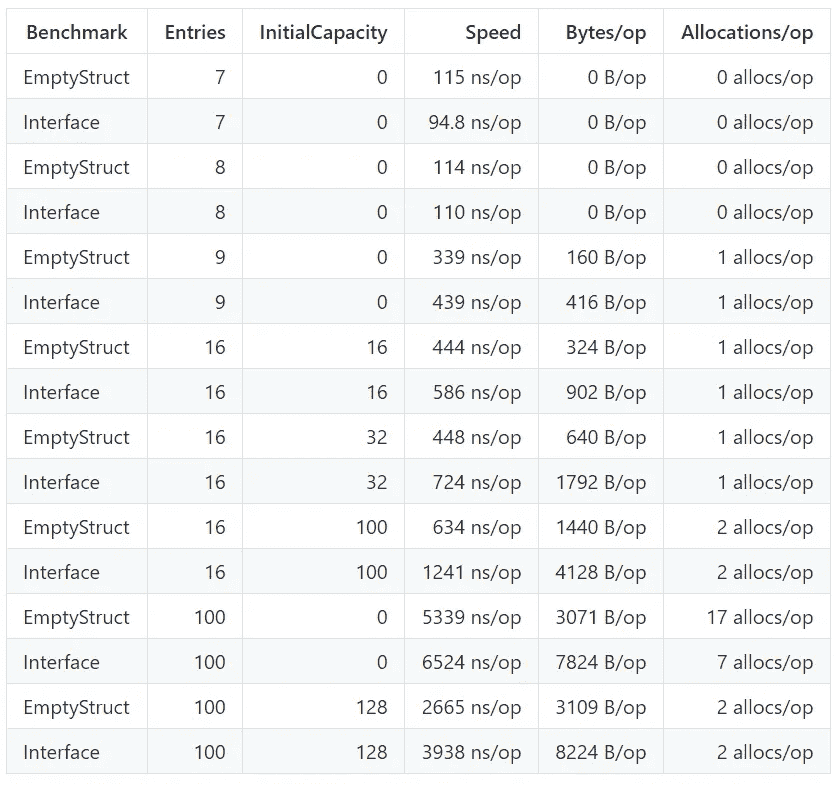

# Golang 映射中的内存分配和性能

> 原文：<https://levelup.gitconnected.com/memory-allocation-and-performance-in-golang-maps-b267b5ad9217>

## 戈朗

## Golang 地图可能会很棘手。理解它们是如何工作的可以帮助你提高代码的性能


(来源:[pexels.com](https://www.pexels.com/))

最近在栈溢出上发现一个有趣的[问题。当我们使用一个接口作为值(`map[int]interface{}` ) *与*一个空结构作为值(`map[int]struct{}`)时，它与 Golang 映射中的内存分配有关。OP 设置了两个基准测试来比较这两种地图类型，并发现了一些奇怪的结果。基准描述如下:](https://stackoverflow.com/questions/65258003/memory-allocation-of-mapintinterface-vs-mapintstruct/65866774)

在下面的代码中，我们为每种地图类型提供了一个函数。每个函数基本上都创建一个映射，然后重复固定次数的零值赋值。也就是说，在执行结束时，映射将具有固定数量的条目，并且每个条目将接收类型的零值(接口为`nil`，空结构为`struct{}{}`)。

```
package main

func main() {}

func MapWithInterface() {
    m := map[int]interface{}{}
    for i := 1; i <= 100; i++ {
        m[i] = nil
    }
}

func MapWithEmptyStruct() {
    m := map[int]struct{}{}
    for i := 1; i <= 100; i++ {
        m[i] = struct{}{}
    }
}
```

基准:

```
package main

import "testing"

func Benchmark_Interface(b *testing.B) {
    for i := 0; i < b.N; i++ {
        MapWithInterface()
    }
}

func Benchmark_EmptyStruct(b *testing.B) {
    for i := 0; i < b.N; i++ {
        MapWithEmptyStruct()
    }
}
```

基准执行的结果如下:

```
goos: darwin
goarch: amd64
pkg: awesomeProject1
Benchmark_Interface-8         130419          8949 ns/op        7824 B/op          7 allocs/op
Benchmark_EmptyStruct-8       165147          6964 ns/op        3070 B/op         17 allocs/op
PASS
ok      awesomeProject1 3.122s
```

两个映射的条目都被赋予零值(`nil`和`struct{}{}`，即不需要分配的值)。然而，我们看到空结构版本运行得更快，使用的内存更少，但它进行了更多的分配。这里发生了什么？为什么这些如此相似的基准测试会有如此不同的结果？

# TL；速度三角形定位法(dead reckoning)

Golang 中地图的内部设计针对性能和内存管理进行了高度优化。映射跟踪可以保存指针的键和值。如果桶中的条目不能保存指针，映射只需创建溢出桶来避免垃圾收集(GC)带来的不必要开销，这将导致更多的分配和更好的性能(`map[int]struct{}`的情况)。

# 长回答

在我们得到答案之前，我们需要理解映射初始化和映射结构。我们将首先浏览这些主题，然后我们将分析一些基准，以了解我们在这里试图理解的两种地图类型的性能。我创建了一个[库](https://github.com/ricardoerikson/benchmark-golang-maps)，其中包含一些测试来帮助理解这个答案。因此，如果您在文本中看到一些对测试或基准的引用，它可能在存储库中。

## 地图初始化

地图初始化有两种方法:

*   当我们不知道有多少条目将被添加到地图中时。
*   `make(map[int]string, hint)`:当我们知道要添加多少条目时。`hint`是对地图初始容量的估计。

无论我们选择哪种初始化方法，映射都是可变的，它们会按需增长。然而，第二种方法至少为`hint`个条目预分配了内存，从而提高了性能。

## 地图结构

Go 中的 map 是一个散列表，它将其键/值对存储在桶中。每个存储桶是一个最多可容纳 8 个条目的数组。默认桶数是 1。一旦每个存储桶中的条目数量达到存储桶的平均负载(也称为负载系数)，这个映射就会因为存储桶的数量翻倍而变大。每次映射增长时，它都会为新来的条目分配内存。实际上，每当存储桶的负载达到 6.5 或更高时，地图就会增长。这个值是硬编码的，选择它是为了优化内存使用。

在幕后，映射是指向`hmap`结构的指针。还有一个`map`结构，它保存了一些关于地图类型的信息。Golang 地图的源代码可以在这里找到:

[https://github.com/golang/go/blob/master/src/runtime/map.go](https://github.com/golang/go/blob/master/src/runtime/map.go)

正如您在上面的链接中看到的，map 内部是复杂的。在下面的链接中，你可以找到一些关于如何破解地图类型的见解。Aleksandr Kochetkov 出色地展示了地图内部的一些细节。

[https://hacker noon . com/some-insights-on-maps-in-golang-rm5v 3 ywh](https://hackernoon.com/some-insights-on-maps-in-golang-rm5v3ywh)

[https://play.golang.org/p/NaoC8fkmy9x](https://play.golang.org/p/NaoC8fkmy9x)

**需要注意的一件重要事情是，映射跟踪可以保存指针的键和值。如果一个桶中的条目不能容纳任何指针，则该桶被标记为不包含指针，并且映射只创建溢出桶(这意味着更多的内存分配)。这避免了不必要的 GC 开销。参见本** [**注释中的**](https://github.com/golang/go/blob/682a1d2176b02337460aeede0ff9e49429525195/src/runtime/map.go#L132) `[**mapextra**](https://github.com/golang/go/blob/682a1d2176b02337460aeede0ff9e49429525195/src/runtime/map.go#L132)` [**struct(第 132 行)**](https://github.com/golang/go/blob/682a1d2176b02337460aeede0ff9e49429525195/src/runtime/map.go#L132) **和本**[**post**](https://www.komu.engineer/blogs/go-gc-maps)**以供参考。**

## 基准分析

空结构`struct{}`没有字段，不能保存任何指针。因此，空结构情况下的桶将被标记为不包含指针的*。这将避免不必要的地图扫描，我们可以期待提高执行速度。此外，我们还可以期待为类型为`map[int]struct{}`的映射分配更多的内存，因为随着它的增长，它会创建更多的溢出桶。*

与空结构不同，`interface{}`类型可以保存任何值，包括指针。为了理解这如何影响映射性能，我们需要理解映射桶跟踪保存所有指针的内存前缀的大小(`[ptrdata](https://github.com/golang/go/blob/cd99385ff4a4b7534c71bb92420da6f462c5598e/src/runtime/type.go#L33)` [字段，第 33 行](https://github.com/golang/go/blob/cd99385ff4a4b7534c71bb92420da6f462c5598e/src/runtime/type.go#L33))。可以保存指针的映射类型不会分配额外的溢出桶。但是，这些类型需要 GC 扫描。

在 map 内部实现中，我们可以看到如何使用`ptrdata`字段来决定是否创建更多的溢出桶( [map.go，第 265 行](https://github.com/golang/go/blob/b634f5d97a6e65f19057c00ed2095a1a872c7fa8/src/runtime/map.go#L265))。参考这个[链接](https://play.golang.org/p/_-QKWu1GBnr)来查看保存所有`map[int]struct{}`和`map[int]interface{}`指针的内存前缀的大小。

当我们看到 CPU 配置文件时，两个基准测试(`Benchmark_EmptyStruct`和`Benchmark_Interface`)之间的差异就很明显了。`Benchmark_Interface`没有导致额外内存分配流的方法`(*hmap)createOverflow`。

## Benchmark_EmptyStruct CPU 配置文件



*Benchmark _ empty struct CPU profile(*[*png*](https://raw.githubusercontent.com/ricardoerikson/benchmark-golang-maps/main/map_empty_struct_cpu_profile.png)*，*[*SVG*](https://raw.githubusercontent.com/ricardoerikson/benchmark-golang-maps/main/map_empty_struct_cpu_profile.svg)*)*

## 基准 _ 接口 CPU 配置文件



*基准 _ 接口 CPU 概要文件(*[*png*](https://raw.githubusercontent.com/ricardoerikson/benchmark-golang-maps/main/map_interface_cpu_profile.png)*，*[*SVG*](https://raw.githubusercontent.com/ricardoerikson/benchmark-golang-maps/main/map_interface_cpu_profile.svg)*)*

## 基准结果

我定制了基准测试来通过条目的数量和地图的初始容量(`hint`)。这是处决的结果。当条目很少或初始容量大于条目数时，结果基本相同。如果您有许多条目，初始容量为 0，您将获得一个完全不同的分配数。



随着条目数量的增加，当我们比较`Interface`和`EmptyStruct`时，我们可以清楚地看到速度上的差异。`Interface`基准比`EmptyStruct`基准慢得多。我们还可以看到，当 map 的初始容量大于条目数时，map 不需要太多的分配，因为所有条目都有一个预分配的空间。

## 结论

导致堆栈溢出问题的不同结果与性能和内存管理的映射优化有关。类型为`map[int]interface{}`的映射速度较慢，因为当 GC 扫描可以保存指针的桶时，它们的性能会下降。类型`map[int]struct{}`的地图使用更少的内存，因为它们实际上使用更少的内存😄。不需要为空结构分配空间(`Test_EmptyStructValueSize`表明`struct{}{}`的大小为零)。尽管`nil`是`interface{}`的零值，但是`interface{}`类型需要一些空间来存储任何值(测试显示了保存`nil`值不为零的`interface{}`类型的大小)。最后，空结构基准分配更高，因为`map[int]struct{}`类型需要更多溢出桶(为了性能优化),因为它的桶不包含任何指针。