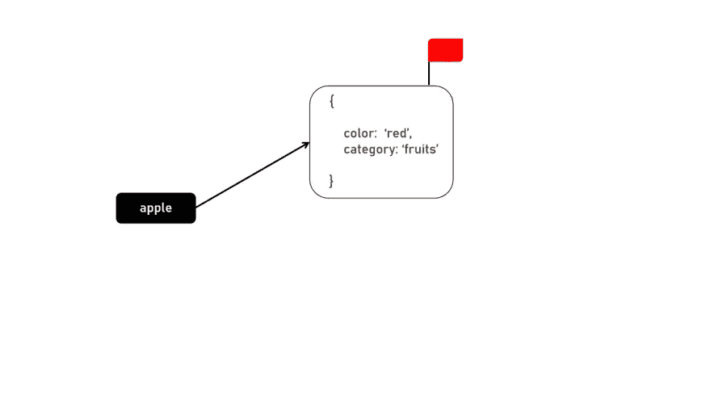
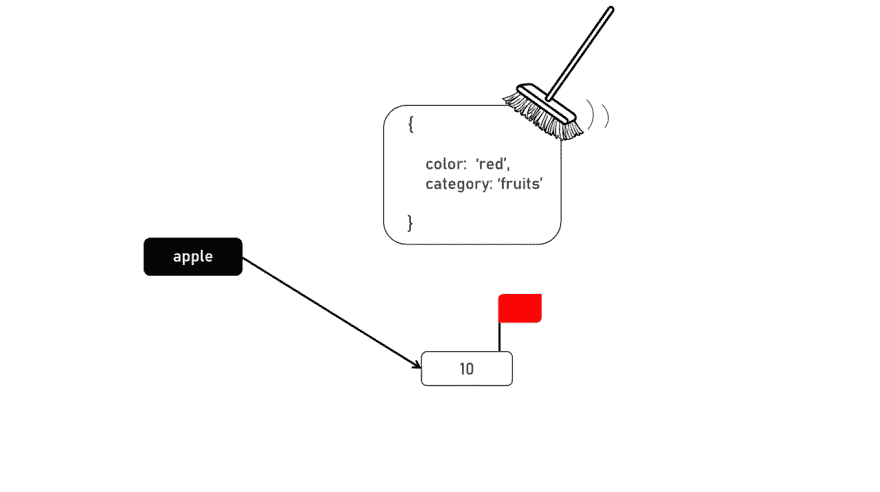

# Javascript 中的内存管理

> 原文：<https://levelup.gitconnected.com/memory-management-in-javascript-d3bb6b7f12ed>


Nubelson Fernandes 在 [Unsplash](https://unsplash.com?utm_source=medium&utm_medium=referral) 上的照片

**Javascript** 是一种高级语言，由现代浏览器(Javascript 引擎)完成垃圾收集。这给 Javascript 开发人员一种印象，他们既不需要知道幕后发生了什么，也不需要做些什么来改善他们的 Javascript 应用程序的内存管理。C 语言等低级语言速度更快、效率更高的原因之一是因为我们可以手动控制 GC，因此它们在内存管理方面更优化、更高效。

Javascript 内存管理由三个主要部分组成:

1)当我们给一个变量赋值时，它会自动分配一个可用的内存块来存储这个值，并引用链接到这个变量。

2)然后在脚本中使用该变量。

3)当变量不再被使用时(或者引用被移除)，堆中的内存将被自动释放，以防止内存泄漏。

如上所述，Javascript 使用标记和清除算法进行内存管理。基本上，它会标记脚本使用的内存引用，并清除其余的。

```
var apple = {
  color: 'red',
  category: 'fruits'
}
```



```
var apple = {
  color: 'red',
  category: 'fruits'
}

apple = 10
```



可能会出现垃圾收集无法释放未使用的内存并导致内存泄漏的情况。作为 Javascript 开发人员，我们可以做些事情来防止它们。内存泄漏的三个最常见原因是:

**1)事件监听器**
当 DOM 元素从 DOM 树中分离并且在 Javascript 中不再引用它时，事件监听器将被自动移除。然而，IE 等较旧的浏览器将无法正确处理这一问题。此外，我们还应该仔细规划事件侦听器的使用，因为在事件被触发之前，它们大部分时间都不会被使用，并且当这些 DOM 元素处于活动状态时，它们会占用内存。

**2)全局变量**这个全局执行上下文是在执行任何代码之前创建的，因此这些全局变量将总是被附加，而不会被垃圾收集。再次强调，规划很重要。尝试在阻塞范围内使用用“let”和“const”(不是“var”，如果我们用“var”声明，它将是全局对象的一部分)定义的局部变量，例如在函数中。当从堆栈中弹出函数调用时，函数中的局部变量会被自动清除。

**3)后台持续运行的东西**我们在使用 setInterval()等函数时也要小心。当我们在回调函数中使用一个变量时，这个变量总是被附加的，不会被清除。

> **结论**:
> 
> 先规划后执行，甚至是分配变量的逻辑。这将有助于提高您的应用程序的性能，尤其是当它扩展时。

如果你想看更多的网络开发或软件工程相关的内容，请关注我。干杯！