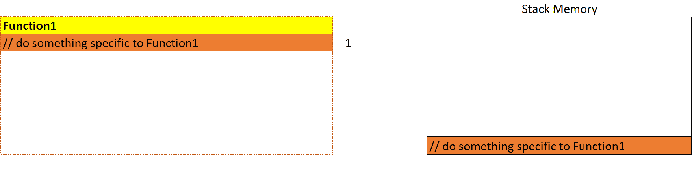

# 中的内存管理。网

> 原文：<https://levelup.gitconnected.com/memory-management-in-net-740b03d01e24>

## 回归基础

## 中关于内存管理的所有内容。NET 和重要的相关主题。


**内存管理。网**。由[杰瑞米·贝赞格](https://unsplash.com/@unarchive?utm_source=unsplash&utm_medium=referral&utm_content=creditCopyText)在 [Unsplash](https://unsplash.com/?utm_source=unsplash&utm_medium=referral&utm_content=creditCopyText) 上拍摄，由[艾哈迈德·塔里克](https://medium.com/@eng_ahmed.tarek)调整

# 介绍

这篇文章是关于**中的内存管理。NET** 框架以及与之相关的一些重要主题和概念。

## 议程

这些是我们将在本文中涉及的主题。

👉栈存储器

👉堆内存

👉变量分配

👉系统呢。字符串？

👉装箱和拆箱

👉碎片帐集

堆内存类型
【垃圾是什么？
▎性能指标
▎小对象堆(SOH)内存生成
▎大对象堆(LOH)呢？垃圾收集触发
垃圾收集过程

👉处置并最终确定

托管和非托管
内存泄漏
终结进程
终结器实现
释放和终结模式

[](https://medium.com/subscribe/@eng_ahmed.tarek) [## 🔥订阅艾哈迈德的时事通讯🔥

### 订阅艾哈迈德的时事通讯📰直接获得最佳实践、教程、提示、技巧和许多其他很酷的东西…

medium.com](https://medium.com/subscribe/@eng_ahmed.tarek) 

**堆栈内存**。由[Iva rajo VI](https://unsplash.com/@eklektikum?utm_source=unsplash&utm_medium=referral&utm_content=creditCopyText)在 [Unsplash](https://unsplash.com/?utm_source=unsplash&utm_medium=referral&utm_content=creditCopyText) 上拍摄，由 [Ahmed Tarek](https://medium.com/@eng_ahmed.tarek) 调整

# 栈存储器

堆栈内存被分配到计算机的 RAM 中。它用于静态内存分配。

堆栈存储器的优点是:

*   分配的变量直接存储在内存中。
*   程序编译时就完成了分配。
*   对这个存储器的访问非常快。

堆栈上的分配以**后进先出(LIFO)** 的方式保留，这意味着最近保留的块总是下一个要释放的块。这就是堆栈内存被用来跟踪嵌套函数调用的原因。

假设我们有下面这段简单的代码。

假设注释实际上代表了一些要执行的代码，当我们开始调用`Function1`时，这就是将要发生的事情。



**嵌套函数调用**。图片由[艾哈迈德·塔里克](https://medium.com/@eng_ahmed.tarek)拍摄

如您所见，在每个函数开始时，都会创建一个堆栈帧，直到函数完全执行后，这个堆栈帧才会被释放。当一个子函数被调用时，一个子框架被创建等等，…

这里值得一提的是，线程之间不共享堆栈内存。换句话说，对于每个线程，分配一个不与任何其他线程共享的新堆栈内存。


**堆内存**。照片由[里克·梅森](https://unsplash.com/@egnaro?utm_source=unsplash&utm_medium=referral&utm_content=creditCopyText)在 [Unsplash](https://unsplash.com/?utm_source=unsplash&utm_medium=referral&utm_content=creditCopyText) 上拍摄，由[艾哈迈德·塔里克](https://medium.com/@eng_ahmed.tarek)调整

# 堆内存

堆内存被分配到计算机的 RAM 中。它用于动态内存分配。

堆上的分配是在运行时完成的，可以随机访问。

访问堆内存有点慢，但是堆的大小只受虚拟内存大小的限制。

堆内存分为两部分:

*   小对象堆
*   大型对象堆(LOH)

关于这一点的更多细节将在本文后面介绍。

这里值得一提的是，堆内存是在线程之间共享的。


**变量分配**。照片由[哈里森·布罗德本特](https://unsplash.com/@harrisonbroadbent?utm_source=unsplash&utm_medium=referral&utm_content=creditCopyText)在 [Unsplash](https://unsplash.com/?utm_source=unsplash&utm_medium=referral&utm_content=creditCopyText) 上拍摄，由[艾哈迈德·塔雷克](https://medium.com/@eng_ahmed.tarek)调整

# 变量分配

**中使用的任何变量。NET** 会是两种类型之一；**值**型或**参考**型。

**值**类型是原始数据类型，如 Byte、SByte、Int16、Int32、Int64、UInt16、UInt32、UInt64、Single、Double、Boolean、Char、Decimal、IntPtr、UIntPtr 和 Structs。

引用类型是开发者定义的其他类型，包括类、接口、委托、字符串和对象。

现在，你可能会问:

> 这些变量存储在哪里？它们是否存储在堆栈存储器中？它们存储在堆内存中吗？

这个问题的答案是:

*   一个**引用**类型对象被存储在**堆**内存中，并且对它的引用被存储在**栈**内存中。
*   一个**值**类型对象总是存储在**堆栈**内存中，除非它被定义在一个类的第一级上。在这种情况下，它被存储在**堆**存储器中。

你不相信我？让我展示给你看。

假设我们定义了以下两个类:

现在，假设我们有这个简单的应用程序代码:

在这里，我们将逐个检查所有的情况，看看什么将被分配到堆内存中。为此，我们将使用 Rider memory tracer 向我们显示堆内存分配，并监视调用之间发生的变化。

第一步是检查何时定义一个`int`，就像我们在第 6 行所做的那样。因此，我们在第 6 行和第 10 行添加了一个断点。当我们到达第 6 行的断点时，在执行该行之前，我们刷新了 Rider 上的堆内存跟踪器。然后我们点击 continue，这样调试器就可以在第 10 行找到断点。然后，我们再次刷新了 Rider 上的堆内存跟踪器，以查看差异。

这就是不同之处:


**存储在堆栈中的值类型**。图片由[艾哈迈德·塔里克](https://medium.com/@eng_ahmed.tarek)拍摄

看，没有东西被分配到堆内存中。

现在，让我们检查一下什么时候定义一个类的实例，它的第一级没有定义任何值类型。此外，它有一个方法，我们将值类型定义为该方法的本地成员。

因此，对第 10 行和第 15 行的断点重复相同的步骤，我们将得到以下结果:


**堆中存储的引用类型**。图片由[艾哈迈德·塔里克](https://medium.com/@eng_ahmed.tarek)拍摄

看，我们只有一个新的条目被分配到类本身的实例的堆内存中。然而，我们没有为方法`F1`中定义的变量`int id`分配任何内存到堆内存中。

现在，让我们检查一下什么时候定义一个类的实例，它的第一级定义了值类型。

因此，在第 15 行和第 17 行的断点处重复相同的步骤，我们将得到以下结果:


**存储在堆中的 Class First Citizen 值类型**。图片由[艾哈迈德·塔里克](https://medium.com/@eng_ahmed.tarek)拍摄

看，我们只有一个新的条目被分配到类本身的实例的堆内存中。然而，当我们检查堆内存中的这个条目时，我们会发现它还包含了`int Id`类成员。

因此，简单总结一下:

*   引用类型总是存储在堆内存中，并引用堆栈内存。
*   如果一个值类型被定义到一个函数中，它将被存储到堆栈内存中。
*   如果值类型被定义为类的第一个成员(在类的第一层)，它将被存储到堆内存中。

如果你有兴趣看一段解释这个话题的视频，我真的推荐你去看[了解这个话题也很重要。所以，如果有兴趣的话，可以看一下文章](https://medium.com/u/a5fdd7e51866# </strong></p><p id=) [**将参数传递给一个. NET C#方法**](/passing-parameters-to-a-net-c-method-388badb7c095?sk=b5c21b7c4a8aca9a150ba64b5ba17825) 。


**系统呢。字符串？**照片由 [amirali mirhashemian](https://unsplash.com/@amir_v_ali?utm_source=unsplash&utm_medium=referral&utm_content=creditCopyText) 在 [Unsplash](https://unsplash.com/?utm_source=unsplash&utm_medium=referral&utm_content=creditCopyText) 拍摄，由 [Ahmed Tarek](https://medium.com/@eng_ahmed.tarek) 调整

# 系统呢。字符串？

作为一个**。NET** 开发者，你可能听说过`System.String`的性质。它在某种程度上是独一无二的，这种独一无二也带来了一些异常。

在处理`System.String`的时候，你需要记住它不仅仅是一个引用类型，它是一个特殊的类型。理解这一点肯定会影响您在应用程序中处理字符串的方式。

关于这一点，我已经写了一篇非常详细的文章。我真的建议你读一读。如果你有兴趣，可以阅读文章 [**如何串进来。NET C#作品**](/how-string-in-net-c-works-f1d69bfa30f5?sk=0f35a41a04bb4e508fd6dac17bd70ddf) 。


**装箱拆箱。**照片由[凯利·麦克林托克](https://unsplash.com/@kelli_mcclintock?utm_source=unsplash&utm_medium=referral&utm_content=creditCopyText)在 [Unsplash](https://unsplash.com/?utm_source=unsplash&utm_medium=referral&utm_content=creditCopyText) 上拍摄，由[艾哈迈德·塔里克](https://medium.com/@eng_ahmed.tarek)调整

# 装箱和拆箱

如果你是一个**。NET** 开发者，很可能你以前听说过**装箱**和**拆箱**。

让我向您展示一个简单的代码示例:

在第 1 行，我们定义了一个`int`。在第 2 行，我们定义了一个新的`Object`变量，并将其设置为我们在第 1 行定义的相同的`int`。

幕后发生的是`int`变量被包装成一个对象，存储到堆内存中。这就是我们所说的**拳击**。


**装箱拆箱**。图片由[艾哈迈德·塔里克](https://medium.com/@eng_ahmed.tarek)拍摄

在第 3 行，我们将`Object`变量转换回`int`。因此，对象被展开回到`int`。这就是我们所说的**拆箱**。

现在，你可能会问:

> 我们为什么要做这种事？是不是很奇怪？

实际上不是。有时装箱和解箱会在你不知道的情况下发生，这是由于某些**的设计。NET** 内置的函数和模块。

让我给你看一些有趣的东西。假设你正在实现一个简单的函数，它接受任何类型的对象作为参数，并做一些基本的事情，比如在这个对象上调用`.ToString()`。

你可能认为这是一个很好的方法:

```
public static void Func(object param)
{
    param.ToString();
}
```

它会工作并完成这个任务，但是如果你调用这个函数并传入一个`int`或者一些结构，它也会触发**装箱**。

想知道如何解决这个问题吗？让我展示给你看。

调用这些方法的方式如下:

内存分析如下所示:


**装箱拆箱。**图片由[艾哈迈德·塔里克](https://medium.com/@eng_ahmed.tarek)拍摄

看，这实际上是使用泛型的好处之一。然而，这并不总是一个简单的选择…

在我们的例子中，使用泛型很容易编写相同的函数，因为它只涉及一个参数。然而，如果它是关于无限数量的参数，这些参数可能有不同的类型呢？

让我们检查一下**中`String.Format`的实现。网**


**弦。格式**来自[微软](https://referencesource.microsoft.com/#mscorlib/system/string.cs,c07c3772222caaff)

您注意到预期的参数了吗？它们可以是任何数量和任何类型的。因此，如果我们试图使用泛型来实现这个方法，我们将会失败。

所以，在这种情况下，我们无法避免**拳**。

此外，有趣的是，当你做这样的事情时:

```
int id = 1;
return $"The generated id equals {id}";
```

你实际上是在做**装箱**，因为这最终会使用`String.Format`方法。


**垃圾收集。**照片由 [zibik](https://unsplash.com/@zibik?utm_source=unsplash&utm_medium=referral&utm_content=creditCopyText) 在 [Unsplash](https://unsplash.com/?utm_source=unsplash&utm_medium=referral&utm_content=creditCopyText) 上拍摄，由 [Ahmed Tarek](https://medium.com/@eng_ahmed.tarek) 调整

# 碎片帐集

在像 C 和 C++这样的语言中，开发人员负责清理分配的对象，这是一种开销，此外还有丢失一些分配的对象的风险，最终会导致内存泄漏。

在**中。网**，就不同了。**。NET 框架接管了将对象分配到堆中的任务，并代表您管理对象分配。**

作为一个**。NET** 开发者，你需要做的就是定义你的变量和**。NET** 将负责创建、初始化对象，并将对象放在正确的内存中。

再者，**。NET** 跟踪你的对象，并知道什么时候不再需要某个对象，以便可以释放它。

所以，现在你可能会问:

> 什么是垃圾收集？

在回答这个问题之前，让我告诉你在跳到垃圾收集之前你首先需要了解的一些重要的事情。


## 堆内存类型

我们之前说过，堆内存分为两部分；**小对象堆(SOH)** 和**大对象堆(LOH)** 。

**小对象堆** ( **SOH** )保存大小小于 **85K** 的已分配对象。

**大对象堆** ( **LOH** )保存着大于 **85K** 大小的已分配对象。

**SOH** 和 **LOH** 与**不同。NET 框架管理它们。请记住这一点，我们稍后将回到这一点。**


## 什么是垃圾？

单词**垃圾**指的是已经分配的不再使用的对象，这些对象可以被**公共语言运行时(CLR)** 从内存中完全移除和释放。

现在，你可能会问:

> CLR 如何知道一个对象是否是垃圾？

答案很简单，就是检查对象是否被一个**根**直接或间接引用。

我知道你可能会问:

> 还有什么是**根**？

根可以是下列之一:

*   堆栈内存中的引用。
*   全局对象。
*   静态对象。

当我们说一个对象被一个根直接**引用时，这意味着这个对象被上面描述的一个根类型引用。**

**另一方面，当我们说一个对象被根对象间接引用时，这意味着该对象被堆中已经被根对象直接或间接引用的另一个对象引用。**

**这意味着对象之间可能有一系列引用，除非系列中的第一个对象被根直接引用，否则整个系列都被视为垃圾。**

**CLR 所做的是维护一个更新的根对象图，以便在 CLR 需要检查某个对象是否是根对象时使用。**

****

****扎根与垃圾。**图片由[艾哈迈德·塔里克](https://medium.com/@eng_ahmed.tarek)拍摄**

**因此，现在 CLR 拥有了决定一个对象是否是垃圾所需的所有信息，对吗？**

****

## **绩效指标**

**现在我们知道了 CLR 如何决定某个对象是否是垃圾。然而，我们需要记住分配到堆中的对象数量。**

**在某个时刻，可能已经有大量的对象被分配到堆中。因此，如果每次需要为新对象分配一些内存时，CLR 只检查所有这些对象，这会对整体性能产生不良影响。**

**这就是为什么 CLR 在分析和处理内存分配时需要遵循另一种方法。**

**微软的天才们想出了一个应对这一挑战的好主意。**

****

## **小对象堆(SOH)内存代**

**微软的天才们决定将 SOH 分成三部分，这样 CLR 一次只能分析和处理一部分。**

**这意味着 CLR 每次能够处理较少数量的对象，而不是处理大量的对象。**

**现在，你可能会问:**

> **这三部分是根据什么决定的？**

**这是一个好问题。这三个部分背后的思想是基于被分配到 SOH 中的对象的性质。**

**简单地说，新对象释放的速度比旧对象快，旧对象可能被全局或静态根引用。**

**基于这个概念，CLR 将 SOH 分为三个部分，我们称之为**代**。**

**这意味着 SOH 分为:**

*   ****第 0 代**:在这里分配的对象比第 1 代和第 2 代中的对象更容易被释放。**
*   ****第 1 代**:这里分配的对象往往比第 2 代中的对象释放得更快。**
*   **第二代:这里分配的对象倾向于停留更长的时间。**

**现在，你可能会问:**

> **三代都一样大吗？**

**答案是否定的。**

**这三代的大小由 CLR 在运行时根据分配给每代的对象数量决定。**

**换句话说，CLR 在运行时调整这三代的大小，目的是基于对象分配的历史获得最佳性能。**

****

## **大对象堆(LOH)怎么办？**

**CLR 以不同的方式管理 LOH 中的对象分配。它不是分成几部分或几代。**

**实际上，人们称 LOH 为第 3 代**只是为了遵循相同的命名惯例，但在现实世界中，它并不遵循与 SOH 相同的过程。****

**LOH 没有被压缩，因为正如我们之前所说的，分配到 LOH 中的对象是大型对象，将这些大型对象复制到未使用的对象上需要很长时间。这会对整个演出产生不良影响。**

**这就是为什么 LOH 跟踪所有空闲和已用的内存位置和空间，并试图将新对象分配到由收集的对象留下的最合适大小的空闲槽中。**

**现在你可能会问:**

> **如果没有合适大小的空闲槽来分配新对象，该怎么办？**

**简而言之就是**碎片化**。**

**LOH 需要不时地进行碎片化，以压缩已分配对象之间的空闲空间，以便有更多大小合适的可用槽来分配新对象。**

****

## **垃圾收集触发器**

**现在我们知道了什么是垃圾，以及 CLR 如何决定将哪些对象标记为垃圾。**

**现在你可能会问:**

> **CLR 什么时候开始释放垃圾？**

**在 SOH 中，对于三代中的每一代，CLR 设置一个阈值，以便当达到该阈值时，CLR 触发这一代和所有更年轻一代的收集机制。**

**换句话说:**

*   **当达到第 0 代的阈值时，将触发第 0 代的收集。**
*   **当达到第 1 代的阈值时，将触发第 1 代和第 0 代的收集。**
*   **当达到第 2 代的阈值时，将触发第 2 代、第 1 代和第 0 代的收集。**

**现在你可能会问:**

> **LOH 呢？**

**实际上，我现在需要告诉你一些事情。LOH 是第二代 SOH 的一部分。**

**因此，每当触发第 2 代收集时，就会触发 LOH 收集。但是，您需要记住，收集过程并不那么简单，算法也很复杂，很难用几行代码来概括。**

****

## **垃圾收集过程**

**简单回顾一下，到目前为止，您已经了解了以下内容:**

*   **我们有四代人(第 0 代、第 1 代、第 2 代和第 3 代)**
*   **每一代都有一个由 CLR 设置和调整的阈值。**
*   **当达到层代阈值时，触发该层代的收集过程，然后触发更年轻层代的收集。**

**现在，让我们继续讨论收集过程的更多细节。**

**当某个层代的收集进程被触发时，分配给该层代的对象被分析和处理如下:**

1.  **使用 CLR 已经建立的图来发现和标记根对象。我们把这些天体称为 ***幸存下来的*** 天体。**
2.  **其他对象现在被标记为无根并准备收集。**
3.  **收集过程如前所述开始(对 SOH 进行复制和覆盖，对 LOH 进行适当大小的替换)。**
4.  **幸存的对象被提升到更高的一级。**

**这里有一个循序渐进的 gif 来帮助你可视化垃圾收集过程。**

****

****垃圾收集。**图片由[艾哈迈德·塔里克](https://medium.com/@eng_ahmed.tarek)拍摄**

**希望这能让你更容易理解。**

****

## **关于**垃圾收集**的重要说明**

1.  **当**垃圾收集**进程开始时，它会暂停所有其他的事情。这就是为什么过度触发**垃圾收集**进程会对整个系统的性能产生不良影响。**
2.  ****垃圾收集**过程可以通过调用`System.GC.Collect()`方法手动触发。**

********

****处置并最终确定。**由 [Roberto Sorin](https://unsplash.com/@roberto_sorin?utm_source=unsplash&utm_medium=referral&utm_content=creditCopyText) 在 [Unsplash](https://unsplash.com/?utm_source=unsplash&utm_medium=referral&utm_content=creditCopyText) 上拍摄，由 [Ahmed Tarek](https://medium.com/@eng_ahmed.tarek) 调整**

# **处置并最终确定**

**如果你做过**。NET** 开发者有一段时间，很可能你听说过 **Dispose** 和 **Finalize** 以及与实现它们相关的设计模式。**

**然而，在进入细节之前，我更喜欢讨论一些与这个主题相关的重要基础知识。**

**所以，还是一步步来吧。**

****

## **托管和非托管**

**在**中。NET** world 我们有两种类型的资源和代码；**托管**和**非托管**。**

**简单来说，**管理的**代码就是由**编译和维护的代码。NET** 框架。在这种情况下，代码被编译成通用语言**微软中间语言(MSIL)** ，然后由**运行。NET** 框架。这就给出了**。NET 框架完全控制代码、执行、内存分配、异常检查等等。****

**另一方面，非托管代码是在**边界之外编译和维护的代码。NET** 框架。在这种情况下，代码被写成另一种外语，编译成机器语言，由操作系统直接执行。这就是为什么会有**。NET 框架对代码、执行和内存分配都没有控制权。非托管代码的例子有文件流、数据连接等****

**因此，如果你的**。NET 系统处理一些非托管代码。NET 框架不能帮助你管理由非托管代码完成的内存分配。这个不如**。NET 框架需要知道如何在需要的时候释放这些资源。******

**因此，从**开始。NET 框架不知道如何在需要的时候释放这些资源。NET 框架决定将这一责任委托给开发人员，因为他应该是意识到这一点的人。****

**现在，你可能会问:**

> **开发人员如何干预管理这些非托管资源？**

**这个问题的简单答案是通过 ***实现一个终结器*** 。**

**但是，要理解这种说法的含义，请进入下一节。**

****

## **内存泄漏**

**你还记得我们讨论过的**垃圾收集**过程吗？实际上，为了关注 GC 过程本身，还有一些细节我没有提到。但是现在，这是正确的时间。**

**当 CLR 将一个对象标记为非根对象并准备好被收集时，此时 CLR 不知道该对象是否正在使用任何非托管资源。**

**这是一个大问题，因为这意味着对象可能正在使用非托管资源，如果这些资源没有被正确地释放，就会出现内存泄漏。这里的内存泄漏是指，尽管实际上并不需要内存分配，但是这些内存分配将与整个系统的寿命一样长。**

**此外，每当创建和收集相同类型的对象时，如果没有适当地释放所包含的非托管资源，这种内存泄漏可能会随着时间的推移变得越来越大。**

**现在，你可能会问:**

> **那么如何告诉 CLR 一个对象使用了一些非托管资源呢？**

**开发商和**之间有协议。双方都应该致力于的. NET** 框架。**

**这个协议就是，每当开发人员实现一个对象的**终结器**时，CLR 应该将这个对象标记为使用非托管资源。**

**现在，下一个问题是:**

> **然后呢？这个**终结器**会在什么时候以及如何被 CLR 使用？**

**同样，为了回答这个问题，让我们继续下一节。**

****

## **定稿过程**

**现在你可能想知道如何实现一个**终结器**。我现在要问你的是等一会儿，我很快会给你看这个。**

**现在，让我们假设您知道如何实现一个**终结器**，并且您已经为您的一些系统对象实现了它。**

**现在，回到**垃圾收集**过程。当一个对象被分配到堆中时，CLR 检查这个对象是否实现了一个**终结器**。**

**如果没有，就像我们在前面几节中解释的那样，没有什么特别的事情发生。**

**然而，如果对象实现了一个**终结器**，CLR 会在一个由 CLR 维护的特殊数据结构中添加对这个对象的引用。这种数据结构被称为**完成队列**。**

**然后，当一个对象准备好被收集时，CLR 检查这个对象是否被引用到**完成队列**中。**

**如果没有，就像我们在前面几节中解释的那样，没有什么特别的事情发生。**

**然而，如果对象被引用到**完成队列**中，CLR 从**完成队列**中移除该引用，并在 CLR 维护的另一个特殊数据结构中创建对同一对象的新引用。这种数据结构被称为**可访问队列**。**

**到目前为止，该对象还没有被收集，因为 CLR 知道应该在收集该对象之前调用该对象上的一个**终结器**。**

****可访问队列**由一个单独的运行时线程维护。如果队列为空，线程会休眠，直到新的条目被添加到队列中，然后线程开始调用所有对象的**终结器**到**可访问队列**。**

**这就是为什么总是建议不要试图依赖于调用**终结器**的时间，因为它是一个不确定的过程。**

**一旦**终结器**被调用，对**可访问队列**中对象的引用被移除，但是对象仍然没有被收集。**

**然后，当再次触发**垃圾收集**进程时，CLR 现在确定该对象已准备好进行收集，因为它既不是根对象，也没有被**完成队列**引用，也没有被**可访问队列**引用。**

**这就是为什么我们知道，当一个对象实现了一个**终结器**时，它会在多一个**垃圾收集**周期中存活更长时间。**

****

****最终确定和可访问队列。**图片由[艾哈迈德·塔里克](https://medium.com/@eng_ahmed.tarek)拍摄**

****

## **终结器实现**

**在**中。NET C#** ，我们可以通过定义一个**析构函数**来实现**终结器**，如下所示:**

**或者通过覆盖`Finalize`方法，如下所示:**

**但是，这是应该遵循的最佳实践吗？**

**不，当实现一个**终结器**时，有一个设计模式可以遵循。**

****

## **处理并最终确定设计模式**

**在深入设计模式的细节之前，让我告诉你更多关于 **Dispose** 和 **Finalize** 方法的信息。**

**主要是两者都负责清除非托管资源。主要区别在于 **Dispose** 方法是由开发人员显式调用的，而 **Finalize** 方法是由 CLR 以不确定的方式调用的，正如我们在前面的章节中所解释的。**

**他们之间还有其他的不同，但这些是目前最重要的。**

**现在，让我们检查**处置和定型模式**的实现。**

**假设我有下面的`MyClass`类:**

**如你所见，在我们的类中，我们正在创建一个已经实现了`IDisposable`接口的`System.Timers.Timer`类的实例。这是一个指示器，我们需要在释放我们的`MyClass`对象之前调用这个计时器的`Dispose`方法。**

**因此，按照 [**微软**](https://docs.microsoft.com/en-us/dotnet/standard/garbage-collection/implementing-dispose) 推荐的**处置定型模式**:**

**我们在这里可以注意到:**

*   **我们定义了私有字段`m_IsDisposed`,用于检查对象之前是否已经被释放。**
*   **我们定义了`protected virtual void Dispose(bool disposing)`来集中清理逻辑。**
*   **如果传入的参数是`true`，这意味着它正在被`Dispose`方法调用。在这种情况下，一切都被清理。**
*   **如果不是，这意味着它正在被`Finalize`方法调用。在这种情况下，只清理非托管资源。**
*   **请记住，在调用托管资源的`Dispose`方法之前，检查托管资源是否还没有`null`是一个最佳实践。**
*   **在`public void Dispose()`方法中，我们调用`GC.SuppressFinalize(this);`来告诉 CLR 跳过调用这个对象的 Finalize 方法，因为我们已经在释放的时候处理了非托管资源。**

**现在，假设我们有如下继承自`MyClass`的`MyChildClass`类:**

**现在，我们需要实现**处置定型模式**如下:**

**这里我们应该注意的是:**

*   **我们没有再次实现`public void Dispose()`方法。**
*   **我们否决了`protected virtual void Dispose(bool disposing)`方法。**
*   **我们在`protected override void Dispose(bool disposing)`方法的末尾调用了`base.Dispose(disposing);`。**

**这里值得一提的是，实现**终结器**并不是你应该经常做的事情。正如我们之前所说的，当 CLR 识别出一个对象实现了一个**终结器**时，这将把该对象的生命周期延长到又一个**垃圾收集**周期。**

**因此，只有当对象使用非托管资源时，才实现一个**终结器**。**

**B onus:阅读`System.Runtime.InteropServices.SafeHandle`以及如何使用它来代替**终结器**。**

********

****最后的想法。**照片由 [Pietro Rampazzo](https://unsplash.com/@peterampazzo?utm_source=unsplash&utm_medium=referral&utm_content=creditCopyText) 在 [Unsplash](https://unsplash.com/?utm_source=unsplash&utm_medium=referral&utm_content=creditCopyText) 拍摄，由 [Ahmed Tarek](https://medium.com/@eng_ahmed.tarek) 调整**

# **最后的想法**

**在本文中，我们已经在**中介绍了内存分配。NET** 框架以及与之相关的一些重要话题。**

**我鼓励你做自己的研究，阅读更多关于这个话题的内容。正如你所看到的，有很多细节，这就是为什么在一篇文章中涵盖所有细节并不容易。**

**另外，我以前发表过一篇关于递归及其对记忆的影响的文章。也许你想检查一下。如果你有兴趣，你可以阅读文章[中的**递归的诅咒。NET C#**](/curse-of-recursion-in-net-c-b017271ddbe6?sk=e1a1f74d42d80a82d433d5be37bc15ac) 。**

**最后，我希望你喜欢读这篇文章，就像我喜欢写它一样。**

****

# **希望这些内容对你有用。如果您想支持:**

**如果您还不是**中介**的会员，您可以使用 [**我的推荐链接**](https://medium.com/@eng_ahmed.tarek/membership) ，这样我可以从**中介**那里获得您的一部分费用，您无需支付任何额外费用。订阅 [**我的简讯**](https://medium.com/subscribe/@eng_ahmed.tarek) 将最佳实践、教程、提示、技巧和许多其他很酷的东西直接发送到您的收件箱。**

****

# **其他资源**

**这些是你可能会发现有用的其他资源。**

**[](/datetime-best-practices-in-net-c-4c2679fcc9e0) [## 中的日期时间最佳实践。NET C#

### 在中使用 DateTime 时要遵循的最佳实践。NET C#

levelup.gitconnected.com](/datetime-best-practices-in-net-c-4c2679fcc9e0) [](/prototype-design-pattern-in-net-c-67db46c3d28f) [## 中的原型设计模式。NET C#

### 中了解原型设计模式。NET C#

levelup.gitconnected.com](/prototype-design-pattern-in-net-c-67db46c3d28f) [](/protecting-public-methods-from-illogical-calls-in-net-c-91fcbb8bee33) [## 保护公共方法免受不合逻辑的调用。NET C#

### 包含代码示例和解释的完整指南。

levelup.gitconnected.com](/protecting-public-methods-from-illogical-calls-in-net-c-91fcbb8bee33) **