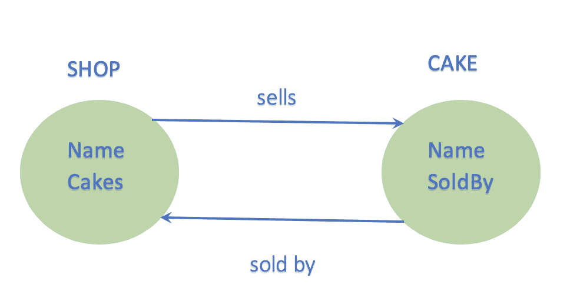
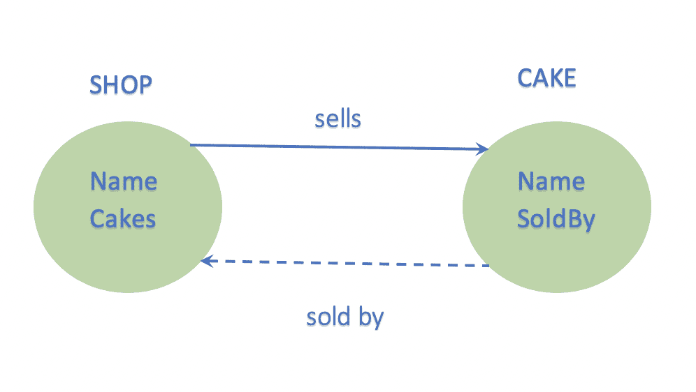

# 带 ARC 的 Swift 中的内存管理

> 原文：<https://levelup.gitconnected.com/memory-management-in-swift-with-arc-34f10d6f189a>

## Swift 内存管理快速指南，提高您的应用程序性能。

内存管理| RAM |内存泄漏

我们的设备📴有两种类型的内存来保存我们的数据:

*   磁盘存储器
*   随机存取存储器

当我们打开一个应用程序时， **RAM** 的一小部分被分配给该应用程序，其中存储了其类的所有实例。这块内存被称为**堆内存**，这是我们在讨论内存管理时提到的那部分内存。

> **堆**是**动态分配的**内存所在的内存(RAM)部分

由于堆内存非常有限，我们必须正确地管理它💰。糟糕的内存管理会大大降低应用程序的速度，并且迟早会导致崩溃。

# 但是 swift 是如何管理堆内存的呢？

Swift 使用一种叫做**自动引用计数** (ARC)的东西进行内存管理。每次创建一个类的新对象时，ARC 都会分配一些内存来存储与该对象相关的数据。每个对象都有一个**引用计数**属性，该属性跟踪所有对其有**强**引用的对象。每次创建一个强引用，该对象的引用计数就会增加 1。每当引用超出范围时，引用计数就减 1。

**但是对象是如何被释放的…**

让我们试着用一个例子来理解这一点。看看下面的商店类:

Swift 示例的内存管理—车间级

如果包含一个对象的 ViewController 超出范围，该对象将被释放。但是，如果对象是在函数内部创建的，那么它的作用域将只在函数内部。一旦函数执行完成，对象将被释放。

假设我们有一个视图控制器 MyViewController，我们在 viewDidLoad()方法中创建一个类 Shop 的对象，如下所示(假设它是一个蛋糕店🍰):

swift 示例的内存管理

在这种情况下，只要 MyViewController 不超出范围，就不会释放商店对象。但是如果我们定义一个函数 runApp()如下:

swift 示例的内存管理

并在 viewDidLoad()中调用 runApp()，而不是在那里创建对象，那么一旦 runApp()超出范围，商店对象就会被释放。

现在，引用计数通过跟踪对对象的引用来识别是否仍然需要该对象。一旦引用计数达到零，该对象将被释放，与该对象相关联的内存将被释放，供另一个对象使用💁。

# 那么内存泄漏是如何发生的呢？

当内容在其生命周期结束后仍保留在内存中时，就会发生内存泄漏。

简单来说，一个**内存泄漏**是一大块内存仍然被分配，但从未被使用过…🤔…

让我们想象这样一种情况，两个物体只相互参照，没有其他参照🗃 ↔️ 🗃.因为它们的引用计数都不能为零，所以它们不能被释放，并将继续占用内存。这被称为强**参考周期**或**保持周期🔄**。

让我们看一个例子。让我们定义一个类蛋糕如下:

swift 示例的内存管理

现在，如果我们将下面这段代码添加到 runApp():

`let cake = Cake(“Sweet Tooth Special Chocolate Truffle Cake”)`

这就产生了一个蛋糕的物体。接下来，在商店中添加属性“cakes”。

Swift 示例的内存管理

现在，如果我们在 runApp()中调用 sells()，它将创建一个保留循环。这将导致 ***内存泄漏*** 。

Swift | ARC |内存泄漏中的引用循环

商店和蛋糕之间的紧密联系

为了打破这种循环，我们使用**弱**和**无主**引用。

# 软弱？无主？🤯

为了打破保持循环，我们使用了**弱**引用。默认情况下，swift 中的所有引用都是**强引用**，并在创建时将引用计数增加 1。但是弱引用不会影响引用计数。此外，*弱引用总是可选变量，当引用计数变为零时，弱引用被设置为零*。

避免内存泄漏的弱引用|打破保持循环

从蛋糕到商店的弱参考

因此，如果我们回到我们的例子，在蛋糕类中，将“soldBy”的声明改为，

`weak var soldBy: Shop?`

当在 runApp()中调用 sells()时，对商店的引用计数不会增加。因此，当所有其他对 shop()的引用都被移除时，它将被释放，cake 的引用计数变为零。

与弱引用类似，**无主**引用不会影响对象的引用计数。但是与弱引用不同，*无主引用从来都不是可选的*。这意味着如果你试图访问一个指向一个已经被释放的对象的无主属性，这就像是强行打开一个为零的可选值。

重要的是，只有在引用和对象肯定会同时被释放的情况下，才应该使用无主引用。

等等…弱引用和无主引用除了一个是可选的而另一个不是之外是一样的吗…🤔。

嗯，不尽然…当我们谈论引用计数时，我们通常指的是对象的*强引用计数*。类似地，swift 为该对象维护一个*无主引用计数*和*弱引用计数*。但是真正将弱引用与无主引用和强引用区分开来的是弱引用指向一个被称为“**副表**的东西，而不是对象本身。这就是为什么，当弱引用超出范围时，对象可以被反初始化和释放…因为弱引用根本不指向对象。当强引用计数达到零时，对象被释放，但是如果无主引用计数大于零，它会留下一个悬空指针。

副表是一个单独的内存块，用来存储对象的附加信息。一个对象最初没有副表条目，当为该对象创建弱引用时，它会自动创建。

# 带闭合的参考循环

闭包是导致内存泄漏的引用循环的另一种方式。让我们以车间课堂为例来理解这一点。让我们向我们的商店类添加一个计算属性 cakeCount。

参考周期示例

如果我们在 runApp()中使用这个属性，一个商店对象通过计算属性 cakeCount 引用闭包，闭包通过“ **self** ”引用对象。由于这是一个双向的强引用，它创建了一个保留循环。

在这种情况下，我们使用**捕获列表**来捕获闭包中对 self 的弱引用或无主引用，如下所示:

捕获列表以避免内存泄漏示例

现在，关闭不会影响引用计数，只要商店超出范围，关闭也会影响引用计数。

这是一个总结。这涵盖了 Swift 内存管理的基础知识。感谢阅读！欢迎提出任何问题，非常感谢您的反馈，所以请留下您的评论！