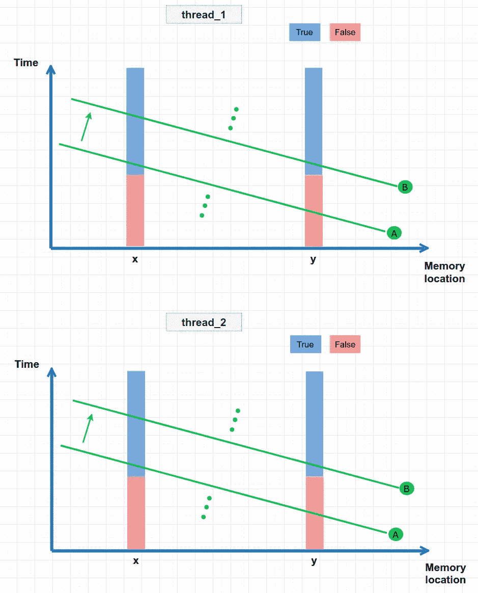

# 基本记忆模型

> 原文：<https://levelup.gitconnected.com/memory-model-basic-d8b5f8fddd5f>

## C++中多线程编程的内存排序


[Andrew Ridley](https://unsplash.com/@aridley88?utm_source=medium&utm_medium=referral) 在 [Unsplash](https://unsplash.com?utm_source=medium&utm_medium=referral) 上拍摄的照片

# 介绍

众所周知，从 C++11 开始，`std::atomic<T>`就作为标准库的一部分被引入。可能该功能最明显的部分是每个实例化的类型`std::atomic<T>`可以在不同的线程上自动操作，而不会导致任何数据竞争。但是，为了避免棘手的错误，或者为了提高程序的性能，了解`std::atomic<T>`的另一个方面是很重要的。这与记忆模型有关，尤其是记忆排序。

C++标准中规定了六种内存排序:`memory_order_relaxed`、`memory_order_consume`、`memory_order_acquire`、`memory_order_release`、`memory_order_acq_rel`和`memory_order_seq_cst`。您可以使用如下原子操作来指定这些内存排序。

```
example) x.store(true, std::memory_order_relaxed);
```

这六种型号可以大致分为以下三个订购类别。

*   轻松排序(`memory_order_relaxed`)。
*   获取-发布排序(`memory_order_consume`、`memory_order_acquire`、`memory_order_release`、`memory_order_acq_rel`)
*   顺序一致排序(`memory_order_seq_cst`)

在这篇文章中，我将使用简单的图表和具体的例子来解释这三个类别，希望它能给你足够的理解来研究每个 memory_order 选项的细节。

# 宽松订购

首先，我将解释放松排序(`std::memory_order_relaxed`)。让我们看看下面的示例程序。如您所见，有两个线程(`thread_1`和`thread_2`)。

在`thread_1`中，将`true`存储到原子对象`x`，然后将`true`值存储到原子对象`y`。

在`thread_2`中，它在一个`while`循环中检查`y`的值，并重复直到它读取`true`为止。在它退出循环后，如果`x`的值是`true`，那么它打印`"y == true also x == true”`。

```
#include <atomic>
#include <thread>
#include <iostream>std::atomic<bool> x,y;void func_1() {
  x.store(true, **std::memory_order_relaxed**);
  y.store(true, **std::memory_order_relaxed**);
}void func_2() {
  while(!y.load(**std::memory_order_relaxed**));
  if(x.load(**std::memory_order_relaxed**)) {
    std::cout << "y == true also x == true \n";  **// This might not be executed.**
  }
}int main() {
 x = false;
 y = false;
 std::thread thread_1(func_1);
 std::thread thread_2(func_2);
 thread_1.join();
 thread_2.join();
}
```

那么程序执行的结果是什么呢？由于在`thread_1` ( `func_1`)中`y`被设置为`true`之前`x`被设置为`true`，您会期望程序总是打印`"y == true also x == true"`。然而，事实是`"y == true also x == true”` **可能不会被打印(可能会被打印，但标准不保证)。**

这是为什么呢？当然，现代编译器，CPU 可以重新排序内存访问操作(如`x.store, x.load`)进行优化。

但是，这种意外不会发生在单线程程序中。在单线程程序中，只有在不破坏最终结果的情况下，编译器和 CPU 才被允许进行重新排序(称为“好像 rule⁴). ”)假设规则对程序员来说是直观的，因为由此产生的可观察到的效果看起来就像编写的程序是按原样执行的(没有任何重新排序)。

相反，在多线程程序中，指定的内存排序决定了编译器和 CPU 可能的重新排序。

`memory_order_relaxed`上例中指定的是约束最少的排序。它在不同线程之间的内存访问操作顺序上几乎不提供同步。一个例外是，它确实保证了在不同的线程中对同一对象的修改顺序必须相同。

那么这意味着什么呢？让我试着用一些概念图来解释一下。


横轴代表内存位置。您可以看到示例程序中的对象`x`和`y`位于两个不同的内存位置，它有两个随时间变化的状态(`True`、`False`)。

绿线代表在特定时间从特定线程的角度来看的“内存快照”。这个“观点”是关键部分。它们是在特定时间从特定线程“观察”到的内存快照。所以，对于一个线程来说，在某一时刻内存中的值看起来就像你沿着绿线切片一样。从概念上讲，沿着绿色箭头的方向有无限的快照。

由于上述同步要求“在不同的线程中，对同一对象的修改顺序必须相同”，快照线不会彼此交叉。所以所有的线程仍然在每个内存位置观察相同的事件顺序。

有趣的部分来了。可以看到，`thread_1`(上)和`thread_2`(下)有各自的快照线，以各自的方式(不同的角度)切分内存位置空间。

为了解释示例程序令人惊讶的结果，我们需要看看从 A 行到 b 行的转换。

从`thread_1`的角度看，它看起来像(见绿线交叉的点处`x`、`y`的值)

1.  首先，`x`被设置为`true`。
2.  然后，`y`被设置为`true`。

从`thread_2`的角度来看，它看起来像

1.  首先，`y`被设置为`true`。
2.  其中，`x`设置为`true`。

因此，从`thread_2`的角度来看，可能存在 y 是`true`而 x 是`false`的情况。这就是为什么示例程序可能不会打印出预期的结果。

通常，与其他选项相比，宽松排序的同步开销最小。然而，正如你所看到的，对实践中的行为进行推理是不直观和困难的。

# 获取-发布订单

接下来，我们来看看获取-发布排序(`memory_order_acquire`、`memory_order_release`)。与宽松的排序相比，获取-释放排序增加了线程之间的同步。它确保存储和加载相同原子对象的线程之间的同步。

让我们看看下面的例子，`thread_1`正在存储，`thread_2`正在分别加载`y`与`memory_order_release`、`memory_order_acquire`选项。为了使获取-释放排序工作，必须在同一个原子对象上成对使用`memory_order_release`、`memory_order_acquire`选项。

获取-释放排序保证了一个线程中发生在存储操作(在本例中为`y.store(true, std::memory_order_release)`)之前的所有内存操作对于正在进行相应加载操作的另一个线程(同样，`y.load(std::memory_order_acquire)`)是可见的。

```
#include <atomic>
#include <thread>
#include <iostream>std::atomic<bool> x,y;void func_1() {
  x.store(true, std::memory_order_relaxed);
  y.store(true, **std::memory_order_release**);
}void func_2() {
  while(!y.load(**std::memory_order_acquire**));
  if(x.load(std::memory_order_relaxed)) {
    std::cout << "y == true also x == true \n";  **// This is guaranteed to be executed.**
  }
}int main() {
 x = false;
 y = false;
 std::thread thread_1(func_1);
 std::thread thread_2(func_2);
 thread_1.join();
 thread_2.join();
}
```

所以，这一次，内存快照图如下所示。基本上，额外的释放-获取同步确保了`thread_1`和`thread_2`的内存快照行看起来相似(为简单起见，在下图中绘制为相同的)。为什么？因为当`thread_2`加载`y`时，在`thread_1`存储`y`之前完成的所有内存操作都应该对`thread_2`可见。为了确保从 A 到 B 的过渡期间`thread_2`的内存快照行(它如何随着时间分割内存空间)应该看起来像`thread_1`中的那些。如果以`x`、`y`更新的顺序为例，在从 A 到 B 的转换过程中，从两个线程来看，它看起来像

1.  首先，`x`设置为`true`。
2.  然后，`y`被设置为`true`

因此，使用发布-获取排序，可以保证示例程序打印出`"y == true also x == true”`。


因此，如您所见，发布-获取订购模式看起来比宽松订购模式更直观。然而，有些情况下它会产生令人惊讶的结果。让我们看下一个例子。

```
#include <atomic>
#include <thread>
#include <assert.h>
#include <iostream>
std::atomic<bool> x,y;void func_1() {
  x.store(true, **std::memory_order_release**);
}void func_2() {
  y.store(true, **std::memory_order_release**);
}void func_3() {
  while(!x.load(**std::memory_order_acquire**));
  if(y.load(**std::memory_order_acquire**)) {
    std::cout << "x == true then also y == true \n"; 
  }
}void func_4() {
  while(!y.load(**std::memory_order_acquire**));
  if(x.load(**std::memory_order_acquire**)) {
    std::cout << "y == true then also x == true \n";
  }
}**// It is possible that neither func_3 or func_4 executes print out**.int main() {
 x = false;
 y = false;
 std::thread thread_1(func_1);
 std::thread thread_2(func_2);
 std::thread thread_3(func_3);
 std::thread thread_4(func_4);
 thread_1.join();
 thread_2.join();
 thread_3.join();
 thread_4.join();
}
```

此时，有四个线程。两个独立的线程(`thread_1`、`thread_2`)分别存储`x`、`y`。`thread_3`和`thread_4`以不同的顺序加载`x`、`y`，如果`x`、`y`都是`true`，则打印出信息。

对于`x`、`y`，每个线程中的存储/加载操作与相应的`std::memory_order_release`和`std::memory_order_acquire`存储/加载操作正确配对。目前看来一切正常。

如果我们天真地猜测可能的执行结果，程序会打印，

1.  `x== true then also y == true`或者，
2.  `y == true then also x == true`或者，
3.  `x== true then also y == true`和`y == true then also x == true`

然而，再次令人惊讶的是**程序可能** **不打印任何东西。**

让我们回到内存快照图。如你所见，`thread_3`和`thread_4`有不同的内存快照线。并且使用之前的类似解释，集中在两个线程上从 A 到 B 的过渡，

从`thread_3`看起来，

1.  首先，`x`设置为`true`。
2.  然后，`y`被设置为`true`。

从`thread_4`看起来，

1.  首先将`y`设置为`true`。
2.  然后，`x`被设置为`true`。

因此，示例程序可能不会打印出预期的结果。那么，我的观点是什么？基本上，释放-获取排序确保具有相应存储-加载对的线程是同步的，但是，如果它们没有与存储-加载操作配对，它不会强制线程同意该排序(因此，`thread_3`和`thread_4`)。


因此，与宽松的排序相比，释放-获取排序对线程间的同步有更多的保证(有更多的开销)。然而，它仍然具有不直观的结果，因为仍然不同的线程可以具有不同的存储器快照线，如在上面的例子中所看到的。

C++标准有更严格的内存排序可以解决问题(开销更大)。这被称为顺序一致排序，这是我们接下来要看的。

# 顺序一致排序

最后的记忆排序是顺序一致排序模型(`memory_order_seq_cst`)。这是最严格的排序，它保证了程序员最直观的结果。因为这是唯一容易推理的排序模型，所以如果不指定原子操作的排序模型，这将被设置为默认选项。

顺序一致性排序不仅保证线程之间的同步与释放-获取排序相同，还保证所有线程必须看到相同的内存操作顺序。换句话说，它保证在不同的线程中只有一个共同的内存操作历史顺序。

让我们看看下面的示例程序，

```
#include <atomic>
#include <thread>
#include <assert.h>
#include <iostream>
std::atomic<bool> x,y;void func_1() {
  x.store(true, **std::memory_order_seq_cst**);
}void func_2() {
  y.store(true, **std::memory_order_seq_cst**);
}void func_3() {
  while(!x.load(**std::memory_order_seq_cst**));
  if(y.load(**std::memory_order_seq_cst**)) {
    std::cout << "x == true then also y == true \n";
  }
}void func_4() {
  while(!y.load(**std::memory_order_seq_cst**));
  if(x.load(**std::memory_order_seq_cst**)) {
    std::cout << "y == true then also x == true \n";
  }
}int main() {
 x = false;
 y = false;
 std::thread thread_1(func_1);
 std::thread thread_2(func_2);
 std::thread thread_3(func_3);
 std::thread thread_4(func_4);
 thread_1.join();
 thread_2.join();
 thread_3.join();
 thread_4.join();
}
```

此时，所有的原子操作都用`memory_order_seq_cst`标记。

这保证了`thread_1`、`thread_2`、`thread_3`和`thread_4`之间只有一个共同的内存操作历史顺序。这与所有具有相同快照行的线程具有相同的含义，如下所示。



在这种特殊的情况下，它恰巧是共同商定的快照行说

1.  首先，`x`设置为`true`。
2.  然后，`y`被设置为`true`。

因此，至少来自`thread_4` ( `func_4`)的打印执行`y == true then also x == true`。

# 结论

从 C++11 开始，多线程程序的内存排序模型作为语言标准的一部分与多线程同步的标准库一起被引入，例如运行在内存模型之上的`std::atomic`。这使得编写可移植程序变得更加容易，因为在 C++11 之前，内存排序模型只由每个特定的体系结构定义。

该语言提供了多种内存排序选项用于`std::atomic`操作。

给出最直观的行为，这种行为很容易推理，通常是你在大多数情况下需要的。因此，`memory_order_seq_cst`是标准库中所有原子操作的默认选项。

尽管如此，如果您需要理解或调试其他人编写的使用除`memory_order_seq_cst` 之外的内存排序的程序的行为，或者如果您需要优化程序并且您不能容忍`memory_order_seq_cst`产生的开销，了解其他选项是有帮助的。

使用内存快照映像，希望您能够掌握可能的内存排序的基本概念，并准备进一步检查它们的细节。

如果你想了解更多的话题，我推荐你去看看赫伯·萨特的[视频](https://channel9.msdn.com/Shows/Going+Deep/Cpp-and-Beyond-2012-Herb-Sutter-atomic-Weapons-1-of-2)。

[1]:[https://en . Wikipedia . org/wiki/Memory _ model _(编程)](https://en.wikipedia.org/wiki/Memory_model_(programming))

【2】:[https://en.wikipedia.org/wiki/Memory_ordering](https://en.wikipedia.org/wiki/Memory_ordering)

[3]:[https://en.cppreference.com/w/cpp/atomic/memory_order](https://en.cppreference.com/w/cpp/atomic/memory_order)

[4]:[https://en.wikipedia.org/wiki/As-if_rule](https://en.wikipedia.org/wiki/As-if_rule)