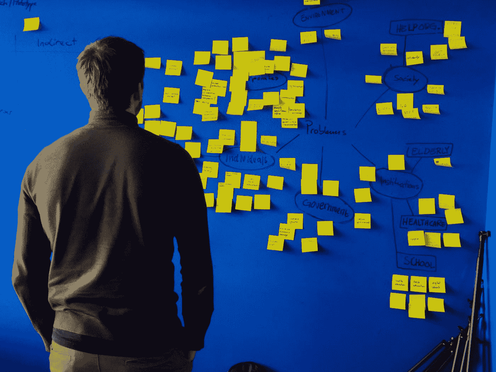

# 程序员的 5 个心智模型

> 原文：<https://levelup.gitconnected.com/mental-models-for-programmers-a4611e19bf99>

## 提升开发人员职业生涯的技巧

由 [Unsplash](https://unsplash.com?utm_source=medium&utm_medium=referral) 上的[记者](https://unsplash.com/@perloov?utm_source=medium&utm_medium=referral)拍摄

有成千上万种编程语言和范式，重要的是不仅要很好地理解你正在学习的东西，还要意识到“更大的图景”——一种说明不同技术之间关系的心理模型，以便理解一切。

本文将探索我们如何编码的不同模型。其中一些模型很实用，容易掌握，而另一些不太明显，但是为了从代码猴子成长为合法的系统架构师，它们完全值得理解。

*第一部分将讨论软件中的一些通用概念，以及这些概念如何与其他学科(如生物学和物理学)相关联，而最后一部分更高级一些，讨论机器学习如何融入这些模型。*

# 1.学会如何学习

对于每个架构师来说，快速、轻松地学习是一项关键技能。每一项技能培养都可以从做正确的事情开始，然后让它变得更容易、更好。

因此，你应该接受持续的学习过程，跟上新技术的步伐。

你需要学习如何教会自己和他人这个系统是如何工作的，以及它在解决什么问题。

# 2.发展同伴指导技能

吸收知识并成为多个领域的专家对于建筑师来说是非常重要的技能。

架构师需要找到帮助他人成功的最佳方式。

# 3.缩小以查看大图

如果一个架构师从开发人员的角色上升，他们必须接受上升所需要的过程变化。他们需要接受使用许多工具和编程语言的培训。

随着编程和软件架构的发展，你需要足够的灵活性，永远不要限制你的知识或者用某些设计决策来束缚自己。

# 4.个人智力成长

一旦你沉浸在发展的世界中，很容易满足于你所知道的，并失去学习新事物的动力。通过建立领导声誉和成为一名建筑师，你的个人成长将会增加，因为它将变得清晰，有其他方式让你作为一个个体成长。

# 5.培养懂 It 的工程师

一个架构师需要伟大的工程师，他们明白这不是关于他们和他们的代码工作。

它是关于解决最终用户的问题—无论是数据建模还是针对生产中的真实数据运行报告。

# 想要更多吗？

感谢阅读！获取更多关于🧠工程、技术和领导力的故事💡您可以 [**加入我们的免费电子邮件简讯**](https://rakiabensassi.substack.com/) 或在这里 报名参加 Medium [**。**](https://rakiabensassi.medium.com/membership)

 [## 如何从一个代码猴子变成一个合法的系统架构师

### 如何进入软件工程师的下一阶段的 6 个技巧

levelup.gitconnected.com](/how-to-become-a-legitimate-system-architect-3ccf686e9712)  [## 像专家一样解决编码问题的 3 个技巧

### 提出问题，进行根本原因分析，等等

better 编程. pub](https://betterprogramming.pub/problem-solving-techniques-b1ed8b4c729f)