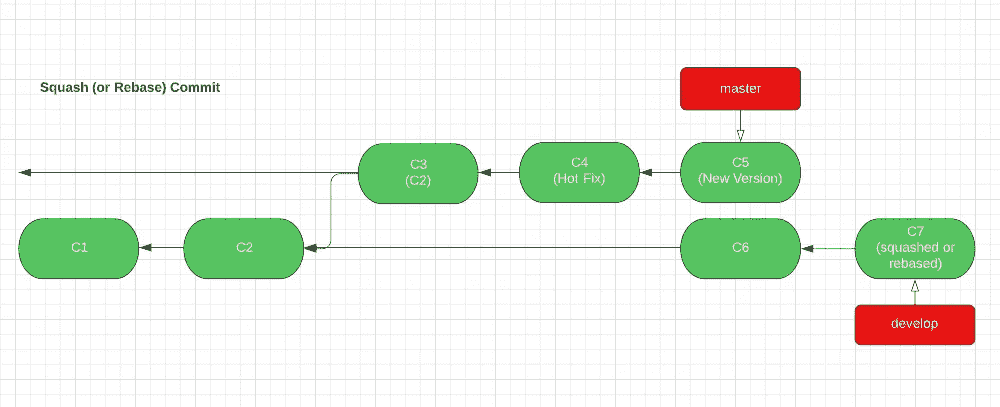

# 合并冲突… WTH？！

> 原文：<https://levelup.gitconnected.com/merge-conflicts-wth-d9f50ea1db0e>

## 解释发布示例中的 Git 分支合并和冲突

# 介绍

Git 是一个强大的版本管理工具，多年来一直被广泛采用。但是有些概念可能不是很好理解。我们最近在发布分支合并中遇到了合并冲突。通过深入研究，它帮助我揭开神秘面纱，并获得一些关于 *Git / Github* merge 如何工作的见解。我觉得很有趣，很乐意分享这个故事。

# Git 分支的关键概念

让我们从一些关于分支和合并的关键概念开始。它们是我的理解，所以不是规范的定义:)

## 1.分支只是提交的一个名称标签

> *分支简单来说就是* *只是一个* ***名称标签，指向一个提交*** *(不像 cvs、subversion 等其他 VCS。)*

例如分支*主*只是一个指向*提交 b6362* 的名称标签。分支*开发*指向*提交 60d31。*

图一。Git 分支

## 2.“在分支上”是什么意思

> *一个提交是*“在分支上”*意味着该提交是一个* ***祖先*** *，或者是从分支名称指向的提交通过父链* *可到达的* ***。***

以上图为例，我们可以说:

*   提交 *b6362(C2)* 在分支*开发者*上，因为该提交是 *60d31(C3)* 的祖先提交，分支*开发者*指向该提交
*   提交 *38a9c(C1)* 在*主*和*开发*分支上，因为它在提交*b 6362(C2/主)*和提交*60d 31(C3/开发)*的父链上

## 3.“合并分支”是什么意思

> “将分支 A 合并到分支 B”*意味着将分支* A ***上的所有提交也合并到分支* B** *上。*

有两种合并，我们将深入研究每一种。

*   **快进** **合并**
*   **创建合并提交**(又名**三向合并**)

# 快进合并

当“将分支 *A* 合并到分支 *B* 时”，分支 *B* 指向**的提交已经在分支*A*上。**

应用于实例:将分支*developer(A)*合并到分支 *master(B)* 时， *master(B)* 指向的提交已经在分支 *developer(A)* 上。现在运行:

***git 结账大师
git 合并开发***

快进合并设置

回想一下“合并分支”的实际含义:

> “将分支 A 合并到分支 B”意味着将分支 A **上的所有提交也合并到分支 B** 上。

为了让分支*上的所有提交也在分支*主*上开发*。最简单的方法是将分支名称 *master* 移动到 *develop* 分支指向的同一个 *commit(C3)* ，如下所示。

现在我们实现了我们的目标:让分支*上的所有提交也在分支*主*上开发*。注意，Git 中的实现有点反直觉，因为我们实际上并没有将*开发*提交转移到*主*中。相反，我们只是将主*分支*的名称标签向前移动。因此这种操作被命名为*快进合并*。

在发布管理的一个简单版本中，我们使用*主*分支作为发布分支，所有特性工作都交给*开发*分支。在发布的时候，我们只是把*开发*合并成*主*。如果我们继续使用*提交 C4* 进行下一个发布周期，它将看起来像这样。诸如此类。

## GitHub 的细微差别

理解了普通版本的*快进合并*的工作原理后，如果你使用任何基于 Git 的托管服务，比如 *GitHub* ，它可能会有自己的细微差别。在 *Github* 中，所有的分支合并都默认带有参数***-no-ff "***，表示“不快进”。

Github 命令的副本

*Github* 想要维护一个分支拓扑，所以它阻止了*快进*操作。所以所有的合并都会创建一些**新合并提交**作为结果。这实际上引出了第二种类型的合并:创建合并提交。

# 创建合并提交(三向合并)

由于有了 *- no-off* 参数， *Github* 将为*主*创建一个新的*合并提交(C4)* 以从*开发*进行合并。注意 *C4* 是一个新提交，但是它的快照与 *C3* 完全相同。还要注意， *develop* 分支上的所有提交现在也在 *master 上，*因此合并成功*。*(有一个关于*三向提交*的细节，我在这里省略了，但是当我们进入下一个发布周期时，我们会用一个完整的提交链设置来补充这个细节)

由于新功能 *(C5，C6)* 仍然被添加到开发分支，我们将到达这一点:

现在，发布: ***git 结账大师
git 合并-无-ff 开发***

这是*三路合并*的经典设置。Git 将执行以下操作来实现它。

*   Git 将寻找最接近的公共祖先提交，它在两个合并分支上。换句话说，这个祖先提交可以从两个分支到达。这个祖先被称为*合并基础*。
*   然后 Git 将计算从*合并基础*到两个分支的 **2 差异**
*   **将两种差异**应用于*合并基础*。如果成功，创建一个新的合并提交。如果失败，报告冲突。

在示例中，我们想要合并*主*(原本在 *C4* )和*开发(C6)* 。

*   他们最近的共同祖先是 *C3(合并基地)*。
*   C3 和 C4 的不同之处在于之前的合并。所以这里没有区别。
*   C3 与 C6 的差异
*   *将两种差异应用到*合并基础(C3)* 。因为 *C3-C4* 之间没有真正的差异，Git 只需要应用 *C3-C6* 的差异。因此创建了一个新的提交 *C7* 。由于这是从*开发*到*主*的合并，Git 将*主*分支名称移动到 *C7* 。合并操作成功。(另请注意， *C7* 的快照内容也与 *C6* 相同)*

*现在我们也看到了为什么取名为“三合”。因为 Git 执行合并涉及到三个重要的提交。*

# *热修复和合并冲突*

*现在我们已经明白了两种类型的 Git 分支合并(*快进* & *三向*)是什么意思。让我们回到**最初促使我下去调查的事件**:*

> *当我们管理我们的应用程序版本(Android 项目)时，我们意识到每当我们将*热修复*添加到*主*分支(发布分支)并将其合并回*开发*分支(主干分支)时，如果我们在 Github 上使用 ***挤压或 rebase merge，下一次我们发布时，Git 总是会告诉我们关于**冲突**，即使我们已经合并了所有内容 WTH？！****

## *热修复方案*

*比方说，我们需要在 master 上安装一个*热补丁*。提交 *C4* 就是为此创建的，然后我们用提交 *C5* 更新了应用版本。现在师父指向 C5。同时，在开发分支上， *C6* 作为一个新特性被添加。*

**

## *场景#1:创建一个合并提交(三向)来合并回*

*为了将*热修复*和版本更新带回*开发*，我们需要通过创建一个合并提交将*开发*合并到*主*。同样，基于三向合并的工作方式，Git 将执行以下操作并创建 C7 作为结果。*

**

*在这个合并逻辑中，Git 发现 *C2* 作为共同的祖先和合并基础，同时应用两个 diff(*C2-C5*&*C2-C6*)。假设没有冲突(意味着同一文件的同一行中有 2 个不同的更改)，将创建一个新的合并提交 *C7* 。*主*修改回*现在开发*。这个发布周期就完成了！*

*值得注意的是:在 Github 中，有 3 个合并动作可用:*

**

*我们希望确保**创建一个合并提交**。它将变得很重要。原因如下:稍后，当我们有了*上的*C8*develop*并准备好下一个版本时:**git merge develop(HEAD on master)***

**

*Git 将在这里执行另一个 3 路合并。问题，你能指出*主(C5)* 和*发展(C8)* 分支的共同祖先吗？*

*答案是他们的**共同祖先是…*C5*。原因是 *C5* 已经在主节点上， *C5* 也在*开发*分支上，这要感谢 *C5 & C7* 之间的链接(上面用红色标出)。***

*从 *C5* 开始，Git 将应用 2 个 diffs。 *C5* 到*主*的差为零。所以 Git 只需要应用 *C5-C8* 的 diff。因为没有冲突，所以保证了成功的合并提交。在这种情况下，创建 *C9* 并将*主*标签移动到 *C9* 。结果如下所示。*

**

## *场景#2:挤压或重定基础合并以应对未来的冲突*

*之前，在 *Github* 上，我们为*主*创建了一个三向合并提交，以返回到*开发*。但是如果我们做了**挤压**或者**重置基础合并**，下一个发布周期的结果将会不同。让我们玩到底。*

*当合并回热修复程序时，如果我们选择**挤压或重设基础合并** …*

****

**提交 C7* 将作为**挤压或重置**的结果而创建。注意*C5&C7*之间没有**链接。***

*在下一个发布周期，当我们想要将 *develop* 合并到 *master* 时，git tree 将会是这样的。*

**

*这种情况下的共同祖先在哪里？由于 *C5 & C7* 之间缺少联系，**共同祖先**现在竟然在***【C2***，这是上一个发布周期的分叉点。在这种情况下，Git 将如何执行合并呢？*

*假设我们在一个配置文件中定义了一个发布版本号。*

*   *在 *C2(合并基础)*，版本为***v 1.0****(之前版本)**
*   **在 *C5(主)*时，是 ***v1.1*** (热修复)**
*   **在 *C8(开发)*时，是***v 2.0****(下次发布)***

******

***冲突***

*   ****C2 & C5* 的区别是将**版本从 *v1.0 更新到 v 1.1******
*   ***C2 & C8* 的区别是将**从 *v1.0* 更新为*v 2.0*****

**当 Git 在 *C2(合并基础)*上应用两种差异时，Git 在同一文件的同一行上有**两种不同的更新。Git 不知道应用哪个 diff，所以它通过说**合并冲突**来认输。****

**现在，这个难题被解决了:当我们在上一个发布周期合并热修复时，不同类型的合并方法会在下一个发布周期开始时导致不同的结果。**

**当然，冲突并不是世界末日，仍然可以手动解决。但是如果我们理解了根本原因并相应地设置了分支规则，我们就可以防止常规的麻烦发生，这对于大型开发团队来说尤其重要。**

# **结束**

**我从这个练习中学到了不少关于*GIT*&*Github*的东西。我相信因为它们都是事物如何运作的基本概念和机制，它们应该也适用于解决许多其他相关的 *Git* 难题。希望这篇文章能有助于更深入的理解，这样我们就能在日常工作中更舒适、更自信地使用 Git。**