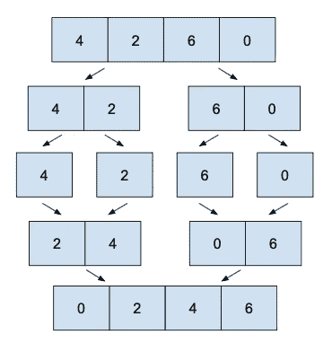

# 合并排序

> 原文：<https://levelup.gitconnected.com/merge-sort-656f8ee59d83>

## 归并排序是一种“分治”算法；它很省时，也是我的最爱。

它的工作方式是将数组分成两部分，递归调用自身，然后**合并两个排序后的部分。**这是一种高效的排序算法。

对于这个排序算法，我们需要两个函数，**一个用于拆分**，而**一个用于重新组合**被拆分的部分；让我们深入研究一下。

第一个函数接收一个未排序的数组，将其分成两部分，对这两部分递归调用相同的方法，然后调用第二个函数重新组合/合并两个排序后的部分。

第二个函数正好相反，接收两个数组，只返回 1。因为两个数组是排序的，我们需要取两个数组中最小的(第 1 个元素)，迭代 2 个指针，填充一个新的排序后的数组，直到其中一个数组指针到达其数组的末尾；然后，我们只添加两个数组中剩余的内容(一个应该为空，另一个已经排序)。

合并排序算法的时间复杂度为 O(n Log n) 的**时间复杂度，并且是一个**强烈推荐了解和使用的算法，但是使用额外的内存 O(n)** ，但是如果您必须在没有额外内存的情况下“就地”执行，请避免使用。在下一篇文章中，我们将看到一个不使用额外空间的排序算法。**

[< <选择排序](https://medium.com/@jbstevenard/selection-sort-38f1196b36ae) | [图书](/@jbstevenard/learn-data-structures-and-algorithms-with-swift-5-6-d9f36a4027dd) | [快速排序> >](https://medium.com/@jbstevenard/quick-sort-217bf062ca65)

 [## 通过我的推荐链接加入 Medium—JB stevenard

### 阅读 jb stevenard 的每一个故事(以及媒体上成千上万的其他作家)。你的会员费直接支持 jb…

medium.com](https://medium.com/@jbstevenard/membership)