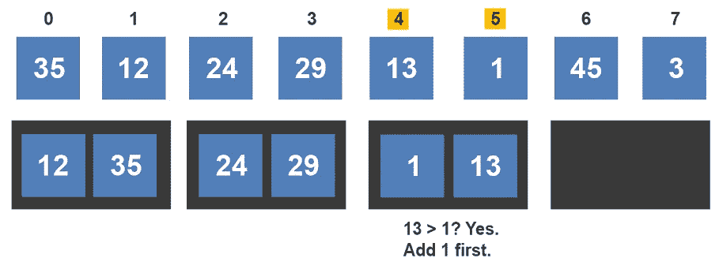
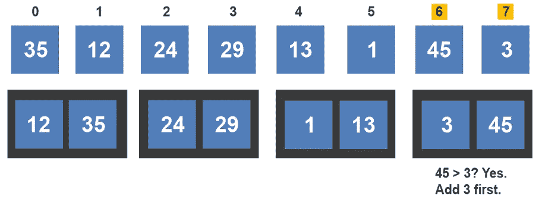
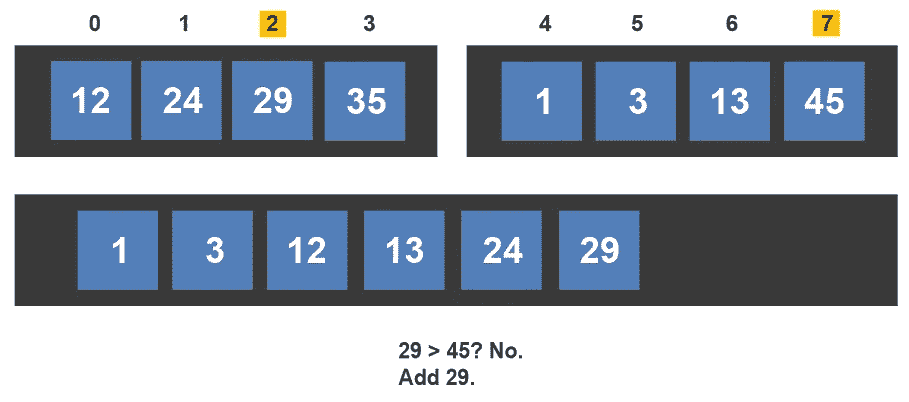

# 合并排序算法直观讲解

> 原文：<https://levelup.gitconnected.com/merge-sort-algorithm-visually-explained-910017da1d3a>

合并排序算法按升序对项目数组进行排序。合并排序是一种分治型算法。该算法采用 n 个元素，并递归地不断划分它们，直到达到只需要关注一个元素的状态。一旦达到这种状态，它就开始组合元素，每次组合时，它都会对它们进行排序。让我们来看一个例子。我们将从一个包含 8 个元素的数组开始。

合并排序算法开始递归地将数组分成 n/2 个子数组。在第一次分割之后，阵列被分成 2 个子阵列。

该算法继续划分子阵列。左子阵列和右子阵列都被划分，并且该算法生成四个新的子阵列。

必须对所有四个子阵列进行最后一次除法运算，以创建八个单独的元素。

现在，合并排序算法将数组分解为单个元素，元素可以在此过程中重新组合和排序。元素 0 和 1 将被合并，然后是 2 和 3、4 和 5、6 和 7。我们将创建 4 个占位符来帮助更好地可视化。

首先，比较元素 0 和 1。因为 35 大于 12，所以元素 1 首先被添加到新子数组中，随后是 35。

接下来，该算法比较索引 2 和 3 处的值。因为 24 小于 29，所以首先将 24 添加到新子数组中，然后是 29。

接下来，比较索引 4 和 5 处的元素。由于 1 小于 13，所以先加 1，再加 13。

最后，比较索引 6 和 7 处的值。因为 3 小于 45，所以首先将 3 添加到子数组中。

这就完成了第一次合并。还有两个。在第二次合并期间，相邻数组之间的值进行比较。首先，12 与 24 相比较。没有必要比较 12 和 35，因为它已经在列表中排序了。

因为 12 首先被添加到列表中，所以左边的数组索引递增。将索引 1 处的值与索引 2 处的值进行比较。因为 24 小于 35，所以接下来将 24 添加到列表中。

第二个数组中的索引递增，并比较值 35 和 29。由于 29 小于 35，所以接下来加上 29。由于没有其他比较可以与 35 进行比较，因此将 35 添加到列表中。

合并排序算法移动到下两个子数组进行合并。比较来自每个子阵列的第一索引。因为 1 小于 3，所以接下来将 1 添加到列表中。

左侧数组中的索引值递增，13 与 3 进行比较。由于 3 小于 13，所以在列表旁边添加了 3。

右侧数组的索引值递增，13 与 45 进行比较。由于 13 小于 45，所以先加 13，再加 45。这完成了将四个子阵列合并成两个子阵列。还有一次合并。

合并排序算法从比较每个数组中的第一个元素开始。在此示例中，将索引 0 处的值与索引 4 处的值进行比较。因为 1 小于 12，所以首先将 1 添加到数组中。

由于该值是从右侧数组添加的，因此右侧数组的索引值会递增。下一个比较是在 12 和 3 之间。因为 3 小于 12，所以接下来将 3 添加到列表中。

右数组的索引值递增，12 与 13 进行比较。因为 12 小于 13，所以接下来将 12 添加到列表中。

左侧数组的索引值递增，24 与 13 进行比较。因为 13 小于 24，所以接下来将 13 添加到列表中。

右数组的索引值递增，24 与 45 进行比较。因为 24 小于 45，所以接下来将 24 添加到列表中。

左侧数组的索引值递增，29 与 45 进行比较。因为 29 小于 45，所以接下来将 29 添加到列表中。

左侧数组的索引值递增，并将 35 与 45 进行比较。因为 35 小于 45，所以 35 加 45。

两个子数组已经完全合并，最终的数组已经完全排序。

如果你喜欢你所读的，我的书，**【算法的说明性介绍】，涵盖了这个算法和更多。**

**

*Dino Cajic 目前是 [LSBio(寿命生物科学公司)](https://www.lsbio.com/)、[绝对抗体](https://absoluteantibody.com/)、 [Kerafast](https://www.kerafast.com/) 、 [Everest BioTech](https://everestbiotech.com/) 、 [Nordic MUbio](https://www.nordicmubio.com/) 和 [Exalpha](https://www.exalpha.com/) 的 IT 负责人。他还是我的自动系统公司的首席执行官。他有十多年的软件工程经验。他拥有计算机科学学士学位，辅修生物学。他的背景包括创建企业级电子商务应用程序、执行基于研究的软件开发，以及通过写作促进知识的传播。*

*你可以在 [LinkedIn](https://www.linkedin.com/in/dinocajic/) 上联系他，在 [Instagram](https://instagram.com/think.dino) 上关注他，或者[订阅他的媒体出版物](https://dinocajic.medium.com/subscribe)。*

*阅读迪诺·卡吉克(以及媒体上成千上万的其他作家)的每一个故事。你的会员费直接支持迪诺·卡吉克和你阅读的其他作家。你也可以在媒体上看到所有的故事。*