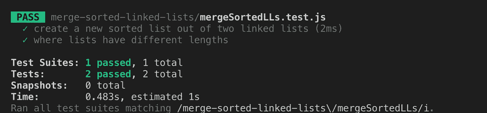

# 合并排序链表——用笑话和一点曲线球

> 原文：<https://levelup.gitconnected.com/merge-sorted-linked-lists-with-jest-and-a-little-curveball-curveball-at-end-69d5eca73914>

## (曲球结束)！

被劫持

在名为“21:合并两个有序链表”的经典 Leetcode 算法中，我们将两个有序链表合并成一个有序链表。随着我对算法和数据结构的深入研究，我觉得这个问题似乎对阐明作为数据结构的链表非常有帮助，所以我认为这将有助于对这个问题做一个预演，并提供一些我发现非常有帮助的算法实践技巧。

**链表:基础知识**

链表是一种线性数据结构，像数组、堆栈或队列，这意味着数据是以有序的方式一个接一个地被顺序访问的。链表是由节点组成的。在单链表中，每个节点保存一个值和一个指向链中另一个节点的指针。在双向链表中，每个节点保存一个值和一个指向前一个节点和另一个节点的指针。链表有头有尾。头节点是一个链表的开始，包含一个值和一个指向下一个节点的指针。尾部是一个链表的结尾，有一个值和一个指向 null 的指针。然而，在双向链表中，头节点的前一个节点指针和尾节点的下一个节点指针一样指向空值。下面的链接(没有双关语)是一个非常棒的网站，它可视化了我们可以在链接节点上执行的方法。

 [## 链表(单链表，双链表)，堆栈，队列，队列

### 链表是一种数据结构，由一组顶点(节点)组成，它们共同代表一个序列。在…下面

visualgo.net](https://visualgo.net/en/list) 

**合并两个排序后的链表:积木**

出于我们的目的，我们不需要用传统上用于构建链表类的方法(创建、搜索、插入、移除)来构建 LinkedList 类，这些方法可以在上面的网站上看到:【https://visualgo.net/en/list。事实上，我们真正需要的是一个节点类，用它我们可以实例化节点，每个节点都有一个值和一个指向另一个节点的指针。使用 ES6 语法创建节点类非常简单，如下图所示。

我们创建了一个名为 Node 的类。当一个节点被创建时，它用一个作为参数传递的值和一个设置为 null 的 next 属性进行实例化。由于在这篇博文中会变得更加清晰的原因，我已经将这个练习模块化了，所以最后我将导出我们的节点类。如果我们要创建一个新节点，其语法如下:

如果我们要查看这个节点，我们会看到节点的 val 属性是 6，它的下一个属性是 null。现在，假设我们决定在下一处房产中添加一些东西。正如我前面提到的，链表是由一个接一个顺序链接的节点组成的。因此，我们不会将 next 设置为一个数字，而是另一个节点。我们将节点的 next 属性设置为一个新的节点实例:

考虑到所有这些，现在让我们来看看这个问题。下面是 Leetcode 对这个问题的描述，以及它们的输入和输出示例:

*“合并两个排序后的链表，作为新的链表返回。新列表应该是通过将前两个列表的节点拼接在一起而制成的。”*

**举例:**

**输入:** 1- > 2- > 4，1- > 3- > 4

**输出:**1->1->2->3->4->4

从描述中，我特别注意到一些事情。首先，我们接收两个链表作为参数，它们被排序。其次，我们返回一个链表。最后，返回的链表的大小是传入的每个链表中节点的总和。记住了输入和输出，构建测试就变得容易多了，现在我将使用 jest 来完成。Jest 是一个 JavaScript 测试框架。我发现执行你自己的测试，对于算法来说是非常值得的。构建自己的测试不仅对软件工程师来说是一项无价的技能，而且它还能让你更深入地思考解决算法所需的代码。如果你清楚地知道输入是什么样的，返回值应该是什么，在我看来，你已经解决了 30%的问题，因为这也给了你一个思考边缘情况的机会。要在 Node.js 中使用 jest，您需要做的就是创建一个目录，并在该目录中运行**NPM I jest**；要将其保存为开发依赖项， **npm i — save-dev jest** 。(在您的目录中，确保您已经首先运行了 **npm init** 来创建 package.json 文件)！

现在，在您的目录中，您可以创建一个名为 mergedTwoLists.js 和 mergedSortedLists.test.js 的文件。当我们写出我们的解决方案时，或者当我们觉得我们可能有了解决方案时，运行 jest [PATH/filename] —注意，运行测试。watch 标志确保测试将在您对被测试文件执行的每个动作操作之后运行，工作方式类似于 nodemon，如果您以前曾经使用过这个令人敬畏的包的话！大哥哥 jest 在看。

现在让我们开始吧。我喜欢写出问题描述，并在我们要写算法的文件中定义一个函数。您可能会注意到，我已经导入了我们之前创建的节点文件，因为我们将使用它来构造合并的链表。在最后一行，我们将导出函数，因为我们将在测试中调用它！

现在来看看测试文件本身。

在我们的测试文件中，我们导入了 mergeTwoLists 函数和 Node 类。虽然这肯定不是最佳实践，但我用 node 类构造函数为我们的测试创建了链表，为每个下一个节点添加了新的节点实例。然后，我创建了一个合并列表，它应该反映 mergeTwoLists 的返回值。现在检查一下测试函数调用中的测试语法。Test 接受一个参数，这个参数描述了我们测试的内容，作为第一个参数，回调作为第二个参数。在回调中，我们调用函数，传入两个排序的链表参数，并写出我们期望的最终值。在这一点上，在编写了测试之后，我意识到描述并没有指定链表将是相同的长度，这可能会给我目前正在绘制的解决方案带来一个问题，所以我决定对此也进行测试。

现在我们对 mergeTwoLists 进行两次测试，我会给你看我的答案，我们可以讨论我做了什么。

当我运行这段代码时，我看到我们的测试通过了！！

在我们的函数 mergeTwoLists 中，我们想从创建一个新节点开始，它将作为我们的链表的头。这个节点是我们在函数末尾想要返回的链表，但是我们并不真正关心我们最初传入节点的值；我们只关心两个链表中的值。我们的节点构造函数要求我们在初始化时给一个节点一个 value 参数，这在我们的问题中没有考虑到最终的链表，所以我们返回 head.next，忽略值为 0 的头节点。现在，我们希望将我们的新节点设置为等于另一个变量，我们将使用该变量通过迭代有条件地添加新节点。过程中的这一步一开始让我很困惑，但在很多链表问题中确实是常见的做法。如果我们考虑这个问题，我们希望遍历我们的两个列表，并在每次迭代中有条件地将新节点添加到合并的链表中。因此，我们也需要在每次迭代中运行我们的新节点。如果我们在没有定义 header 的情况下执行这个操作，仅仅在 while 循环块的末尾设置 head 等于 head.next，那么 head.next 将等于 null，因为我们将返回尾节点！！不，不，不。记住 JavaScript 是通过引用传递的，所以我们对 runner 做的任何事情也会发生在 head 上，所以我们必须创建一个临时变量来为我们的链表取值，这样我们就可以在最后返回整个链表。

接下来，我们遍历列表，只要两个列表的值都不为空，然后向 runner.next 添加一个新节点，并有条件地重新定义关联列表，使其等于下一个值。当我们的一个链表等于 null 时，while 循环将结束，所以在最后，我们只剩下 list1 或 list2，因为它们是排序的，我们可以只设置 runner 的 next 属性等于 list1 或 list2。这也将说明我们的链表大小不同的情况。最后，我们返回 head .下一个！

*** *曲线球****

现在我们已经完成并解决了 Leetcode 问题，我喜欢想出一些方法来使问题复杂化——尤其是如果它是一个我有一点麻烦的问题(惩罚我自己！).对于曲线球，我决定加入神秘的元素。如果给我们一个可变数量的链表会怎么样。1…2…3…50?怎样才能创建一个合并器，不管传入多少个链表，都把排序的链表合并成一个排序的链表？让我们从测试开始。

对于这个函数，我决定构建三个不同的测试，以确保我们的代码没有错误、美观和干净。第一个测试考虑是否传入了四个链表。虽然我可以构建完整的链表来进行测试，但这听起来有点令人头痛，所以我们将根据最终链表的预计长度来测试它，在我们的合并中，它总是每个节点的总和。为了测试大小，我创建了一个名为 size 的方法，它返回链表的长度。查找一个链表的长度是一个 O(n)运算，在我们的例子中，如果你查看我们为最后的测试创建的四个链表，每个节点的总和将是 11。第二个测试检查是否传入了一个参数，因为链表是排序的，所以我们希望返回同一个链表。如果传递了两个列表，我们希望执行与 Leetcode 算法中相同的操作。所以，这里什么都没有。这是我的最终解决方案。首先，我引入了我们为 Leetcode 问题编写的方法。

耶，我们通过了所有的测试！

